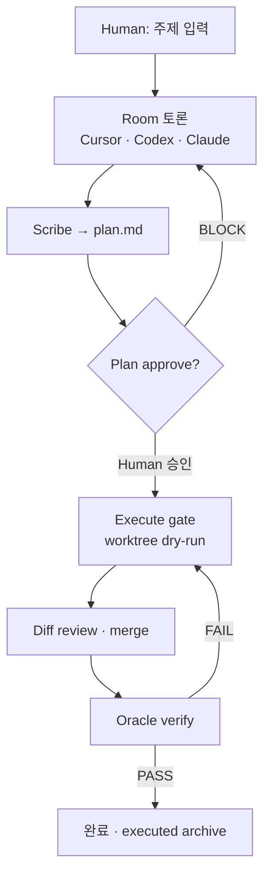

# Agent Lab

**주제 하나 → 세 AI 에이전트 협업 → `plan.md` → Human 승인 → worktree 실행·merge·Oracle 검증**

Agent Lab은 Cursor · Codex · Claude가 한 Room에서 토론하고, 기획을 문서화한 뒤, 코드 변경을 **격리된 git worktree**에서 dry-run하고 Human이 승인·merge하는 **개발자용 멀티에이전트 콘솔**입니다.

| | quant-pipeline | Agent Lab |
|---|----------------|-----------|
| 역할 | DB · 백테스트 · 실거래 실행 | 기획 · 토론 · 코드 초안 · 검증 루프 |
| 산출물 | TASK · pytest · Handoff | `plan.md` · execute diff · verified merge |
| Human | Conductor 운영 | 방향·승인·결정 (Human gate 유지) |

`plan.md`를 Human이 검토한 뒤 pipeline의 `TASK-*.md`로 옮길 수 있습니다. Agent Lab이 pipeline을 **대신 실행하지는 않습니다**.

---

## 주요 기능

| 영역 | 설명 |
|------|------|
| **3자 Room** | Cursor · Codex · Claude 병렬·순차 토론, 합의·이의(BLOCK) 거버넌스 |
| **Plan workflow** | Clarify → Scribe → peer review → Human plan approve → execute |
| **Execute gate** | worktree dry-run → diff review → merge → Oracle verify (실패 시 repair loop) |
| **Mission Loop** | Discuss ↔ Execute ↔ Verify FSM, Momus-lite plan gate, evidence ledger |
| **Human Inbox** | execute 중 MCP·승인 요청을 Human에게 라우팅 |
| **Verified / Goal loop** | 목표 제안 → Human 승인 → Oracle 완료 판정 |
| **Runtime harness** | discuss/execute lane, PolicyEngine, checkpoint resume |
| **Desktop + Web** | Tauri 2 네이티브 앱 또는 브라우저 UI (FastAPI 백엔드 내장) |

**아키텍처 불변 원칙:** 합의=Room · 격리=worktree · 완료=Oracle verified · BLOCK → execute 409

---

## 빠른 시작

### 필요 환경

- Python **3.11+**
- Node **18+**
- Rust (`rustc`) — Tauri 빌드 시
- 에이전트 CLI 중 **하나 이상**: `codex login` · `claude login` · Cursor SDK (`pip install -e ".[cursor]"`)

### 설치

```bash
git clone <repo-url> ~/Projects/agent-lab
cd ~/Projects/agent-lab
make install
cp .env.example ~/.agent-lab/.env   # 또는 repo 루트 .env
```

`.env`에 최소 하나의 provider를 설정합니다. 패키지 앱·GUI는 PATH가 짧으므로 `CODEX_BIN`, `CLAUDE_BIN` 등 **절대 경로**를 권장합니다.

| Provider | 인증 | 비고 |
|----------|------|------|
| `codex` (기본) | `codex login` (ChatGPT/Plus) | Plus ≠ Platform API 과금 |
| `openai` | `OPENAI_API_KEY` | Classic graph (Planner/Critic/Scribe) |
| `anthropic` | `ANTHROPIC_API_KEY` | Classic graph |

### 실행

```bash
make dev          # API :8765 + UI http://127.0.0.1:5173
make tauri-dev    # 네이티브 데스크톱 창
make prod         # web build + uvicorn :8765 (통합 서빙)
python -m agent_lab run "주제"   # CLI — 동일 sessions/ 사용
```

**macOS 앱 빌드:** `make tauri-build` → `web/src-tauri/target/release/bundle/macos/Agent Lab.app`

설정 우선순위: `~/.agent-lab/.env` → `~/.agent-lab/config.toml` → repo `.env`  
상세: [docs/STABILITY.md](docs/STABILITY.md) · [docs/APP.md](docs/APP.md)

---

## 워크플로 개요



1. **Discuss** — Composer에서 주제·메시지 전송 → Room 라운드 (합의·이의·Scribe)
2. **Plan** — `plan.md`에 `## 지금 실행` 액션 정리 → Human plan approve
3. **Execute** — git worktree에서 dry-run → diff 승인 → merge
4. **Verify** — Oracle이 criteria 대조 (mock 기본, live opt-in)

Turn profile `verified` 사용 시 LazyCodex-style verified loop(제안 → Human 승인 → DONE → Oracle VERIFIED)가 적용됩니다.

---

## 세 에이전트

| 에이전트 | 역할 | 잘 맡기는 일 |
|----------|------|--------------|
| **Cursor** | 레포 직접 탐색 · 패치 · execute | 버그 원인, UI/코드 변경, worktree 실행 |
| **Codex** | 분해 · 순서 · 검증 기준 | 테스트 플랜, decompose, completion criteria |
| **Claude** | 맹점·리스크 · 두 번째 의견 | 설계 검토, Scribe, Oracle |

역할 프롬프트: `src/agent_lab/agents/prompts.py`

---

## 세션·산출물

주제 1개 = `sessions/<date>-<slug>/` 폴더 1개.

| 파일 | 내용 |
|------|------|
| `chat.jsonl` | 원문 대화 (line ref provenance) |
| `run.json` | `run_schema_version`, turns, mission, verified_loop, execute 메타 |
| `plan.md` | Scribe 정리 기획 (`chat.jsonl#L<n>` 출처 포함) |
| `executed/` | merge된 diff 아카이브 (`{exec_id}.json`) |

Classic graph(Planner/Critic/Scribe)는 `topic.txt`, `transcript.md`, `meta.json`을 추가로 생성합니다. 신규 기능은 **Room 경로** 기준입니다.

---

## 프로젝트 구조

```text
agent-lab/
├── src/agent_lab/          # Room · execute · mission · oracle 코어
│   ├── room.py             # 멀티에이전트 Room 오케스트레이션
│   ├── plan_execute*.py    # worktree execute · merge · verify
│   ├── plan_workflow.py    # Plan-First FSM
│   ├── mission_loop.py     # Mission Loop Layer 6
│   └── runtime/            # Runtime harness (discuss/execute lane)
├── app/server/             # FastAPI (routers/* — main.py는 조립만)
├── web/                    # React 18 + Vite UI
│   └── src-tauri/          # Tauri 2 데스크톱 셸
├── tests/                  # pytest (~870 mock-fast, integration 별도)
├── scripts/                # smoke · score · ops · dogfood
├── sessions/
│   └── _regression/        # 36 regression baselines (git tracked)
└── docs/                   # 제품·운영·RFC 문서
```

---

## 개발·테스트

```bash
make dev              # API + web hot reload
make lint             # ruff check (src/ app/ tests/ scripts/)
make typecheck        # mypy src/agent_lab (gradual; non-blocking in CI)
make test-fast        # mock-only, ~1분 (~870 tests, -n auto when xdist)
make test             # full mock suite (integration 포함)
make ci               # lint + test-fast + smoke + score fixtures
make ci-full          # lint + full test + smoke + score

python scripts/smoke_room.py     # 36 regression baselines
make verify-hooks                # Hook · Communicate suite
make list-flags                  # AGENT_LAB_* 레지스트리 (79 entries)
make dogfood-suite-mock          # Eval Program v1 mock topics
```

**규칙:** CI는 mock-only (`AGENT_LAB_MOCK_AGENTS=1`). live LLM 테스트는 `AGENT_LAB_RUN_LIVE=1`로 opt-in.  
subprocess env는 `subprocess_env.subprocess_env()` allowlist만 — **`.env` 전체 상속 금지**.  
`sessions/*` 커밋 금지 (`sessions/_regression/` 제외). execute gate 우회 금지.

개발 가이드: [CLAUDE.md](CLAUDE.md)

---

## 환경 변수

전체 목록: `make list-flags` 또는 `GET /api/health/flags`

자주 쓰는 플래그:

| 변수 | 기본 | 설명 |
|------|------|------|
| `AGENT_LAB_MOCK_AGENTS` | 0 | 1 = mock agent (테스트·CI) |
| `AGENT_LAB_PLAN_WORKFLOW` | 1 | Plan-First workflow |
| `AGENT_LAB_ORACLE_LIVE` | 0 | live Oracle (execute verify) |
| `AGENT_LAB_MISSION_LOOP` | 0 | Mission Loop FSM |
| `AGENT_LAB_CLARIFIER` | 0 | 첫 턴 Socratic clarifier |
| `AGENT_LAB_EFFICIENCY` | 0 | Room 토큰 절약 모드 |

템플릿: [.env.example](.env.example)

---

## 문서

| 문서 | 용도 |
|------|------|
| [docs/USER-GUIDE.md](docs/USER-GUIDE.md) | **제품 동작 명세** (기능·상태·API·env) |
| [docs/README.md](docs/README.md) | 문서 인덱스 (Tier 1–5) |
| [docs/EXTERNAL-REFS-TRACEABILITY.md](docs/EXTERNAL-REFS-TRACEABILITY.md) | **Shipped 기능** 증거 매트릭스 |
| [docs/STABILITY.md](docs/STABILITY.md) | CI · smoke · config · release |
| [docs/OPS-RUNBOOK.md](docs/OPS-RUNBOOK.md) | live worktree · merge operator |
| [docs/PLAN-WORKFLOW.md](docs/PLAN-WORKFLOW.md) | Plan-First FSM |
| [docs/GOAL-LOOP.md](docs/GOAL-LOOP.md) | Goal loop · verified loop |
| [docs/APP.md](docs/APP.md) | Tauri 패키징 · API 개요 |

**규칙:** shipped 상태는 TRACEABILITY + 코드 + 테스트가 SSOT. `docs/00`–`05` 번호 문서는 교육용 레거시입니다.

---

## API 개요

| Method | Path | 설명 |
|--------|------|------|
| GET | `/api/health` | 백엔드 상태 · flags |
| GET | `/api/sessions` | 세션 목록 |
| POST | `/api/room/runs` | Room 턴 (SSE) |
| POST | `/api/sessions/{id}/execute` | Execute gate |
| GET | `/api/runtime` | Runtime harness snapshot |

전체 라우터: `app/server/routers/`

---

## 한 줄 요약

Agent Lab = **세 AI가 토론하고 plan을 쓰고, Human이 승인한 뒤 worktree에서 실행·merge·Oracle 검증까지 이어가는 개발자 콘솔**.  
pipeline은 그 plan을 검토한 뒤 **프로덕션 실행**하는 곳입니다.
