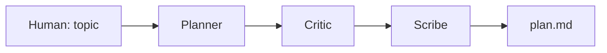

# Agent Lab — 기초 교육 가이드

> **Legacy doc (Tier 4)** — early sandbox tutorial. **Canonical:** [USER-GUIDE.md](./USER-GUIDE.md) · [README.md](./README.md)

> **이 문서는 독립 프로젝트용입니다.**  
> `quant-pipeline` repo와 **별도 GitHub repo·별도 작업 폴더**에서 시작하세요.  
> pipeline은 “실행·검증·거래”, Agent Lab은 “주제 던지고 에이전트가 같이 생각하기” 연습장입니다.

---

## 1. 이게 뭔가요?

**Agent Lab** = 주제 한 줄만 주면, 여러 LLM 역할이 **짧은 대화(또는 순차 메시지)** 로 기획안을 만드는 **교육용 샌드박스**입니다.

| quant-pipeline | Agent Lab (이 프로젝트) |
|----------------|-------------------------|
| DB, 백테스트, 실거래 안전 | 없음 (기본) |
| TASK · pytest · Handoff | PLAN · 아이디어 · 질문 목록 |
| Conductor + messenger 운영 | **톡방/그래프 실험** |
| 프로덕션에 가깝음 | **학습·프로토타입** |

**목표**: “에이전트끼리 말하게” 만드는 법을 배우고, 나중에 pipeline의 `TASK-*.md` 초안만 **가져오기**.

---

## 2. 왜 repo를 나누나요?

1. **컨텍스트 분리** — pipeline을 열면 연구·SPEC91·DB가 섞여 LLM이 헷갈림  
2. **비용·실험** — 톡방은 토큰이 많이 듦. 실패해도 main pipeline 히스토리가 지저분해지지 않음  
3. **의존성** — LangGraph / AutoGen 등은 pipeline에 안 넣는 게 맞음  
4. **보안** — Lab에는 `.env`에 API 키만, **브로커·DB 비밀번호 넣지 않기**

---

## 3. “세션”이란?

여기서 **세션**은 세 가지를 구분합니다.

| 용어 | 의미 | 예 |
|------|------|-----|
| **Chat session** | 한 번의 “주제”에 대한 대화 기록 | `sessions/2026-05-26-c45-overlay/plan.md` |
| **IDE session** | Cursor / Claude Code 창 하나 | Lab repo만 연 채로 작업 |
| **Graph run** | LangGraph 등이 돌린 **상태 체크포인트** | `thread_id=abc`, 재개 가능 |

**규칙 (교육용)**  
- 주제 1개 = 폴더 1개 (`sessions/<date>-<slug>/`)  
- 그 안에: `topic.txt`, `transcript.md`, `plan.md`, `meta.json`  
- 끝나면 세션 폴더를 **닫고** 새 주제는 새 폴더

---

## 4. 추천 기술 스택 (처음엔 하나만)

처음부터 전부 만들지 말고 **한 가지**만 깊게.

| 단계 | 도구 | 왜 |
|------|------|-----|
| **0주차** | Python + `openai` / `anthropic` SDK 직접 호출 | “에이전트 = 프롬프트 + 역할” 감 잡기 |
| **1주차** | **LangGraph** (또는 AG2 GroupChat) | 상태·노드·human approve 배우기 |
| **2주차** | 간단한 **CLI** `agent-lab run "주제"` | 세션 폴더 자동 생성 |
| 나중 | Web UI (Chainlit / Streamlit) | 선택 |

**비추천 (초반)**  
- pipeline `orchestration/pipeline.py` 복사해서 억지로 톡방에 끼우기  
- RL / Conductor 논문식 end-to-end 학습  
- 실시간 무한 루프 대화 (비용·환각)

---

## 5. 새 repo 만들기 (10분)

### 5.1 GitHub

```text
repo 이름 예: agent-lab   (또는 mas-playground)
Public / Private: Private 권장 (API 실험 로그)
```

### 5.2 로컬

```bash
mkdir ~/Projects/agent-lab && cd ~/Projects/agent-lab
git init
python3 -m venv .venv
source .venv/bin/activate
pip install langgraph langchain-openai langchain-anthropic python-dotenv
```

### 5.3 최소 폴더 구조

```text
agent-lab/
├── README.md                 # 이 문서 요약 + 실행법
├── .env.example              # OPENAI_API_KEY=, ANTHROPIC_API_KEY=
├── .gitignore                # .env, .venv, sessions/*/raw/
├── pyproject.toml            # optional
├── src/
│   └── agent_lab/
│       ├── __init__.py
│       ├── graph.py          # LangGraph 정의
│       ├── roles.py          # system prompts (Planner, Critic, Scribe)
│       └── cli.py              # python -m agent_lab run "주제"
├── sessions/                 # git에 transcript/plan만 (선택)
│   └── .gitkeep
└── docs/
    └── 00-GETTING-STARTED.md   # pipeline에서 복사한 이 파일
```

### 5.4 `.gitignore` 필수

```gitignore
.env
.venv/
__pycache__/
sessions/**/raw/
*.log
```

---

## 6. 가장 작은 “톡방” 개념 (3역할)

에이전트가 **진짜 채팅앱처럼** 무한 대화하지 않게, **노드 3개**로 고정합니다.



| 역할 | 하는 일 | 출력 |
|------|---------|------|
| **Planner** | 주제를 3~5개 하위 질문·가설로 쪼갬 | bullet list |
| **Critic** | 맹점·리스크·검증 방법 지적 | 짧은 반박 |
| **Scribe** | 최종 `plan.md` (목표, 범위, 비목표, 다음 TASK 후보) | 파일 |

**Human은**  
- 시작: `topic`만 입력  
- 끝: `plan.md` 읽고 pipeline에 TASK로 옮길지 결정  

**이게 “톡방”의 교육용 핵심**: 자유 대화 ❌ → **역할 + 순서 + 산출물 1개** ✅

---

## 7. 첫 실습 (의사 코드)

`src/agent_lab/graph.py` 안에서 대략 이런 흐름입니다.

```python
# 1) state = {"topic": "...", "messages": []}
# 2) planner_node → messages += planner_reply
# 3) critic_node  → messages += critic_reply (planner 출력 참조)
# 4) scribe_node  → plan_md string
# 5) save sessions/<slug>/plan.md + transcript.md
```

**실행**

```bash
export $(grep -v '^#' .env | xargs)   # macOS: 수동 export 권장
python -m agent_lab.cli run "C4of5를 기존 KR 전략에 얹는 방법"
ls sessions/
```

---

## 8. pipeline과 연결하는 법 (선택, 2주차)

Agent Lab **끝 산출물**만 pipeline으로 넘깁니다.

```text
agent-lab/sessions/.../plan.md
        │
        ▼  (Human + Claude Conductor)
quant-pipeline/tasks/TASK-NNN-*.md
quant-pipeline/tasks/sprint.active.yaml
```

**Lab이 하면 안 되는 것**  
- `git push` pipeline  
- `kor_price` 접속  
- LIVE / SPEC91 실행  

---

## 9. 비용·안전 교육

| 항목 | 가이드 |
|------|--------|
| API 비용 | 세션당 max_turns=6 등 **상한** 코드에 박기 |
| 로그 | transcript에 API key 넣지 않기 |
| 모델 | 교육은 **작은 모델**로 그래프 디버그, 최종만 큰 모델 |
| 환각 | “대화가 그럴듯함” ≠ “맞음” — Critic 노드 필수 |

---

## 10. 학습 로드맵 (4주)

| 주 | 목표 | 완료 기준 |
|----|------|-----------|
| 1 | SDK로 Planner 1회 호출 | `hello.py`가 주제 받아 bullet 출력 |
| 2 | LangGraph 3노드 | `plan.md` 자동 저장 |
| 3 | `sessions/` 규칙 + CLI | `run "주제"` 한 방에 동작 |
| 4 | pipeline TASK 초안 export | `plan.md` → `TASK-draft.md` 템플릿 변환 스크립트 |

---

## 11. 자주 하는 질문

**Q. pipeline의 Option A (`pipeline run`) 를 Lab에서 쓰면?**  
A. 안 됨. 그건 **Cursor Cloud + Git PR** 전용. Lab은 **기획 대화**만.

**Q. AutoGen GroupChat이 더 톡방 같은데?**  
A. 데모는 좋음. 통제·재현은 LangGraph가 나음. 둘 다 2주차에 비교 실습 추천.

**Q. 에이전트가 서로 API로 직접 호출?**  
A. 교육용으론 **오케스트레이터 Python이 중개** (너 = 그 오케스트레이터 작성자). 진짜 분산 MCP는 나중.

**Q. 한 repo에 `agent-lab/` 서브폴더만?**  
A. 학습 초반은 가능. **본격 실험은 분리 repo** 권장 (위 2절).

---

## 12. 다음에 읽을 것 (만들 문서)

분리 repo에 이어서 작성하면 좋은 md:

| 파일 | 내용 |
|------|------|
| `docs/01-roles-and-prompts.md` | Planner/Critic/Scribe system prompt |
| `docs/02-langgraph-tutorial.md` | 노드·edge·checkpoint 예제 |
| `docs/03-session-format.md` | `meta.json` 스키마 |
| `docs/04-export-to-pipeline.md` | plan → TASK md 변환 규칙 |

---

## 13. 한 줄 요약

**Agent Lab** = 새 repo + 세션 폴더 + 3역할 그래프 + `plan.md` 산출.  
**pipeline** = 그 plan을 Human/Conductor가 검토한 뒤 **실행**하는 곳.  
지금 단계에선 **톡방 전체 자동화**보다 **“주제 → plan.md” 한 줄기**만 완성하면 교육 목표 달성입니다.
