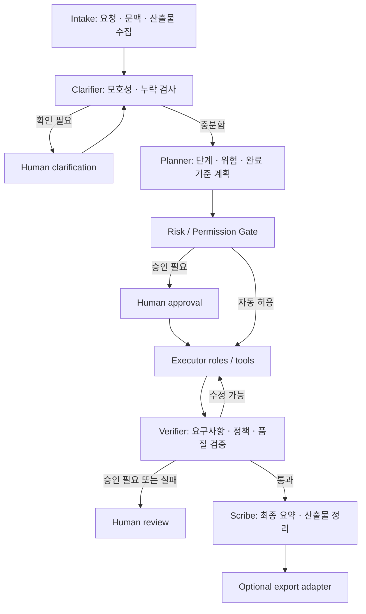

# Agent Lab - 통제 가능한 범용 워크플로 시스템 설계

> **Legacy doc (Tier 4)** — early architecture sketch. **Canonical:** [USER-GUIDE.md](./USER-GUIDE.md) · [EXTERNAL-REFS-TRACEABILITY.md](./EXTERNAL-REFS-TRACEABILITY.md) · [README.md](./README.md)

> 상태: 설계 초안 (historical)  
> 대상: 현재 `Planner -> Critic -> Scribe` 프로토타입을 범용 에이전트 환경으로 확장하는 단계  
> 원칙: 자유로운 다중 에이전트 대화보다, 입력ㆍ권한ㆍ승인ㆍ산출물이 추적 가능한 실행을 우선한다.

---

## 1. 목적

Agent Lab은 특정 프로젝트 전용 자동화가 아니라, 다양한 주제와 작업 유형에 대해 여러 역할의 에이전트가 협업하는 **일반 목적 워크플로 실행 환경**을 목표로 한다.

현재 구현은 다음 최소 흐름을 제공한다.

```text
topic -> Planner -> Critic -> Scribe -> plan.md
```

이 구조는 기획 생성 실험에는 충분하지만, 범용 작업 환경으로 사용하려면 아래 질문에 답할 수 있어야 한다.

- 에이전트가 입력 문맥을 잘못 이해했을 때 어떻게 실행을 멈추는가?
- 어떤 역할이 어떤 도구와 파일에 접근할 수 있는가?
- 어떤 작업은 사람이 승인하기 전에는 진행하지 못하게 할 것인가?
- 최종 산출물이 요구사항을 충족했는지 어떻게 검증하는가?
- 실행 과정, 가정, 승인, 실패, 결과를 어떻게 재현 가능하게 남기는가?

이 문서는 위 통제 장치를 포함한 실행 모델과 초기 구현 범위를 정의한다.

---

## 2. 목표와 비목표

### 목표

- 다양한 작업에 재사용 가능한 워크플로 템플릿을 정의한다.
- 각 실행이 입력, 가정, 단계, 도구 사용, 승인, 결과물을 명시적으로 기록하게 한다.
- 모호한 요청이나 위험한 동작은 자동 실행보다 확인 및 승인을 우선하게 한다.
- 텍스트 기획부터 조사, 코드 작업, 문서 생성, 외부 시스템 export까지 점진적으로 확장할 수 있게 한다.
- 모델 공급자나 도구 구현이 바뀌어도 워크플로 계약은 유지한다.

### 비목표

- 제약 없는 자율 에이전트가 장시간 자유롭게 행동하는 시스템
- 승인 없이 외부 서비스 변경, 배포, 거래, 데이터 삭제를 실행하는 시스템
- 모든 업무 영역에 대해 즉시 최적화된 역할ㆍ검증 규칙을 제공하는 것
- 초기 단계에서 웹 UI, 분산 실행, 에이전트 간 실시간 채팅을 완성하는 것

---

## 3. 핵심 설계 원칙

| 원칙 | 의미 |
|------|------|
| 명시적 입력 | 주제만 던지지 않고 목적, 배경, 제약, 기대 산출물을 구조화한다. |
| 모호성 우선 처리 | 의미가 갈리는 용어ㆍ목표가 있으면 추측해서 진행하지 않는다. |
| 최소 권한 | 역할과 단계별로 필요한 도구와 접근 범위만 허용한다. |
| 승인 가능한 경계 | 외부 변경, 고비용 실행, 위험 작업은 승인 지점 뒤에 둔다. |
| 산출물 중심 | 대화량이 아니라 검토 가능한 파일과 판정 결과로 완료를 정의한다. |
| 재현성과 감사 가능성 | 입력, 프롬프트 버전, 모델, 도구 호출, 승인, 결과를 세션에 기록한다. |
| 점진적 자율성 | 신뢰도가 검증된 작업만 자동 실행 범위를 넓힌다. |

---

## 4. 용어

| 용어 | 정의 |
|------|------|
| Run | 하나의 사용자 요청을 처리하는 전체 실행 단위 |
| Workflow | Run에서 수행할 단계, 역할, 권한, 승인, 산출물 규칙의 정의 |
| Step | 단일 역할 실행 또는 결정 지점 |
| Role | Step에서 수행할 책임과 출력 계약을 가진 에이전트 프로필 |
| Context | 요청을 올바르게 해석하기 위한 배경 정보, 파일, 용어 정의 |
| Assumption | 확인되지 않았지만 진행에 사용되는 가정 |
| Gate | 조건 충족 또는 human approval 전에는 다음 단계로 넘어갈 수 없는 지점 |
| Tool policy | 어떤 도구를 어떤 범위에서 사용할 수 있는지에 대한 규칙 |
| Artifact | 실행 중 생성ㆍ수정ㆍ검토되는 파일 또는 구조화된 결과 |
| Evaluation | 결과물이 요구사항과 정책을 충족했는지 판정하는 절차 |
| Adapter | 결과물을 다른 프로젝트나 서비스의 포맷으로 변환하거나 전달하는 모듈 |

---

## 5. 실행 모델

범용 실행의 기본 흐름은 아래와 같다.



현재의 `Planner -> Critic -> Scribe`는 다음과 같이 보존한다.

- 도구를 사용하지 않는 저위험 기획 워크플로의 기본 템플릿으로 유지한다.
- `Critic`은 초기에는 `Verifier` 역할도 일부 겸할 수 있다.
- 입력이 모호하거나 실행 권한이 필요한 템플릿에서는 `Clarifier`, `Gate`, `Executor`, `Verifier`를 추가한다.

---

## 6. 입력 계약

단순 `topic: str`만으로는 범용 환경에 부족하다. Run 입력은 아래 필드를 기준으로 확장한다.

| 필드 | 필수 | 설명 | 예시 |
|------|------|------|------|
| `topic` | 예 | 작업의 짧은 제목 | `C4of5를 기존 KR 전략에 얹는 방법` |
| `objective` | 예 | 이번 실행에서 얻을 결과 | `실험 후보와 검증 계획 수립` |
| `context` | 선택 | 도메인, 배경, 관련 파일, 용어 정의 | `KR은 한국 주식 전략을 의미` |
| `constraints` | 선택 | 하면 안 되는 일, 시간ㆍ비용 제한 | `코드 수정 금지`, `웹 검색 허용` |
| `desired_artifacts` | 예 | 산출물 목록과 형식 | `plan.md`, `decision.json` |
| `workflow` | 예 | 사용할 워크플로 템플릿 | `planning.basic` |
| `risk_level` | 선택 | 사용자 지정 위험 수준 힌트 | `low`, `medium`, `high` |

초기 CLI 예시는 다음 형태를 목표로 한다.

```bash
agent-lab run \
  --workflow planning.basic \
  --topic "C4of5를 기존 KR 전략에 얹는 방법" \
  --objective "백테스트 후보 설계" \
  --context-file context.md \
  --artifact plan.md
```

짧은 요청을 위한 기존 명령도 유지한다.

```bash
agent-lab run "새 서비스 아이디어 검토"
```

이 경우 시스템은 자동 실행 전에 누락된 문맥이 위험한지 판단하고, 필요하면 clarification 결과만 생성한다.

---

## 7. 모호성 처리와 Clarification Gate

### 필요한 이유

`KR` 같은 약어는 도메인에 따라 전혀 다른 의미가 된다. 주제만으로 즉시 계획을 만들면 문법적으로 완성된 잘못된 산출물이 생성될 수 있다.

### Clarifier 책임

Clarifier는 일을 해결하지 않는다. 다음만 판정한다.

- 용어, 대상, 목적, 산출물 형식 중 해석이 갈리는 부분이 있는가?
- 핵심 제약이나 데이터 출처가 빠져 결과가 무의미해질 수 있는가?
- 가정을 명시한 채 저위험으로 진행할 수 있는가, 아니면 사용자 확인이 필수인가?

### 판정 결과

Clarifier 출력은 자연어 답변만이 아니라 구조화된 상태여야 한다.

```json
{
  "decision": "needs_clarification",
  "ambiguities": [
    {
      "term": "KR",
      "candidate_meanings": ["Korean equity strategy", "Knowledge Representation"],
      "blocking": true
    }
  ],
  "questions": [
    "여기서 KR은 한국 주식 전략을 의미하나요?"
  ],
  "assumptions_allowed": []
}
```

### 자동 진행 기준

다음 조건을 모두 충족할 때만 확인 없이 다음 단계로 이동한다.

- 해석 차이가 결과 방향을 실질적으로 바꾸지 않는다.
- 외부 시스템 변경이나 민감 데이터 접근이 없다.
- 잘못된 결과가 되돌릴 수 없는 행동을 유발하지 않는다.
- 사용된 가정을 최종 산출물에 명시할 수 있다.

---

## 8. 워크플로 템플릿

워크플로는 역할 이름이 아니라 실행 계약이다. 처음에는 아래 네 종류만 제공하는 것이 적절하다.

| ID | 용도 | 기본 단계 | 도구 | 승인 |
|----|------|----------|------|------|
| `planning.basic` | 아이디어ㆍ계획 작성 | Clarifier, Planner, Critic, Scribe | 없음 | 모호성 시만 |
| `research.readonly` | 자료 조사ㆍ비교 분석 | Clarifier, Researcher, Critic, Scribe | 읽기ㆍ검색 | 외부 변경 없음 |
| `code.change` | 저장소 코드 변경 | Clarifier, Planner, Implementer, Tester, Reviewer, Scribe | 파일 수정ㆍ명령 실행 | 변경 계획 또는 위험 명령 |
| `export.reviewed` | 외부 포맷 변환/전달 | Planner, Formatter, Verifier, Exporter | adapter별 | export 직전 |

### 워크플로 정의 예시

장기적으로 템플릿은 코드 밖의 설정으로 표현한다.

```yaml
id: planning.basic
version: 1
description: Low-risk planning workflow without external tools
inputs:
  required: [topic, objective, desired_artifacts]
steps:
  - id: clarify
    role: clarifier
    output: clarification.json
    gate:
      block_when: needs_clarification
  - id: plan
    role: planner
    output: draft_plan.md
  - id: critique
    role: critic
    input: [draft_plan.md]
    output: critique.md
  - id: synthesize
    role: scribe
    input: [draft_plan.md, critique.md]
    output: plan.md
  - id: verify
    role: verifier
    input: [plan.md, clarification.json]
    output: evaluation.json
policies:
  tools: none
  max_llm_calls: 5
  require_assumptions_section: true
```

---

## 9. 역할 설계

역할은 persona가 아니라, 책임ㆍ허용 입력ㆍ출력 형식ㆍ금지 행동의 묶음이어야 한다.

| 역할 | 책임 | 핵심 출력 | 금지 행동 |
|------|------|-----------|-----------|
| Clarifier | 요청의 불명확성, 누락, 위험 판정 | `clarification.json` | 임의의 도메인 가정으로 계획 확정 |
| Planner | 작업 단계, 성공 기준, 예상 위험 설계 | `draft_plan.md` 또는 `plan.json` | 승인 없이 실행 |
| Researcher | 허용된 자료에서 근거 수집 | `findings.md`, 출처 목록 | 출처 없는 사실 확정 |
| Implementer | 승인된 계획에 따른 변경 수행 | 변경 파일, 작업 로그 | 허용 범위 밖 수정 |
| Critic | 계획의 취약점과 실패 조건 검토 | `critique.md` | 전체 계획을 무근거 재작성 |
| Verifier | 요구사항, 검증 결과, 정책 준수 판정 | `evaluation.json` | 미검증 결과를 통과 처리 |
| Scribe | 산출물과 의사결정 요약 | 최종 문서 | 새로운 사실 발명 |
| Exporter | 승인된 결과를 외부 형식으로 변환/전달 | export artifact | 승인 전 전송 |

각 역할 프롬프트에는 최소한 다음 항목을 포함한다.

```text
Responsibility:
Allowed inputs:
Required output schema:
Must state assumptions:
Must stop when:
Forbidden actions:
```

---

## 10. 상태 모델

현재 `GraphState`는 네 개 문자열만 저장한다. 범용 시스템에서는 아래와 같은 Run 상태가 필요하다.

```python
class RunState(TypedDict):
    run_id: str
    workflow_id: str
    workflow_version: int
    status: str
    request: dict
    context: list[dict]
    assumptions: list[dict]
    risks: list[dict]
    permissions: dict
    approvals: list[dict]
    steps: list[dict]
    artifacts: list[dict]
    evaluation: dict | None
    errors: list[dict]
```

### Run 상태 값

| 상태 | 의미 |
|------|------|
| `created` | 입력이 접수되었으나 실행 전 |
| `clarification_required` | 사용자 답변을 기다리는 중 |
| `planned` | 실행 계획과 위험 분류가 생성됨 |
| `approval_required` | 승인 전에는 다음 단계 불가 |
| `running` | 허용된 Step 실행 중 |
| `verification_failed` | 평가 실패, 수정 또는 사용자 판단 필요 |
| `completed` | 필수 산출물과 평가가 완료됨 |
| `failed` | 복구되지 않은 오류로 종료 |
| `cancelled` | 사용자 요청 또는 정책에 의해 중단 |

### Step 기록

각 Step은 아래 정보를 남긴다.

```json
{
  "id": "critique",
  "role": "critic",
  "status": "completed",
  "started_at": "2026-05-26T11:00:00Z",
  "ended_at": "2026-05-26T11:00:06Z",
  "model": "codex/chatgpt",
  "input_artifacts": ["draft_plan.md"],
  "output_artifacts": ["critique.md"],
  "tool_calls": [],
  "assumptions_added": [],
  "error": null
}
```

---

## 11. 권한과 도구 정책

범용성이 높아질수록 모델이 어떤 행동을 할 수 있는지가 핵심 통제 지점이 된다.

### 권한 등급

| 등급 | 허용 범위 | 예시 | 기본 승인 |
|------|-----------|------|-----------|
| `T0_TEXT_ONLY` | 모델 텍스트 생성만 | 기획, 요약, 비평 | 자동 |
| `T1_READ_ONLY` | 로컬/웹 자료 읽기 | 문서 분석, 리서치 | 자동 또는 도메인별 |
| `T2_LOCAL_WRITE` | 지정 작업 폴더 파일 생성ㆍ수정 | 코드 변경, 문서 생성 | 계획 승인 후 |
| `T3_COMMAND_EXEC` | 테스트ㆍ빌드 등 명령 실행 | `pytest`, 렌더링 | 허용 목록 내 자동 |
| `T4_EXTERNAL_WRITE` | 외부 시스템 변경 | 이슈 생성, PR, 이메일, 업로드 | 직전 승인 |
| `T5_HIGH_RISK` | 배포, 삭제, 금융/개인정보 관련 실행 | 프로덕션 변경, 거래 | 기본 금지 |

### Tool policy 필드

```yaml
permissions:
  tier: T1_READ_ONLY
  tools:
    allow: [read_files, web_search]
    deny: [write_files, shell, external_export]
  filesystem:
    read_roots:
      - ./docs
      - ./inputs
    write_roots:
      - ./sessions/${run_id}
  network:
    allow_domains: []
  budgets:
    max_llm_calls: 6
    max_tool_calls: 10
    max_runtime_sec: 300
```

### 기본 정책

- 새로운 템플릿은 `T0_TEXT_ONLY` 또는 `T1_READ_ONLY`에서 시작한다.
- 파일 수정은 workspace 경로를 명시한 뒤에만 허용한다.
- 외부 쓰기 작업은 adapter가 존재하더라도 승인 없이 실행하지 않는다.
- 고위험 작업은 단순 prompt 지시로 허용 범위를 높일 수 없게 한다.

---

## 12. 승인 게이트

승인은 단순한 "계속할까요?" 질문이 아니라, 승인 대상과 영향 범위를 고정하는 기록이다.

### 승인 필요 조건

- 모호한 의미 중 하나를 선택해야 결과 방향이 달라지는 경우
- 로컬 파일을 생성 또는 수정하는 경우
- 시간ㆍ호출 비용이 설정된 예산을 초과하는 경우
- 외부 서비스에 데이터를 전송하거나 변경하는 경우
- Verifier가 정책 위반 또는 낮은 신뢰도를 보고한 경우

### 승인 기록 예시

```json
{
  "gate_id": "approve_code_change",
  "decision": "approved",
  "requested_at": "2026-05-26T12:00:00Z",
  "decided_at": "2026-05-26T12:02:00Z",
  "scope": {
    "workflow": "code.change",
    "write_roots": ["./src", "./tests"],
    "commands": ["pytest"]
  },
  "summary": "로그 파서 수정 및 단위 테스트 추가",
  "decided_by": "human"
}
```

승인은 해당 범위에만 유효하며, 새 파일 영역이나 새 외부 시스템 작업이 필요해지면 다시 요청한다.

---

## 13. 산출물과 세션 디렉터리

현재 세션 구조를 확장해, 사람이 읽는 결과와 기계가 판정하는 상태를 분리한다.

```text
sessions/<date>-<slug>/
├── request.yaml                 # 입력 계약의 원본
├── context/
│   └── supplied-context.md      # 사용자가 제공한 배경 또는 참조 목록
├── run.json                     # 현재 상태, workflow/model/policy 메타
├── steps/
│   ├── 01-clarification.json
│   ├── 02-draft-plan.md
│   ├── 03-critique.md
│   └── 04-evaluation.json
├── artifacts/
│   └── plan.md                  # 사용자에게 전달할 최종 산출물
├── transcript.md                # 읽기 쉬운 실행 기록
├── approvals.json               # 승인 및 거절 기록
└── events.jsonl                 # 상태 전이ㆍ도구 호출 이벤트
```

### 산출물 공통 메타

각 artifact에는 가능하면 다음 메타를 연결한다.

- 생성한 Step과 역할
- 참조한 입력 및 context
- 사용한 가정
- 검증 상태
- 외부 export 여부와 대상

### 기존 포맷 호환

초기 전환 동안에는 `plan.md`, `transcript.md`, `meta.json`, `topic.txt`를 계속 생성한다. 새로운 `run.json`과 `evaluation.json`은 추가 산출물로 도입한다.

---

## 14. 검증과 완료 기준

실행 성공은 LLM 호출이 에러 없이 끝난 것이 아니다. 산출물과 정책이 판정되어야 한다.

### 공통 검증 항목

| 항목 | 확인 내용 |
|------|-----------|
| 형식 | 필수 파일ㆍ필수 섹션ㆍ구조화 출력 schema가 존재하는가 |
| 정합성 | 최종 결과가 사용자의 목적과 context에 맞는가 |
| 가정 | 미확인 사항이 숨겨지지 않고 기록되었는가 |
| 범위 | 요청 범위 밖 작업이나 권한 초과 행동이 없는가 |
| 근거 | 조사형 결과는 출처, 코드형 결과는 테스트 근거가 있는가 |
| 보안 | secret, 민감 데이터, 금지 정보가 산출물/로그에 포함되지 않았는가 |

### Evaluation 결과 예시

```json
{
  "result": "needs_revision",
  "checks": [
    {
      "id": "context_alignment",
      "status": "fail",
      "detail": "'KR'의 의미가 확인되지 않은 상태에서 특정 도메인으로 확정됨"
    },
    {
      "id": "required_sections",
      "status": "pass"
    }
  ],
  "blocking_issues": ["Clarification 없이 도메인을 확정함"],
  "recommended_action": "return_to_clarifier"
}
```

### 완료 조건

Run은 다음 조건을 모두 만족할 때만 `completed`가 된다.

- 요청된 필수 artifact가 생성됨
- blocking evaluation failure가 없음
- 필요한 approval이 모두 존재함
- 사용된 가정과 미해결 질문이 최종 artifact 또는 run metadata에 남음
- 외부 export가 있었다면 전송 대상과 결과가 기록됨

---

## 15. 실패, 재시도, 중단

### 실패 분류

| 유형 | 예 | 처리 |
|------|----|------|
| 입력 실패 | 목적/문맥 부족, 용어 모호 | clarification 대기 |
| 모델 실패 | 빈 응답, 형식 오류, API 오류 | 제한 횟수 재시도 후 중단 |
| 도구 실패 | 파일 없음, 테스트 실패, 네트워크 오류 | Step 실패 기록, 계획 수정 또는 승인 요청 |
| 정책 실패 | 권한 초과 시도, secret 포함 | 즉시 차단, human review |
| 검증 실패 | 결과가 context와 충돌 | 이전 단계로 반환 |

### 재시도 정책

- 동일 모델 자동 재시도 횟수는 템플릿에 명시한다.
- 형식 오류 재시도 시에는 요구 schema만 재강조하고 작업 범위를 확대하지 않는다.
- 권한 거절이나 사용자 clarification 누락은 자동 재시도하지 않는다.
- 재시도마다 비용과 결과를 events에 기록한다.

### 취소와 재개

- 사용자는 모든 `approval_required` 또는 `clarification_required` 상태에서 취소할 수 있다.
- 재개 시 이전 Step 결과를 그대로 사용하고, 변경된 context 또는 approval만 추가 기록한다.
- 실행 중 모델/프롬프트/워크플로 버전이 변경되면 새 Run으로 분기하는 것을 기본으로 한다.

---

## 16. 공급자와 모델 계층

현재 `codex`, `openai`, `anthropic` 백엔드 선택 구조는 유지할 수 있다. 다만 워크플로는 모델 이름이 아니라 capability를 요청해야 한다.

### 요구 capability 예시

```yaml
model_policy:
  clarifier:
    capability: structured_text
    temperature: 0.1
  planner:
    capability: reasoning_text
    temperature: 0.3
  implementer:
    capability: tool_use
  verifier:
    capability: structured_text
    temperature: 0.0
```

### 저장해야 하는 메타

- provider와 실제 model id
- 역할별 호출 시간, token/cost 정보가 제공되는 경우 그 값
- prompt template version
- 실패 및 fallback 여부

모델 fallback은 결과 성격을 바꿀 수 있으므로 조용히 수행하지 말고 `run.json`과 최종 요약에 표시한다.

---

## 17. Export adapter

다른 프로젝트 연계는 Agent Lab의 본체가 아니라 adapter로 둔다.

```text
artifacts/plan.md
        |
        +--> adapters/markdown_package
        +--> adapters/github_issue
        +--> adapters/task_draft
        +--> adapters/project_specific/*
```

### adapter 규칙

- 입력 artifact와 출력 대상 형식을 명시한다.
- 변환만 하는 adapter와 외부 시스템을 변경하는 adapter를 구분한다.
- 외부 쓰기 adapter는 `T4_EXTERNAL_WRITE`로 취급하고 실행 직전 approval을 요구한다.
- adapter는 특정 프로젝트의 도메인 규칙을 포함할 수 있지만, core workflow에 역으로 의존성을 주입하지 않는다.

`quant-pipeline` 연계가 필요해질 경우 `task_draft` 또는 `project_specific/quant_pipeline` adapter 중 하나로 구현하며, 기본 Scribe 출력 형식에는 포함하지 않는다.

---

## 18. CLI와 사용자 경험

### 초기 명령 집합

```bash
# 저위험 기획 생성
agent-lab run --workflow planning.basic --request request.yaml

# 실행 상태 조회
agent-lab status <run-id>

# clarification 답변 추가 후 재개
agent-lab answer <run-id> --file clarification-response.md

# 승인 또는 거절
agent-lab approve <run-id> --gate execute
agent-lab reject <run-id> --gate execute --reason "범위 수정 필요"

# 최종 artifact 출력
agent-lab show <run-id> --artifact plan.md
```

### 사용자에게 보여야 하는 정보

- 현재 Run이 어느 상태인지
- 다음 진행을 막고 있는 질문 또는 승인 요청이 무엇인지
- 허용된 도구와 쓰기 범위가 무엇인지
- 어떤 artifact가 생성되었고 검증 결과가 어떤지
- 비용/호출 수 제한을 얼마나 사용했는지

---

## 19. 단계별 구현 로드맵

현재 프로토타입 위에 한 번에 모든 기능을 얹지 않는다.

### Phase 1 - 범용 계획 생성기 정리

목표: 잘못된 문맥 해석을 줄이고 pipeline 종속 표현을 제거한다.

- `topic` 외에 `objective`, `context`, `desired_artifacts` 입력 추가
- Scribe 출력의 `Suggested next TASKs (for quant-pipeline)`를 범용 `Recommended next actions`로 교체
- `meta.json`에 workflow id, 입력 context 유무, assumptions 저장
- 기존 CLI와 세션 포맷 호환 유지

완료 기준:

- 같은 `C4of5 / KR` 요청이 context 없음 상태에서는 확인 질문으로 멈춘다.
- context가 제공되면 지정된 의미를 따른 기획안을 생성한다.

### Phase 2 - Clarifier와 evaluation 도입

목표: 추측에 의한 성공을 실행 실패로 판정할 수 있게 한다.

- `Clarifier -> Planner -> Critic -> Scribe -> Verifier` 그래프 구현
- `clarification.json`, `evaluation.json`, `run.json` 저장
- `clarification_required`, `verification_failed`, `completed` 상태 구현
- schema 검증 및 필수 섹션 검사 추가

완료 기준:

- 모호한 입력은 LLM이 완성된 plan을 만들기 전에 차단된다.
- 최종 plan이 context와 충돌하면 completed가 되지 않는다.

### Phase 3 - 설정 기반 워크플로

목표: 고정된 그래프를 여러 템플릿으로 일반화한다.

- `workflows/*.yaml` 로드
- 역할 prompt와 output schema 버전 관리
- `planning.basic`, `research.readonly` 템플릿 제공
- 역할별 호출 예산과 도구 허용 목록 적용

완료 기준:

- 새 워크플로 추가가 그래프 코드 수정 없이 가능하다.
- 읽기 전용 조사 워크플로가 출처 포함 artifact를 생성한다.

### Phase 4 - 승인된 도구 실행

목표: 코드ㆍ문서 작업까지 통제 범위 안에서 지원한다.

- permission tier와 approval 저장 구현
- `code.change` 워크플로 및 테스트 Step 추가
- 지정 디렉터리 쓰기 제한, 허용 명령 목록, 실패 기록 도입

완료 기준:

- 승인 전에는 로컬 쓰기가 일어나지 않는다.
- 승인된 범위의 변경과 검증 결과가 artifact 및 events에 남는다.

### Phase 5 - Export adapter

목표: core와 외부 프로젝트 연계를 분리한다.

- 변환 전용 adapter와 외부 쓰기 adapter 인터페이스 정의
- export 직전 approval gate 구현
- 최초의 실제 프로젝트 adapter 한 개를 별도 패키지로 시험

완료 기준:

- 동일한 core artifact를 서로 다른 대상 포맷으로 변환할 수 있다.
- 외부 변경은 승인 기록 없이 수행되지 않는다.

---

## 20. 초기 코드 변경 제안

Phase 1과 2를 구현할 때 현재 파일 기준 변경 방향은 다음과 같다.

| 현재 파일 | 변경 방향 |
|-----------|-----------|
| `src/agent_lab/roles.py` | `CLARIFIER`, `VERIFIER` 추가, Scribe의 프로젝트 종속 heading 제거 |
| `src/agent_lab/graph.py` | `RunState` 도입, clarification 및 evaluation 분기 추가 |
| `src/agent_lab/cli.py` | 구조화 입력, `status`/`answer` 명령의 기반 추가 |
| `src/agent_lab/session.py` | `request.yaml`, `run.json`, `steps/`, `artifacts/` 저장 도입 |
| `src/agent_lab/invoke.py` | 역할별 model policy 및 호출 메타 반환 지원 |
| `workflows/planning.basic.yaml` | 첫 설정 기반 workflow 정의, 새 파일 |
| `tests/` | 모호성 차단, 상태 전이, 저장 포맷, 호출 상한 테스트 추가 |

초기 리팩터링에서 도구 실행이나 외부 export를 동시에 구현하지 않는다. 먼저 텍스트 전용 워크플로에서 상태 전이와 검증 계약이 안정적으로 동작해야 한다.

---

## 21. 최소 테스트 전략

| 테스트 범주 | 필수 사례 |
|-------------|-----------|
| 입력 검증 | 빈 topic, objective 누락, 잘못된 workflow id |
| 모호성 | 약어 의미가 갈리는 요청이 clarification으로 전환됨 |
| context 반영 | 정의된 용어가 Planner/Scribe 결과에 일관되게 반영됨 |
| 상태 전이 | clarification, approval, verification failure, completed 전이 |
| 출력 계약 | 필수 artifact 및 JSON schema 생성 여부 |
| 호출 예산 | `max_llm_calls` 초과 차단 |
| 권한 정책 | 금지 도구/경로/외부 write 요청 차단 |
| 공급자 오류 | 빈 응답, timeout, quota 오류 기록 및 제한 재시도 |
| 보안 | API key나 secret 문자열이 transcript에 기록되지 않음 |
| 호환성 | 기존 `python -m agent_lab run "주제"` 최소 동작 유지 |

LLM 결과 내용 자체를 정확한 문자열로 단정하는 테스트는 피하고, 상태 전이ㆍschemaㆍ정책ㆍ산출물 존재 여부를 중심으로 검사한다.

---

## 22. 결정이 필요한 항목

아래 항목은 구현 전에 확정해야 한다.

| 결정 항목 | 선택지 | 초기 권장 |
|-----------|--------|-----------|
| workflow 포맷 | Python 정의 / YAML 설정 | Phase 2까지 Python, Phase 3부터 YAML |
| 상태 저장소 | 파일 기반 / SQLite | 파일 기반으로 시작 |
| clarification 방식 | 질문 출력 후 새 Run / 동일 Run 재개 | 동일 Run 재개 |
| 승인 단위 | Run 전체 / gate별 scope | gate별 scope |
| prompt 버전 관리 | 코드 상수 / 별도 파일 | 역할 수가 늘면 별도 파일 |
| artifact schema | Markdown 중심 / JSON 중심 | 사용자 산출물은 Markdown, 제어 상태는 JSON |
| 외부 adapter | core 포함 / 별도 모듈 | 별도 모듈 |

---

## 23. 최종 방향

Agent Lab의 범용성은 에이전트 수나 자유 대화 길이에서 나오지 않는다. 다음 네 가지가 갖춰질 때 범용 작업 환경으로 신뢰할 수 있다.

1. 무엇을 하라는 요청인지 불명확하면 멈추고 확인한다.
2. 각 단계가 어떤 권한으로 무엇을 만들었는지 기록한다.
3. 위험하거나 되돌리기 어려운 행동은 사람이 승인한다.
4. 결과물이 요구사항과 정책을 통과했을 때만 완료로 본다.

따라서 다음 구현 우선순위는 `Clarifier`, 구조화된 Run 상태, 범용 Scribe 출력, `Verifier`이다. 도구 실행과 외부 연계는 이 기반이 안정된 뒤에 추가한다.
