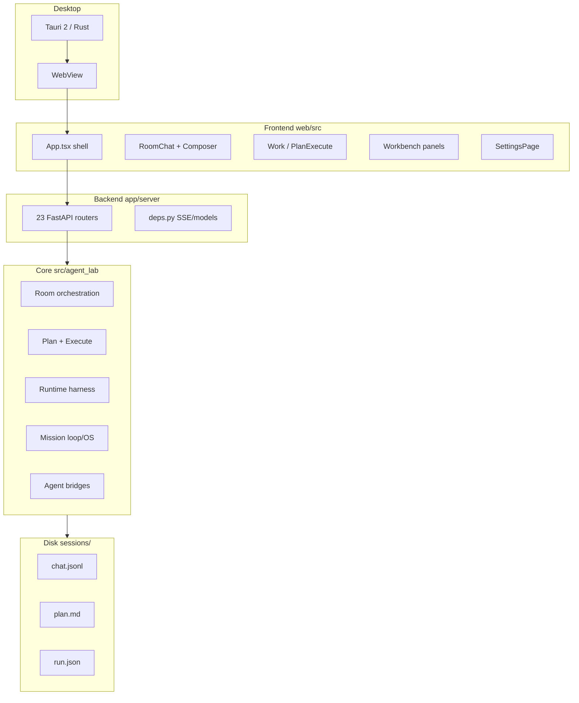

# Agent Lab — 시스템 아키텍처 분류

> **목적:** 기능·백엔드·프론트·UX를 한눈에 보는 지도  
> **플로우 설명:** [FLOW.md](./FLOW.md) · **상세 동작:** [USER-GUIDE.md](./USER-GUIDE.md) · **문서 인덱스:** [README.md](./README.md) · **shipped 증거:** [EXTERNAL-REFS-TRACEABILITY.md](./EXTERNAL-REFS-TRACEABILITY.md)

---

## 0. 전략적 포지션 (2026-06)

> 상세: [STRATEGIC-DIRECTION-2026.md](./STRATEGIC-DIRECTION-2026.md) · 역할 오케스트레이션: [ROLE-ORCHESTRATION-PLAN.md](./ROLE-ORCHESTRATION-PLAN.md)

**"신뢰 수준에 따라 자율도가 조정되는 Trusted Autonomous Mission Platform"**

Fugu(ICLR 2026) 같은 완전 자율 처리나 Harness 패턴 팩토리와 경쟁하는 것이 아니라, 아래 5개 모트로 포지션을 확보한다:

| 모트 | 구현 | Fugu/Harness에 없음 |
|------|------|---------------------|
| BLOCK → 409 | `room/objections.py` | ✓ |
| worktree 격리 | `plan/execute_worktree.py` | ✓ |
| Oracle + Repair | `oracle_core.py`, `verify_repair_policy.py` | ✓ |
| run.json 감사 이력 | `run_meta.py` | ✓ |
| Human Inbox | `human_inbox.py` | ✓ |

**진행 중인 이니셔티브 (P0):** Dynamic Room · Model Policy · Code-memory MCP  
**다음 단계 (P1):** Trust-gated Auto-approval · Room Preset System · 108 플래그 → 4 프로필  
**역할 오케스트레이션 (P1~P8):** `topic_router` → `role_plan` → guidance seam 주입

---

## 1. 제품 정체

**Trusted Autonomous Mission Platform** — AI 개발 작업을 계획·승인·격리 실행·검증하는 데스크톱/웹 콘솔.

| 불변 원칙 | 구현 |
|-----------|------|
| 합의 = Room | `room/`, 3-agent discuss |
| 격리 = worktree | `plan/execute_worktree.py` |
| 완료 = Oracle verified | `oracle_core.py`, verify repair |
| BLOCK → execute 409 | `room/objections.py`, execute gate |

**포지셔닝:** deer-flow/Hermes 같은 full Agent OS가 아니라, **Human gate가 있는 dev mission conductor**.

---

## 2. 계층 구조



| 계층 | 경로 | 기술 |
|------|------|------|
| Desktop shell | `web/src-tauri/` | Tauri 2, uvicorn :8765 기동 |
| Frontend | `web/src/` | React 18, Vite (:5173 dev) |
| API | `app/server/` | FastAPI, ~140 endpoints |
| Core logic | `src/agent_lab/` | Python 3.11+, ~270 modules |
| Session data | `sessions/<id>/` | JSONL + markdown + run meta |
| Project memory | `.agent-lab/` | PROJECT.md, PLATFORM.md, hooks |

---

## 3. 기능 도메인 분류

### 3.1 Discuss (Room)

| 기능 | 설명 | Core | API | UI |
|------|------|------|-----|-----|
| 3-agent 토론 | Cursor·Codex·Claude 병렬/순차 | `room/`, `room/parallel_rounds.py` | `POST /api/room/runs` (SSE) | `RoomChat.tsx`, `ChatComposer.tsx` |
| 합의·이의 | endorse, BLOCK, challenge | `room/consensus*.py`, `room/objections.py` | `session_governance` | `RoomTaskBar`, `HumanDecisionBanner` |
| Scribe | `plan.md` 합성 | `room/plan_scribe.py` | (room SSE) | `PlanDocument.tsx` |
| Clarifier | Socratic 요구사항 명확화 | `session_clarifier.py` | `plan_execute` clarifier | `RoomChat` interview UI |
| Dispatch | worker delegate, parallel fan-out | `room/dispatch.py` | room router | `LiveAgentsStrip` |
| Topic routing | quick/standard/deep/critical | `topic_router.py` | — | Room preset (`roomPresets.ts`) |

### 3.2 Plan (계약)

| 기능 | Core | API | UI |
|------|------|-----|-----|
| Plan workflow FSM | `plan/workflow.py` | `plan_workflow` router | `PlanWorkflowBanner`, `PlanApprovalPanel` |
| Plan actions | `plan/actions.py` | `plan_execute` | `PlanActionCard` |
| Peer review / gate | `evaluate_plan_gate()` | mission_loop plan-gate | `WorkPlanApprovalSection` |
| Provenance | `plan/provenance.py` | — | `PlanProvenanceFooter` |

**산출물:** `sessions/<id>/plan.md` (Human-readable contract)

### 3.3 Execute (격리 실행)

| 기능 | Core | API | UI |
|------|------|-----|-----|
| Worktree dry-run | `plan/execute_worktree.py` | `plan_execute` dry-run | `PlanExecutePanel`, `ExecuteQueueBar` |
| Diff review | `plan/execute_merge.py` | resolve/merge/abort | `SideBySideDiff`, `DiffToolPanel` |
| Merge checks | `merge_checks.py` | merge-checks API | `MergeChecksPanel` |
| Trust auto-merge | `auto_merge.py`, `merge_classifier.py` | trust-budget | `TrustAutoMergeBar` |
| Worktree hooks | `worktree_hooks.py` | — | — |
| Crash recovery | `crash_recovery.py` | lifespan | — |

### 3.4 Verify (Oracle)

| 기능 | Core | API | UI |
|------|------|-----|-----|
| Oracle verdict | `oracle_core.py` | reverify | `VerificationStatusPanel` |
| Verify repair loop | `verify_repair_policy.py` | mission_loop | `DiscussRecoveryBanner` |
| Evidence gates | `evidence_gates.py` | plan_execute | `EvidenceGatesPanel` |
| Adversarial gate | `adversarial_gate.py` | — | (mock-first) |

### 3.5 Mission Loop (FSM)

| 기능 | Core | API | UI |
|------|------|-----|-----|
| Discuss↔Execute↔Verify | `mission_loop.py` | `mission_loop` router | `MissionOverviewSection`, `WorkStatusBar` |
| Verified loop bridge | `verified_loop.py` | `verified_loop` | `VerifiedLoopBanner` |
| Goal loop | `goal_loop.py` | sessions goal | `GoalLoopBanner` |
| Mission board | `mission_board.py` | runtime snapshot | `MissionBoardStrip`, `TurnBudgetSection` |
| Evidence ledger | `evidence_ledger.py` | evidence stream | `EvidenceTimeline` |
| Wisdom index | `wisdom_index.py` | wisdom-search | `WisdomSearchPanel` |

**Work phase SSOT:** `GET /api/sessions/{id}/runtime` → `runtime/work_phase.py`

### 3.6 Human Inbox

| 기능 | Core | API | UI |
|------|------|-----|-----|
| Execute-time 질문 | `human_inbox.py` | `human_inbox` router | `HumanInboxPanel` |
| Discuss inbox | `inbox_facilitator.py` | — | `HumanInboxPanel` (Harvest 배지) + `DiscussRecoveryBanner` |
| MCP server | `inbox_mcp_server.py` | — | — |

### 3.7 Runtime Harness

| 기능 | Core | 문서 |
|------|------|------|
| Unified contract | `runtime/runtime.py`, `phases.py`, `transitions.py` | [RUNTIME-HARNESS-PLAN.md](./RUNTIME-HARNESS-PLAN.md) |
| Discuss lane | `runtime/discuss_lane.py` | |
| Execute lane | `runtime/execute_lane.py`, `invoke_execute.py` | |
| External runner | `runtime/external_runner.py`, `external_handoff.py` | GJC handoff MB-8 |
| Policy engine | `runtime/policy.py` | |

### 3.8 Agents & Bridges

| 에이전트 | Core | 설정 |
|----------|------|------|
| Cursor | `agents/cursor_agent.py`, `cursor_bridge.py` | SDK / bridge |
| Codex | `agents/codex_agent.py`, `codex_cli.py` | CLI, optional proxy |
| Claude | `agents/claude_agent.py`, `claude_cli.py` | CLI, hooks |
| Registry | `agents/registry.py` | `GET /api/agents` |
| Health / preflight | `agent_health.py`, `agent_preflight.py` | `AgentHealthPanel` |

### 3.9 Gateway & Mission OS

| 기능 | Core | API | UI |
|------|------|-----|-----|
| Outbound notify | `gateway/outbound.py` | gateway router | `GatewaySettingsPanel` |
| Telegram/Slack/Discord | `gateway/adapters_*.py` | webhooks | Settings |
| Scheduler | `mission_scheduler.py` | `mission_os` schedules | `SchedulesPanel` |
| Daemon state | `daemon_state.py` | daemon health | `DaemonStatusBar` |

**로드맵:** [MISSION-OS-DIRECTION.md](./MISSION-OS-DIRECTION.md)

### 3.10 Workspace Tools

| 탭 | 단축키 | Component | API |
|----|--------|-----------|-----|
| Transcript | ⌘1 | `RoomChat` | room SSE |
| Work | ⌘2 | `WorkToolPanel` | plan_execute, runtime |
| Background | ⌘3 | `BackgroundTasksPanel` | background_tasks |
| Diff | ⌘4 | `DiffToolPanel` | plan_execute |
| Files | ⌘5 | `WorkspaceFilesPanel` + Monaco | workspace_files |
| Preview | ⌘6 | `PreviewPanel` | dev_preview |
| Terminal | ⌘7 | `TerminalPanel` | WS terminal |

### 3.11 Plugins & Commands

| 기능 | Core | UI |
|------|------|-----|
| Slash commands | `command_registry.py` | `SlashCommandMenu` |
| Plugin discovery | `plugin_discovery.py` | `PluginPanel` |
| Skill drafts | `skill_drafts.py` | promote/reject API |
| Session MCP | `session_plugin_runtime.py` | Settings |

### 3.12 Extensions

| Extension | 경로 | 문서 |
|-----------|------|------|
| Quant trading mission | `trading_mission/`, `extensions/quant_trading.py` | `docs/trading-mission/`, `extensions/QUANT-TRADING.md` |

### 3.13 Classic (Legacy)

| 기능 | Core | UI |
|------|------|-----|
| Planner→Critic→Scribe graph | `graph.py`, `runner.py` | `RunLogPanel` (classic) |
| `POST /api/runs` | `routers/room.py` | 별도 Run 탭 |

Room이 **기본**; Classic은 레거시.

### 3.14 Backend Hardening (P0–P5, default off)

Additive, flag-gated layers from the LangGraph/OpenHands/Aider/SWE-agent gap analysis. Each is a pure-stdlib module with unit tests; flag OFF ⇒ byte-identical to prior behavior. **P0–P3 are wired into an existing chokepoint; P4–P5 ship as unwired pure libraries (zero call sites).**

| 갭 | Core | 연결 지점 (seam) | Flag | UI |
|----|------|------------------|------|-----|
| P0 checkpoint/resume | `checkpoint_store.py` | `run_meta.patch_run_meta` | `AGENT_LAB_CHECKPOINT` | — (resume는 함수 호출) |
| P1 symbol repo-map | `repo_map.py` | `context_bundle.py` (repo tree 교체) | `AGENT_LAB_REPO_MAP`(+`_TOKENS`) | — (컨텍스트 내부) |
| P2 tool-output compaction | `room/context/message_trim.py` helpers | `prepare_recent_messages` (char-trim 직전) | `AGENT_LAB_COMPACT_TOOL_OUTPUT`(+`_CHARS`) | — |
| P3 edit-time syntax gate | `syntax_gate.py` | `merge_checks.build_merge_checks` | `AGENT_LAB_SYNTAX_GATE` | `MergeChecksPanel` (자동 표시) |
| P3 sandbox policy | `sandbox_policy.py` | `worktree_hooks._run_command` | `AGENT_LAB_SANDBOX_POLICY`(+`_RUNTIME`) | — (live Docker deferred) |
| P4 eval harness | `eval_harness.py` | **없음 (zero call site)** | `AGENT_LAB_EVAL_HARNESS` | — (연결 deferred) |
| P5 event schema + KV store | `event_schema.py`, `memory_store.py` | **없음 (zero call site)** | `AGENT_LAB_EVENT_MEMORY` | — (연결 deferred) |

**겹침 메모:** P1은 `build_repo_tree_block`을 flag로 교체(OFF면 기존 tree 유지); P5 `event_schema`는 `room_live_log.LIVE_EVENT_TYPES`를 상위집합으로 재사용(단방향 import). P0는 boot-time `crash_recovery`(자동)와 별개의 수동 스냅샷/resume.

---

## 4. 백엔드 상세 (`app/server/`)

**패턴:** Router → `src/agent_lab/*` 직접 호출 (별도 service layer 없음)

### 4.1 Router 맵 (23개)

| 도메인 | Router file | 주요 책임 |
|--------|-------------|-----------|
| Health | `health.py` | health, flags, readiness, diagnostics, reconnect |
| Sessions | `sessions.py` | CRUD, archive, attachments, goal |
| Session tasks | `session_tasks.py` | task claim/complete |
| Session governance | `session_governance.py` | objections, capabilities |
| Context | `context_layers.py` | context layer PATCH |
| Room | `app/server/routers/room.py` | SSE runs, run-lock, context-preview |
| Plan execute | `plan/execute.py` | evidence, merge, clarifier, wisdom, handoff |
| Plan workflow | `plan/workflow.py` | approve/reject plan |
| Verified loop | `verified_loop.py` | verified loop gates |
| Runtime | `runtime.py` | work_phase snapshot |
| Mission loop | `mission_loop.py` | FSM advance/pause/resume |
| Mission OS | `mission_os.py` | gateway, scheduler, templates |
| Human inbox | `human_inbox.py` | inbox CRUD, resolve |
| Agents | `agents.py` | agent list, backends |
| Commands | `commands.py` | slash, plugins, external tools |
| Skill drafts | `skill_drafts.py` | draft promote |
| Gateway | `gateway.py` | adapters, webhooks, notify |
| Workspace files | `workspace_files.py` | Monaco file roots |
| Terminal | `terminal.py` | WS terminal |
| Dev preview | `dev_preview.py` | dev server probe |
| Background tasks | `background_tasks.py` | bg task CRUD |
| Settings | `settings.py` | credentials, codex oauth |
| Auth | `auth.py` | agent auth providers, codex capture, auth-run WS |

### 4.2 Core Python 맵 (`src/agent_lab/`)

| 패키지/군 | 모듈 수(대략) | 대표 파일 |
|-----------|---------------|-----------|
| Room orchestration | ~35 | `room/`, `room/turn_flow.py` |
| Plan & execute | ~20 | `plan/execute.py` (2k lines) |
| Runtime harness | 24 | `runtime/runtime.py` |
| Mission loop/OS | ~12 | `mission_loop.py` |
| Agents & CLI | ~12 | `agents/`, `cursor_bridge.py` |
| Human inbox | ~8 | `human_inbox.py` |
| Gateway | 14 | `gateway/router.py` |
| Evidence & scoring | ~12 | `evidence_ledger.py`, `wisdom_index.py` |
| Session & context | ~18 | `context_bundle.py`, `run_meta.py` |
| Hooks & envelopes | ~10 | `room/hooks.py`, `reply_policy.py` |
| Backend hardening (P0–P5) | 7 | `checkpoint_store.py`, `repo_map.py`, `syntax_gate.py`, `sandbox_policy.py`, `eval_harness.py`, `event_schema.py`, `memory_store.py` |
| Trading extension | 28 | `trading_mission/` |

### 4.3 Startup (`main.py` lifespan)

1. `agent_auth_bootstrap` — Room auth
2. `crash_recovery` — crashed merge reconcile
3. `mission_scheduler` — background scheduler
4. `daemon_state` — daemon heartbeat

---

## 5. 프론트엔드 상세 (`web/src/`)

**라우팅:** `App.tsx` — `workspace` | `settings` (페이지 라우터 없음, shell 기반)

### 5.1 디렉터리

| 경로 | 파일 수 | 역할 |
|------|---------|------|
| `components/` | 105 | UI 컴포넌트 |
| `utils/` | ~80 | 뷰 로직, prefs, formatters |
| `hooks/` | 11 | Tauri, scroll, plan execute |
| `api/client.ts` | 1 | ~100 fetch helpers |
| `context/` | — | React context providers |
| `run/`, `figma/` | — | classic run view, figma assets |
| `styles/` | 9 | CSS |
| `i18n/` | 3 | locale |

### 5.2 컴포넌트 분류

#### Shell & Navigation
`SessionRail`, `SessionList`, `MacTitlebar`, `ShellPortal`, `NewSessionDialog`, `FirstRunOnboarding`

#### Room / Transcript (핵심 UX)
`RoomChat` (~3.7k lines), `ChatComposer`, `ChatBubble`, `ComposerPreflightBar`, `RoomTaskBar`, `RoomRunStatusBar`, `TurnProgressStrip` — Composer mode: **fast / supervisor** presets (`roomPresets.ts`), not quick/team/loop segmented picker.

#### Work / Plan / Execute
`WorkToolPanel`, `WorkPanel`, `WorkStatusBar`, `PlanExecutePanel` (~1.5k), `PlanDocument`, `PlanApprovalPanel`, `SideBySideDiff`, `MergeChecksPanel`, `ExecuteQueueBar`

#### Workbench (우측 레일)
`WorkbenchPanel`, `ContextOverviewPanel`, `HumanInboxPanel`, `HumanGatePanel`, `MissionOverviewSection`

#### Mission / Evidence
`EvidenceTimeline`, `EvidenceGatesPanel`, `WisdomSearchPanel`, `MissionBoardStrip`, `GoalLoopBanner`, `VerifiedLoopBanner`, `DiscussRecoveryBanner`

#### Settings & Health
`SettingsPage`, `AgentHealthPanel`, `AgentCredentialsPanel`, `GatewaySettingsPanel`, `CodexProxyPanel`, `SchedulesPanel`

#### Chrome & Commands
`CommandPalette`, `NotificationCenter`, `SlashCommandMenu`, `TweaksPanel`

### 5.3 API 클라이언트

모든 REST 호출은 `api/client.ts`에 집중. 컴포넌트는 hook/utils 경유.

---

## 6. UX / 정보 구조 (IA)

### 6.1 3-column 레이아웃

```text
[ Session rail ] | [ Transcript + Composer + Taskbar ] | [ Workbench ]
```

### 6.2 Workbench 모드

| Mode | 패널 | 사용자 의도 |
|------|------|-------------|
| `overview` | Context overview, Mission | 지금 세션 전체 상태 |
| `tasks` | Tasks, gates, plan approval | 해야 할 Human 결정 |
| `inbox` | Human/Discuss inbox | 에이전트 질문 처리 |
| `tools` | Workspace tabs (⌘1–7) | 파일·diff·터미널 |

### 6.3 Work stepper (`WorkStatusBar`)

`Plan → Review → Execute → Verify → Done`

SSOT: `work_phase` from runtime API — UI와 백엔드 동기화.

### 6.4 주요 사용자 플로우

| 플로우 | 단계 | 관련 UI |
|--------|------|---------|
| 새 세션 | ⌘N → folder → agents → topic | `NewSessionDialog`, `SessionSetupBar` |
| Room 턴 | compose → SSE stream → transcript | `ChatComposer`, `RoomChat` |
| Plan approve | clarify → scribe → Human approve | `PlanApprovalPanel` |
| Execute | dry-run → diff → merge approve | `PlanExecutePanel`, `SideBySideDiff` |
| Verify fail | repair loop → discuss recovery | `DiscussRecoveryBanner` |
| Inbox | MCP question → Human answer | `HumanInboxPanel` |

### 6.5 Desktop (Tauri)

| 항목 | 내용 |
|------|------|
| Rust entry | `web/src-tauri/src/lib.rs` |
| API 기동 | uvicorn :8765 — **prod:** Tauri spawn + 4s supervisor · **dev:** `ensure-dev-api.mjs` (`AGENT_LAB_SKIP_TAURI_API=1`) |
| IPC | HTTP `:8765` only (no custom Tauri `invoke`; plugins: opener, dialog, notification) |
| Prod | webview → `http://127.0.0.1:8765/` (mixed-content workaround) |
| Dev browser | `make dev` — Vite :5173 + `/api` proxy |
| Dev desktop | `make tauri-dev` — Vite :1420 + same proxy |
| Bundled runtime | `scripts/prepare_bundled_runtime.sh` → `.app` embedded venv |
| **Baseline (pre hybrid Rust)** | Tag `baseline/pre-hybrid-rust-2026-06-28` · [PACKAGING-BASELINE.md](./PACKAGING-BASELINE.md) · [HYBRID-RUST-PYTHON-ADR.md](./HYBRID-RUST-PYTHON-ADR.md) |

### 6.6 알려진 UI gap

→ [UI-MIGRATION-GAPS.md](./UI-MIGRATION-GAPS.md) · USER-GUIDE §27

---

## 7. 세션 디스크 계약

` sessions/<session-id>/`

| 파일 | 용도 |
|------|------|
| `topic.txt` | 세션 주제 |
| `chat.jsonl` | 메시지 원문 (SSOT) |
| `plan.md` | Plan contract |
| `run.json` | Runtime state, mission, budgets |
| `meta.json` | 세션 메타 |
| `transcript.md` | 렌더된 transcript (파생) |
| `artifacts/` | 에이전트 산출물 |
| `attachments/` | 첨부 |

Mission evidence: `.agent-lab/missions/<id>/evidence.jsonl`

---

## 8. 테스트 & 품질

| 종류 | 경로 |
|------|------|
| Unit/integration | `tests/` (~280 files) |
| Regression baselines | `sessions/_regression/` (~40 scenarios) |
| Benchmarks | `sessions/_benchmark/` |
| CI reports | `sessions/_reports/` |
| Smoke | `scripts/smoke_room.py`, `make verify-hooks` (37 regression baselines) |

→ [STABILITY.md](./STABILITY.md)

---

## 9. 관련 문서 빠른 링크

| 질문 | 문서 |
|------|------|
| 기능·동작 전체 | [USER-GUIDE.md](./USER-GUIDE.md) |
| shipped 여부 | [EXTERNAL-REFS-TRACEABILITY.md](./EXTERNAL-REFS-TRACEABILITY.md) |
| Mission OS 방향 | [MISSION-OS-DIRECTION.md](./MISSION-OS-DIRECTION.md) |
| Plan workflow | [PLAN-WORKFLOW.md](./PLAN-WORKFLOW.md) |
| UI productization | [CONSOLE-PRODUCTIZATION.md](./CONSOLE-PRODUCTIZATION.md) |
| Ops / live | [OPS-RUNBOOK.md](./OPS-RUNBOOK.md) |
| 문서 전체 인덱스 | [README.md](./README.md) |
