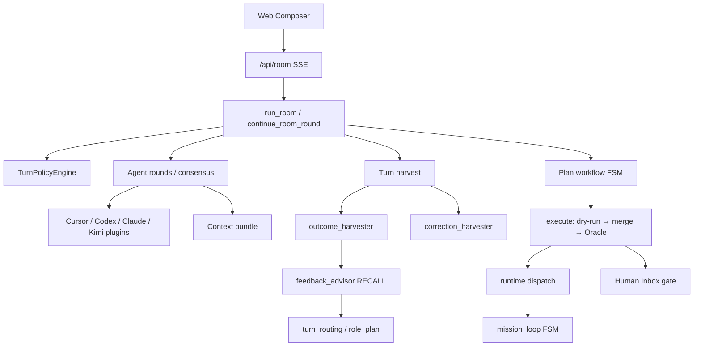

# 설계: Harness Self-Improvement Loop (N6 Phase 2)

> **Status:** approved **N6 feature spec**, core daily reading 아님 · **작성:** 2026-07-07 · **authority 정리:** 2026-07-10
> **현재 상태/동결:** [NOW.md](./NOW.md) · [NORTH-STAR.md](./NORTH-STAR.md) §2.1 N6. 이 문서는 HS 설계·안전 결정·phase 계약만 소유하며 shipped 현황의 최종 권위가 아니다.
> **승인:** 2026-07-08 Human 승인 — REVIEW P0 5건 반영 후. HS0~HS5 구현 완료, HS6은 HS-M5 미충족으로 동결.
> **북극성 근거**: [NORTH-STAR.md](./NORTH-STAR.md) §2.1 **N6** (Self-patch meta-loop — 1단계 관측 ✅, **2단계 HSIL 설계 승인·HS0~HS5(HS5-3 포함) 코드+mock 검증 완료, HS6은 HS-M5 게이트 미충족으로 동결**)  
> **외부 근거**: [Lilian Weng — Harness Engineering for Self-Improvement](https://lilianweng.github.io/posts/2026-07-04-harness/) · [choi.openai Threads 정리](https://www.threads.com/@choi.openai/post/DafZipXD6aG)  
> **선행 shipped**: [DESIGN-S1-FEEDBACK-LOOP.md](./DESIGN-S1-FEEDBACK-LOOP.md) · [N10-USER-LOOP-WISDOM-DRAFT.md](./N10-USER-LOOP-WISDOM-DRAFT.md) · `self_patch.py`

---

## 0. 문서 범위 · Tier 체계 (용어 정리)

본 문서는 **두 가지 Tier 체계**를 병행한다. 혼동 금지.

| 체계 | 의미 | 섹션 |
|------|------|------|
| **Editable Surface Tier A/B/C** | 하네스 **파일** 수정 권한·승인 강도 | §7 |
| **Implementation Tier A/B/C/D** | **작업** 우선순위·로드맵 (즉시 → 아키텍처 → 보류) | §6 |
| **HS Phase HS0–HS7** | 구현 **마일스톤** (코드 배포 단위) | §9 |

매핑 요약:

| Impl Tier | HS Phase | Editable Tier |
|-----------|----------|---------------|
| A (즉시) | HS0–HS2 | — (관측·기억) |
| B (N6 확장) | HS3–HS6 | A + B |
| C (아키텍처) | HS7 | A + B (동일, 범위만 확대) |
| D (보류) | — | C (frozen) 변경 없음 |

---

## 1. Context — 왜 지금 이 작업인가

### 1.1 외부 신호 (요약)

2026년 7월, harness engineering이 RSI(재귀적 자기개선)의 **현실적 시작점**으로 정리됐다.

| 관측 | 출처 | agent-lab 시사점 |
|------|------|------------------|
| 동일 모델, 하네스만 바꿔 SWE-bench **20%→50%** | DGM | preset·prompt·hooks가 1급 레버 |
| 하네스 진화 = propose → held-in/out 검증 → merge | Self-Harness | Human Inbox + Oracle과 정합 |
| 약한 모델에 재귀 개선기 → **성능 하락** | STOP | mock/fast profile에서 proposer 금지 |
| 평가자·권한은 진화 루프 **바깥** | Weng bottleneck #5 | 5모트 불변 |
| 실패 기록 보존이 탐색 공간을 줄임 | Weng #3 · Trehan 2026 | ledger 편향(성공만) 보완 |
| 스캐폴딩 바꿔도 SWE-bench 편차 **4% 이내** (재현성) | Tencent Hy3 (choi.openai 인용) | `harness_reproducibility_pp` KPI |
| 2028년쯤 Claude 10→11 자기생산 (RSI 특이점) | Jack Clark (choi.openai 인용) | HSIL은 그 전 **채워질 층** 목록 |

### 1.2 agent-lab 한 줄 진단

> agent-lab은 이미 **「견고한 하네스 + Human gate + 관측 ledger」**까지 갖췄고, 웽·Self-Harness·DGM이 말하는 **「ledger → bounded edit → held-out 검증 → Inbox 병합」**만 연결하면 된다.

### 1.3 목표 · 비목표

**Harness Self-Improvement Loop (HSIL)** — 자기 하네스를 **측정 가능한 폐루프**로 개선.

**비목표** → Implementation **Tier D** (§6.4) 참조.

### 1.4 어휘 매핑 (NORTH-STAR §2.2 동결)

| HSIL 항목 | 소속 어휘 |
|-----------|-----------|
| Weakness mining | **Wisdom** W2 |
| Harness proposal / playbook | **Wisdom** W3 |
| Regression gate / eval attribution | **Oracle** |
| Inbox merge | **Plan** (Human gate) |

**새 1급 개념 추가 없음.**

---

## 2. 출처 정리 — choi.openai 스레드 · Weng 블로그

### 2.1 choi.openai Threads ([원문](https://www.threads.com/@choi.openai/post/DafZipXD6aG))

릴리안 웽 7월 4일 Lil'Log **[Harness Engineering for Self-Improvement](https://lilianweng.github.io/posts/2026-07-04-harness/)** 를 12파트로 요약한 스레드. 핵심 논지:

| 파트 | 요지 |
|------|------|
| 1 | Lil'Log = 연구자들이 논문보다 먼저 읽는 블로그; 주제 RSI |
| 2 | **하네스** = raw 모델↔실세계 사이 층; 2023 공식 `에이전트=LLM+메모리+도구+계획` → 워크플로·평가·권한·영속 상태까지 확장 |
| 3 | 설계 패턴 3: 워크플로 자동화(autoresearch) · 파일=메모리 · 서브에이전트 |
| 4 | 전망: RSI는 가중치 직접 수정보다 **하네스 메타 방법론**에서 시작 |
| 5 | 최적화 사다리: 프롬프트→컨텍스트→워크플로→하네스 코드→옵티마이저; **ACE · MCE · Meta-Harness** |
| 6 | **STOP** 경고: GPT-4는 개선, GPT-3.5/Mixtral은 악화 — 지능 원천은 모델 |
| 7 | **Self-Harness**: 약점 채굴→제한 수정→held-in/out 검증; 권한·보안은 루프 **바깥** |
| 8 | **DGM**: Claude 3.5 고정, SWE 20→50%, Polyglot 14.2→30.7%; **AlphaEvolve** 알고리즘·스케줄링 |
| 9 | 자동 연구 실패 6모드 (Trehan); 부벡 「숫자에 테이프」 |
| 10 | 병목: 부정적 결과 · 보상 해킹 · 기억=지능의 일부 |
| 11 | 잭 클라크 2028 RSI · Hy3 재현성 4% |
| 12 | 사람은 루프 밖이 아니라 **스택 위**; 실험 실행=하네스, 질문 선택=사람 |

### 2.2 Weng 블로그 핵심 (원문 SSOT)

**하네스 정의**: 베이스 모델 주변 — 생각·계획, 도구 호출, 컨텍스트·메모리, 산출물 저장, 결과 평가를 orchestrate하는 시스템 (Claude Code, Codex 등).

**에이전트 공식 진화** (웽 본인):

```
2023: agent = LLM + memory + tools + planning + action
2026: + workflow design, evaluation, permission controls, persistent state management
```

**가까운 RSI 경로** (Weng 예측):

1. 하네스 엔지니어링이 메타 방법론으로 진화 (답이 아니라 **더 나은 답을 얻는 장치** 개선)
2. 성숙한 하네스 → 자동 연구 → 더 똑똑한 모델이 하네스 단순화
3. 많은 harness 개선은 모델 안으로 흡수되나 **목표·제약·컨텍스트 인터페이스**는 잔존

**미래 병목 7** (Weng §Future Challenges) → agent-lab 대응은 §5.3.

---

## 3. 외부 연구 · 프로그램 카탈로그

### 3.1 컨텍스트 · 워크플로 · 하네스 최적화

| ID | 이름 | 핵심 | agent-lab 변용 | Impl Tier |
|----|------|------|----------------|-----------|
| R0 | [Weng 2026 Harness](https://lilianweng.github.io/posts/2026-07-04-harness/) | 하네스=RSI 현실적 시작점 | 본 문서 SSOT | — |
| R1 | [Karpathy autoresearch](https://github.com/karpathy/autoresearch) | 5분 GPU 루프·파일 로그·밤새 반복 | HS4-4, HS7-3 | C |
| R2 | [ACE](https://lilianweng.github.io/posts/2026-07-04-harness/) (Zhang et al. 2025) | Generator·Reflector·Curator; 증분 bullet | HS2 playbook | A |
| R3 | [MCE](https://arxiv.org/abs/2601.21557) (Ye et al. 2026) | bi-level: skill(메커니즘) + context(내용) | HS7-1 | C |
| R4 | [Meta-Harness](https://arxiv.org/abs/2603.28052) (Lee et al. 2026) | 코딩 에이전트가 하네스 코드 탐색 | HS3 manifest + traces grep | B |
| R5 | [ADAS](https://openreview.net/forum?id=imT03YXlG2) (Hu et al. 2025) | 메타 에이전트가 워크플로 코드 생성 | Tier D (전체 탐색) | D |
| R6 | [AFlow](https://openreview.net/forum?id=z5uVAKwmjf) (Zhang et al. 2025) | 워크플로 그래프 MCTS | Mission FSM 후속 | D |
| R7 | AI Scientist (Lu et al. 2026) | 아이디어→실험→논문 파이프라인 | Mission loop (부분 일치) | — |
| R8 | ScientistOne (Meng et al. 2026) | Chain-of-Evidence 감사 | Oracle + evidence trace | C |
| R9 | Autodata (Kulikov et al. 2026) | challenger·solver·verifier 합성 데이터 | eval surface 확장 후속 | D |

### 3.2 자기개선 · 진화 탐색

| ID | 이름 | 핵심 | agent-lab 변용 | Impl Tier |
|----|------|------|----------------|-----------|
| R10 | [STOP](https://openreview.net/forum?id=ZJ0UzOb8RD) (Zelikman et al. 2023) | 개선기가 자기 자신 개선; 약모델 역효과 | §7.4 STOP 가드 | B |
| R11 | [Self-Harness](https://arxiv.org/abs/2606.09498) (Zhang et al. 2026) | mine→propose→validate→merge | HS1–HS5 전체 | B |
| R12 | [AHE](https://arxiv.org/abs/2604.25850) (Lee et al. 2026) | component·experience·decision 관측성 | §4.4, manifest·traces·predictions | B |
| R13 | [DGM](https://arxiv.org/abs/2505.22954) (Zhang et al. 2025) | 고정 모델·하네스 코드 진화; SWE 20→50% | HS6 preset mutation | B |
| R14 | [AlphaEvolve](https://arxiv.org/abs/2506.13131) (Novikov et al. 2025) | 후보 풀+LLM diff+fitness | HS6 Pareto selection | B |
| R15 | ShinkaEvolve / ThetaEvolve | 탐색 효율·RL 결합 | Tier D | D |
| R16 | [Hyperagents](https://arxiv.org/abs/2603.19461) (Zhang et al. 2026) | meta-agent가 task agent 수정 | DELEGATE 확장 후속 | C |
| R17 | [SIA](https://arxiv.org/abs/2605.27276) (Hebbar et al. 2026) | harness+weight 동시 최적화 | Tier D (training lane) | D |
| R18 | Promptbreeder / GEPA | 프롬프트 진화 | prompts.py BLOCK 대상 | B |

### 3.3 평가 · 벤치마크 · 실패 연구

| ID | 이름 | 용도 | agent-lab 연결 |
|----|------|------|----------------|
| R19 | [Trehan & Chopra 2026](https://arxiv.org/abs/2601.03315) | LLM 자동 연구 6대 실패 모드 | `failure_tags` (§8.1) |
| R20 | Bubeck et al. 2025 | 「numerical duct tape」 | `false_success` tag |
| R21 | Claw-SWE-Bench | harness vs model attribution (동일 backbone 19%→73%) | `eval_harness` 정신 |
| R22 | Harness-Bench | realistic workflow harness 효과 | dogfood L2 |
| R23 | PaperBench / CORE-Bench / RE-Bench / MLE-bench / KernelBench | Weng appendix | `evals/`·emergence bench 장기 |

### 3.4 산업·언론 맥락 (choi.openai)

| 신호 | HSIL에서의 위치 |
|------|----------------|
| Jack Clark 2028 RSI | HSIL = 그 전에 채워야 할 **층** (하네스·평가·Human oversight) |
| Hy3 스캐폴딩 재현성 4% | HS0 `harness_reproducibility_pp` |
| 개발자 노동시장 (코드 실행 vs 판단) | §12 Human의 자리; Plan gate 유지 |

---

## 4. agent-lab 현재 하네스 (Baseline)

### 4.1 레이어드 스택

agent-lab은 단일 `Harness.run()` 클래스가 아니라 **레이어드 orchestration stack**:



| 레이어 | 역할 | 핵심 파일 |
|--------|------|-----------|
| Room (discuss) | 멀티에이전트 턴·합의·scribe | `src/agent_lab/room/` |
| Runtime | 이벤트 라우터 (discuss/execute/mission) | `runtime/runtime.py` |
| Plan/execute | plan.md → worktree → merge → verify | `src/agent_lab/plan/` |
| Mission loop | Discuss↔Execute FSM | `mission/loop.py` |
| Session SSOT | run.json | `run/meta.py`, `run/state.py` |
| API+SSE | HTTP 진입 | `app/server/routers/room.py` |
| Web UI | Composer → runRoom | `web/src/hooks/useRoomExecuteSend.ts` |

### 4.2 「하네스」에 해당하는 컴포넌트

| 개념 | 구현 | 비고 |
|------|------|------|
| Workflow | TurnPolicyEngine, Mission FSM, plan workflow | `turn_policy.py`, `mission/loop.py` |
| Prompts | per-agent room prompts | `agents/prompts.py` |
| Context | layered bundle | `context/bundle.py` |
| Tools | agent-native + MCP Inbox + stubs | plugins별 |
| Hooks | TOML subprocess hooks | `room/hooks.py` |
| Memory | namespace KV | `memory_store.py` — **consumer 0** |
| Subagents | DELEGATE/DISPATCH, Oracle | `dispatch.py`, `verified_loop.py` |
| Presets | fast / supervisor | `room/preset.py` |
| Human gate | Inbox SSOT | `human_inbox.py` |
| Eval scorer | model vs harness | `eval_harness.py` — **call site 0** |

### 4.3 기존 자기개선·관측 메커니즘

| 메커니즘 | 역할 | 자동화 수준 |
|----------|------|-------------|
| S1 outcome ledger | 턴/execute 메트릭 cross-session | Record |
| feedback_advisor | RECALL → SetupHint (roles, subset, tool cards) | Setup shaping |
| feedback_report | advisor lift 검증 | Analytics |
| correction_harvester | 사용자 교정 → rule candidate | Inbox 승인 후 |
| rule_sync | SSOT → 하네스별 export | 단방향 |
| self_patch | allowlist classify | **관측만** (N6 D2) |
| autonomy_ladder | L0→L3 승격 | Inbox-gated |
| s2_role_bandit | role combo ε-greedy | Session-local |
| drift_audit / risk_pin | L3 drift · 위험 핀 | Flag-gated |
| verified_loop | Goal → approve → VERIFIED | Closed sub-loop |

**자동 코드 self-modification 루프는 없음** — N6 「다음」이 본 문서.

### 4.4 Extension points (플러그인 위치)

1. `agents/plugins.py` — 신규 에이전트  
2. `turn_policy.py` — TurnSignals / TurnEffects  
3. `preset.py` — `_PRESET_CONFIGS`  
4. `run/profile.py` — run profile flags (F2)  
5. `context/bundle.py` — context 레이어  
6. `.agent-lab/hooks.toml` — hooks  
7. `outcome_harvester.py` / `feedback_advisor.py` — S1  
8. `human_inbox.py` — gates  
9. `useRoomComposerPrefs.ts` / `useRoomExecuteSend.ts` — UI  
10. `evals/cases.jsonl`, `dogfood-v1.json` — eval  
11. `.agent-lab/harness/manifest.json` — N6/HS3 (구 `self_patch_allowlist.txt`, HS3-2에서 단일화)

---

## 5. Gap 분석

### 5.1 HSIL 관점 missing pieces

```
outcome_harvester (RECORD)     ✅
  → feedback_advisor (RECALL)  ✅
  → correction_harvester       ✅
  → self_patch (classify)      ✅
  → eval_harness               ✅ HS0 (2026-07-08)

  → weakness_mining            ✅ HS1 (2026-07-08)
  → playbook                   ✅ HS2 (2026-07-08)
  → harness_proposal           ✅ HS3 (2026-07-09)
  → regression_gate            ✅ HS4 (2026-07-09)
  → inbox_merge (harness_patch)✅ HS5 (2026-07-09)
```

### 5.2 Harness engineering 일반 갭

| 갭 | 현재 | HSIL/후속 |
|----|------|-----------|
| Unified harness API | Room+Runtime+Mission 분산 | Tier D |
| Tool registry end-to-end | agent-native 분산 | N7 S3 |
| memory_store 소비 | ✅ HS1-4 (2026-07-08, `weakness_miner.py` 첫 consumer) | — |
| eval_harness wiring | ✅ HS0 (2026-07-08) | — |
| Subagent process manager | DELEGATE만 | HS7-2 (C2) |
| Metrics→action | ✅ HS3–HS5 (2026-07-09, mine→propose→regress→merge 코드 완결 — dogfood 증거는 HS-M5 미충족, §1 큐 참고) | — |
| MCE bi-level context | 단일 bundle | HS7-1 (C1) |
| Trehan contract formalize | 휴리스틱만 | HS7-4 (C4) |

### 5.3 Weng 미래 병목 7 → agent-lab

| # | 병목 | agent-lab 대응 |
|---|------|----------------|
| 1 | Weak/fuzzy evaluators | Oracle + pytest/dogfood; 연구 taste는 Human |
| 2 | Context/memory lifecycle | HS1 traces, HS2 playbook, HS7-1 MCE |
| 3 | Negative results | failure_pattern + candidate fail 보존 |
| 4 | Diversity collapse | S1.5 ε-greedy explore |
| 5 | Reward hacking | held-out, evaluator outside loop, §10 |
| 6 | Long-term success | drift_audit, goal_ledger (Mission) |
| 7 | Role of humans | Inbox, L2 oversight, §12 |

---

## 6. Implementation Tier A/B/C/D — 전체 로드맵

> 이전 대화에서 정리한 **적용·변용 1차 목록**의 완전판. 각 항목은 HS Phase·파일·플래그와 연결.

### 6.1 Tier A — 기존 코드 위 즉시 (1–2주)

| ID | 항목 | 내용 | HS | 파일 |
|----|------|------|-----|------|
| A1 | Failure taxonomy | Trehan 6모드 + `harness_infra` → `turn_metrics.failure_tags` | HS1 | `turn_metrics.py` |
| A2 | ACE playbook | 증분 bullet; correction_rules 병행 | HS2 | `wisdom/playbook.py`, `context/bundle.py` |
| A3 | eval_harness ↔ dogfood | model vs harness attribution 리포트 | HS0 | `eval_harness.py`, `run_dogfood_suite.py` |
| A4 | memory_store 1 consumer | `failures/{session_id}` ns; 부정적 결과 보존 | HS1 | `memory_store.py`, `weakness_miner.py` |

**기대 효과**: harness 기여도 수치화; 반복 실패 패턴 가시화; context collapse 완화.  
**리스크**: 낮음 (관측·주입 위주).

### 6.2 Tier B — N6 self-patch 확장 (2–4주)

| ID | 항목 | 내용 | HS | 파일 |
|----|------|------|-----|------|
| B1 | Editable surface SSOT | manifest.json; Tier A/B; proposer bounded | HS3 | `harness_proposer.py`, manifest |
| B2 | AHE 3관측성 | component·experience·decision | HS3–5 | manifest, traces, predictions.jsonl |
| B3 | Self-Harness 루프 | mine→propose→regress→Inbox | HS1–5 | 전 모듈 |
| B4 | DGM-lite | preset genome + dogfood fitness | HS6 | `preset.py`, `run_dogfood_suite.py` |
| B5 | AlphaEvolve-lite | Pareto(pass, token); 1 candidate/week Inbox | HS6 | `feedback_report.py` |
| B6 | Tier B 승인 플로우 | UI/eval 변경 = L1 전체 gate | HS5-B | `human_inbox.py`, §7.2 |

**기대 효과**: allowlist 안에서 검증된 self-patch 1건 E2E.  
**리스크**: 중간 (게이트·회귀 설계).

### 6.3 Tier C — 아키텍처 확장 (1–2달)

| ID | 항목 | 내용 | HS | 파일 |
|----|------|------|-----|------|
| C1 | MCE bi-level | outer=skill( bundle 연산자), inner=context 내용 | HS7-1 | `context/bundle.py`, `.agent-lab/skills/` |
| C2 | Sub-agent process manager | 병렬 가설·파일 로그·parent grep merge | HS7-2 | `dispatch.py`, `sessions/.../subagents/` |
| C3 | autoresearch micro-loop | Mission REPAIR: smoke 1 case 단일 신호 | HS7-3 | `mission/loop.py`, `smoke_room.py` |
| C4 | Trehan → transcript contract | false_success·drift 검증 항목 formalize | HS7-4 | `ROOM-TRANSCRIPT-CONTRACT.md`, scribe |
| C5 | ScientistOne evidence | claim→evidence trace in plan/execute | HS7-5 | Oracle audit extension |
| C6 | tool_cards + harness | S3a RECALL × failure pattern | HS7-6 | `tool_cards.py`, N7 연동 |

**선행**: Tier B HS-M5 (Inbox merge E2E 1건) 완료.

### 6.4 Tier D — 의도적 보류

| 아이디어 | 보류 이유 |
|----------|-----------|
| DGM full open-ended harness mutation | execute gate·Inbox 우회 위험 |
| SIA (harness + weight joint) | agent-lab = deployment harness, not training |
| ADAS / AFlow full workflow search | Mission FSM 안정 전 search space 폭발 |
| Meta-Harness unlimited outer loop | compute + regression; dogfood tier gate 필수 |
| Evaluator inside evolution loop | reward hacking |
| ADAS wholesale OmO harness port | [RUNTIME-HARNESS-PLAN.md](./RUNTIME-HARNESS-PLAN.md) 범위 외 |
| Gateway stub 확장 | NORTH-STAR 동결 |
| Trading core 표면 확대 | F5 extension lane |

---

## 7. Editable Surface Tier A/B/C (파일 권한)

`.agent-lab/harness/manifest.json` — git tracked SSOT. `self_patch_allowlist.txt`와 **HS3-2에서 단일화**.

> **분류 원칙 (도구 치환 갭 봉쇄 — [REVIEW-LINER-RESEARCH-2026-07.md](./REVIEW-LINER-RESEARCH-2026-07.md) P0-4):**
> 편집 결과가 **subprocess/도구 실행을 유발하는 표면**(hooks, 실행형 skill)은 diff가 아무리 작아도 **Tier B 이상**.
> Tier A는 **선언적 표면**(프롬프트 텍스트, 수치 파라미터, 비실행 스킬 문서)만.
> 근거: 실행 표면은 권한 상승 벡터 — hook 1줄 추가로 Tier C frozen 경로를 포함한 임의 표면을 사실상 수정할 수 있다 (도구 치환 공격).

### 7.1 Tier A — 제안 가능 · L2+ 경량 승인 (HS4 pass 후)

| glob | 편집 단위 | 예시 |
|------|-----------|------|
| `.claude/skills/**` | skill 전체 (**비실행 문서만** — §7 분류 원칙; Bash 등 실행 도구를 갖는 skill은 Tier B) | `/regression-check` 보강 |
| `src/agent_lab/agents/prompts.py` | `# --- BLOCK: {agent} ---` 구간 | codex read-only preamble |
| `src/agent_lab/run/profile.py` | `flags` dict 기본값만 | `AGENT_LAB_FEEDBACK_EXPLORE_RATE` |
| `src/agent_lab/room/preset.py` | `_PRESET_CONFIGS[{preset}]` 수치 | `max_parallel_rounds` |

`PatchCandidate.files` — **Tier A만** 자동 regression 대상. `classify_self_patch` = `full`.

### 7.2 Tier B — 제안 가능 · **L1 전체 Human gate** (경량 승인 불가)

| glob | 이유 | HS5-B 요구사항 |
|------|------|----------------|
| `.agent-lab/hooks.toml` | **실행 표면** — hook = subprocess; Tier C 우회 벡터 (§7 분류 원칙, Tier A→B 이동 2026-07-08) | hooks 실행 카탈로그(등록 명령 목록) diff를 Inbox 카드에 명시 |
| `web/src/hooks/useRoomComposerPrefs.ts` | UI 계약 | `make ci` web build 필수 |
| `web/src/hooks/useRoomExecuteSend.ts` | send 경로 | smoke_room UI 경로 |
| `evals/cases.jsonl` | eval surface | held-out case freeze 목록 대조 |
| `sessions/_benchmark/topics/dogfood-v1.json` | dogfood 토픽 | held-out split 오염 방지 |

**HS5-B 작업**:

| ID | 작업 |
|----|------|
| HS5-B1 | `harness_patch` 카드에 `editable_tier: "B"` 표시 |
| HS5-B2 | Tier B approve 시 L2 경량 승인 **거부** — full Inbox only |
| HS5-B3 | regression_gate held-out에 **eval case diff 감사** |
| HS5-B4 | manifest `tier` 필드 per glob |

### 7.3 Tier C — Frozen (제안·분류상 self-patch **불가**)

```
src/agent_lab/room/turn_flow*.py
src/agent_lab/room/agent_invoke.py      # finalize/harvest 경로
src/agent_lab/plan/execute*.py
src/agent_lab/human_inbox.py
src/agent_lab/runtime/**
app/server/routers/room.py
src/agent_lab/outcome_harvester.py      # ledger 무결성
src/agent_lab/feedback_advisor.py       # RECALL 편향 방지
```

manifest에 **미등록** = proposer 거부. Human이 직접 PR하는 일반 개발 경로는 unaffected.

### 7.4 STOP 가드 — proposer 비활성

| 조건 | 근거 |
|------|------|
| `AGENT_LAB_MOCK_AGENTS=1` | STOP 약모델 |
| `AGENT_LAB_RUN_PROFILE=fast` | 단일 lead |
| model tier < `balanced` | 메커니즘 개선 역량 |
| `autonomy.level < L2` | 제안·회귀만, merge 없음 |

---

## 8. 데이터 스키마

### 8.1 Failure taxonomy (`turn_metrics.failure_tags`)

| tag | 정의 | agent-lab 신호 |
|-----|------|----------------|
| `stale_defaults` | 낡은 라이브러리·명령 | ModuleNotFoundError 등 |
| `implementation_drift` | 제안 ≠ 구현 | plan.md vs diff |
| `context_loss` | 목표·제약 유실 | drift_audit, goal_ledger gap |
| `false_success` | 잡음·빈 성공 | Oracle pass, 0 assertions |
| `weak_taste` | 도메인 감각 부족 | BLOCK 미해결, CHALLENGE 반복 |
| `wrong_question` | 질문 미답 | consensus but topic mismatch |
| `harness_infra` | 환경·타임아웃 | eval_harness attribution=harness |

Trehan 6모드 + `harness_infra`. choi.openai 스레드 9/10과 1:1.

### 8.2 `failure_pattern` episode (outcomes.jsonl)

```json
{
  "v": 2,
  "episode_kind": "failure_pattern",
  "pattern_id": "fp:implementation_drift:scribe_skip",
  "primary_tag": "implementation_drift",
  "verifier": {"source": "oracle", "verdict": "fail"},
  "causal_summary": "...",
  "trace_ref": ".agent-lab/traces/sess123/turn4/summary.json",
  "recurrence_count": 3,
  "addressable": true,
  "harness_rev": "manifest@sha:none"
}
```

`harness_rev` (REVIEW P0-3, HS5-6): episode 생성 당시 `.agent-lab/harness/manifest.json`의 커밋 SHA(또는 patch id) — 롤백 시 quarantine 대상 판별용. HS5 이전(현재)은 `"manifest@sha:none"` 고정값.

### 8.3 ACE playbook bullet

```json
{
  "id": "pb:001",
  "description": "Plan ON 턴에서 scribe skip 시 execute 전 plan.md diff 필수 확인",
  "pattern_id": "fp:implementation_drift:scribe_skip",
  "evidence_count": 4,
  "status": "active",
  "harness_rev": "manifest@sha:none"
}
```

Curator: 전체 rewrite 금지; 동일 `pattern_id` → `evidence_count++`. `status`는 `active` 외 `quarantined`(HS5-7 — 롤백된 `harness_rev`에서 생성, RECALL 제외 대상) 값을 가질 수 있다.

### 8.4 PatchCandidate · predictions · regression report

**미구현 (HS3~HS5 착수 시 확정) — 아래는 §7·§9 전반의 기존 참조(`PatchCandidate.files`, `predictions.jsonl`, HS5-4 "predictions verified")와 REVIEW P0-2/P0-3 요구사항에 맞춘 스키마 초안.** 이전 초안 §5.4–5.6은 유실됨 — 복원이 아니라 재정의.

**PatchCandidate** (HS3 harness_proposer 출력):

```json
{
  "id": "pc-2026-07-09-001",
  "pattern_id": "fp:weak_taste:standard",
  "axis": "prompts",
  "files": ["src/agent_lab/agents/prompts.py"],
  "diff_ref": ".agent-lab/harness/candidates/pc-2026-07-09-001/diff.patch",
  "eval_additions": ["dogfood-v1.json#M9"],
  "harness_rev": "manifest@sha:none",
  "status": "proposed",
  "created_at": "2026-07-09T00:00:00Z"
}
```

- `axis`: 정확히 1개(REVIEW P1-3 "1 candidate = 1 axis" — 다축 동시 수정 거부).
- `files`: manifest Tier A/B glob에 매칭되는 경로만; Tier A만 HS4 자동 회귀 대상(§7.1).
- `eval_additions`: 신규 표면 도입 시 필수(REVIEW P0-5/HS3-6) — 비어있는데 새 glob/플래그를 건드리면 HS4-6이 거부.

**predictions.jsonl** (HS5-4, candidate당 1행 — merge 시 기록, 이후 관측치로 갱신):

```json
{
  "candidate_id": "pc-2026-07-09-001",
  "predicted_effect": {"kpi": "weak_taste_recurrence", "direction": "down"},
  "actual_effect": null,
  "verified": null,
  "merged_at": "2026-07-09T00:00:00Z",
  "verified_at": null
}
```

`prediction_accuracy`(§13.3 KPI) = `verified == true`인 행 비율.

**RegressionGateReport** (HS4 산출, merge 전 Inbox 카드에 첨부):

```json
{
  "candidate_id": "pc-2026-07-09-001",
  "held_in": {"topics": ["M4", "M9"], "assertions_checked": ["test_challenge_amend"], "pass": true},
  "held_out": {"scope": "test-fast minus held_in", "pass": true},
  "resolved_patterns_checked": ["fp:implementation_drift:scribe_skip"],
  "eval_surface_expanded": true,
  "verdict": "pass",
  "reason": "all assertions green; no resolved-pattern regression"
}
```

`verdict`는 REVIEW P0-1 원칙대로 **결정론적 assertion 결과**로만 정해진다 — `held_in`/`held_out`의 pass rate는 후보 랭킹 신호로만 쓰고 단독 merge 근거가 아니다.

`manifest.json` 예시:

```json
{
  "schema_version": 1,
  "tiers": {
    "A": [
      {"glob": ".claude/skills/**", "edit_unit": "file"},
      {"glob": "src/agent_lab/agents/prompts.py", "edit_unit": "block", "marker": "# --- BLOCK:"}
    ],
    "B": [
      {"glob": "evals/cases.jsonl", "edit_unit": "file", "requires": ["held_out_audit"]}
    ]
  },
  "frozen_prefixes": ["src/agent_lab/room/turn_flow", "src/agent_lab/plan/execute"]
}
```

---

## 9. HS Phase — 구현 마일스톤

### HS0 — ATTRIB (Impl A3)

| ID | 작업 | 파일 | 상태 |
|----|------|------|------|
| HS0-1 | dogfood 종료 시 `eval_harness.aggregate()` | `scripts/run_dogfood_suite.py` | ✅ 2026-07-08 |
| HS0-2 | `harness_attribution` in feedback_report | `feedback_report.py` | ✅ 2026-07-08 |
| HS0-3 | `model_resolved_rate` / `harness_failure_rate` | dogfood report JSON | ✅ 2026-07-08 |
| HS0-4 | `harness_reproducibility_pp` (preset A/B swap) | `scripts/run_dogfood_suite.py`(`run_reproducibility`), `feedback_report.py` | ✅ 2026-07-09 |

플래그: `AGENT_LAB_EVAL_HARNESS` (default ON)

**HS0-1~3 구현 노트 (2026-07-08):** dogfood 토픽에는 SWE-bench식 F2P/P2P test id가 없으므로
`eval_harness.py`에 두 어댑터를 추가해 `aggregate()`를 재사용했다 — `score_dogfood_status()`
(dogfood mock 토픽의 `pass`/`ran`/`fail`/`error` → model/harness 매핑, `error`=harness)와
`score_outcome_verdict()`(outcome ledger의 `final_verdict` → model/harness 매핑, Oracle
`verdict=="skipped"`=검증 기준 미기재=harness). `aggregate()`에 `harness_failure_rate`
필드를 추가했다(기존 `model_resolved_rate`와 분모가 다름 — 전자는 `harness_failure_count`를
분모에서 제외, 후자는 포함). `test_eval_harness.py`의 N2 가드(§AC13)를 "call site 0" 단언에서
"allowlist된 모듈만"(`feedback_report.py` 추가) 단언으로 갱신 — 의도된 wiring이므로.

**HS0-4 구현 노트 (2026-07-09):** `scripts/run_dogfood_suite.py --mode reproducibility`
(`make dogfood-suite-reproducibility`) — `mock` 필드가 `run`(scenario:/skip: 제외, 스크립트가
특정 셋업에 종속이라 swap이 공정하지 않음)인 토픽만 골라 room preset(fast→`turn_profile=quick`,
supervisor→`loop`) 양쪽으로 재생하고, pass rate(=`scores` 산출 여부) 편차를 percentage point로
계산한다(Hy3식 재현성: 스캐폴딩만 바뀌어도 편차가 커지면 하네스 자체가 노이즈원이라는 신호).
리포트는 `sessions/_reports/dogfood-suite-reproducibility-*.json`, `feedback_report.py`의
`_harness_reproducibility_stats()`가 최신 리포트를 읽어 `harness_reproducibility` 키로 노출.

### HS1 — MINE (Impl A1, A4)

| ID | 작업 | 파일 | 상태 |
|----|------|------|------|
| HS1-1 | `failure_tags` in turn_metrics | `turn_metrics.py` | ✅ 2026-07-08 |
| HS1-2 | `weakness_miner.py` | 신규 | ✅ 2026-07-08 |
| HS1-3 | `.agent-lab/traces/{session}/{turn}/summary.json` | `weakness_miner.py` (`agent_invoke.py`에서 호출) | ✅ 2026-07-08 |
| HS1-4 | memory_store `failures/{session_id}` | `memory_store.py` (첫 consumer) | ✅ 2026-07-08 |
| HS1-5 | `recurrence_count >= MIN_PATTERN_SAMPLE`(3) | `weakness_miner.py` | ✅ 2026-07-08 |

플래그: `AGENT_LAB_WEAKNESS_MINER` (default `0`)

**구현 노트 (2026-07-08):** taxonomy 7종(§8.1) 중 신뢰 가능한 기존 신호로 도출 가능한 3종만 구현 —
`harness_infra`(Oracle `verdict=="skipped"`, HS0의 `score_outcome_verdict`와 동일 신호)·
`false_success`(Oracle pass인데 evidence 없음)·`weak_taste`(미해결 BLOCK 또는 반복 CHALLENGE).
`stale_defaults`/`implementation_drift`/`context_loss`/`wrong_question`은 각각 원본 에러
텍스트·plan/diff 비교·drift_audit 연동·기대 라우팅값이 필요해 이번 증분에서 보류(허위 휴리스틱
대신 정직하게 비워둠 — `turn_metrics.py` 주석 참고). `mine_weakness_patterns()`는 §8.2 스키마의
`failure_pattern` episode를 ledger에 **쓰지 않는** 순수 read/aggregate로 구현(레저 스키마 확장은
HS2/HS3가 소비 시점에 결정) — `pattern_id = fp:{primary_tag}:{category}`, `recurrence_count`는
distinct session 수(동일 세션 반복은 카운트 안 됨). traces/memory 경로는 `.gitignore` 추가
(`.agent-lab/traces/`, `.agent-lab/memory/`).

### HS2 — PLAYBOOK (Impl A2)

| ID | 작업 | 파일 | 상태 |
|----|------|------|------|
| HS2-1 | `wisdom/playbook.py` | 신규 | ✅ 2026-07-08 |
| HS2-2 | `playbook_bullets_for_topic()` in bundle | `context/bundle.py` | ✅ 2026-07-08 |
| HS2-3 | correction_rules → playbook 이중 쓰기 | `correction_harvester.py` | ✅ 2026-07-08 |
| HS2-4 | Inbox 승인 → bullet | `correction_harvester.py` | ✅ 2026-07-08 |

플래그: `AGENT_LAB_PLAYBOOK` (default `0`)

**구현 노트 (2026-07-08):** HS2-3/4는 **동일 훅**으로 구현 — `correction_harvester.promote_correction_rule()`은
애초에 Human Inbox `correction_rule` 승인 후에만 호출되므로(`handle_correction_rule_inbox_resolve` choice=="approve"),
"correction_rules → playbook 이중 쓰기"와 "Inbox 승인 → bullet"이 같은 호출 지점이다. `human_inbox.py`는
수정하지 않음 — 기존 승인 흐름을 그대로 재사용. 저장은 **append-only JSONL**(`outcomes.jsonl`/`traces`와
동일 원칙): `add_bullet()`은 행을 절대 덮어쓰지 않고 새 리비전을 추가하며, `load_bullets()`가 `pattern_id`별
최신 행으로 접어(fold) 현재 상태를 만든다. Curator 규칙(§8.3): 동일 `pattern_id` 재관측 시 `description`·
`harness_rev`는 **최초 작성 값 고정**, `evidence_count`만 증가 — 전체 rewrite 금지 원칙의 문자 그대로의 구현.
소스는 현재 correction_harvester 하나뿐(HS1 weakness pattern, HS3 harness_proposer는 후속 연결).

### HS3 — PROPOSE (Impl B1, B2)

| ID | 작업 | 파일 | 상태 |
|----|------|------|------|
| HS3-1 | `harness_proposer.py` | 신규 | ✅ 2026-07-09 |
| HS3-2 | manifest.json SSOT; allowlist 단일화 | `.agent-lab/harness/manifest.json` | ✅ 2026-07-09 |
| HS3-3 | prompts BLOCK 파서 | `harness_proposer.py` | ✅ 2026-07-09 |
| HS3-4 | trigger: recurrence≥3, addressable, STOP OK | `harness_proposer.addressable_patterns()` (`weakness_miner.py` 위임) | ✅ 2026-07-09 |
| HS3-5 | proposer: offline script 우선; Room optional | `scripts/propose_harness.py` | ✅ 2026-07-09 |
| HS3-6 | PatchCandidate가 신규 glob/블록/플래그 도입 시 대응 dogfood topic 또는 evals case를 함께 제안 (REVIEW P0-5, F2 플래그-프로필 가드와 동형) | `harness_proposer.propose_candidate()` | ✅ 2026-07-09 |

Self-Harness bounded context 4항목 (R11) 필수. eval 표면 동시 확장 검사는 HS4-6이 거부 게이트로 집행 — HS3-6은 제안 측 의무.

플래그: `AGENT_LAB_HARNESS_PROPOSER` (default `0`, `autonomous.owns`)

**구현 노트 (2026-07-09):** 이 모듈은 diff 내용을 생성하지 않고 LLM도 호출하지 않는다 — "offline script 우선"(HS3-5)의 문자 그대로, 사람(또는 후속 Room 에이전트)이 실제 변경을 작성해 제출하면 4개 게이트(STOP guard·Tier·axis·eval surface)로 **검증만** 한다. `propose_candidate()`가 이 게이트를 하나로 묶는다:
1. **STOP guard**(§7.4): `AGENT_LAB_MOCK_AGENTS=1`·`AGENT_LAB_RUN_PROFILE=fast`(model tier < balanced와 동형 신호로 처리)·`run_meta` 제공 시 `autonomy.level < L2`. offline 경로는 세션이 없어 autonomy 체크가 자연히 생략됨(propose 자체는 merge가 아니므로).
2. **Tier**: 후보의 모든 파일이 manifest Tier A 또는 B **하나로만** 귀결돼야 함(혼합 시 거부) — Tier C(frozen 또는 미등록)는 즉시 거부.
3. **Axis**(REVIEW P1-3): 모든 파일이 manifest의 동일 `axis`(prompts/preset/profile/skills/hooks/ui/eval_surface)로 귀결돼야 함.
4. **Eval surface**(HS3-6): `introduces_new_surface=True`인데 `eval_additions`가 비어있으면 거부.

`self_patch.py`는 이제 `harness_proposer.tier_a_globs()`를 통해 manifest.json에서 Tier A glob을 읽는다 — 기존 `.agent-lab/self_patch_allowlist.txt`(flat 파일)는 삭제, 단일 SSOT 확립(R4 해소). `prompts.py`에 `# --- BLOCK: {agent} ---` 마커 4쌍(cursor/codex/claude/kimi_work) 추가 — 순수 주석, 프롬프트 문자열 값은 불변.

### HS4 — REGRESS (Impl B3)

| ID | 작업 | 파일 | 상태 |
|----|------|------|------|
| HS4-1 | worktree apply → pytest — candidate가 건드린 표면에 대응하는 assertion 목록 명시 필수 (REVIEW P0-1) | `regression_gate.py` | ✅ 2026-07-09 |
| HS4-2 | held-in: 동일 `primary_tag` topics **+ `resolved_patterns.jsonl` 누적 셋 전체** (REVIEW P0-2) | `regression_gate.py`(tag map), `.agent-lab/harness/resolved_patterns.jsonl` | ✅ 2026-07-09 (부분 — 아래 노트) |
| HS4-3 | held-out: test-fast + dogfood excl. held-in | `regression_gate.py` | ✅ 2026-07-09 |
| HS4-4 | Mission REPAIR smoke 1 case (R1 autoresearch) | `regression_gate.py`(smoke_room.py 재사용) | ✅ 2026-07-09 (축소 스코프 — 아래 노트) |
| HS4-5 | fail candidate 보존 (negative results) | `regression_gate.write_report()` | ✅ 2026-07-09 |
| HS4-6 | eval 동시 확장 검사: 신규 glob/블록/플래그 도입 시 대응 dogfood topic·evals case 없으면 거부 (REVIEW P0-5, 레드 퀸 대응) | `regression_gate.py` | ✅ 2026-07-09 |

플래그: `AGENT_LAB_REGRESSION_GATE` (default `0`, `autonomous.owns`)

**REGRESS 게이트 원칙 (REVIEW P0-1):** 벤치마크/dogfood 통과율은 후보 랭킹 신호로만 쓴다. merge 게이트는 결정론적 assertion(pytest 개별 assert, smoke 38 baseline, Oracle verify)으로 판정 — 통과율 단독으로 merge 불가 (분류기는 신호, 검증기가 게이트).

**구현 노트 (2026-07-09):**
- **격리 함정 해결**: git worktree는 이 checkout의 `.venv`를 공유하므로, worktree 안에서 그냥 pytest를 돌리면 editable-install된 **메인 checkout의** `agent_lab`을 계속 import해 "격리 검증"이 거짓이 될 뻔했다. `PYTHONPATH=<worktree>/src` 우선 주입으로 실제 격리를 확인(수동 검증 + `test_regression_gate.py`의 real-git end-to-end 테스트 2건으로 고정).
- **HS4-1 스키마**: `PatchCandidate.assertions`(pytest node id 목록) 필드를 HS3의 `PatchCandidate`에 추가 — propose 시점엔 선택([]기본), **HS4가 비어있으면 구조적으로 거부**(결정론적 게이트 요구사항의 실제 집행 지점).
- **HS4-2 완료 (2026-07-09)**: `_TAG_TOPIC_MAP`(태그→dogfood topic id) 3개 태그 전부 근거 있는 topic으로 채움 — `weak_taste`는 M3/M4(BLOCK/CHALLENGE 스크립트), `harness_infra`는 신규 X5(`oracle_verify({"verify": ""}, [])` → `skipped`), `false_success`는 신규 X6(`oracle_call`로 EVIDENCE 없는 pass 응답 재현) — 셋 다 `turn_metrics.derive_execution_failure_tags`의 탐지 조건과 정확히 일치하도록 `scripts/run_dogfood_suite.py`에 시나리오 함수로 검증됨(이전엔 이 두 태그 자체가 turn 종료 시점에서만 도출돼 구조적으로 발동 불가였음 — 같은 날 별도로 수정, `derive_execution_failure_tags` 참고). `resolved_patterns.jsonl` 누적은 완전 구현(append-only, HS5가 merge 시 기록).
- **HS4-4 축소 스코프**: "Mission REPAIR 루프" 전체가 아니라 `smoke_room.py`(38 baseline 검증)를 worktree 안에서 1회 재사용 — HS7-3이 다루는 완전한 REPAIR verify 신호는 별개(동결).
- **디펜스 인 뎁스**: HS4는 candidate의 `files` 선언을 그냥 믿지 않는다 — 실제 diff에서 `+++ b/...` 헤더로 터치 파일을 파싱해 선언과 다르면 거부. HS4-6도 HS3-6(제안자 자기 신고)와 별개로 diff 텍스트에서 신규 `AGENT_LAB_*` 토큰·manifest.json 터치를 직접 스캔해 재검증.
- CLI: `scripts/regress_harness.py --candidate-id ... --diff-path ...` (offline, HS3-5와 동형).

**해결 패턴 누적 셋 (REVIEW P0-2):** merge된 모든 patch의 `pattern_id`를 `resolved_patterns.jsonl`에 누적한다. 이후 모든 candidate의 held-in은 자신의 태그 + 누적 셋 전체를 포함 — 순환 보정(과거 해결 패턴 재도입)을 방지. 재발 시 HS5-4 predictions verified가 해당 patch를 회귀 원인으로 자동 귀속(ATTRIB). dogfood 시간 증가는 held-in을 태그당 대표 1 topic으로 제한해 통제.

### HS5 — MERGE (Impl B3, B6)

| ID | 작업 | 파일 | 상태 |
|----|------|------|------|
| HS5-1 | Inbox `harness_patch` 카드 (propose + resolve dispatch) | `merge_gate.py`(`propose_harness_patch`), `human_inbox.py`(dispatch) | ✅ 2026-07-09 |
| HS5-2 | approve → 실제 git apply+commit | `merge_gate.merge_candidate` | ✅ 2026-07-09 |
| HS5-3 | Tier A + L2: 경량 승인 (`autonomy_promotion.harness_patch_light_approval_eligible`, `resolve_display_autonomy_level` ≥ L2) | `autonomy_promotion.py`, `merge_gate.handle_harness_patch_resolve` | ✅ 2026-07-09 |
| HS5-4 | predictions verified | `merge_gate.py`(`record_prediction`/`verify_prediction`, `predictions.jsonl`) | ✅ 2026-07-09 |
| HS5-5 | KPI: accept_rate, prediction_accuracy | `merge_gate.harness_patch_stats`, `feedback_report.py` 연결 | ✅ 2026-07-09 |
| HS5-6 | playbook bullet · failure_pattern episode에 `harness_rev`(생성 당시 manifest/patch 버전) 필드 (REVIEW P0-3) | `merge_gate.current_harness_rev`, `correction_harvester.py`/`feedback_report.py` stamping | ✅ 2026-07-09 |
| HS5-7 | `harness_patch` 롤백 시 해당 `harness_rev`로 생성된 playbook bullet을 `status: quarantined`로 전환 (REVIEW P0-3) | `merge_gate.rollback_harness_patch`, `wisdom/playbook.quarantine_bullets_by_harness_rev` | ✅ 2026-07-09 |
| HS5-B1–B4 | Tier B full gate (editable_tier 표시·L2 경량 승인 거부·eval case diff 감사·manifest tier 필드) | `merge_gate.py`(`propose_harness_patch`/`handle_harness_patch_resolve`/`audit_eval_case_diff`), `harness_proposer.py` manifest | ✅ 2026-07-09 |

플래그: `AGENT_LAB_HARNESS_INBOX` (default `0`)

**구현 노트 (2026-07-09):** `merge_gate.py`가 HSIL 파이프라인에서 실제 git 트리에 쓰는 유일한 지점 —
merge 전 6단 게이트(회귀 통과 → STOP guard 재확인 → Tier B는 `used_light_approval` 무조건 거부·Tier
A는 autonomy L2+ 확인 → working tree clean → diff freshness → Tier B eval-surface 삭제 감사)를 순서대로
거친 뒤 `git apply` + `git commit`. CLI는 `scripts/merge_harness.py`(propose/merge/rollback 3모드, "명령
실행이 곧 human 승인"). 커밋 `6325c845`(코어) + 후속 커밋(HS5-3).

**롤백·메모리 드리프트 (REVIEW P0-3 — 회복을 1급 관심사로):** 하네스 파일은 git revert로 복원돼도 그 버전이 만든 outcomes.jsonl episode·playbook bullet은 잔존한다(래칫 문제). HS5-6/7로 provenance를 남기고 격리한다 — ledger episode는 **불변 유지**(삭제 금지, 부정 결과 보존 원칙), quarantined bullet만 RECALL에서 제외.

### HS6 — DGM-lite (Impl B4, B5) — 동결 until HS-M5

| ID | 작업 |
|----|------|
| HS6-1 | preset genome 2–3 params |
| HS6-2 | ε-greedy + dogfood fitness |
| HS6-3 | Pareto(pass, token) → Inbox 1/주 |

플래그: `AGENT_LAB_HARNESS_MUTATION` (default `0`)

### HS7 — Architecture (Impl Tier C) — 동결 until HS6 평가

| ID | Impl | 작업 | 파일 |
|----|------|------|------|
| HS7-1 | C1 | MCE skill DB + crossover hook | `wisdom/skills/`, `context/bundle.py` |
| HS7-2 | C2 | subagent job dir + status records | `dispatch.py`, session subdirs |
| HS7-3 | C3 | REPAIR verify signal = smoke 1 | `mission/loop.py` |
| HS7-4 | C4 | ROOM-TRANSCRIPT-CONTRACT §Trehan | docs + scribe lint |
| HS7-5 | C5 | evidence chain on plan actions | `plan/actions.py` |
| HS7-6 | C6 | failure_pattern → tool_card hint | `tool_cards.py` |

플래그: `AGENT_LAB_HARNESS_ARCH` (default `0`, `autonomous.owns`)

---

## 10. 아키텍처 회로 · 5모트

### 10.1 HSIL 6-스테이지 (S1 위)

```
HS0 ATTRIB → HS1 MINE → HS2 PLAYBOOK → HS3 PROPOSE → HS4 REGRESS → HS5 MERGE → S1 RECORD
```

S1 **턴 셋업** 학습 + HSIL **하네스 구성** 학습 = 직교. `feedback_advisor`는 roles; `harness_proposer`는 prompts/preset.

### 10.2 5모트 (불변)

| 모트 | HSIL |
|------|------|
| BLOCK→409 | proposer frozen 경로 수정 불가 |
| Worktree | candidate 항상 worktree |
| Oracle | merge 전 verify |
| Human Inbox | Tier A도 L2 미만 full; Tier B always full |
| run.json F4 | turn 중 read_run_meta 재적재 금지 |

Reward hacking (Weng #5): held-out topic id; no judge-as-reward; eval case Tier B.

**추가 불변 (REVIEW P0-1/2/3, 2026-07-08):**
- **분류기는 신호, 검증기가 게이트** — HS4 통과율은 랭킹 신호만; merge는 결정론적 assertion (§9 HS4)
- **해결 패턴은 잠긴다** — `resolved_patterns.jsonl` 누적 셋, 순환 보정 금지 (§9 HS4-2)
- **롤백은 회복이지 삭제가 아니다** — ledger episode 불변, 영향받은 playbook만 quarantine (§9 HS5-6/7)

---

## 11. agent-lab에 특히 잘 맞는 변용 3가지

1. **「하네스 진화는 prompts/skills/preset/hooks만」** — N6 allowlist = DGM safe surface. `turn_flow`/`execute` frozen (Tier C).

2. **「Oracle + worktree = held-out regression」** — Self-Harness D_in/D_out을 기존 격리 실행으로 구현. 새 인프라보다 **연결**.

3. **「Human Inbox = evaluator outside loop」** — Weng #5 + NORTH-STAR §6. 자동화는 L2 `autonomy_promotion`만.

---

## 12. Human의 자리 (choi.openai 12/12 · Weng §7)

| 영역 | 하네스/AI | 사람 |
|------|-----------|------|
| 코드 실행 | execute, worktree, Oracle | — |
| 무엇을 만들지 | — | topic, Plan approve |
| 연구·개발 | 실험 반복, 로그 (HS4) | 어떤 질문이 가치 있는지 |
| 하네스 진화 | 제안·회귀 (HS3–4) | merge 승인 (HS5) |
| 장기 건강 | drift_audit (Mission) | mission 분할·재접지 |

웽: *「알맞은 때, 알맞은 추상화 수준에서 감독」* → autonomy ladder L1/L2/L3와 정합.

---

## 13. 모듈 · 플래그 · KPI

### 13.1 신규 모듈

| 모듈 | 경로 |
|------|------|
| weakness_miner | `src/agent_lab/weakness_miner.py` |
| harness_proposer | `src/agent_lab/harness_proposer.py` |
| regression_gate | `src/agent_lab/regression_gate.py` |
| playbook | `src/agent_lab/wisdom/playbook.py` |
| propose script | `scripts/propose_harness.py` |
| manifest | `.agent-lab/harness/manifest.json` |
| traces / candidates / predictions | `.agent-lab/` (gitignore) |

### 13.2 플래그 (F2)

| 플래그 | 기본 | Phase | profile |
|--------|------|-------|---------|
| `AGENT_LAB_EVAL_HARNESS` | `1` | HS0 | balanced.flags |
| `AGENT_LAB_WEAKNESS_MINER` | `0` | HS1 | thorough.flags |
| `AGENT_LAB_PLAYBOOK` | `0` | HS2 | thorough.flags |
| `AGENT_LAB_HARNESS_PROPOSER` | `0` | HS3 | autonomous.owns |
| `AGENT_LAB_REGRESSION_GATE` | `0` | HS4 | autonomous.owns |
| `AGENT_LAB_HARNESS_INBOX` | `0` | HS5 | autonomous.owns |
| `AGENT_LAB_MIN_PATTERN_SAMPLE` | `3` | HS1 | thorough.owns |
| `AGENT_LAB_HARNESS_MUTATION` | `0` | HS6 | autonomous.owns |
| `AGENT_LAB_HARNESS_ARCH` | `0` | HS7 | autonomous.owns |

- `fast`/`balanced`: HS0  
- `thorough`: HS0–HS2  
- `autonomous`: HS0–HS5 (L2+ 경량 merge)

### 13.3 KPI (NORTH-STAR §1.4 추가 제안)

| KPI | 정의 |
|-----|------|
| `harness_attribution_rate` | harness_infra / 전체 실패 |
| `harness_reproducibility_pp` | preset swap pass rate 편차 (Hy3식) |
| `failure_pattern_recurrence` | pattern_id 재발 |
| `harness_patch_accept_rate` | Inbox 승인율 |
| `prediction_accuracy` | prediction vs verified |
| `playbook_hit_rate` | bullet 유무 clean-pass uplift |
| `negative_candidate_preservation` | fail candidate 보존 건수 |

`make feedback-report JSON=1` 확장.

---

## 14. 검증

### 14.1 단위 (mock-only)

`test_failure_tags_*`, `test_weakness_miner_*`, `test_harness_proposer_*` (Tier C path reject), `test_regression_gate_*`, `test_playbook_curator_*`, `test_tier_b_inbox_requires_l1_*`

### 14.2 회귀

- 모든 HS 플래그 `0` → `make test-fast` 불변  
- `smoke_room.py` 38 baseline  
- `test_run_meta_write_discipline` allowlist empty

### 14.3 E2E

```bash
# HS0 (A3)
make dogfood-suite-mock
make feedback-report JSON=1 | jq '.harness_attribution'

# HS1–2 (A1,A2,A4)
AGENT_LAB_OUTCOMES_ROOT=/tmp/hsil \
  AGENT_LAB_WEAKNESS_MINER=1 AGENT_LAB_PLAYBOOK=1 \
  make dogfood-feedback-mock

# HS3–5 (B3)
# harness_patch Inbox → approve → Oracle → predictions verified

# HS6 (B4,B5) — after HS-M5
# AGENT_LAB_HARNESS_MUTATION=1 make dogfood-suite-mock
```

### 14.4 모트 감사

- Tier C path diff 없음 post-merge  
- Tier B merge에 L2 경량 승인 사용 시 **테스트 실패** (HS5-B2)  
- Tier A patch merge 후 **hooks 실행 카탈로그**(`.agent-lab/hooks.toml` 등록 명령 목록) diff 없음 확인 — Tier A 편집이 실행 표면에 간접 도달하면 실패 (P0-4)

---

## 15. HS-마일스톤 사다리 (HS-M1~M7) · 착수 순서

> **NORTH-STAR D0~D4와 별개 축.** NORTH-STAR §1 D0~D4는 "완성 증거"(코드→mock→dogfood→KPI) 사다리이고, 아래 HS-M1~M7은 "HSIL 파이프라인 착수 순서"(어떤 HS Phase를 언제 시작하는가) 사다리다. 각 HS Phase 자체의 완성도는 NORTH-STAR D-라벨로 별도 표기(예: HS0~HS5는 현재 D2 — NORTH-STAR §2.1 N6 참고).

| 단계 | Impl | HS | 산출물 | 게이트 |
|------|------|-----|--------|--------|
| HS-M1 | A3 | HS0 | harness attribution | `make ci` |
| HS-M2 | A1,A4 | HS1 | failure_tags + traces | dogfood 1주 |
| HS-M3 | A2 | HS2 | playbook in context | turn_metrics rationale |
| HS-M4 | B1–B3 | HS3–4 | candidate + regression dry | 0 held-out false-pass |
| HS-M5 | B3,B6 | HS5 | Inbox merge E2E | 1 self-patch via Human |
| HS-M6 | B4,B5 | HS6 | preset mutation (선택) | prediction_accuracy ≥ 0.5 |
| HS-M7 | C1–C6 | HS7 | arch (선택) | HS-M5 + N7 readiness |

**권장 순서** (이전 대화):  
`1 HS0 → 2 HS1 → 3 HS2 → 4 HS3+4 → 5 HS4 memory → 6 HS5 → 7 HS6`  
(5= A4는 HS1과 동시; 6= B3 merge)

---

## 16. 리스크 · 오픈 질문

| # | 리스크 | 완화 |
|---|--------|------|
| R1 | prompt 과적합 | held-out, recurrence≥3 |
| R2 | HS4 compute | held-in daily; held-out weekly |
| R3 | playbook 폭발 | evidence cap + dedup |
| R4 | allowlist/manifest 이중 | HS3-2 단일화 |
| R5 | mock proposer | STOP guard |
| R6 | Tier B eval 오염 | held-out case freeze list |

**오픈 질문**:

1. ~~Proposer: Room vs `scripts/propose_harness.py` only~~ — ✅ 해결 (2026-07-09, offline 채택 · `scripts/propose_harness.py`)  
2. `traces/` TTL: 30일 vs cap 500 sessions  
3. HS-M6 gate: prediction_accuracy vs accept_rate  
4. HS7 착수: N7 S3a 선행 여부  
5. ~~NORTH-STAR N6 행 갱신 시점 (본 문서 DRAFT→APPROVED)~~ — ✅ 해결 (2026-07-08, Human 승인 · NORTH-STAR §2.1 N6 갱신 완료)

---

## 17. 재사용 자산 · 관련 문서

### 17.1 재사용 (신규 금지)

`outcome_harvester`, `self_patch` glob, `feedback_advisor` ε-greedy, `execute_dry_run`, `run_dogfood_suite`, `eval_harness`, `human_inbox`, `wisdom/index`, `autonomy_promotion`, `correction_harvester`, `tool_cards`, `drift_audit`, `cost_ledger_quarter`

### 17.2 관련 문서

| 문서 | 관계 |
|------|------|
| [NORTH-STAR.md](./NORTH-STAR.md) §2.1 N6 | 이니셔티브 SSOT |
| [DESIGN-S1-FEEDBACK-LOOP.md](./DESIGN-S1-FEEDBACK-LOOP.md) | RECORD/RECALL |
| [N10-USER-LOOP-WISDOM-DRAFT.md](./N10-USER-LOOP-WISDOM-DRAFT.md) | user_correction |
| [RUNTIME-HARNESS-PLAN.md](./RUNTIME-HARNESS-PLAN.md) | Tier C frozen |
| [S3-TOOL-CARD-SPEC.md](./S3-TOOL-CARD-SPEC.md) | HS7-6 |
| [EVAL-PROGRAM.md](./EVAL-PROGRAM.md) | L1/L2/L3 |
| [ROOM-TRANSCRIPT-CONTRACT.md](./ROOM-TRANSCRIPT-CONTRACT.md) | HS7-4 |
| [TURN-POLICY.md](./TURN-POLICY.md) | preset/turn_policy |
| [ARCHITECTURE.md](./ARCHITECTURE.md) | baseline §4 |

---

## 18. 요약

| 축 | 내용 |
|----|------|
| **출처** | Weng 2026 + choi.openai 12파트 + 연구 카탈로그 R0–R23 |
| **Baseline** | agent-lab 레이어드 하네스 + S1/N10/N6 관측 |
| **Gap** | mine → propose → regress → merge |
| **Editable** | Tier A (L2 경량) / B (L1 full) / C (frozen) |
| **로드맵** | Impl Tier A→B→C, 보류 D; HS0–HS7 |
| **불변** | 5모트, 6어휘, STOP, evaluator outside loop |
| **한 줄** | 측정→패턴→기억→제한 제안→Oracle 밖 평가→Human merge |

코어 지능(모델)을 바꾸지 않고, **배치를 좋게 만드는 하네스**를 dogfood로 증명한 뒤에만 자동화 폭을 넓힌다.
