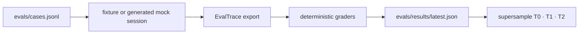

# Eval Contract — 측정·trace·판정 SSOT

> **Status:** canonical · current behavior
> **Last verified:** 2026-07-11
> **Code SSOT:** `src/agent_lab/feedback_report.py` · `evals/schema.py` · `evals/trace_export.py` · `evals/graders.py` · `evals/report.py`
> **History:** [EVAL-SURFACE-SUPER-SAMPLE-PLAN.md](./EVAL-SURFACE-SUPER-SAMPLE-PLAN.md) · [EVAL-SURFACE-V1-PLAN.md](./EVAL-SURFACE-V1-PLAN.md)

이 문서는 outcome ledger와 local eval surface에서 사용하는 단어·분모·trace·grader·T0~T2 판정을 정의한다. 구현 계획과 완료 이력은 history 문서가 소유한다.

## 1. Outcome 정의

### Completed episode

> **completed episode = `outcomes.jsonl`에서 `phase == "execute"`인 row**

- canonical field는 `verdict_eligible_total`이다.
- turn/legacy row는 `final_verdict`가 구조적으로 null일 수 있으므로 clean-pass와 lift 분모에서 제외한다.
- turn row는 routing·role·advisor·latency 같은 `turn_signal_total` 관측에 사용한다.
- Oracle verdict가 없는 execute row도 completed episode다. verdict coverage는 별도 지표다.

### Canonical fields

| Field | 의미 |
|-------|------|
| `total` | ledger 전체 row |
| `verdict_eligible_total` | completed episode 수 |
| `turn_signal_total` | completed episode가 아닌 관측 row |
| `oracle_verdict_coverage` | 전체 row 대비 verdict-eligible 비율인 현재 report 정의 |
| `turn_source_counts` | phase와 무관한 `default/history/explore` 분포 |
| `by_source` | completed episode 품질 분모 |
| `advisor_lift` | source와 default의 clean-pass 차이 |

표시용 `completed_episode_count`가 필요하면 `verdict_eligible_total`에서 파생한다. 별도 재계산 필드를 만들지 않는다.

## 2. 표본 기준

| 기준 | 값 | 용도 |
|------|----|------|
| `MIN_SAMPLE` | 3 | advisor override와 lift null 여부를 정하는 기계 게이트 |
| early signal | n≥10 | 사람이 초기 dogfood 방향을 읽는 기준 |
| decision sample | n≥30 | source 비교를 신뢰하고 동결 해제를 검토하는 기준 |

`MIN_SAMPLE=3`은 통계적 유의성을 뜻하지 않는다. n≥10과 n≥30은 해석 기준이며 runtime 플래그가 아니다.

`advisor_lift.<source>_vs_default: null`이 below-MIN_SAMPLE의 canonical machine-readable 표현이다. 별도 `insufficient_sample` field를 추가하지 않는다.

## 3. Local eval surface



### Case source

- `fixture_session`: `sessions/_regression/`의 committed fixture
- `mock_run`: 임시 폴더에서 deterministic mock Room session 생성
- 둘 다 없으면 명시적으로 skipped 처리

### EvalTrace fixed spans

```text
route → role_plan → room_round → objection → plan_update
      → human_gate → execute → oracle_verify → feedback_advisor
```

Legacy fixture는 literal trace가 없을 수 있으므로 `run.json`, `chat.jsonl`, `plan.md`, `trace.jsonl`, `evidence.jsonl`에서 best-effort reconstruction한다. 누락은 exception 대신 `trace_completeness` 저하로 나타낸다.

### Trace profiles

| Profile | 필요한 경로 |
|---------|-------------|
| `discuss_only` | route · role_plan · room_round · objection |
| `plan_only` | discuss + plan_update · human_gate |
| `execute_path` | route · role_plan · room_round · plan_update · human_gate · execute · oracle_verify |
| `full_path` | fixed spans 전체 |

## 4. Deterministic graders

| Grader | 검사 |
|--------|------|
| `routing_contract` | category, TurnPolicy routing snapshot, TurnContract snapshot |
| `session_contract` | profile, workflow, spans, subset, role plan |
| `turn_contract_runtime` | applied TurnContract agent count, round cap, consensus |
| `generated_mock_quality` | generated S-case 품질 |
| `gate_integrity` | unresolved BLOCK 이후 execute 금지 |
| `objection_flow` | challenge/amend/block 기대 |
| `plan_contract` | action 구조 |
| `oracle_coverage` | execution verdict coverage |
| `trace_completeness` | profile별 span 비율 |

`gate_integrity`와 `trace_completeness`는 항상 실행한다. 나머지는 case의 `expected`가 해당 계약을 선언할 때 실행한다. `turn_contract_runtime`는 `turn_contract.runtime_controls`를 fallback으로 사용해 legacy mock에 없는 `consensus_mode`도 판정한다. Oracle verdict는 `oracle.verdict`, `oracle_verdict`, `verify_after_merge.oracle.verdict` 세 저장 형태를 동일하게 정규화한다. v1은 LLM judge를 사용하지 않는다.

## 5. Supersample 판정

| Tier | 현재 report 의미 |
|------|------------------|
| **T0** | routing, Human-gate bypass, Oracle coverage, trace completeness, objection, S-case 품질 |
| **T1** | quickstart 재현 명령과 `fork_time_minutes` 기준선 |
| **T2** | 외부 fork/issue/PR 생태계 지표; 현재 gate false |

`trace_completeness_rate` 해석:

- `≥0.8`: strong trace coverage
- `≥0.33`: legacy fixture에서 예상되는 partial coverage
- `<0.33`: missing span 점검 필요
- 측정값 없음: `not_measured`

## 6. 명령

```bash
make feedback-report JSON=1
make eval-surface-local
make quickstart-verify
make emergence-bench-check
make dogfood-feedback-mock
```

결과 SSOT는 `.agent-lab/outcomes.jsonl`, `evals/results/latest.json`, 각 session의 `run.json`/trace/evidence다. 현재 실행 큐는 [NOW.md](./NOW.md), T0~T2 장기 위치는 [NORTH-STAR.md](./NORTH-STAR.md)를 따른다.
