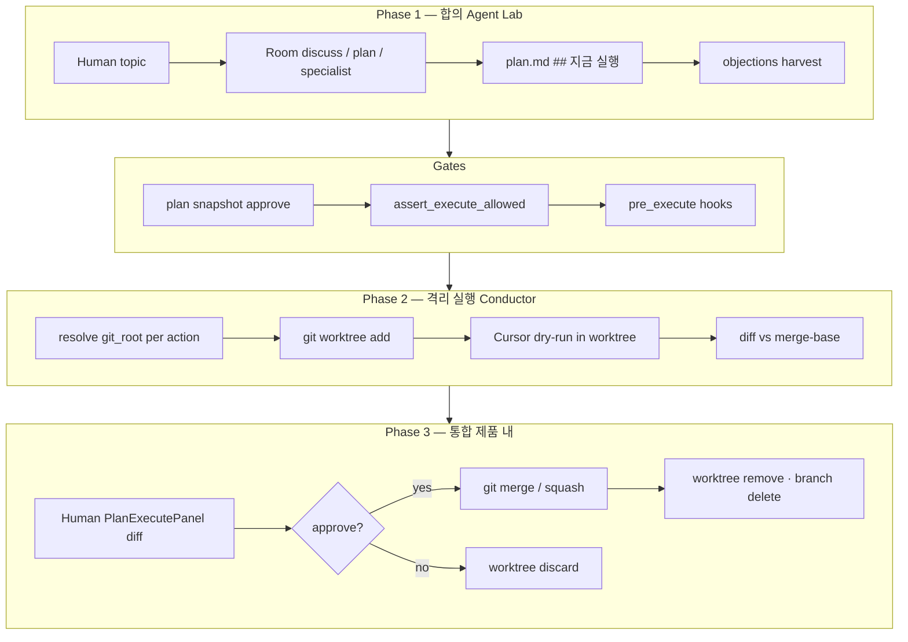

# Execute Worktree 전면 개혁안 (Full)

> 상태: **M0 spike 진행** (2026-06) — `plan_execute_git/worktree/merge` + pytest  
> 철학: **합의는 Agent Lab · 실행 격리는 Conductor · 통합(merge)은 제품 안에서**  
> Fallback: **Per-action isolation + git/non-git 분기 + Human override(예외만)**

---

## 0. 한 줄 요약

```
Room 토론 → plan.md ## 지금 실행
  → [gates: objection · pre_execute · plan snapshot]
  → git worktree에서 dry-run (action마다 repo·branch·tree 격리)
  → Human diff 검토 → approve = 제품 내 merge
  → worktree 정리 · provenance · task 완료
```

**Conductor에서 가져옴:** workspace = delegation unit, branch/worktree = 물리 격리, approve ≈ merge.  
**Agent Lab이 유지·강화:** discuss/plan 합의, objections, provenance, pre_execute, session KPI.

**교차 문서:** Room 트랙(E/F/G/H) + **여전히 유효한 사전 피드백** → [`ROOM-REINFORCEMENT.md`](ROOM-REINFORCEMENT.md) §「사전 피드백 레지스트리」

---

## 1. 문제 정의

### 1.1 현재 execute (snapshot in-place)

| 항목 | 현재 동작 | 한계 |
|------|-----------|------|
| cwd | `resolve_execute_workspace()` 단일 root | action마다 repo 다를 수 있으나 **격리 단위는 session snapshot** |
| dry-run | main cwd에서 Cursor 직접 수정 | **main working tree 오염** 가능 |
| reject | `restore_snapshot()` | 롤백은 되나 Conductor급 “통합 전 clean main” 아님 |
| approve | snapshot 삭제, 변경 cwd에 잔존 | **approve ≠ merge** — PR/Conductor UX와 불일치 |
| F2 discuss | artifacts 힌트 + full chat | 실행 격리와 별 층; 본 개혁은 **execute 층** |

### 1.2 Conductor 대비 Agent Lab 포지션

| | Conductor | Agent Lab (개혁 후) |
|---|-----------|---------------------|
| 분해 | Human이 workspace 단위로 | **Room + scribe → plan action** (자동 분해) |
| 에이전트 관계 | 무대화·병렬 | 토론·BLOCK/CHALLENGE (유지) |
| 격리 | git worktree | **동일 (기본)** |
| 통합 | Human diff → merge/PR | **Human diff → 제품 내 merge** |
| 추적 | PR diff | **+ chat.jsonl#L · objection · execution audit** |
| cross-workspace signal | 없음 | **objection → plan_action execute 409** |

### 1.3 사전 피드백 — 본 개혁 범위 vs Room 트랙 (확정)

Conductor 레퍼런스 계획 수립 **전** 확정된 갭 중, **이 문서(Phase I)가 닫는 것**과 **닫지 않는 것**.

| 피드백 (확정) | Phase I | 비고 |
|---------------|---------|------|
| main cwd dry-run 오염 | ✅ worktree | M0 pytest green |
| approve ≠ merge | ✅ 제품 내 merge | M2 UI |
| worktree 실패 → 자동 snapshot | ❌ **금지** | fail closed + override |
| action마다 다른 git repo | ✅ `resolve_action_git_context` | multi-root → block |
| F2: R2에 artifacts만 | ❌ **미포함** | §11 — `context_bundle` trimming 별도 |
| CLI retry / partial turn | ❌ | Room — `ROOM-REINFORCEMENT` R-P0 |
| delegate LLM call count 벤치 | ❌ | mock replay 선행 (H3) |
| artifact context **미연결** | — | **폐기** (P2에서 연결됨) |
| E4 resolve UI **없음** | — | **폐기** (TaskBar 있음; discoverability만 잔여) |

**vs 단일 에이전트 / CC (확정 포지션):** Phase I 이후에도 **Room 턴 신뢰성(retry)**·**F2 강제** 없이는 “실행·복구” 체감은 CC에 열세일 수 있음. **합의·감사·게이트**는 Agent Lab 우위 유지.

---

## 2. 설계 원칙

1. **Workspace는 delegation 단위** — plan action 1건 ≈ (가능하면) worktree 1개.  
2. **Branch + worktree는 integration 전까지 main을 건드리지 않는다.**  
3. **approve의 의미는 worktree 경로에서만 “merge”** — snapshot override는 **별 버튼·별 상태**.  
4. **git repo action은 worktree 실패 시 자동 snapshot degrade 금지** — fail closed 또는 Human opt-in.  
5. **non-git action은 애초에 merge FSM에 넣지 않는다** — `apply` 경로 분리.  
6. **기존 E/G gate는 worktree 앞뒤에 그대로** — 리플랫폼이 아니라 execute 층 교체.

---

## 3. End-to-end 워크플로



### Phase 1 — 합의 (기존 Room, 변경 최소)

- Human → discuss / plan / specialist / delegate.
- Scribe → `plan.md` with 3-field actions (`what` / `where` / `verify`).
- Objections, tasks, consensus, artifacts — **현행 유지**.
- **추가 (scribe 힌트):** executable action의 `where` paths가 **단일 git_root** 아래인지, `isolation` hint.

### Phase 2 — 격리 dry-run (신규 핵심)

1. action 선택 → `resolve_action_git_context(action, permissions, session_binding)`.
2. isolation policy 적용 (§4).
3. worktree 생성 → Cursor `cwd = worktree_path`.
4. (선택) 세션 snapshot은 **worktree tree 기준** 유지 — reject 시 worktree 폐기 + snapshot restore.
5. `execution` record: diff, branch, worktree_path, git_root, merge-base SHA.

### Phase 3 — 통합 (제품 내 merge)

1. Human PlanExecutePanel에서 diff + provenance + pre_verify + artifacts 검토.
2. **「Merge 승인」** (worktree) → 서버가 `git merge` 수행 (§7).
3. conflict → `merge_status: conflict` + UI (§9).
4. success → branch/worktree GC, task complete, plan ref 갱신.

---

## 4. Isolation 정책 (Fallback full spec)

### 4.1 Per-action 필드 (plan + execution)

**plan action (scribe / parser 확장):**

```yaml
# plan.md frontmatter 또는 action block 메타 (구현 선택)
isolation: auto | worktree | apply | block
# auto = git_root 있으면 worktree, 없으면 apply
```

**runtime `ActionGitContext` (dry-run 전 계산):**

```json
{
  "action_key": "now:1",
  "git_root": "/Users/.../quant-pipeline",
  "git_root_detected": true,
  "isolation": "worktree",
  "isolation_source": "auto",
  "monitored_paths": ["src/foo.py"],
  "paths_under_root": true
}
```

### 4.2 자동 분기 (기본값)

| 조건 | `isolation` | worktree 시도 | approve UI |
|------|-------------|---------------|------------|
| `git rev-parse` 성공, paths ⊆ root | **worktree** | ✅ | **「Merge 승인」** |
| git_root 없음 (lecture md 등) | **apply** | ❌ | **「파일 반영」** (merge FSM 밖) |
| paths가 여러 git_root에 걸침 | **block** | ❌ | execute 불가 — scribe/plan 수정 요청 |
| `isolation: block` 명시 | **block** | ❌ | execute 불가 |

### 4.3 worktree 실패 시 (git action)

**자동 snapshot degrade ❌**

```
worktree add 실패
  → execution.status = blocked_isolation
  → API 409 { code: "worktree_unavailable", reason, remediation[] }
  → UI 모달 (§9.2)
```

**Human override (예외, opt-in):**

- 모달: 「修復 후 재시도」(기본) / 「이번만 비격리 snapshot」(위험)
- override 선택 시:
  - `isolation_effective: snapshot_override`
  - `isolation_override_by: human`, `ts`
  - approve 버튼: **「cwd에 반영 (비격리)」** — merge FSM **진입 불가**
  - audit + `session_score` penalty flag (선택)

### 4.4 `isolation: apply` (non-git)

- Cursor cwd = `resolve_execute_workspace()` (현행과 유사).
- snapshot으로 rollback (현행).
- approve = **파일 쓰기 확정** (merge 아님).
- UI에 “git merge 아님” 배지.

### 4.5 Per-action repo (사용자 요구 1번)

- `git_root`는 action의 `where`/`verify` 백틱 경로에서 **공통 ancestor** 로 탐지.
- session `workspace_binding`과 충돌 시 **action paths 우선**.
- execution record에 `git_root`, `workspace_root`(worktree), `base_branch`(보통 `main`/`master` auto-detect) 저장.

---

## 5. Execution 상태 머신 (FSM)

### 5.1 Worktree 경로

```
idle
  → preflight (gates)
  → worktree_creating
  → dry_run_running
  → pending_approval          # diff ready, main clean
  → merge_running           # approve 클릭
  → merged                  # success
  → merge_conflict          # Human resolution UI
  → rejected                # discard worktree
  → blocked_isolation       # worktree 실패, 재시도 대기
  → failed                  # agent/cli error
  → cancelled
```

### 5.2 Snapshot override 경로 (예외)

```
… → snapshot_override_running → pending_apply_approval → applied_in_place | rejected
```

**`merged`와 `applied_in_place`는 UI·audit·KPI에서 절대 혼동하지 않음.**

---

## 6. 데이터 모델

### 6.1 `execution` (run.json) — 확장 필드

```json
{
  "id": "exec-abc123",
  "action_key": "now:1",
  "status": "pending_approval",

  "isolation_requested": "auto",
  "isolation_effective": "worktree",
  "isolation_override": null,

  "git_root": "/Users/me/Projects/quant-pipeline",
  "base_branch": "main",
  "base_sha": "a1b2c3d",
  "exec_branch": "agent-lab/sess-2026-foo-now-1",
  "worktree_path": "/Users/me/Projects/agent-lab/sessions/.../worktrees/exec-abc123",

  "workspace_root": "/Users/me/.../worktrees/exec-abc123",
  "workspace_label": "quant-pipeline (worktree)",

  "merge": {
    "status": "pending",
    "strategy": "merge",
    "commit_sha": null,
    "conflict_files": [],
    "attempted_at": null,
    "completed_at": null
  },

  "snapshot_id": "exec-abc123",
  "diff": "...",
  "diff_stat": { "files": 2, "insertions": 10, "deletions": 3 },
  "pre_verify": { },
  "provenance_refs": ["chat.jsonl#L42", "plan_action:1"],

  "fallback_reason": null,
  "blocked_reason": null
}
```

### 6.2 Session 디렉터리 레이아웃

```
sessions/{session_id}/
  plan.md
  run.json
  chat.jsonl
  snapshots/{exec_id}/          # worktree tree 기준 (reject restore)
  worktrees/{exec_id}/          # git worktree checkout
  merge-artifacts/{exec_id}/    # conflict markers, merge log (optional)
```

### 6.3 Worktree GC

| 이벤트 | branch | worktree dir | snapshot |
|--------|--------|--------------|----------|
| reject | delete | remove | delete |
| merged | delete (or keep 24h) | remove | delete |
| crash/orphan | `run.json` 기준 startup GC | remove stale | optional |
| pending > N days | UI warning | — | — |

---

## 7. Merge (제품 내 — 사용자 요구 1번)

### 7.1 Approve = merge (worktree only)

`POST /api/sessions/{id}/execute/resolve` `vote: approve` 시:

**preconditions**

- `isolation_effective == worktree`
- `status == pending_approval`
- artifact gate (`verification_artifacts.ok`) — 현행 유지
- `merge.status != conflict` (또는 conflict resolved flag)

**steps (server)**

1. `git -C {git_root} status --porcelain` on **base branch** → must be clean (worktree 외).
2. `git -C {git_root} merge --no-ff {exec_branch}` (또는 `--squash` + commit — 설정).
3. success → `merge.commit_sha`, `status: merged`.
4. `git worktree remove`, `git branch -D {exec_branch}` (policy).
5. task complete, plan provenance update.

### 7.2 Conflict

- merge exit ≠ 0 → `merge.status: conflict`, `conflict_files[]`.
- **main은 conflict 상태** — Human이 제품 UI 또는 외부 IDE에서 해결.
- UI: 「Conflict 해결됨」확인 → `git commit` 완료 검증 → `status: merged`.
- 또는 「Merge 취소」→ `git merge --abort` + worktree discard + `rejected`.

### 7.3 Merge commit message (provenance)

```
agent-lab: {action_what} (now:1)

Session: {session_id}
Execution: {exec_id}
Refs: chat.jsonl#L42; plan_action:1
Approved-by: human
```

### 7.4 Squash vs merge commit

| strategy | 장점 | 설정 |
|----------|------|------|
| `--no-ff` | branch history 보존 | default for audit |
| `--squash` | main log 깔끔 | session meta `merge_strategy` |

---

## 8. 백엔드 모듈 (신규·변경)

### 8.1 신규

| 모듈 | 책임 |
|------|------|
| `plan_execute_git.py` | `detect_git_root`, `resolve_action_git_context`, branch name sanitize |
| `plan_execute_worktree.py` | create/remove worktree, list orphans, ensure clean base |
| `plan_execute_merge.py` | merge, abort, conflict parse, post-merge verify |
| `plan_execute_isolation.py` | policy engine: auto/worktree/apply/block, override validation |

### 8.2 변경

| 모듈 | 변경 |
|------|------|
| `plan_execute.py` | dry-run cwd → worktree; approve → merge path |
| `plan_execute_snapshot.py` | snapshot cwd = worktree root |
| `plan_actions.py` | optional `isolation` parse; multi-root validation |
| `room_objections.py` | `blocked_isolation` action도 execute 409 유지 |
| `room_hooks.py` | `pre_execute` ctx에 `git_root`, `worktree_path` |
| `run_meta.py` | execution schema version bump |

### 8.3 API

| Method | Path | 변경 |
|--------|------|------|
| POST | `.../execute/dry-run` | 409 `worktree_unavailable`, `paths_span_repos` |
| POST | `.../execute/resolve` | approve → merge; conflict response shape |
| POST | `.../execute/merge/abort` | **신규** — conflict cancel |
| POST | `.../execute/merge/confirm` | **신규** — conflict resolved 후 complete |
| POST | `.../execute/isolation/override` | **신규** — snapshot_override opt-in |
| GET | `.../execute/{id}` | merge + worktree metadata |

---

## 9. UI (PlanExecutePanel + 주변)

### 9.1 Worktree pending

- Header: `quant-pipeline · branch agent-lab/... · worktree`
- Diff viewer (현행 diff + side-by-side 목표)
- Badges: pre_verify, artifacts, open objection (linked action)
- Primary: **「Merge 승인」** Secondary: **「Discard」**
- Footer: `git_root`, `base_sha`, provenance refs (click → chat)

### 9.2 Worktree 실패 모달

```
격리 worktree를 만들 수 없습니다
Reason: dirty worktree / branch exists / not a git repository

[修復 후 재시도]  (primary)
[이번만 비격리 실행…]  (destructive, secondary)
[취소]
```

### 9.3 Merge conflict

- File list with conflict markers preview
- 「IDE에서 열기」(open_resource)
- 「Merge abort」 / 「Conflict 해결 완료」

### 9.4 Apply (non-git)

- **「파일 반영」** — merge wording 금지
- Banner: git merge 없음

### 9.5 RoomTaskBar / objection

- open objection on `plan_action:N` → execute 버튼 disabled (현행 유지)
- worktree blocked → task bar에 isolation reason

---

## 10. 기존 Gate 통합 (변경 없이 위치만 명확화)

| Gate | 시점 | worktree 개혁 후 |
|------|------|------------------|
| plan snapshot approve | dry-run 전 | 동일 |
| `assert_execute_allowed` | dry-run 전 | 동일 |
| `pre_execute` hook | dry-run 전, **worktree 생성 후** cursor 호출 전 권장 | cwd=worktree |
| verification artifacts | approve 전 | 동일 |
| objection resolve | dry-run 전 | 동일 |

**pre_execute hook 순서 (권장):**

```
gates → create worktree → pre_execute(cwd=worktree) → cursor dry-run
```

---

## 11. Discuss 층 (F2) — 별 트랙, execute와 병행

execute worktree가 **main 오염**을 막아도, specialist R2 discuss는 **별 문제**로 남는다 (사전 피드백 확정).

### 11.1 현재 (코드 기준)

- `build_artifacts_block()` → `context_bundle` **constraints에 추가됨** (P2 ✅).
- `context_bundle.py`에 **`research_mode`로 `recent`/`peer`를 줄이는 분기 없음**.
- R2 Cursor payload ≈ **full `recent_block` + `peer_block` + artifacts 요약 + 문구**  
  `"Cursor R2: artifacts만 근거로 패치 제안 가능."` (`room_artifacts.py`).
- 즉 **강제 비대칭이 아니라 입력 모순** — LLM이 chat을 따를지 artifacts를 따를지 보장 불가.

### 11.2 목표 (Room R-P1 — 본 개혁과 독립)

| 조건 | context 변경 |
|------|----------------|
| `turn_profile == specialist` && `parallel_round >= 2` && `agent == cursor` | `recent`/`peer` → Human turn 요약 + artifacts 본문(또는 path) **만** |
| 그 외 | 현행 유지 |

완료 조건: 회귀에서 R2 payload meta에 `context_mode: artifact_only` + `recent` 길이 상한 이하.

| 트랙 | 목표 | 우선순위 |
|------|------|----------|
| **Execute worktree (본 문서)** | 패치 격리 + merge | **I-M0~M2** |
| **F2 R2 context slimming** | discuss **입력** 강제 | **R-P1** (병행) |
| **CLI retry** | room 턴 복구 | **R-P0** (병행) |

---

## 12. 구현 로드맵

### M0 — Spike (3–5일)

- [x] temp git repo + `plan_execute_worktree` create/remove
- [x] simulate patch in worktree (file touch + commit)
- [x] approve → merge → main clean assert (`test_worktree_merge_ok`)
- [x] reject → main unchanged assert (`test_worktree_reject_main_unchanged`)
- [x] Cursor SDK `cwd=worktree` — **code-path Go** (`respond(cwd=worktree)` + `test_run_dry_run_worktree_cwd_and_record`)
- [x] Cursor SDK **live** dry-run 1회 (`CURSOR_API_KEY`, main clean until merge)

**Exit:** pytest green + (선택) live SDK 1회

### M1 — Core backend (1–2주)

- [x] `plan_execute_git.py` (M0)
- [x] `plan_execute_worktree.py`, `plan_execute_merge.py` (M0)
- [ ] `plan_execute_isolation.py` (policy engine + override API)
- [x] `run_dry_run` worktree path (git only)
- [x] execution schema v2 + migration tolerant read
- [x] fail closed + 409 codes
- [x] snapshot remains for worktree reject restore

### M2 — Product merge (1–2주)

- [x] `plan_execute_merge.py` (M0, pytest)
- [x] `resolve_execution` approve → `merge_exec_branch` (M1)
- [x] PlanExecutePanel: worktree 배너, Merge 승인, `merge_conflict` alert
- [x] `PlanExecutionRecord` / dry-run 409 types (`client.ts`)
- [x] `merge_conflict` 재시도 — `resolve_execution` approve (worktree)
- [x] conflict 해결용 merge/abort·confirm API
- [x] worktree GC on session load

### M3 — Policy & override (1주)

- [x] `plan_execute_isolation.py` policy engine
- [x] plan action optional `isolation: auto|worktree|apply|block` parse
- [x] Human override modal + `isolation/override` API
- [x] apply path for non-git (label separation)
- [x] scribe hint: single git_root validation

### M4 — Hardening (지속)

- [ ] orphan worktree CI guard
- [ ] `score_session` + merge success rate KPI
- [ ] regression fixtures: `worktree_merge_ok`, `worktree_blocked`, `merge_conflict`
- [ ] retry/partial turn (room layer — 별 문서)

---

## 13. 테스트 · 벤치

### 13.1 자동 (no live LLM)

| Fixture | 검증 |
|---------|------|
| `worktree_merge_ok/` | dry-run → approve → main has patch |
| `worktree_reject/` | dry-run → reject → main clean |
| `worktree_unavailable/` | 409 blocked_isolation |
| `objection_blocks_worktree/` | open BLOCK → dry-run 409 |
| `merge_conflict/` | scripted conflict → conflict UI state |

### 13.2 Room 벤치 (사전 피드백 — Phase I 외)

| # | 시나리오 | 기준 | 전제 |
|---|----------|------|------|
| R1 | analyze 1R 3관점 | duplicate_speech_rate | `score_session` |
| R2 | plan → ## 지금 실행 | plan_actions validation | — |
| R3 | specialist asymmetric cwd | capability_cwd meta | fixture |
| R4 | DELEGATE codex | 라운드 대체 | **mock replay** 없으면 호출 수 미측정 |
| R5 | 10-turn session KPI | objection 해결률, ref validity | H4 |

### 13.3 Execute 벤치 (본 개혁)

| # | 시나리오 | 기준 |
|---|----------|------|
| E1 | pipeline action worktree | main clean until merge |
| E2 | agent-lab action 다른 root | 별 worktree |
| E3 | non-git lecture apply | `파일 반영`, merge UI 없음 |
| E4 | worktree fail → retry |修復 후 성공 |
| E5 | override snapshot | `snapshot_override`, no merge |
| E6 | approve merge | commit message provenance |
| E7 | merge conflict | abort restores |
| E8 | pre_execute block | worktree created then block before cursor |

---

## 14. 하지 말 것

- ❌ N worktree 동시 병렬 (Conductor full clone) — v1 sequential 유지
- ❌ git action 자동 snapshot degrade
- ❌ approve 버튼 하나로 merge + in-place 혼합
- ❌ GitHub PR 자동 생성 (v1) — 로컬 merge first
- ❌ Room 토론을 Conductor식 무대화로 교체
- ❌ worktree 없이 “Conductor UX만 흉내” (diff viewer만 추가)

---

## 15. 리스크 · 완화

| 리스크 | 완화 |
|--------|------|
| Cursor SDK가 worktree cwd 미지원 | M0 spike에서 최우선 검증 |
| merge conflict 빈번 | squash option; conflict UX; small action scope |
| orphan worktree disk | GC + run.json registry |
| action paths multi-repo | plan validation → block early |
| bundled app non-git cwd | apply path; worktree only on user repo |
| execution schema drift | `run_schema_version` bump + tolerant read |

---

## 16. 성공 기준 (6개월)

| KPI | 목표 |
|-----|------|
| git action worktree 사용률 | ≥ 95% |
| snapshot_override 비율 | < 5% |
| approve → merged 1차 성공률 | ≥ 70% |
| merge conflict rate | < 20% |
| main dirty incident (pre-merge) | 0 (worktree path) |
| objection → execute block | regression green |

---

## 17. 관련 문서

- `docs/ROOM-REINFORCEMENT.md` — Phase E/G (gate · artifacts)
- `docs/STABILITY.md` — preflight, execute validation (업데이트 예정)
- `docs/05-room-agent-roles.md` — discuss vs execute 역할

---

## 18. 결정 로그 (본 개혁 확정 사항)

| # | 결정 |
|---|------|
| 1 | plan action마다 repo/git_root 다를 수 있음 |
| 2 | approve ≈ **제품 내 merge** (Conductor와 동일 UX 목표) |
| 3 | 기본 격리 = **git worktree** |
| 4 | Fallback = **per-action + git/non-git 분기 + Human override(예외)**; 자동 snapshot degrade **금지** |
| 5 | non-git = **apply** 경로, merge FSM 분리 |
| 6 | Human merge conflict 해결 — 제품 UI + confirm API |

---

## 19. 사전 피드백 ↔ 로드맵 매핑 (요약)

| 여전히 유효 | 문서 | 다음 작업 |
|-------------|------|-----------|
| CLI retry, partial turn | ROOM §사전 피드백 | R-P0 |
| F2 R2 입력 강제 | 본 문서 §11 | R-P1 |
| score_session CI, 10 시나리오 | ROOM §다음 액션 | H-P1/P2 |
| DELEGATE call count | ROOM §사전 피드백 | mock replay |
| E4 Composer 노출 | ROOM | UX-P2 |
| FastAPI lifespan | ROOM | ops-P0 |
| **Execute 격리·merge** | **본 문서** | **I-M1~M2** |

---

## Appendix A — branch naming

```
agent-lab/{session_slug}-{action_key}-{exec_id_short}
# 예: agent-lab/2026-05-30-foo-now-1-exec-a1b2
```

## Appendix B — 409 error codes

| code | meaning |
|------|---------|
| `worktree_unavailable` | git/worktree 생성 실패 |
| `paths_span_repos` | action paths가 여러 git root |
| `open_objection` | 현행 |
| `pre_execute_blocked` | 현행 |
| `base_branch_dirty` | merge 전 base branch dirty |
| `merge_conflict` | approve merge 중 conflict |

## Appendix C — UI copy (한국어)

| 상태 | Primary CTA |
|------|-------------|
| pending_approval (worktree) | Merge 승인 |
| pending_approval (override) | 승인 (변경 유지) |
| pending_approval (apply) | 파일 반영 |
| merge_conflict | Conflict 해결 완료 |
| blocked_isolation | 조건修復 후 재시도 |
