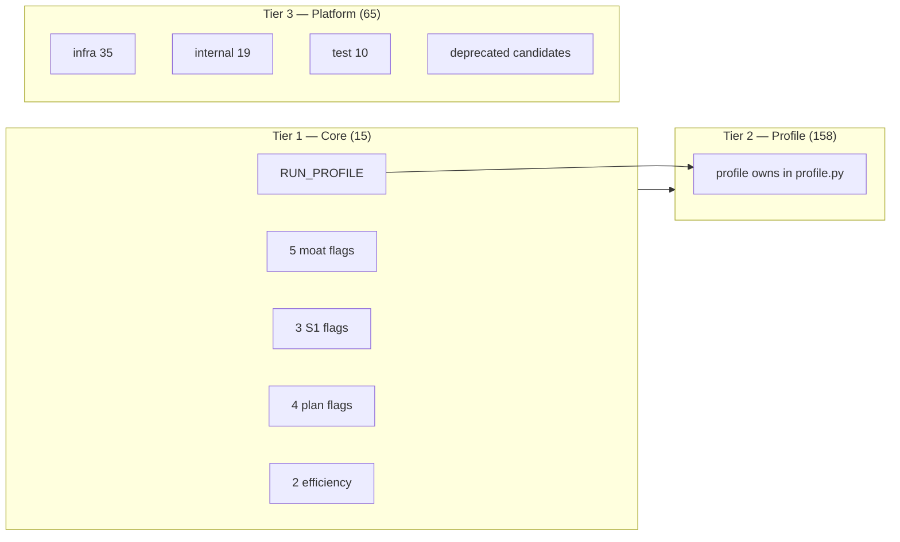

# Flag tiers — draft (B1–B2, 2026-09-01)

> **Status:** draft SSOT for operator-facing flag surface · **code SSOT:** `runtime_flags.py` · `run/profile.py`  
> **Scope:** classify 238 `AGENT_LAB_*` registry rows into **3 tiers**; lock **15 core** flags for dogfood/docs.

## Why

Registry has **238** flags (**173** feature). `balanced` alone **owns 92** and **applies 15** values. Operators should only need **≤15 core** names day-to-day; everything else is profile-owned or frozen.

## Tier model (B1)

| Tier | Count (2026-09-01) | Who sets it | Purpose |
|------|-------------------:|-------------|---------|
| **1 — Core** | **15** | `AGENT_LAB_RUN_PROFILE` (+ rare per-flag override) | Moats + S1 + plan/execute + delegate — document in USER-GUIDE |
| **2 — Profile** | **158** feature (non-core) | `fast` / `small` / `balanced` / `thorough` / `autonomous` `owns` / `flags` | Tunable behavior; F2 guard in `tests/test_run_profile.py` |
| **3 — Platform** | **65** non-feature + deprecated candidates | Infra env, CI, extension lane, delete backlog | Not product toggles |



## Tier 1 — Core 15 (B2)

Human dogfood set. **`AGENT_LAB_RUN_PROFILE=balanced`** turns **11** of these ON by default (see § balanced defaults).

| Group | Flag | Role |
|-------|------|------|
| **Profile** | `AGENT_LAB_RUN_PROFILE` | Named preset (`balanced` default dogfood) |
| **Moat (5)** | `AGENT_LAB_ORACLE_LIVE` | Live Oracle verify (off in `fast`) |
| | `AGENT_LAB_PLAN_WORKFLOW` | Plan FSM / execute gate SSOT |
| | `AGENT_LAB_EXECUTE_INBOX` | Execute lane uses agent MCP inbox |
| | `AGENT_LAB_MISSION_AUTHORITY` | Journal-owned Inbox (+ `MISSION_AUTHORITY_SESSIONS`) |
| | `AGENT_LAB_EXTERNAL_TOOLS` | External CLI delegate (`tools.yaml`) |
| **S1 (3)** | `AGENT_LAB_TURN_METRICS` | Turn KPIs → outcomes ledger |
| | `AGENT_LAB_OUTCOME_LEDGER` | Feedback / lift inputs |
| | `AGENT_LAB_FEEDBACK_ADVISOR` | Setup hints from outcomes |
| **Plan (4)** | `AGENT_LAB_PLAN_FSM_SKILL_FIRST` | Plan phase routing |
| | `AGENT_LAB_PLAN_PHASE_PROJECTION` | Phase labels on actions |
| | `AGENT_LAB_PLAN_SCRIBE_REPAIR` | Scribe repair on plan drift |
| | `AGENT_LAB_CORRECTION_HARVESTER` | Correction patterns harvest |
| **Efficiency (2)** | `AGENT_LAB_REPO_MAP` | Symbol-graph context (optional ON) |
| | `AGENT_LAB_COMPACT_TOOL_OUTPUT` | Tool output compaction |

**Invariant:** core flags stay in `FLAG_REGISTRY` as `feature`. Code default ON flags (e.g. `CHECKPOINT`, `TRACE`) are **Tier 2** — profile-owned, not operator core.

### `balanced` applied ON (11)

```
AGENT_LAB_ORACLE_LIVE
AGENT_LAB_TURN_METRICS
AGENT_LAB_OUTCOME_LEDGER
AGENT_LAB_FEEDBACK_ADVISOR
AGENT_LAB_REPO_MAP
AGENT_LAB_COMPACT_TOOL_OUTPUT
AGENT_LAB_MISSION_AUTHORITY          # + MISSION_AUTHORITY_SESSIONS=*
AGENT_LAB_PLAN_FSM_SKILL_FIRST
AGENT_LAB_PLAN_PHASE_PROJECTION
AGENT_LAB_PLAN_SCRIBE_REPAIR
AGENT_LAB_CORRECTION_HARVESTER
```

**Core but OFF until explicit:** `AGENT_LAB_EXTERNAL_TOOLS` (delegate spike), `AGENT_LAB_PLAN_WORKFLOW` / `AGENT_LAB_EXECUTE_INBOX` (code-default ON via Tier 2, not profile-applied).

Verify:

```bash
make list-flags --profile balanced
AGENT_LAB_RUN_PROFILE=balanced python -c "from agent_lab.run.profile import apply_run_profile; apply_run_profile(); import os; print(os.getenv('AGENT_LAB_ORACLE_LIVE'))"
```

## Tier 2 — Profile-managed (158 feature flags)

Any **feature** flag not in Tier 1. Ownership: `src/agent_lab/run/profile.py` (`flags` = applied defaults, `owns` = membership). F2: every feature flag has ≥1 profile owner (`test_f2_every_feature_flag_has_owner`).

**Operator rule:** prefer `AGENT_LAB_RUN_PROFILE` over individual flags. Override only when debugging.

| Profile | applied keys | typical ON |
|---------|-------------:|------------|
| `fast` | 6 | Oracle mock, auto-approve low |
| `small` | 18 | balanced-like + efficiency |
| `balanced` | 15 | 11 ON (table above) |
| `thorough` | 12 | + adversarial, judge, syntax gate |
| `autonomous` | 15 | + mission loop, drift, loop_probe |

Examples (non-core, stay Tier 2):

- Room/context: `TURN_POLICY`, `ROOM_ROLES`, `EFFICIENCY_*`, `SCRIBE_*`
- Safety: `DIFF_SAFETY`, `SANDBOX_*`, `ADVERSARIAL_LIVE`, `JUDGE_LIVE`
- Mission loop: `MISSION_LOOP`, `MISSION_AUTORUN`, `GOAL_LOOP`
- Kimi Work: `KIMI_WORK_*`

## Tier 3 — Platform / frozen / deprecated candidates

Not part of operator core surface.

| Bucket | Count | Examples |
|--------|------:|----------|
| **infra** | 35 | `AGENT_LAB_ROOT`, `SESSIONS_DIR`, `API_PORT`, `CODEX_BIN` paths |
| **internal** | 19 | trading lane (F5), harness internals |
| **test** | 10 | `AGENT_LAB_MOCK_AGENTS`, soak toggles |
| **config** | 1 | non-env config row |

### Deprecated / freeze candidates (B3 input — no code delete yet)

| Flag | Rationale |
|------|-----------|
| `AGENT_LAB_LOOP_PROBE` | Autonomous-only; no dogfood consumer |
| `AGENT_LAB_WISDOM_*` | Cross-session wisdom track frozen |
| `AGENT_LAB_KIMI_WORK_WARM_ON_STARTUP` | Ops-only warm path |
| `AGENT_LAB_KIMI_WORK_KEEP_DAIMON_ON_SHUTDOWN` | Ops-only |
| `AGENT_LAB_RESEARCH_MCP_CRITIC_LIVE` | Research extension |
| `AGENT_LAB_CONTEXT_RECIPE` | CX8 shadow only |
| `AGENT_LAB_CODEX_PROXY` | Legacy proxy path |

## Commands

```bash
make list-flags                          # full registry (238)
make list-flags --profile balanced       # profile ownership column
GET /api/health/flags?profile=balanced   # API equivalent
pytest tests/test_flag_tiers.py -q       # core-15 guard
pytest tests/test_run_profile.py -q      # F2 ownership guard
```

## Next (B3–B4)

| ID | Task | Status |
|----|------|--------|
| B3 | Deprecated delete/freeze list sign-off | pending |
| B4 | `balanced` single SSOT doc vs `list-flags --profile balanced` | pending |

## References

- [NOW.md](./NOW.md) · [USER-GUIDE.md](./USER-GUIDE.md) § Feature flags  
- [DELEGATE-SPIKE.md](./DELEGATE-SPIKE.md) — `AGENT_LAB_EXTERNAL_TOOLS` enable path  
- `src/agent_lab/runtime_flags.py` · `src/agent_lab/run/profile.py`
