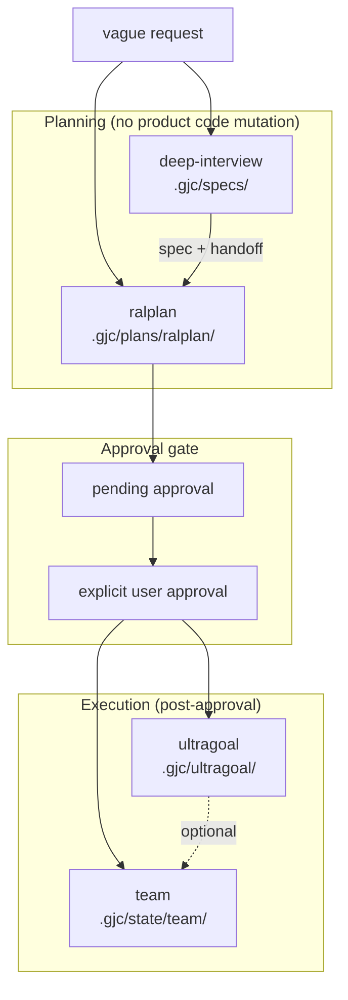

# GJC Workflow Pipeline — agent-lab integration map

> **Purpose:** Canonical map of [gajae-code](https://github.com/gajae-ai/gajae-code) (`gjc`) workflow skills and how they align with agent-lab shipped modules and backlog.  
> **Learn AI mirror:** `Learn AI/notes/05-agent-lab/gajae-code-workflow-pipeline.md`  
> **GJC source of truth:** `workflow-manifest.ts` in `@gajae-code/coding-agent`

---

## Pipeline diagram



---

## GJC skills (four bundled workflows)

| Skill | CLI / entry | Artifacts | Terminal phases |
|-------|-------------|-----------|-----------------|
| `deep-interview` | `/skill:deep-interview`, `gjc deep-interview` | `.gjc/specs/` | `interviewing` → `handoff` → `complete` |
| `ralplan` | `/skill:ralplan`, `gjc ralplan` | `.gjc/plans/ralplan/<run-id>/` | `planner` → `architect` → `critic` → `revision`* → `final` |
| `ultragoal` | `/skill:ultragoal`, `gjc ultragoal` | `.gjc/ultragoal/` | `goal-planning` → `pending` → `active` → `complete` |
| `team` | `/skill:team`, `gjc team` | `.gjc/state/team/` | `starting` → `running` → `complete` |

\* Critic `ITERATE`/`REJECT` loops back through persisted Planner (max 5 passes).

**Invariant:** Until explicit execution approval, planning skills must not edit product source, run mutating shell, commit, or delegate implementation.

---

## agent-lab mapping (shipped)

| GJC stage | GJC behavior | agent-lab module | Doc / ID |
|-----------|--------------|------------------|----------|
| Requirements interview | Socratic Q&A, ambiguity score, topology | `session_clarifier.py`, `GET/POST …/clarifier-interview*` | MB-7, [MISSION-BOARD-ADOPTION.md](./MISSION-BOARD-ADOPTION.md) §8.2 |
| Consensus plan | Planner / Architect / Critic, ADR | `plan_workflow.py`, Room `room_consensus.py`, `PlanApprovalPanel.tsx` | PW-1, L2, ML-P2 |
| Pending approval | Plan frozen until human OK | Plan-First FSM, merge checks gate | PW-1, MB-5 |
| Multi-goal execution | `goals.json`, `ledger.jsonl`, checkpoints | `mission_loop.py`, `evidence_ledger.py`, `goal_loop.py` | ML-C, MB-4, LC-L5 |
| Quality gate on complete | architect + executor QA JSON | `evidence_gates.py`, `oracle_core.py`, `adversarial_gate.py` | MB-3, LC-oracle, LC-L4 |
| Parallel workers | tmux team | `room_dispatch.py`, `CMD-fanout` | [ROOM-DISPATCH-PROTOCOL.md](./ROOM-DISPATCH-PROTOCOL.md) |
| External harness | `gjc` subprocess + handoff JSON | `runtime/external_runner.py`, `external_handoff.py` | MB-8, RT-H7 |

### Handoff protocol (MB-8)

When `external_runner` invokes `gjc`, stdout or `external_handoff.json` is attached to `executions[].external_handoff`:

```json
{
  "stopped_cleanly": true,
  "changed_files": ["src/foo.py"],
  "checks": [{"cmd": "make test", "exit": 0}],
  "evidence_summary": "…",
  "risks": []
}
```

Dogfood state: repo `.gjc/` (ralplan + ultragoal runs under `plans/ralplan/`).

---

## Gap / adoption backlog (Learn AI ↔ agent-lab)

Tracked in Learn AI `notes/05-agent-lab/backlog.md`:

| ID | Gap | Proposed agent-lab work |
|----|-----|-------------------------|
| AL-005 | GJC `team` (tmux) vs Room dispatch | Compare protocols; document when to use `room_dispatch` vs external `gjc team` |
| AL-009 | No single UI for full GJC pipeline | Work stepper extension: **Interview → Plan → Approve → Goal → Verify** with phase badges |
| AL-010 | `pending-approval.md` only in `.gjc/` | Import GJC plan artifact into Plan panel; link to `plan_workflow` approve |
| AL-011 | ultragoal `quality-gate-json` vs `evidence_gates` | Schema alignment doc + optional validator bridge |

---

## Implementation notes for agents

1. **Do not** treat agent-lab `plan.md` as identical to GJC `ralplan` artifacts — similar FSM, different file layout and role agents.
2. **Do** use `external_runner` when the user wants full GJC workflow (interview → ralplan → ultragoal) outside the Room.
3. **Clarifier** (MB-7) is the in-app substitute for lightweight deep-interview; full GJC interview needs `gjc` or skill import.
4. State mutations in GJC use `gjc state <skill> write|handoff` — agent-lab uses `run.json` + mission board snapshot instead.

---

## References

| Resource | Location |
|----------|----------|
| GJC skill text | `gjc skills read <name>` |
| GJC embedded docs | `gjc://codebase-overview.md` |
| agent-lab architecture | [ARCHITECTURE.md](./ARCHITECTURE.md) |
| Shipped evidence | [EXTERNAL-REFS-TRACEABILITY.md](./EXTERNAL-REFS-TRACEABILITY.md) |
| Plan FSM | [PLAN-WORKFLOW.md](./PLAN-WORKFLOW.md) |
| Runtime / external lane | [RUNTIME-HARNESS-PLAN.md](./RUNTIME-HARNESS-PLAN.md) |
