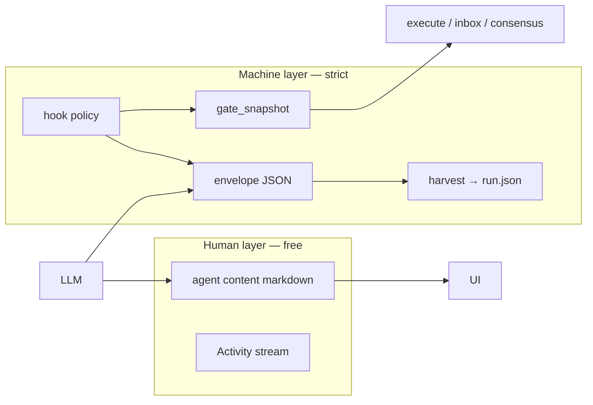

# Hook · Communicate 개선 계획

> **Status (2026-06-07):** **Phase 0–5 shipped** (phrase fallback migration opt-in only).  
> **Baseline:** `tests/fixtures/communicate-baseline-benchmark.json` · `make measure-communicate-baseline`  
> **근거:** Room transcript 합의, Hook/Communicate 구현, `STABILITY.md` shipped baseline.  
> **Canonical shipped evidence:** [EXTERNAL-REFS-TRACEABILITY.md](./EXTERNAL-REFS-TRACEABILITY.md)  
> **관련:** [HUMAN-INBOX.md](./HUMAN-INBOX.md) · [ROOM-REINFORCEMENT.md](./ROOM-REINFORCEMENT.md) · [EXECUTE-WORKTREE-REFORM.md](./EXECUTE-WORKTREE-REFORM.md)

---

## 0. 한 줄 요약

| 축 | Shipped (2026-06-07) | Remaining |
|----|----------------------|-----------|
| **Hook** | Room Hook Router + native overlay + `pre_scribe` | — |
| **Communicate** | Full stack shipped | `LEGACY_ENDORSE` default **off** (envelope required for phrase endorse) |

**불변 원칙 (transcript 합의):**

1. Loop 최종 권한 = Human approve + verified_loop; execute gate는 우회 금지.
2. Gate 상태 = `gate_snapshot` 순수 계산 (분산 if scattered).
3. Hook 부작용 = 이벤트 정책표만; 실패 = `sub_reason` 구조화.
4. Consensus canonical = `act=ENDORSE` (+ 명시 Human 승인); phrase fallback 점진 축소.
5. Turn profile = 다음 agent가 gate·합의 맥락 복원하는 **최소 상태**만.

---

## 1. 문제 정의

### 1.1 Hook — “CC가 Cursor/Codex에 서로 다른 hook을 걸 수 있나?”

**답: Room Router는 yes (shipped). Native product hooks는 cwd overlay passthrough (optional).**

Agent Lab hook **세 겹** — Layer A는 **에이전트별·이벤트별** 라우팅 shipped (2026-06-07).

```
┌─────────────────────────────────────────────────────────────┐
│ Layer A — Room hooks (orchestrator) ✅ shipped               │
│   room_hooks.py + hooks.toml                                 │
│   events: pre_execute | task_completed | teammate_idle       │
│         + pre_agent_reply | post_agent_reply | post_harvest  │
│         + pre_scribe                                           │
│   scope: per-agent [hooks.cursor|codex|claude] + global      │
├─────────────────────────────────────────────────────────────┤
│ Layer B — CC-hooks (Claude Code dev tool)                    │
│   .claude/settings.json — PostEdit / Stop                    │
│   scope: repo 개발 시 Claude Code IDE; room runtime ≠        │
├─────────────────────────────────────────────────────────────┤
│ Layer C — Native product hooks (각 CLI/SDK) 🔶 optional      │
│   .cursor/hooks.json | .codex/hooks.json | .claude/settings  │
│   Agent Lab: AGENT_LAB_NATIVE_HOOKS=1 → session bundle → cwd │
│   Cursor SDK: hooks API 없음 → Room Router가 turn boundary   │
└─────────────────────────────────────────────────────────────┘
```

**Remaining (optional only)**

- Phrase fallback removal: `AGENT_LAB_LEGACY_ENDORSE=0` + regression fixtures (§Phase 5).
- Live envelope KPI re-baseline after production turns (`communicate_meta` in sessions).
- Cursor SDK has no native hooks API — **Room Router + `.cursor/hooks.json` overlay** (§4.3).

### 1.2 Communicate — “답변이 과하게 제한된다”

**원인:** machine-readable 형식을 **prompt 상단**에서 강제하고, **hook/post-parse 검증**은 약함.

한 턴 agent payload에 동시 주입되는 communicate 규칙 (비효율 모드 포함 시 더 심함):

| 블록 | 출처 | Human prose에 미치는 영향 |
|------|------|---------------------------|
| `CURSOR_ROOM` / `CODEX_ROOM` / `CLAUDE_ROOM` | `agents/prompts.py` | 톤·역할 |
| `CONVERSATION_GUIDANCE` | `room_context.py` | `[PROPOSED:]` 등 |
| `MULTI_AGENT_COORDINATION` |同上 | R1/R2 행동 |
| `PEER_DECISION_GUIDANCE` |同上 | Human vs peer 범위 |
| `ENVELOPE_FORMAT_GUIDANCE` | `agent_envelope.py` | R2+ fence JSON **필수에 가까움** |
| `DECISION_FORK_GUIDANCE` |同上 | Human fork block |
| `EFFICIENCY_RESPONSE_GUIDANCE` | `room_context.py` | **800자**, bullet≤3 |
| `ANALYSIS_TURN_GUIDANCE` |同上 | 제안·이의 **금지** |
| `.agent-lab/PLATFORM.md` | `platform_md.py` | ENDORSE 1줄 등 (cap 500) |
| turn profile / specialist / verified | `context_bundle.py` | 추가 블록 |

**Shipped (2026-06-07)**

- LLM raw → `parse_agent_response_v2()` — structured adapter 우선, fence fallback.
- `communicate_meta` per turn in `run.json`; `GET /api/sessions/{id}` → `observability`.
- R2+ consensus: `AGENT_LAB_ENVELOPE_STRICT=consensus_only` + hook retry ×1.
- Structured request: `AGENT_LAB_STRUCTURED_ENVELOPE=1` + adapter (Claude `--output-format json`).

**Remaining (optional)**

- Phrase fallback (`AGENT_LAB_LEGACY_ENDORSE=1` default) — removal gated §4.6 / Phase 5.
- Live-session guidance KPI vs pre-reform baseline (fixtures use stub `run.json`).

**레거시 이중 체계**

- Canonical 목표: `envelope.act`
- Fallback: `이의 없습니다`, `PASS`, `[PROPOSED:]` (`classify_consensus_reply`)

---

## 2. 외부 레퍼런스

| 출처 | Hook | Communicate / protocol |
|------|------|------------------------|
| [Cursor Hooks](https://cursor.com/docs/agent/hooks) | `preToolUse` / `postToolUse` / `stop` / `beforeSubmitPrompt` … | Agent IDE tool loop 검증 |
| [Codex Hooks](https://developers.openai.com/codex/hooks) | `.codex/hooks.json`, `PreToolUse`/`PostToolUse`/`Stop` | stdin JSON 계약 |
| [Claude Code hooks](https://docs.anthropic.com/en/docs/claude-code/hooks) | `PostEdit` / `Stop` … (`.claude/settings.json`) | dev + CLI project settings |
| [Communication-centric MAS survey](https://arxiv.org/html/2502.14321v3) | — | Speech act = performative + state change |
| [LDP (arxiv 2603.08852)](https://arxiv.org/abs/2603.08852) | — | Typed semantic frame > prose fence |
| [Multi-agent debate + structured output](https://www.yixtian.com/blog/10-multi-agent-debate-w-state-pattern) | — | string match < structured output |
| Agent Lab `plan.md` | 이벤트 정책표, `sub_reason` | ENDORSE canonical, turn profile hint |

---

## 3. 현재 구현 (shipped baseline — 변경 금지 전제)

### 3.1 Room hooks (shipped — 2026-06-07)

**모듈:** `src/agent_lab/room_hooks.py`  
**Python:** `requires-python >= 3.11` (`pyproject.toml`) — `tomllib` stdlib 직접 import (legacy `sys.version_info` guard **제거됨**).

**설정:** `AGENT_LAB_HOOKS_PATH` → repo `.agent-lab/hooks.toml` → `~/.agent-lab/hooks.toml`

| Event | 호출부 | Turn abort? | exit 2 | exit ≠0 | timeout / os_error |
|-------|--------|-------------|--------|---------|---------------------|
| `pre_execute` | `plan_execute.py` | ✅ dry-run **409** | block | block | block |
| `task_completed` | `room_tasks.complete_task` | ✅ **ValueError** | block | block | block |
| `teammate_idle` | `room._teammate_idle_peer_message` | ❌ | feedback only | log, no block | log, no block |

**계약 (shipped):**

- JSON stdin; `HookResult.sub_reason`: `exit_2` \| `timeout` \| `os_error` \| `nonzero` \| `""`
- `HookEventPolicy` per shipped event (`_SHIPPED_EVENT_POLICIES` in code)
- `teammate_idle`: **multi-command run-all** (`stop_on_block=False`); feedback aggregate; `blocked` never aborts peer nudge path
- `pre_execute` / `task_completed`: **first block stops** (`stop_on_block=True`)
- `load_hooks_config()`: **mtime-keyed cache** per process; `clear_hooks_config_cache()` for tests / `AGENT_LAB_HOOKS_PATH` change

**Shipped extensions (2026-06-07):**

- `pre_agent_reply` / `post_agent_reply` in `room._call_one_agent`
- `[hooks.cursor|codex|claude]` + `[policy.*]` TOML overrides
- `hook_runs[]` via `append_hook_run`; SSE `hook_event` (+ Activity lines)
- `post_harvest` after inbox harvest block
- `sub_reason` on all hook paths; `retryable` on consensus `post_agent_reply` block

**예시:** `.agent-lab/hooks.example.toml` (shipped + native `[agent_hooks]` comment)  
**회귀:** `make verify-hooks` → `test_room_hooks`, `test_hook_router`, `test_reply_policy`, `test_gate_snapshot`, `test_hook_communicate_*`

### 3.2 CC-hooks (dev-only)

**경로:** `.claude/settings.json`, `.claude/hooks/*.sh`  
**테스트:** `tests/test_claude_hooks.py`  
**주의:** `room_hooks.py`와 **별개** (`CLAUDE.md`, `EXTERNAL-REFS-TRACEABILITY` CC-hooks).

### 3.3 Communicate (shipped)

| 기능 | 모듈 | 비고 |
|------|------|------|
| Envelope parse | `agent_envelope.py` | `parse_agent_response_v2`, structured prefix |
| Reply policy | `reply_policy.py` | envelope strict, guidance tier, analyze row |
| Gate snapshot | `gate_snapshot.py` | `compute_gate_snapshot`, context inject |
| Structured adapter | `structured_envelope_adapter.py` | Claude JSON, cursor/codex prompt addon |
| Observability | `run_observability.py` | `hook_runs` tail, `communicate_meta` |
| Native hooks materializer | `agent_hooks_materializer.py` | session bundle → cwd overlay |
| Consensus loop | `room_consensus.py` | R2+ envelope; slim bundle (no duplicate block) |
| Turn state | `room_turn_state.py` | blackboard, anchor, open_issues |
| Objections harvest | `room_objections.py` | BLOCK/CHALLENGE → execute 409 |
| Mailbox | `room_mailbox.py` | `act=MESSAGE`, `to` |
| Context assembly | `context_bundle.py` | guidance_block, peer, artifacts |
| UI envelope meta | `web/src/utils/agentEnvelope.ts`, `TranscriptMessageChrome.tsx` | act label, warn |
| Markdown render | `web/src/utils/messageMarkdown.tsx` | subset markdown |

### 3.4 Human Inbox (Communicate 확장 — shipped)

Discuss/Execute lane 분리: [HUMAN-INBOX.md](./HUMAN-INBOX.md)

- Execute: MCP `ask_human` / `propose_build` (blocking tool loop).
- Discuss: envelope harvest, `[HUMAN-DECISION:]`, sync pause (M4).

---

## 4. 목표 아키텍처

### 4.1 두 층 분리



**규칙**

- **Human이 읽는 본문(`content`)**: 길이·형식 **soft** (efficiency/consensus profile만 compact hint).
- **Machine이 읽는 필드(`envelope`, harvest)**: **strict** — hook + parser + consensus loop.
- 형식 강제는 **prompt 최소화 → hook/post-parse/max 1 retry**.

### 4.2 Hook — Room Hook Router (1차 Production 핵심)

Orchestrator(`room.py`)가 **에이전트 id를 알고 있으므로**, native hook 통합 전에도 “CC가 Cursor/Codex/Claude에 다른 hook”을 구현할 수 있다.

**호출 위치**

```
continue_room_round / run_agent_rounds
  └─ _call_one_agent (per agent, per round)
       ├─ run_hook("pre_agent_reply", { agent, parallel_round, turn_profile, ... })
       ├─ build_agent_context_bundle → call_agent
       ├─ parse_agent_response
       └─ run_hook("post_agent_reply", { agent, content, envelope, envelope_parse_error, ... })
```

**설정 스키마 (목표)**

```toml
# ~/.agent-lab/hooks.toml 또는 .agent-lab/hooks.toml

timeout_s = 30

[policy.pre_execute]
block_exit = 2
fail_on = ["exit_2", "timeout", "os_error"]  # exit_nonzero 정책 명시

[policy.post_agent_reply]
block_exit = 2
fail_on = ["exit_2"]  # consensus_mode일 때만 block; default warn

[policy.teammate_idle]
block_exit = 2
fail_on = []  # nudge only, never block turn

[hooks.global]
pre_execute = ["scripts/hooks/pre-execute.sh"]
post_harvest = ["scripts/hooks/post-harvest.sh"]

[hooks.cursor]
pre_agent_reply = []
post_agent_reply = ["scripts/hooks/cursor-post-reply.sh"]

[hooks.codex]
post_agent_reply = ["scripts/hooks/codex-post-reply.sh"]

[hooks.claude]
post_agent_reply = ["scripts/hooks/claude-post-reply.sh"]

[hooks]  # legacy flat (fallback)
task_completed = ["scripts/hooks/verify-task.sh"]
teammate_idle = ["scripts/hooks/teammate-idle.sh"]
```

**해석 규칙 (Phase 1)**

1. `hooks.<agent>.<event>` → 없으면 `hooks.global.<event>` → 없으면 `hooks.<event>` (legacy flat).
2. Context JSON **항상** `"agent"`, `"event"`, `"session_id"`, `"workspace"` 포함.
3. `post_agent_reply` context: `content`, `envelope`, `parallel_round`, `consensus_mode`, `review_mode`, `turn_profile`, `gate_snapshot` (Phase 2+).

**Config cache (Phase 1 — extend shipped cache)**

| 항목 | Shipped (2026-06-07) | Phase 1 추가 |
|------|----------------------|--------------|
| Cache key | path + mtime + size | + `AGENT_LAB_HOOKS_PATH` env |
| Invalidate | mtime change, `clear_hooks_config_cache()` | SSE reload API (optional) |
| Per-turn I/O | 1 read per process per file revision | same; parallel round N×events still 0 extra reads if cached |

**Multi-command (normative — §5.1)**

### 4.3 Hook — Native passthrough (2차, 선택)

Room Router가 **턴 경계**를 담당; native hook은 **tool loop 내부**를 담당.

| Agent | Native config | Agent Lab passthrough (목표) |
|-------|---------------|------------------------------|
| **Codex** | `.codex/hooks.json` | ✅ `native_agent_hooks_overlay("codex")` + session materializer |
| **Claude CLI** | `.claude/settings.json` hooks | ✅ `native_claude_hooks_overlay` + settings fragment merge |
| **Cursor SDK** | Cursor IDE `.cursor/hooks.json` | **Room Router** + `native_cursor_hooks_overlay` (SDK hooks API 없음) |

#### Cursor SDK hooks — 검증 기록 (2026-06-07)

| 주장 | 근거 | 결론 |
|------|------|------|
| Cursor **IDE** hooks exist | [Cursor Hooks docs](https://cursor.com/docs/agent/hooks) (2026) | ✅ `.cursor/hooks.json`, `preToolUse`/`postToolUse`/… |
| Agent Lab **SDK** path passes hooks | `cursor_agent._build_agent_options()` → `AgentOptions(local=…, mcp_servers=…)` only | ❌ **hooks 필드 미전달** |
| `cursor-sdk` PyPI 0.1.5 public types | repo CI optional extra; `AgentOptions` surface = api_key, model, local, mcp_servers (code review) | **hooks API 없음** (재확인: SDK minor bump 시 이 표 갱신) |

**Phase 4 (shipped):** Codex/Claude/Cursor session bundle → workspace cwd for invoke duration (`AGENT_LAB_NATIVE_HOOKS=1`). Repo root **덮어쓰기 금지** 유지.

**재검증 트리거:** `cursor-sdk` major/minor upgrade, `AgentOptions` schema change, Cursor docs changelog.

**세션 bundle 경로 (제안)**

```
sessions/<id>/.agent-lab/agent-hooks/
  codex/hooks.json
  claude/settings.json   # hooks fragment only
  manifest.json          # which agents enabled what
```

**금지:** repo root `.codex/hooks.json`을 Agent Lab이 매 턴 덮어쓰기 (Human repo 오염).

### 4.4 Communicate — Reply Policy Matrix

**모듈 (신규):** `src/agent_lab/reply_policy.py` (가칭)

| Profile | `parallel_round` | envelope | prose | `[PROPOSED:]` | guidance inject |
|---------|------------------|----------|-------|---------------|-----------------|
| discuss R1 | 1 | optional | free | optional | CONVERSATION only |
| discuss R2+ | ≥2 | **warn** (strict off) | free | optional | + peer follow-up |
| consensus R2+ | ≥2 | **required** | compact for ENDORSE/PASS | harvest only | envelope block **short** |
| review R2+ | ≥2 | required | free + delta | optional | review follow-up |
| analyze | * | forbidden acts | observe-only | **forbidden** | ANALYSIS only |
| plan harvest | * | BLOCK/CHALLENGE need refs | — | — | objection rules |
| efficiency overlay | * | inherits base row | **800 char hint** adds on base | cap | + EFFICIENCY block |

#### Profile 조합 우선순위 (normative)

에이전트 한 턴에 여러 overlay가 켜질 때 **위에서 아래로** 적용; 아래 행이 위 행을 override.

| Priority | Source | Effect |
|----------|--------|--------|
| 1 | `consensus_mode` | → **consensus R2+** row (envelope required if strict) |
| 2 | `review_mode` + R2+ | → **review R2+** row |
| 3 | `turn_profile=analyze` | → **analyze** row (forbidden acts) |
| 4 | `turn_profile=specialist` / `verified` | specialist/verified blocks (`context_bundle`) |
| 5 | base discuss | discuss R1 vs R2+ by `parallel_round` |
| 6 | `efficiency_mode` / `AGENT_LAB_EFFICIENCY` | +800 char hint, agreed/open caps — **does not override envelope forbidden** |

**조합 예시**

| analyze + efficiency | envelope | prose |
|----------------------|----------|-------|
| analyze wins act rules | **forbidden** (PROPOSE/ENDORSE/BLOCK acts) | observe-only + **800 char hint** |

| consensus + efficiency | envelope | prose |
|------------------------|----------|-------|
| consensus wins | **required** (if strict) | compact ENDORSE/PASS + 800 char cap on body |

**Env flags**

| Variable | Default | Meaning |
|----------|---------|---------|
| `AGENT_LAB_ENVELOPE_STRICT` | `consensus_only` | `off` \| `consensus_only` \| `always` |
| `AGENT_LAB_LEGACY_ENDORSE` | `0` | `1` = `이의 없습니다` phrase fallback (legacy opt-in) |
| `AGENT_LAB_EFFICIENCY` | `0` | 800자 guidance |
| `AGENT_LAB_GUIDANCE_TIER` | `standard` | `minimal` \| `standard` \| `debug` (inject 크기) |

### 4.5 Communicate — Structured reply layer

**목표:** fence-in-prose 제거 (consensus/review path 우선).

```
Layer A — machine (provider structured output or tool call)
  { "act": "ENDORSE", "refs": ["L42"], "confidence": 0.9 }

Layer B — human (markdown, no cap unless efficiency_mode)
  자유 서술
```

**구현 순서**

1. `parse_agent_response_v2(raw, structured: dict | None)` — structured 우선, fence fallback.
2. Claude/Codex adapter: JSON schema / response_format (가능한 backend부터).
3. Cursor SDK: structured field 추가 시 연동; until then fence + `post_agent_reply` hook validate.
4. **Retry policy:** consensus only, max 1, hook feedback을 follow-up으로 (`sub_reason=envelope_invalid`).

### 4.6 Communicate — Consensus canonicalization

**Primary signal**

```json
{ "act": "ENDORSE", "refs": [] }
```

**Deprecated (migration)**

| Legacy | Replacement | Removal gate |
|--------|-------------|--------------|
| 첫 줄 `이의 없습니다` | `act=ENDORSE` | `AGENT_LAB_LEGACY_ENDORSE=0` + smoke 20 fixtures |
| 첫 줄 `PASS` | `act=PASS` | consensus peer review fixtures |
| `[PROPOSED:]` only | `act=PROPOSE` + optional tag | task harvest dual-read 1 release |

**`classify_consensus_reply` 변경**

1. envelope.act 존재 → **always wins**
2. phrase fallback → `LEGACY_ENDORSE` env off면 **neutral** (substantive로 오분류 방지)
3. metrics: `consensus.envelope_rate`, `consensus.fallback_rate` in `run.json` turn meta

### 4.7 Communicate — Gate snapshot (loop 연동)

**상태:** **shipped** — `src/agent_lab/gate_snapshot.py` (`compute_gate_snapshot`, `format_gate_snapshot_block`).

#### `run_meta` 입력 → gate 출력 매핑

| `run_meta` key | Reader | Gate / `block_source` | Module |
|----------------|--------|------------------------|--------|
| `objections[]` | `status == "open"` | `open_objection` — execute BLOCK on `plan_action_index` | `room_objections.open_objections()` |
| `human_inbox[]` | item `status == "pending"` | `inbox_pending` | `human_inbox.compute_inbox_pending()` |
| `inbox_pending` | bool (denormalized) | same as above | `human_inbox`, patched in `room.py` |
| `executions[]` | latest `status`, `pre_verify.blocked` | `pre_execute` / `execute_blocked` | `plan_execute.py` |
| `consensus` (turn) | `status != "reached"`, `pending_agents` | `consensus_incomplete` | `room_consensus.py`, `room.py` |
| `tasks[]` | open CHALLENGE + `task_id` | `task_blocked` | `room_tasks.py`, `room_objections.py` |
| `permissions` / bridge | Cursor degraded | `executor_unavailable` | health / `cursor_bridge.py` |

**우선순위 (first matching `block_source` wins for `block_reason` display)**

1. `inbox_pending` (Human gate)
2. `open_objection` with act `BLOCK` on target plan action
3. `pre_execute` / `pre_verify.blocked`
4. `consensus_incomplete` (♾️ mode)
5. `executor_unavailable`

#### 순수 함수 (목표)

```python
def compute_gate_snapshot(run_meta: dict) -> dict:
    return {
        "next_allowed_action": "discuss" | "plan" | "dry_run" | "merge" | "wait_human",
        "block_source": None | "open_objection" | "pre_execute" | "inbox_pending" | ...,
        "block_reason": str | None,
        "gates": {
            "execute": {"open": bool, "reason": str | None},
            "consensus": {"open": bool, "reason": str | None},
            "inbox": {"pending": int},
        },
    }
```

**Communicate 주입**

- `context_bundle` constraints에 **gate_snapshot 요약 5줄 이하** (turn profile hint).
- peer digest / turn_state에 `gate_snapshot` digest — 다음 agent가 **같은 gate 인식**.

**Owner:** Room common schema (`src/agent_lab/gate_snapshot.py`), writer = orchestrator only.

### 4.8 Communicate — Turn profile 최소화

**목표:** `turn_profile` + `turn_state` = 복원에 필요한 필드만.

| 필드 | 유지 | 제거/축소 |
|------|------|-----------|
| anchor excerpt + ref | ✅ | — |
| open_issues (cap 4) | ✅ | plan 전체 중복 |
| pending_agents | ✅ consensus | — |
| gate_snapshot digest | ✅ **추가** | — |
| full peer re-summary | ❌ | recent thread로 대체 |

---

## 5. 이벤트 정책표 (Hook)

### 5.1 Shipped events (code: `HookEventPolicy`)

| Event | Block turn / op? | exit 2 | exit ≠0 | timeout | os_error | Multi-cmd |
|-------|------------------|--------|---------|---------|----------|-----------|
| `pre_execute` | ✅ 409 | block | block | block | block | stop on first block |
| `task_completed` | ✅ | block | block | block | block | stop on first block |
| `teammate_idle` | ❌ | feedback | log | log | log | **run all**, aggregate feedback |

### 5.2 Agent turn events (shipped 2026-06-07)

| Event | Block? | exit 2 | timeout | exit ≠0 | os_error | Multi-cmd |
|-------|--------|--------|---------|---------|----------|-----------|
| `pre_agent_reply` | ❌ | log | log | log | log | run all |
| `post_agent_reply` | consensus only | block+retry | warn | warn | warn | stop on block |
| `post_harvest` | optional | policy TOML | policy | policy | policy | run all default |
| `pre_scribe` | optional | policy TOML | policy | policy | policy | run all default |

### 5.3 `sub_reason` — exception → enum mapping

| Condition | `exit_code` | `sub_reason` | `blocked` (shipped) |
|-----------|-------------|--------------|---------------------|
| `returncode == 2` | `2` | `exit_2` | per `HookEventPolicy.block_on_exit_2` |
| `returncode not in (0, 2)` | rc | `nonzero` | per `block_on_nonzero` |
| `subprocess.TimeoutExpired` | `-1` | `timeout` | per `block_on_timeout` |
| `OSError` on Popen/run | `-1` | `os_error` | per `block_on_os_error` |
| builtin envelope invalid (consensus R2+) | `0` | `envelope_invalid` | per post_agent_reply policy |
| success | `0` | `""` | false |

**Phase 1:** `[policy.<event>]` in TOML may override columns in §5.2; shipped §5.1 stays code-default until override loader lands.

### 5.4 Multi-command execution

| `stop_on_block` | Behavior |
|-----------------|----------|
| `true` (pre_execute, task_completed) | 첫 block/timeout/os_error 시 **나머지 command skip** |
| `false` (teammate_idle; future pre_agent_reply) | **모든 command 실행**; `feedback` newline-join; `blocked` = OR of policy flags |

### 5.5 `HookResult` (shipped + Phase 1)

```python
@dataclass
class HookResult:
    blocked: bool
    feedback: str
    exit_code: int
    event: str
    command: str = ""
    sub_reason: SubReason = ""  # shipped
    retryable: bool = False      # Phase 1 (post_agent_reply)
    structured: dict | None = None  # Phase 1
```

---

## 6. 데이터 계약

### 6.1 `run.json` additions

```json
{
  "hook_runs": [
    {
      "ts": "ISO8601",
      "event": "post_agent_reply",
      "agent": "codex",
      "command": "scripts/hooks/codex-post-reply.sh",
      "exit_code": 0,
      "sub_reason": "",
      "blocked": false,
      "feedback": "",
      "human_turn": 3,
      "parallel_round": 2
    }
  ],
  "turns": [
    {
      "communicate_meta": {
        "envelope_strict": false,
        "envelope_parse_error": false,
        "guidance_chars": 4200,
        "legacy_endorse_used": false
      }
    }
  ]
}
```

### 6.2 `hooks.toml` discovery (unchanged + agent keys)

1. `AGENT_LAB_HOOKS_PATH`
2. `<repo>/.agent-lab/hooks.toml`
3. `~/.agent-lab/hooks.toml`

### 6.3 API / UI

| Surface | Hook | Communicate |
|---------|------|-------------|
| Activity / NotificationCenter | `hook.blocked`, `hook.warn` + typing `activities[]` | envelope parse warn (TranscriptMessageChrome only) |
| PlanExecutePanel | `pre_verify` (existing) | — |
| Session detail GET | `observability.hook_runs` tail | `observability.last_communicate_meta` |
| Health | hooks.toml loaded bool | — |

---

## 7. 구현 로드맵

**의존성**

- **Phase 0** → baseline + reply policy (모든 후속 Phase의 측정 기준).
- **Phase 1 ∥ Phase 2** — 병렬 가능 (`gate_snapshot`은 Hook Router 비의존).
- **Phase 3** — Phase **1** `post_agent_reply` **필수**; Phase 2 완료 불필요.

### Phase 0 — Baseline + Reply Policy ✅ (2026-06-07)

**Baseline**

- [x] `scripts/measure_communicate_baseline.py` — `sessions/_benchmark` (chat KPI) + `sessions/_regression` (stub `run.json`)
- [x] Committed reference: `tests/fixtures/communicate-baseline-benchmark.json`
- [x] Ephemeral live: `sessions/_reports/communicate-baseline-YYYYMMDD.json` (gitignored under `sessions/*`)
- [x] `make measure-communicate-baseline` · `tests/test_measure_communicate_baseline.py`

**Communicate**

- [x] `reply_policy.py` + `AGENT_LAB_ENVELOPE_STRICT=consensus_only`
- [x] `context_bundle`: guidance tier; PLATFORM dedupe
- [x] `EFFICIENCY_RESPONSE_GUIDANCE` → efficiency_mode only
- [x] analyze: observe/risk OK; PROPOSE/ENDORSE acts forbidden (§4.4 priority)
- [x] `run.json` `communicate_meta` per turn

**검증:** `tests/test_reply_policy.py`; benchmark baseline JSON committed.

---

### Phase 1 — Room Hook Router ✅ (2026-06-07)

**Hook**

- [x] `[hooks.cursor|codex|claude]` + `run_hook_for_agent()`
- [x] `pre_agent_reply` / `post_agent_reply` in `_call_one_agent`
- [x] `[policy.*]` TOML overrides
- [x] `hook_runs[]`, SSE `hook_event` (+ UI Activity)
- [x] `.agent-lab/hooks.example.toml` (per-agent + `[agent_hooks]` comment)

**Communicate:** `post_agent_reply` ctx; consensus retry ×1.

**검증:** `tests/test_hook_router.py`, `test_hook_communicate_patches.py`, `test_hook_communicate_remaining.py`.

---

### Phase 2 — Gate snapshot ✅ (2026-06-07)

**Hook:** [x] `post_harvest` after harvest block.

**Communicate:** [x] `gate_snapshot.py`; inject via `context_bundle` + `reply_policy`.

**검증:** [x] `tests/test_gate_snapshot.py`.

---

### Phase 3 — Structured reply ✅ (2026-06-07)

**Hook:** [x] builtin schema validate on `post_agent_reply` (consensus); custom TOML hooks optional.

**Communicate:** [x] `parse_agent_response_v2`; [x] structured adapter (Claude/Codex/Cursor); [x] compact envelope guidance (`AGENT_LAB_GUIDANCE_TIER`).

**검증:** mock structured tests shipped; live parse ≥99% TBD on production sessions (KPI only).

---

### Phase 4 — Native passthrough ✅ (2026-06-07)

- [x] Session `agent-hooks` materializer + cwd overlay (codex/cursor/claude)
- [x] Cursor: Room Router substitute (SDK hooks API 없음)

---

### Phase 5 — Production hardening ✅ (2026-06-07)

- [x] USER-GUIDE §9.8 hook/communicate
- [x] `make verify-hooks` (extended)
- [x] weekly KPI — `communicate` pool in `score_sessions_weekly` + report §Hook · Communicate
- [x] HOOK-COMM doc status ✅ (this file)
- [x] `pre_scribe` hook wired · builtin envelope schema validate on `post_agent_reply`
- [x] Envelope guidance compact unless `AGENT_LAB_GUIDANCE_TIER=debug`
- [x] Activity envelope warn (SSE `agent_activity` + P2 toast)
- [x] phrase fallback removal (`AGENT_LAB_LEGACY_ENDORSE` default `0` + `envelope_consensus_endorse` regression)

---

## 8. 파일 맵

| 영역 | Shipped module | Tests / ops |
|------|----------------|-------------|
| Room hooks | `room_hooks.py` | `test_room_hooks`, `test_hook_router` |
| Room orchestration | `room.py` | pre/post_agent_reply, post_harvest, hook_event SSE |
| Reply policy | `reply_policy.py` | `test_reply_policy` |
| Envelope | `agent_envelope.py` | v2 parse, structured prefix |
| Structured adapter | `structured_envelope_adapter.py` | `test_hook_communicate_remaining` |
| Context | `context_bundle.py` | policy-driven guidance, gate inject |
| Gate | `gate_snapshot.py` | `test_gate_snapshot` |
| Run meta | `run_meta.py` | `hook_runs`, `communicate_meta` |
| Observability | `run_observability.py` | session GET `observability` |
| Native hooks | `agent_hooks_materializer.py` | `test_agent_hooks_materializer` |
| UI Activity | `RoomChat.tsx`, `hookActivity.ts` | hook_event → activities + toast |
| Baseline | `scripts/measure_communicate_baseline.py` | `make measure-communicate-baseline` |
| Config example | `.agent-lab/hooks.example.toml` | per-agent + agent_hooks |

---

## 9. 금지 · 불변 (구현 시)

- execute gate 우회 hook 금지 (`pre_execute`는 verify만, merge skip 불가).
- `subprocess_env.subprocess_env()` — hook child도 env 전체 상속 금지.
- Hook이 `sessions/*` 밖 repo 파일 **삭제/force push** — hook script 책임; 문서에 warn.
- Facilitator / Inbox option **invent** 금지 (기존 HUMAN-INBOX RFC).
- phrase fallback 제거 시 **반드시** regression fixture + env flag.

---

## 10. 성공 지표 (6개월)

**Baseline (2026-06-07):** `tests/fixtures/communicate-baseline-benchmark.json` (`sessions/_benchmark`, 5 sessions).

| KPI | Baseline (benchmark) | Target | Status |
|-----|-------------------|--------|--------|
| avg agent reply chars (discuss) | **32.6** | ≥ baseline × 1.30 (~42) | measure on post-reform live sessions |
| legacy `이의 없습니다` endorse | **0** | <10% post migration | ✅ benchmark |
| envelope parse errors (turn meta) | **0** | ≥99% success | ✅ benchmark; live TBD |
| median guidance_chars (turn meta) | **0** | ↓ vs pre-reform | stubs lack `communicate_meta`; re-run after live turns |
| hook `sub_reason` on block/error | — | 100% | ✅ shipped code path |
| per-agent hook routing | — | distinct commands | ✅ TOML schema shipped |

**Commands:** `make measure-communicate-baseline` · `make verify-hooks`

---

## 11. 오픈 질문 (transcript BLOCK)

1. **gate_snapshot owner** — **결정: Room** (`gate_snapshot.py`); see §4.7 mapping.
2. **phrase fallback removal** — Phase 3 후 + 1 release; `AGENT_LAB_LEGACY_ENDORSE=0`.
3. **post_agent_reply block scope** — consensus + plan BLOCK harvest only.
4. **Cursor SDK hooks** — §4.3 검증 표 (2026-06-07); **재검증 on `cursor-sdk` bump**; until then Room Router.

---

## 12. 변경 이력

| 날짜 | 내용 |
|------|------|
| 2026-06-07 | 초안 — Hook 3-layer, Router, Communicate matrix, gate_snapshot, Ph0–5 |
| 2026-06-07 | 리뷰 반영 — §3.1 shipped policy; tomllib dead code removed; teammate_idle nonzero fix; cache; §4.4 combo; §4.7 mapping; §5 split shipped/target; Phase deps; baseline; Cursor SDK verification table |
| 2026-06-07 | **Phase 5** — USER-GUIDE §9.8, weekly communicate KPI, pre_scribe, envelope validate, compact guidance, Activity envelope warn |
