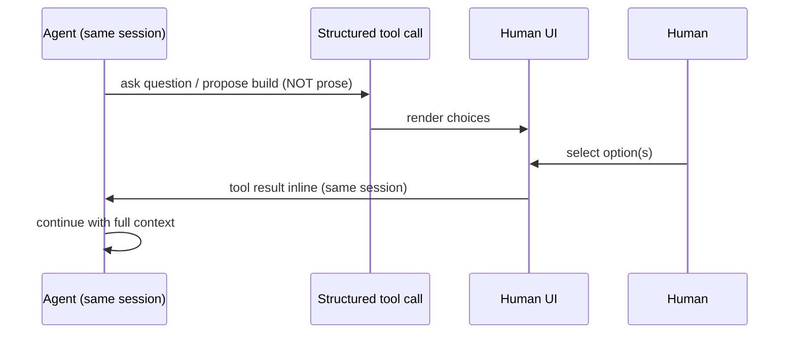
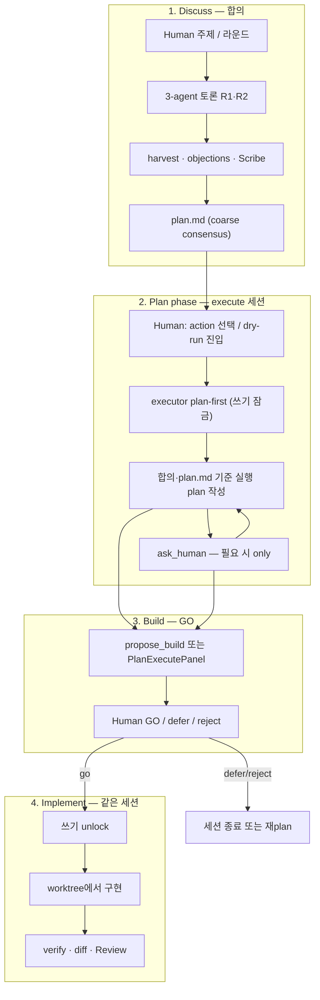
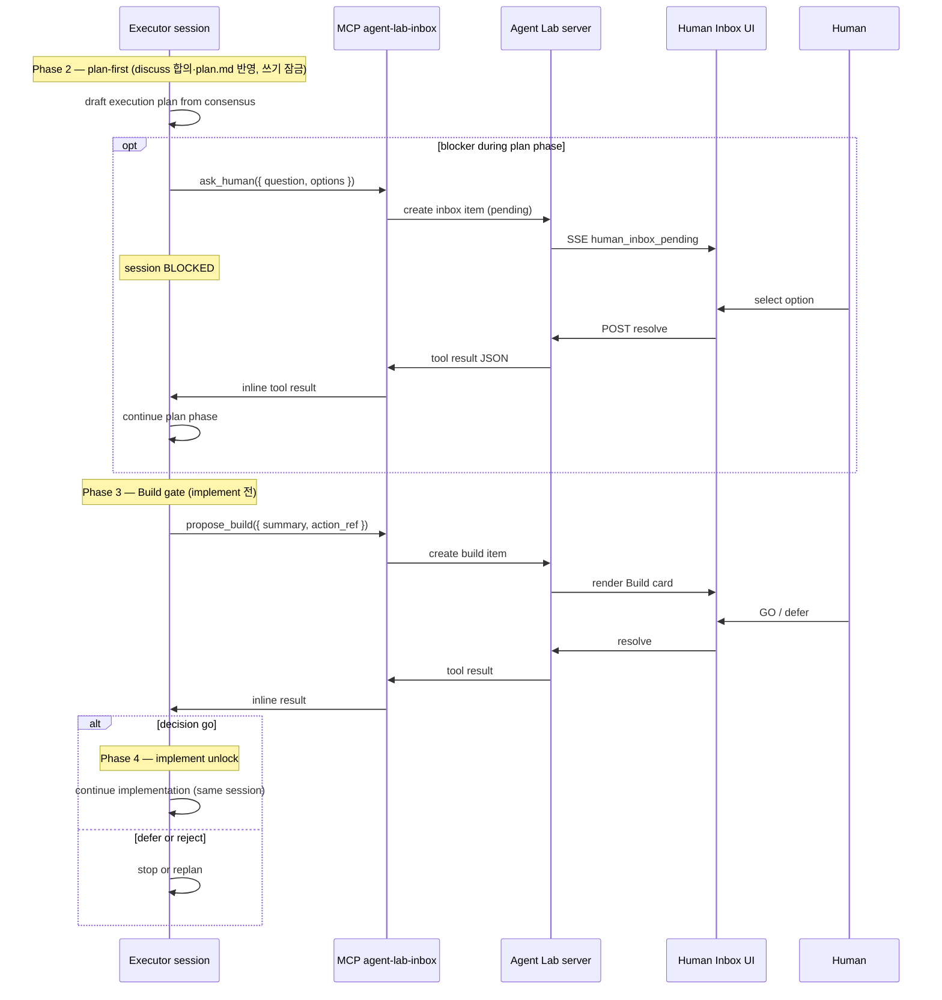
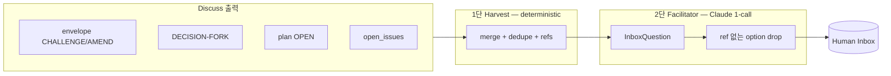
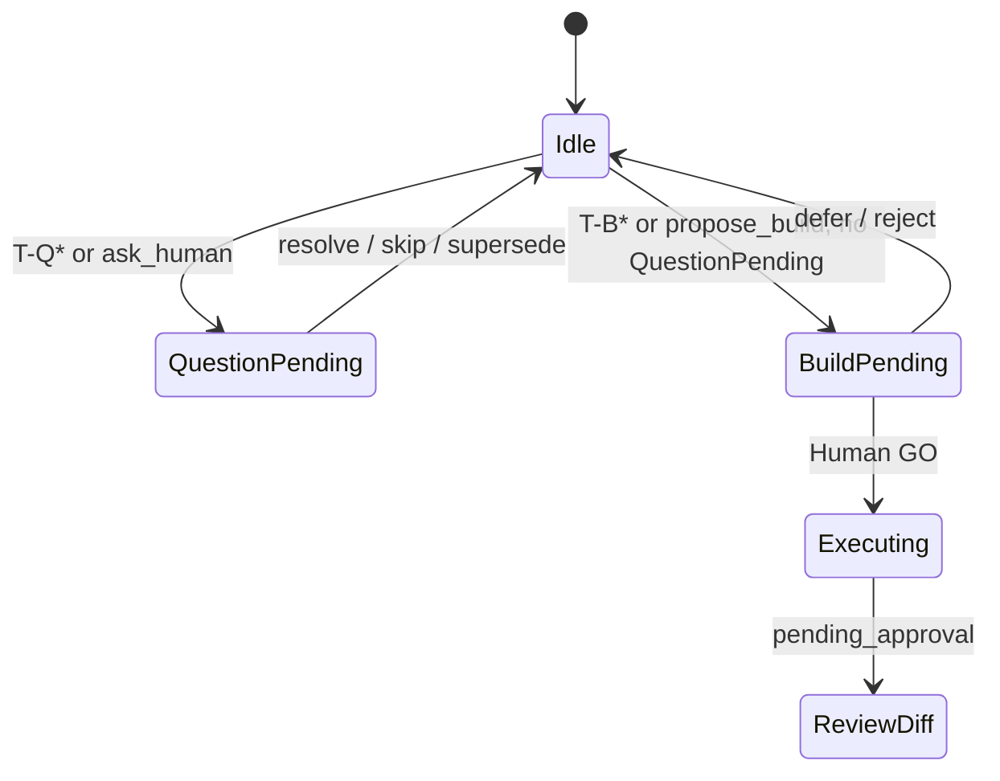
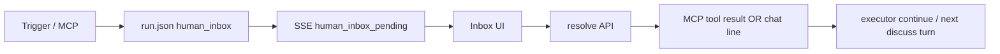
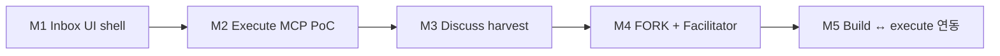

# Human Inbox — 설계 RFC

> **Status (2026-06-07):** Execute lane **M2 shipped** (MCP + `respond_session` + API). Discuss harvest / dedicated resolve UI **partial**.  
> **Canonical index:** [docs/README.md](./README.md) · **Shipped evidence:** [EXTERNAL-REFS-TRACEABILITY.md](./EXTERNAL-REFS-TRACEABILITY.md)  
> **관련:** [USER-GUIDE.md](./USER-GUIDE.md) · [NOTIFICATION-TAXONOMY.md](./NOTIFICATION-TAXONOMY.md)

> **Design direction (2026-06-26):** Human gate SSOT는 **에이전트 MCP**(`ask_human` / `propose_build`). Orchestrator harvest는 레거시·축소 대상; `plan.md`는 Scribe 별도 파이프라인. 전체 방향·Phase 로드맵 → **[MCP-FIRST-INBOX.md](./MCP-FIRST-INBOX.md)** (본 문서 = 도구·API 스펙).

| Area | Shipped | Gap |
|------|---------|-----|
| `human_inbox.py` + `run.json` `human_inbox[]` | ✅ | — |
| REST `/api/sessions/{id}/inbox/*` | ✅ | — |
| MCP `agent-lab-inbox` (stdio) + execute blocking | ✅ | Codex executor parity (M6) |
| Plan-first → Build GO gate (`execute_inbox_build_go`) | ✅ | — |
| Taskbar **peer mailbox** UI | ✅ | Peer channel, not Human decision resolve |
| Dedicated Human Inbox resolve panel | 🔶 | API exists; full UI polish in [UI-MIGRATION-GAPS.md](./UI-MIGRATION-GAPS.md) |
| Discuss deterministic harvest → Inbox | ✅ | M3 shipped — `inbox_harvest.py` + gateway notify on harvest |
| Discuss sync-pause (`should_pause_discuss`) | ✅ | sync-only default; `HumanDecisionBanner` + grace round (FORK · T-Q2) |
| FORK / Facilitator | ✅ | `inbox_facilitator.py` — ref-anchored options; live opt-in `AGENT_LAB_FACILITATOR_LIVE` |
| Inbox `skill_draft` row (Mission OS Phase 4) | ✅ | Web Inbox skills segment + promote/reject |

Claude Code(`AskUserQuestion`, `ExitPlanMode`)와 Cursor(`ask-follow-up`, plan→build)가 수렴하는 **레퍼런스 메커니즘**을 execute 경로에 맞추고, discuss Room은 Agent Lab 고유 오케스트레이션으로 분리한다. **확정 흐름:** discuss에서 합의 → execute **plan phase** → **Build GO** → implement (§3.4). Human Inbox는 두 경로 모두에서 Human이 답하는 **단일 UI surface**다.

---

## 1. 목적·문제

### 1.1 사용자가 원하는 것

| 방식 | 설명 |
|------|------|
| **자율 사용** | Room/execute 중 에이전트가 allowlist된 plugin·MCP를 상황에 맞게 사용 |
| **명시 호출** | Human이 `/skill-name`, `/goal-check` 등 슬래시로 직접 실행 |
| **방향·실행 결정** | 합의·구현 중 막히면 Human에게 **방향**을 묻고, 실행 전 **GO/보류**를 Human이 결정 |

Composer `/` 메뉴·Plugin 패널(CommandRegistry)은 **1차(shipped)**. Human Inbox는 Human **결정** 전용 surface다.

### 1.2 문제 (3) — 본질

예전에 Human Gate를 줄이려 한 이유는 Gate 자체가 싫어서가 아니다.

| # | 겉으로 보인 이유 | 실제 핵심 |
|---|------------------|-----------|
| 1 | Gate 담당 에이전트가 Human 답을 기다리는 동안 **다른 에이전트만** 계속 → 흐름 비대칭 | 부가적 |
| 2 | Human 응답 대기로 **작업 중지** | 부가적 (execute에서는 **의도적 blocking**이 맞음) |
| **3** | Question/Build가 **전용 UI가 아니라** chat에 에이전트마다 **다른 표현**으로 섞임 → **어디에·무엇에 답해야 하는지 모름** | **본질** |

**목표는 “Human을 덜 묻기”가 아니라 “묻는 곳을 하나로 모으기”다.**

에이전트는 Human에게 질문해도 된다. 다만 Human-facing 답변 surface는 **Human Inbox**로 통일하고, transcript debate와 분리한다.

### 1.3 성공 정의

- Human이 pending 결정을 **한 곳**에서 처리한다.
- Execute 중 에이전트가 막히면 **세션 컨텍스트를 잃지 않고** Human 답을 받아 이어간다 (레퍼런스 충실).
- Discuss 중에는 **턴 경계**에 맞는 가벼운 오케스트레이션으로 방향을 정리한다 (레퍼런스 억지 모방 금지).

---

## 2. 레퍼런스 분석 — Claude Code + Cursor 수렴

두 제품은 서로 다른 UI 이름을 쓰지만, **동일한 메커니즘**에 수렴한다.



| 제품 | 방향 확인 | 실행 GO |
|------|-----------|---------|
| Claude Code | `AskUserQuestion` | `ExitPlanMode` |
| Cursor | `ask-follow-up` | plan → build confirm |

**공통 본질:**

1. 에이전트가 세션 **중간**에 **실제 blocker**에 부딪힌다.
2. **구조화된 tool call**을 낸다 — 산문 질문·턴 종료 후 harvest가 아님.
3. Human 답은 **tool result**로 **같은 세션**에 **inline** 반환된다.
4. 에이전트는 **re-injection·re-prompt 없이** full context로 계속한다.

Agent Lab에서 이 패턴에 가장 가까운 것은 **execute/build 단일 에이전트 세션**에 붙는 MCP `ask_human` / `propose_build`다.

### 2.1 후보 메커니즘 비교

| 후보 | 레퍼런스 근접도 | 설명 |
|------|-----------------|------|
| **A. MCP `ask_human` / `propose_build`** | **레퍼런스 그 자체** | tool call → Inbox render → Human choice → tool result inline |
| **B. envelope ASK + harvest + orchestrator gating** | **다른 패러다임** | 턴 종료 → harvest → 다음 턴 re-inject. Agent Lab idiom — discuss 전용 |

**Execute 경로의 1차 메커니즘은 A.** B는 discuss fallback으로만 둔다.

---

## 3. 설계 원칙

### 3.1 두 축

| 축 | 역할 |
|----|------|
| **Reference-fidelity axis (1차)** | Execute/build — blocking MCP tool loop, inline tool result |
| **Agent Lab idiom (2차)** | Discuss — envelope, harvest, orchestrator gating, post-turn clarification |

Reference-fidelity를 discuss에 억지로 적용하지 않는다. **카테고리 오류**다 (3-agent 병렬 one-shot vs 단일 persistent session).

### 3.2 Human Inbox UI 원칙 (유지)

- Question·Build를 **별 패널**이 아니라 **Human Inbox 하나**에 `kind`로 구분.
- **Transcript** = Cursor / Codex / Claude **토론만** (Human 질문 문장 없음).
- **Human Inbox** = pending Question · Build — **여기만 Human이 답함**.
- **Review** = dry-run diff merge 승인 (기존 PlanExecutePanel).
- **순서 규칙:** pending Question이 있으면 Build item 생성·활성화 **금지**.

### 3.3 명시적 거부 (요약)

| 거부 항목 | 이유 |
|-----------|------|
| Discuss에서 inline MCP blocking | one-shot per agent per turn — tool result loop 불가 |
| Question→Claude, Build→Cursor **분리** | 컨텍스트 단절, harvest/re-inject 패러다임 회귀 |
| Execute에서 harvest-as-primary | 레퍼런스와 다른 패러다임 |
| Chat prose로 Human 질문 | 문제 (3) 재발 |
| **워크플로 처음부터 Plan mode** | Cursor Plan mode는 단일 에이전트·한 채팅 — 3자 토론·합의를 대체 못 함 |

---

## 3.4 End-to-end 워크플로 — Discuss → Plan phase → Build → Implement

확정 흐름. **Plan mode(Cursor) / execute plan phase는 워크플로 시작이 아니라 discuss 합의 이후**에만 켠다.

### 3.4.1 왜 처음부터 Plan mode가 아닌가

Cursor Plan mode는 **한 에이전트·한 세션**에서 codebase를 탐색하고 plan 문서를 만드는 모드다. 3에이전트가 번갈아 의견을 내고 반박하는 **discuss**와 역할이 다르다.

| | Discuss room | Execute plan phase (Plan mode 대응) |
|--|--------------|-------------------------------------|
| **목적** | **합의·논쟁** — 방향 맞추기 | **실행 plan 정리** — “합의대로 plan만 짜라” |
| **형태** | 3-agent 병렬, 턴제 one-shot | 단일 executor, **persistent session** |
| **Human Inbox** | orchestration (비-blocking, envelope/harvest) | **blocking** `ask_human` / `propose_build` |
| **레퍼런스** | Agent Lab 고유 (Cursor에 대응 없음) | Cursor Plan mode + Build + implement |

**원칙:** discuss에서 **말을 충분히 하고 합의**한 뒤, execute 경계에서 plan phase로 넘긴다. Plan phase에서도 막히면 `ask_human`으로 물어보고 Human이 Inbox에서 답하면 된다. plan이 정리되면 **Build GO** → 같은 세션에서 implement.

### 3.4.2 4단계 흐름



| 단계 | Agent Lab | Cursor 대응 | Human 역할 |
|------|-----------|-------------|------------|
| **1. Discuss** | Room 3-agent, `plan.md` | *(없음 — 다자 토론)* | Inbox로 방향 (가벼운 orchestration) |
| **2. Plan phase** | execute 세션 **plan-first** | **Plan mode** — explore + plan 문서 | `ask_human` 답 (blocking) |
| **3. Build** | `propose_build` / PlanExecutePanel | **Build 버튼** | GO / 보류 / 거부 |
| **4. Implement** | 같은 executor 세션, dry-run | Build 클릭 후 **같은 채팅**에서 코딩 | Review diff (merge 승인) |

### 3.4.3 Plan phase 세션 정책 (execute)

Cursor SDK에 Plan mode API는 없다. execute 진입 시 **세션 정책**으로 동일 의미를 구현한다.

| 정책 | 내용 |
|------|------|
| **진입 시점** | discuss 합의 + `plan.md` (및 snapshot approve) **이후** — action/dry-run Human 트리거 |
| **plan-first** | GO(`propose_build` `decision: go`) 전까지 **파일 쓰기·apply 금지** — 탐색·질문·실행 plan 요약만 |
| **입력 컨텍스트** | 승인된 `plan.md`, discuss `[HUMAN-DECISION:]`, 선택 action key — “**이대로 실행 plan만 짜라**” |
| **질문** | plan 작성 중 blocker → **`ask_human` only** (prose·chat 질문 금지) |
| **Build** | 실행 plan 요약이 Human 검토 가능한 상태 → **`propose_build`** — Cursor Build와 동일 타이밍 (**implement 전**) |
| **Implement unlock** | `propose_build` GO → 같은 세션에서 implement phase; verify follow-up은 기존과 동일 |
| **Fast-path** | `plan.md` + action이 이미 **executable·구체적**이면 plan phase는 **확인할 blocker 없음 → 즉시 `propose_build`** (게이트 유지, 중복 체감만 축소). executor는 1–2문장 execution summary만 낸 뒤 Build card |

**Shipped (2026-06):** discuss 합의 후 execute **plan-first** (`_cursor_plan_phase_prompt`) → **`propose_build`** → implement. `run_dry_run()` enforces plan phase before file edits. Regression: `tests/test_plan_workflow.py`, plan execute mock suite.

**Fast-path:** executable `plan.md` + concrete action → short plan phase → immediate `propose_build` (gate preserved, friction reduced).

### 3.4.4 Discuss Build vs Execute Build

| | Discuss (T-B*) | Execute (`propose_build`) |
|--|----------------|---------------------------|
| **의미** | “이 action 실행해도 될까?” **예고·gate** | plan phase 완료 후 **실행 GO** (레퍼런스 Build) |
| **메커니즘** | orchestrator Inbox, 비-blocking | MCP blocking, inline tool result |
| **관계** | Human GO → execute lane **착수** | execute 세션 **내부** implement phase 진입 |

Discuss Build(T-B4)로 execute에 들어온 뒤, executor는 **반드시 plan phase(2)를 거친 다음** `propose_build`(3)로 implement(4)에 들어간다. UI에서 Human이 dry-run을 눌렀다고 **plan phase를 건너뛰지 않는다** (최소: 짧은 실행 plan 요약 + GO — coarse `plan.md`만으로 바로 코딩하지 않음).

**게이트 2개 (의도):** T-B4(discuss → execute **착수**) + `propose_build`(implement **GO**) — Cursor도 “시작 → plan 검토 → Build”와 동일. discuss가 이미 상세 `plan.md`를 만들었으면 plan phase는 §3.4.3 **fast-path**로 짧게 통과할 수 있다.

### 3.4.5 Question / Build 타이밍 (execute)

| Tool | 호출 시점 | 호출하지 않는 때 |
|------|-----------|------------------|
| **`ask_human`** | plan phase·implement **중** 실제 blocker | discuss 합의로 이미 정해진 coarse 방향 (plan.md·`[HUMAN-DECISION:]`) |
| **`propose_build`** | **plan phase 완료**, implement **직전** | discuss 단계, implement 이미 시작한 뒤 “이 diff OK?” (그건 Review) |

pending Question이 있으면 `propose_build` **금지** (§3.2 순서 규칙).

---

## 4. Execute lane — Reference-fidelity (1차)

> **전체 맥락:** §3.4 — discuss 합의 **후** execute 세션의 plan phase → Build → implement.

### 4.1 대상 세션

**Dry-run / worktree execute** — `plan_execute.run_dry_run()`이 구동하는 **단일 persistent agent session**. 세션은 §3.4의 **plan phase(2) → Build(3) → implement(4)** 순서를 따른다.

- Executor: **Cursor SDK** (오늘 기본) 또는 **Codex executor**
- MCP tools는 **실행 중인 executor 세션에만** 부착 — 에이전트 간 분리 금지
- **같은 세션**에 두 tool 모두:

| MCP tool | 레퍼런스 대응 | 용도 | Phase (§3.4) |
|----------|---------------|------|--------------|
| `ask_human` | `AskUserQuestion` / `ask-follow-up` | plan·implement **중** blocker **방향** | 2, 4 |
| `propose_build` | Cursor **Build** / `ExitPlanMode` | plan phase **완료 후**, implement **직전** GO | 3 |

Human Inbox = **UI renderer + answer router** → 선택 결과를 **tool result**로 executor에 반환.

### 4.2 MCP server `agent-lab-inbox` 스펙 (초안)

서버 이름: `agent-lab-inbox` (stdio 또는 SSE — executor별 attach 방식은 구현 단계에서 결정)

#### `ask_human`

AskUserQuestion 형태를 따른다.

```json
{
  "name": "ask_human",
  "description": "Human에게 구조화된 방향 결정을 요청한다. prose 질문 금지 — 이 tool만 사용.",
  "inputSchema": {
    "type": "object",
    "required": ["question", "options"],
    "properties": {
      "question": { "type": "string", "description": "Human에게 보여줄 질문" },
      "options": {
        "type": "array",
        "items": {
          "type": "object",
          "required": ["id", "label"],
          "properties": {
            "id": { "type": "string" },
            "label": { "type": "string" },
            "description": { "type": "string" }
          }
        },
        "minItems": 2
      },
      "multiSelect": { "type": "boolean", "default": false },
      "context_ref": { "type": "string", "description": "선택적 — plan action id, file path 등" }
    }
  }
}
```

**Tool result (Human 답변 후):**

```json
{
  "selected": ["option-id-a"],
  "freeform": null,
  "resolved_at": "2026-06-06T12:00:00Z",
  "inbox_item_id": "inbox-abc"
}
```

#### `propose_build`

```json
{
  "name": "propose_build",
  "description": "Plan phase가 끝난 뒤 implement phase 진입 전 Human GO를 요청한다 (Cursor Build 대응). plan.md 합의만으로는 호출하지 않는다 — executor가 실행 plan 요약을 낸 다음.",
  "inputSchema": {
    "type": "object",
    "required": ["summary", "action_ref"],
    "properties": {
      "summary": { "type": "string", "description": "실행 요약 — 무엇을·어디서·검증" },
      "action_ref": { "type": "string", "description": "plan action key, e.g. now:0" },
      "risks": { "type": "array", "items": { "type": "string" } },
      "estimated_scope": { "type": "string" }
    }
  }
}
```

**Tool result:**

```json
{
  "decision": "go" | "defer" | "reject",
  "note": "optional human note",
  "resolved_at": "2026-06-06T12:00:05Z",
  "inbox_item_id": "inbox-def"
}
```

`decision: go` → executor가 dry-run 구현을 계속. `defer`/`reject` → 세션은 정리 규칙에 따라 종료 또는 대안 제시.

### 4.3 Blocking loop



**핵심:** dry-run이 끝날 때까지 executor 세션은 열린 채로 유지. Human 대기 중에도 **같은 Agent 인스턴스**가 컨텍스트를 유지한다.

**Human 무응답 (execute):** Cursor SDK는 MCP tool call에 **자체 timeout**이 있다. Human이 영영 답하지 않으면 SDK가 세션을 에러로 끊을 수 있다. `agent-lab-inbox` MCP server는 SDK timeout **전에** (설정 가능, 기본 예: 30분) `status: timeout` tool result를 반환하거나, Inbox **[건너뛰기]/defer** 시 `decision: defer` result로 unblock한다. §6.5 ⑧.

### 4.4 Executor-agnostic

| Executor | 오늘 상태 | MCP attach |
|----------|-----------|------------|
| **Cursor SDK** | `cursor_agent.respond()` — `Agent.create` → prompt + verify follow_up → `close`. `AgentOptions`에 **`mcp_servers` 미전달** (`cursor_agent.py:116`) | **SDK는 MCP 지원** (`AgentOptions.mcp_servers`, `StdioMcpServerConfig` / `HttpMcpServerConfig` / `SseMcpServerConfig`; activity에 `ToolCallStartedUpdate` / `ToolCallCompletedUpdate`). **갭 = Agent Lab wiring:** `mcp_servers` 등록, `respond_session()` blocking resolve, tool activity → Inbox |
| **Codex** | `codex_agent.respond()` — CLI one-shot, JSONL activity 파싱 존재 | **갭:** MCP→Inbox wiring 없음 (E4) |
| **Claude CLI** | Room discuss용 text mode; `--mcp-config` CLI 지원은 있으나 execute 미사용 | execute 후보 executor로 확장 시 동일 MCP 서버 재사용 가능 |

**Question-Claude / Build-Cursor 분리는 거부.** Question과 Build **모두** execute 중인 executor 세션(cursor 또는 codex)에 속해야 한다.

### 4.5 Human Inbox UI 역할 (execute)

Execute lane에서 Inbox는 **thin adapter**:

1. MCP tool call payload → Inbox item (`kind: question | build`)
2. Human UI 렌더 (options, multiSelect, Build summary)
3. Resolve → MCP tool result writer → executor unblock
4. `run.json` `human_inbox[]`에 audit trail 기록
5. Discuss context로 넘어갈 때만 `[HUMAN-DECISION:]` 정규화 (§6)

Inbox는 에이전트가 직접 호출하지 않는다. **MCP server가 bridge**다.

### 4.6 Shipped execute path (2026-06-07)

**Current (`plan_execute.py` + `cursor_agent.py`):**

```text
run_dry_run()
  → _call_execute_agent(..., inbox_mcp=AGENT_LAB_EXECUTE_INBOX default 1)
    → cursor_agent.respond_session()  # plan phase → Build GO gate → implement
    → AgentOptions.mcp_servers = agent-lab-inbox (stdio)
    → codex_agent.respond_session() when executor=codex
```

| Capability | Status |
|------------|--------|
| `human_inbox[]` + resolve/supersede API | ✅ `app/server/routers/human_inbox.py` |
| MCP `ask_human` / `propose_build` | ✅ `inbox_mcp_server.py`, `cursor_inbox_mcp.py` |
| Execute plan-first + GO gate | ✅ `execute_inbox_build_go`, `tests/test_inbox_execute_e2e.py` |
| Activity / tool → Inbox notifications | 🔶 partial — see NOTIFICATION-TAXONOMY |
| Codex JSONL tool bridge (E4) | ⬜ M6 |

**Historical note:** §4.6 previously described pre-M2 one-shot `respond()` — **obsolete**; kept only in git history.

**관련 파일:** `plan_execute.py`, `agents/cursor_agent.py`, `agents/codex_agent.py`, `human_inbox.py`

---

## 5. Discuss lane — Agent Lab idiom (2차)

### 5.1 왜 inline MCP가 맞지 않는가

Discuss Room (`room.py`)은 **3-agent 병렬 토론**:

- Cursor / Codex / Claude — **에이전트당 one-shot per turn**
- 턴 종료 후 harvest → Scribe → 다음 Human send
- 한 에이전트의 “blocking tool call”이 **다른 에이전트 R2 digest·합의**와 동시에 돌 수 없음

따라서 Claude/Cursor **reference fidelity를 discuss에 강제하면** orchestrator 전체를 단일 persistent session으로 바꿔야 하며, Room 아키텍처와 충돌한다.

### 5.2 Discuss 메커니즘

| 메커니즘 | 역할 |
|----------|------|
| **envelope ASK** (향후) | 에이전트가 구조화된 “Human 방향 필요” 신호 — post-turn harvest 입력 |
| **Clarifier** (`session_clarifier.py`) | 첫 턴 주제 짧을 때 사전 질문 — Inbox surface로 흡수 |
| **Harvest + Facilitator** | R1+R2 후 open issues → Inbox question item 합성 |
| **FORK envelope** | 선택지 anchor — Facilitator가 ref 기반으로 option 이름만 정리 |
| **Orchestrator gating** | pending Inbox → discuss **전원 pause** (sync checkpoint) |
| **`decision_request` JSON** | MCP 불가 환경 fallback |

Human Inbox는 discuss에서도 **Human-facing surface**로 유지하되, 메커니즘은 **비-blocking 오케스트레이션**이다. Human 답은 다음 턴 context에 `[HUMAN-DECISION:]` + `human_inbox[]` resolved 상태로 주입.

### 5.3 Discuss 워크플로

```mermaid
flowchart TB
  subgraph discuss [Discuss turn]
    H1[Human 메시지]
    CL[Clarifier T-Q0 — optional]
    R1[R1 병렬]
    R2[R2 peer digest]
    HAR[harvest mailbox / objections / artifacts]
    H1 --> CL --> R1 --> R2 --> HAR
  end

  subgraph gate [Orchestration gate]
    PAUSE{decision 필요?}
    INBOX[(Human Inbox)]
    FAC[Facilitator 1-call — M4+]
    ANS[Human 답 / skip]
    DEC["[HUMAN-DECISION]"]
    HAR --> PAUSE
    PAUSE -->|yes| FAC --> INBOX
    INBOX --> PAUSE2[discuss PAUSE]
    PAUSE2 --> ANS --> DEC
    PAUSE -->|no| SCRIBE
    ANS --> SCRIBE
  end

  subgraph plan [Plan · Build trigger]
    SCRIBE[Scribe → plan.md]
    BUILD[Build item T-B* — gates OK]
    SCRIBE --> BUILD
  end

  DEC --> discuss
  BUILD -.->|Human GO → §3.4 execute| execute lane
```

**원칙 (discuss):**

- Facilitator = **Claude read-only 1-call** — 3명 발화 **합성** (Cursor에 맡기지 않음)
- Facilitator는 option을 **invent하지 않음** — FORK/envelope ref anchor만
- **sync-only (default)** — pending pause-eligible Inbox question이 있으면 discuss auto 라운드 정지. Composer 토글은 제거됨; 벤치/회귀만 `AGENT_LAB_INBOX_MODE=soft` 또는 세션 `inbox_mode: soft`
- **grace round** — 새 FORK(T-Q1+options) 또는 T-Q2(plan OPEN) harvest 직후 **1 debate 라운드** 추가(동료 ENDORSE/AMEND/PASS) → 그다음 pause
- **HumanDecisionBanner** — runtime `gates` snapshot으로 discuss · plan clarify · execute 차단 레인을 Composer 위 단일 배너에 표시

### 5.3.1 Sync mode · grace round (shipped 2026-06-14)

| 설정 | 동작 |
|------|------|
| `AGENT_LAB_INBOX_MODE=sync` (default) | pause-eligible pending question → discuss pause |
| `AGENT_LAB_INBOX_MODE=soft` | harvest·Inbox surface만; discuss 계속 |
| 세션 `run.json` `inbox_mode` | env보다 우선 (`sync` \| `soft`) |

**Pause-eligible triggers:** T-Q0 (Clarifier), T-Q2 (plan OPEN), T-Q1 FORK (options≥2), manual/gateway sources.

**Grace (1 extra round before pause):**

| Trigger | Guidance | Reply policy |
|---------|----------|--------------|
| T-Q1 FORK | `[Inbox fork grace round]` | `decision-fork` inject 억제 |
| T-Q2 plan OPEN | `[Inbox plan-open grace round]` | peer 반응 유도 |

**UI:** `HumanDecisionBanner` (`web/src/components/HumanDecisionBanner.tsx`) — `/api/sessions/{id}/runtime`의 `gates` + `discussPaused`. `PlanWorkflowBanner`의 Inbox 버튼은 배너 표시 중 숨김.

**Not pause-eligible (by design):** T-Q1 without options (CHALLENGE/AMEND harvest 제거됨) — transcript `room_objections`에 유지.

### 5.3.2 Legacy note

이전 초안의 “soft mode Composer 토글”은 제거됨 — Human Inbox 질문은 sync에서만 discuss를 멈추는 것이 제품 의도.

### 5.4 Discuss 트리거 (개념 ID)

Question/Build는 **매 턴 자동**이 아니다.

#### Question (방향)

| ID | 트리거 | 시점 |
|----|--------|------|
| **T-Q0** | Clarifier (주제 짧음 / 첫 턴) | **에이전트 라운드 전** |
| **T-Q1** | Discuss harvest (CHALLENGE/AMEND, consensus incomplete, open_issues) | **R1+R2 직후**, sync pause |
| **T-Q2** | plan OPEN + 매칭 `[HUMAN-DECISION]` 없음 | Scribe 후 |
| **T-Q3** | Goal Oracle FAIL (auto-continue OFF) | discuss/plan 턴 후 |
| **T-Q4** | Objection — Human **정책** 필요 | 해당 시점 |
| **T-Q5** | Human 수동 (`/question`, Inbox “질문 요청”) | anytime |

#### Build (실행 제안 — discuss 측)

> **MCP-first (planned):** discuss T-B* orchestrator harvest → lead `propose_build` after Scribe. 매핑·Phase B → [MCP-FIRST-INBOX.md §7](./MCP-FIRST-INBOX.md).

Discuss의 Build item은 **execute GO 예고**이며, 실제 dry-run은 execute lane(MCP `propose_build` 또는 PlanExecutePanel)에서 처리.

| ID | 트리거 | 조건 |
|----|--------|------|
| **T-B1** | plan에 `## 지금 실행` executable 존재 | recommended action |
| **T-B2** | Gates pass | open objection 없음, pre_execute, executor ready |
| **T-B3** | pending execution 없음 | 동일 action `pending_approval` 중복 방지 |
| **T-B4** | Human GO | Inbox Build [dry-run] → execute lane 착수 |

Build Inbox = **“실행할까?”** · Review diff = **“이 diff merge할까?”** (기존 PlanExecute 유지).

#### Fast preset — orchestrator harvest/MCP skip

`room_preset=fast` (또는 `user_mode=quick` + `plan_intent=none`)에서는 discuss lane **build/discuss harvest**와 **discuss/plan CLARIFY inbox MCP**를 스킵한다. Execute lane `propose_build`·merge gate는 유지.

- **제품 가정:** Fast는 discuss에서 clarify→plan→execute 오케스트레이션을 쓰지 않음.
- **향후:** Execute에서 plan-workflow를 켤 수 있음 → 스킵 범위 재검토 필요.

상세 표·코드 SSOT: [05-room-agent-roles.md §Fast preset — orchestrator Inbox skip](./05-room-agent-roles.md) · [FLOW.md §2.1](./FLOW.md)

### 5.5 Harvest · Facilitator · FORK (discuss 품질 파이프라인)



- M3까지: harvest → **options 없음**, refs·excerpt만, **LLM 합성 0%**
- M4+: FORK + Facilitator — ref-anchored options만

---

## 6. Human Inbox UI 명세

### 6.1 Surface 배치

```
┌─ Human Inbox (Composer 위 고정) ─────────────────┐
│ 🔶 방향 결정 1건 · 🔷 실행 확인 0건                │
│ Q: cadence 스윕 범위?  [VU만] [VU+Theme] [직접]   │
└──────────────────────────────────────────────────┘
```

| Surface | 역할 |
|---------|------|
| **Transcript** | 에이전트 토론만 |
| **Human Inbox** | pending Question · Build |
| **Review** | dry-run diff merge |
| **plan.md OPEN** | Inbox item `id`와 1:1 링크 (discuss) |

### 6.2 Item types · states

| Field | 값 |
|-------|-----|
| `kind` | `question` \| `build` |
| `source` | `mcp_ask_human` \| `mcp_propose_build` \| `orchestrator` \| `manual` |
| `status` | `pending` \| `resolved` \| `deferred` \| `superseded` \| `rejected` |

**Ordering:** `question` pending → `build` item 생성·활성화 차단.



### 6.3 `[HUMAN-DECISION:]` 정규화

Discuss·audit 경로에서 Human 답을 chat context에 넣을 때 **한 줄** 형식:

```text
[HUMAN-DECISION: id=inbox-abc choice=vu-only note=]
```

| 필드 | 설명 |
|------|------|
| `id` | `human_inbox[].id` |
| `choice` | 선택 option id 또는 `go`/`defer`/`reject` |
| `note` | optional freeform |

**Execute MCP 경로:** primary 전달은 **tool result inline** — `[HUMAN-DECISION:]`는 `run.json` audit + discuss bridge용.

### 6.4 UI ↔ 서버 계약



**SSE:** `complete`는 “턴 처리 끝”이지 Inbox pending이면 **`inbox_pending: true`** 동시 표시.

### 6.5 깨지기 쉬운 지점

| # | 문제 | 완화 |
|---|------|------|
| ① | Human **새 메시지** 후 stale Inbox | `human_turn_id` — 새 send 시 pending **supersede** |
| ② | clarifier + harvest **중복** 질문 | dedupe key |
| ③ | SSE `complete` 오해 | `inbox_pending: true`, Composer 배지 |
| ④ | Build card vs plan drift | `plan_revision` / `action_id` — stale 표시 |
| ⑤ | `[HUMAN-DECISION]` context 누락 | bundle block + contract test |
| ⑥ | Skip 없음 (discuss) | **[건너뛰기]** → `deferred` + sync 해제 |
| ⑦ | Facilitator option invent | M3까지 **LLM 합성 0%** |
| ⑧ | Execute MCP **Human 무응답** — SDK tool timeout → 세션 crash | MCP server가 timeout/defer **전에** tool result (`timeout` / `defer`); Inbox skip 연동 (§4.3) |

---

## 7. `run.json` — `human_inbox[]` 스키마

```json
{
  "human_inbox": [
    {
      "id": "inbox-abc",
      "kind": "question",
      "source": "mcp_ask_human",
      "trigger": null,
      "human_turn_id": 7,
      "status": "pending",
      "prompt": "cadence 스윕 범위를 어디까지 할까요?",
      "options": [
        { "id": "vu-only", "label": "VU만", "description": "…" },
        { "id": "vu-theme", "label": "VU+Theme", "description": "…" }
      ],
      "multi_select": false,
      "refs": ["plan.md#L42"],
      "plan_open_id": null,
      "plan_revision": null,
      "action_ref": null,
      "mcp_call_id": "call-xyz",
      "session_id": "exec-session-1",
      "supersedes": null,
      "resolved_choice": null,
      "resolved_at": null,
      "created_at": "2026-06-06T12:00:00Z"
    }
  ],
  "inbox_pending": true
}
```

| Field | Execute | Discuss |
|-------|---------|---------|
| `mcp_call_id` | MCP tool call correlation | null |
| `trigger` | null | `T-Q1` 등 |
| `source` | `mcp_*` | `orchestrator` / `manual` |

---

## 8. MCP vs Fallback 매트릭스

| 상황 | 1차 | Fallback |
|------|-----|----------|
| Execute dry-run, Cursor/Codex + MCP enabled | `ask_human` / `propose_build` via `mcp_servers` | PlanExecutePanel manual GO if `AGENT_LAB_EXECUTE_INBOX=0` |
| Execute, Codex JSONL tool events | MCP bridge (E4) | `decision_request` in agent text → server parse |
| Discuss 방향 결정 | orchestrator T-Q* + harvest | envelope ASK, `decision_request` JSON block |
| Discuss Build 제안 | T-B* + gates → Inbox card | PlanExecutePanel 직접 (기존) |
| MCP 전혀 불가 | — | `decision_request` / FORK / manual Inbox item |

**원칙:** Fallback은 **discuss·MCP gap** 한정. Execute가 안정화되면 fallback은 축소한다.

---

## 9. 구현 로드맵



| 단계 | 내용 | 레인 | 가치 |
|------|------|------|------|
| **M1** | Inbox 패널 + `run.json` `human_inbox[]` + resolve API + `[HUMAN-DECISION]` | UI 공통 | **(3) 즉시** — surface만으로 가치 |
| **M2** | `agent-lab-inbox` MCP + **`cursor_agent` `mcp_servers` wiring** + execute blocking PoC (`respond_session`) | Execute | **레퍼런스 충실** 핵심 |
| **M2b** | Clarifier → Inbox surface 흡수 | Discuss | 묻는 곳 하나 |
| **M3** | deterministic harvest → options 없음, refs만 | Discuss | invent 구간 제거 |
| **M4** | envelope FORK + Facilitator + sync pause | Discuss | 선택지 품질 |
| **M5** | Discuss Build item ↔ execute `propose_build` / PlanExecute | 연동 | end-to-end GO |
| **M6** | Codex executor MCP bridge (E4) — Cursor와 동일 Inbox contract | Execute | executor parity |

### Acceptance criteria (2026-06-07)

**M1 — API + data model**

- [x] `human_inbox[]` in `run.json` + resolve/supersede API
- [x] 새 Human send 시 stale item supersede (`supersede_pending_inbox`)
- [ ] Dedicated Inbox panel — pending kind + one-click resolve (Taskbar shows **peer mailbox** today)

**M2 — Execute MCP**

- [x] `AgentOptions.mcp_servers` — `agent-lab-inbox` stdio (`cursor_agent.py`)
- [x] `ask_human` / `propose_build` → blocking `respond_session` loop
- [x] Dry-run single session through plan → GO → implement (`tests/test_inbox_execute_e2e.py`)
- [ ] MCP Human timeout / defer → tool result before SDK hard timeout (edge cases)

**M3 — Discuss harvest**

- [x] harvest → excerpt + refs Inbox (options 없음) — `inbox_harvest.py` + `fan_out_inbox_item`
- [x] Facilitator / LLM option invent 금지 (policy)

**M4 — Discuss advanced**

- [x] FORK / ref-anchored options — `inbox_facilitator.merge_forks`
- [x] sync pause + skip/defer — `should_pause_discuss` + gate_scope UI chips

**M5 — End-to-end Build**

- [x] Build GO gate → execute dry-run → Review diff (default inbox MCP path)

---

## 10. 비목표

- Discuss Room을 Claude/Cursor **native Question UI 클론**으로 만드는 것
- Question→Claude, Build→Cursor **역할 분리**
- Execute에서 **harvest-as-primary** (턴 종료 후 re-inject를 기본으로 두는 것)
- Chat prose·regex로 “Human에게 …” 감지 (문제 3 재발)
- Facilitator가 ref 없이 option **발명**
- `sessions/*` 커밋·execute gate 우회

---

## 11. 기존 Agent Lab 자산과의 관계

| 이미 있음 | Human Inbox 관계 |
|-----------|------------------|
| `plan_execute.run_dry_run()` | M2 execute MCP blocking 부착점 |
| `cursor_agent.respond()` | M2 → `respond_session()` 확장 |
| `codex_cli.codex_event_label()` | M6 JSONL → MCP 이벤트 확장 |
| Clarifier (`AGENT_LAB_CLARIFIER`) | M2b Inbox 흡수 |
| PlanExecutePanel · worktree dry-run | Review diff — Build GO 이후 |
| Goal loop · Oracle | T-Q3 |
| Objections · Tasks | T-B2 execute gate |
| `TurnState.open_issues`, envelope | M3 harvest 입력 |
| NotificationCenter | Activity 알림 — Inbox와 별 surface ([NOTIFICATION-TAXONOMY.md](./NOTIFICATION-TAXONOMY.md)) |
| CommandRegistry `/` | Inbox 여는 단축키 후보 |

---

## 12. 관련 파일

| 영역 | 경로 |
|------|------|
| Execute orchestration | `src/agent_lab/plan_execute.py` |
| Cursor executor | `src/agent_lab/agents/cursor_agent.py` |
| Codex executor | `src/agent_lab/agents/codex_agent.py`, `src/agent_lab/codex_cli.py` |
| Discuss Room | `src/agent_lab/room.py` |
| Envelope protocol | `src/agent_lab/agent_envelope.py` |
| Clarifier | `src/agent_lab/session_clarifier.py` |
| Run meta | `src/agent_lab/run_meta.py` |
| Inbox UI (진행 중) | `web/src/components/NotificationCenter.tsx` (Activity), Inbox 전용 컴포넌트 예정 |
| Notification routing | `web/src/utils/notificationStore.ts`, `web/src/utils/pushNotification.ts` |
| Plan execute UI | `web/src/components/PlanExecutePanel.tsx` |

---

## 변경 이력

| 날짜 | 내용 |
|------|------|
| 2026-06-06 | 초안 — Question/Build·Inbox·트리거·native capture gap·MVP 순서 |
| 2026-06-06 | **전면 개정** — reference-fidelity axis, execute MCP primary, discuss idiom 분리, Question-Claude 분리 거부, capture 허용 |
| 2026-06-14 | **sync-only UI** — Composer inbox toggle removed; `HumanDecisionBanner`; FORK+T-Q2 grace round; docs §5.3.1 |
| 2026-06-06 | **§3.4.3 fast-path**, **§4.4 Cursor MCP 사실 수정** (SDK 지원·wiring 갭), execute tool timeout (§4.3·§6.5⑧), M2에 `mcp_servers` 편입 |
