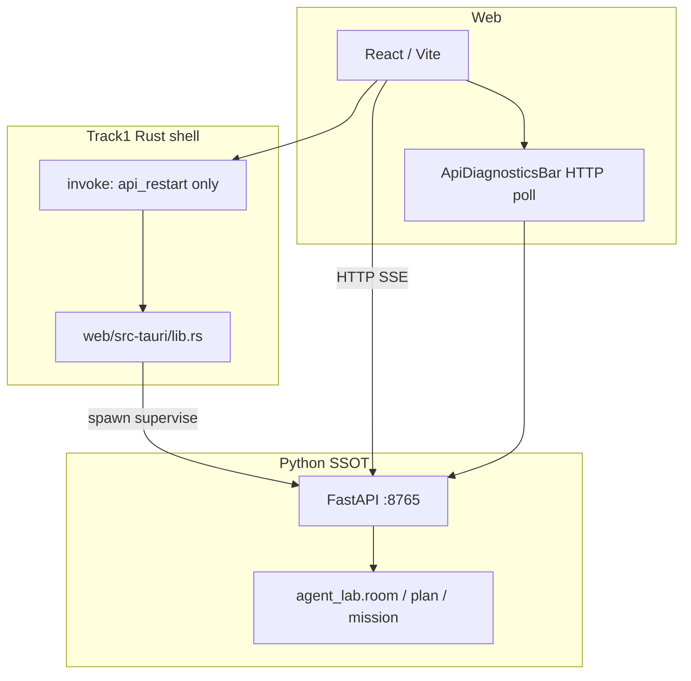
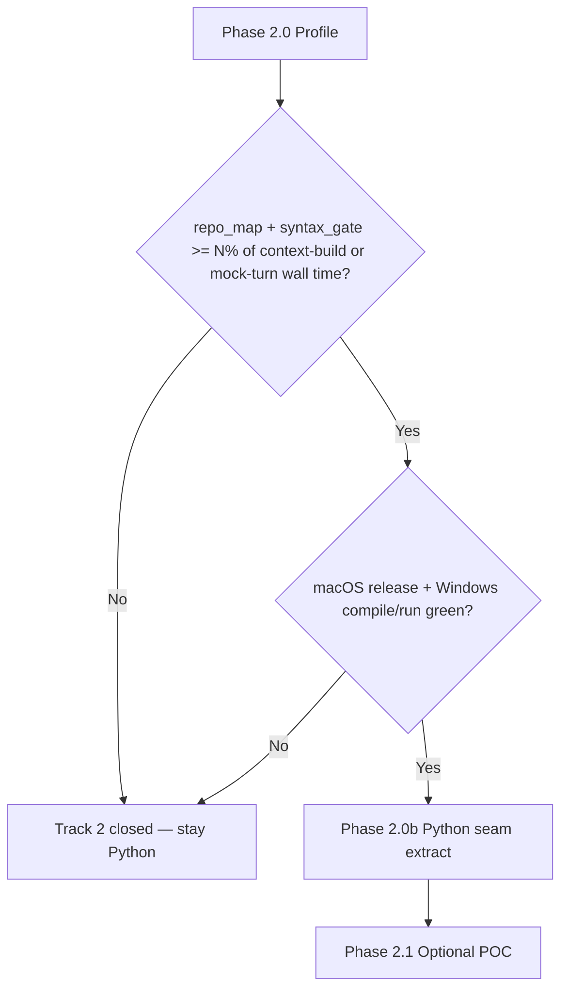
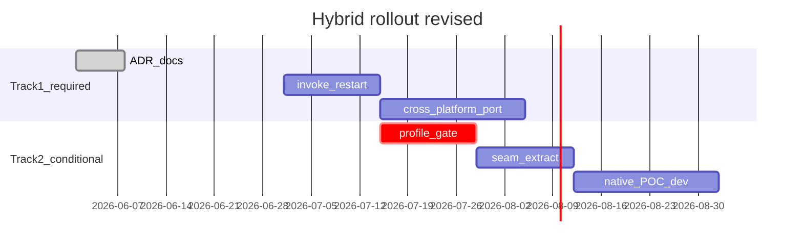

# ADR — Hybrid Rust + Python (packaging + conditional native)

> **Status:** Accepted (2026-06-28)  
> **Baseline:** tag `baseline/pre-hybrid-rust-2026-06-28` · [PACKAGING-BASELINE.md](./archive/legacy/PACKAGING-BASELINE.md)  
> **Supersedes:** informal “repo_map Rust in 4 weeks” rollout sketch

---

## Decision

Agent Lab stays **Python SSOT** for Room · plan · execute · mission · Human gate.

| Track | Nature | Default |
|-------|--------|---------|
| **Track 1** | Tauri shell + HTTP IPC + small `invoke` bridge | **Proceed** — production packaging |
| **Track 2** | PyO3 / native hot-path acceleration | **Conditional** — profile gate + platform gate; may never ship |

**One-line rule:** Pure-Python cross-platform path is always the default. Native code is optional acceleration **only when measured and bundled-runtime-ready**.

---

## Context

### Current architecture (Living SSOT)



- **IPC bus:** HTTP `127.0.0.1:8765` — unchanged.
- **Dev API owner:** `ensure-dev-api.mjs` + `AGENT_LAB_SKIP_TAURI_API=1` (not Tauri spawn).
- **Prod API owner:** `lib.rs` supervisor.
- **PyO3 today:** none.

### What we rejected

- Full Room / plan_execute / mission rewrite in Rust
- PyO3 embed of entire FastAPI (uvicorn in-process)
- Tauri `externalBin` sidecar (until subprocess model proves insufficient)
- **Scheduled** Track 2 work without profile + bundling gates

---

## Track 1 — Packaging (proceed)

### Goals

Users should not manually manage `:8765`. Desktop shell supervises API lifecycle; UI can recover from offline without a terminal.

### Already shipped (do not re-build)

| Area | Location | Notes |
|------|----------|-------|
| Dev API lifecycle | [`web/scripts/ensure-dev-api.mjs`](../web/scripts/ensure-dev-api.mjs), [`web/vite.config.ts`](../web/vite.config.ts) | watchdog, reload grace, port reclaim (macOS) |
| Prod spawn + supervisor | [`web/src-tauri/src/lib.rs`](../web/src-tauri/src/lib.rs) | 4s loop, health probe |
| HTTP diagnostics UI | [`web/src/components/ApiDiagnosticsBar.tsx`](../web/src/components/ApiDiagnosticsBar.tsx) | offline banner, 8s poll, sessions dir, boot log tail, copy JSON, **API 재시작** (release) |
| Tauri invoke | `lib.rs` + [`web/src/utils/tauriApiShell.ts`](../web/src/utils/tauriApiShell.ts) | `api_restart`, `api_shell_status`; ACL `allow-api-shell` |
| Release boot failure dialog | `lib.rs` `show_api_boot_error` | native error on spawn failure |
| sessions_dir mismatch detect | `lib.rs` `api_health_sessions_dir()` | **log + reuse** — does not block yet |
| Bundled Python venv | [`scripts/prepare_bundled_runtime.sh`](../scripts/prepare_bundled_runtime.sh) | no native extensions |

### Phase 1.1 — ADR + doc cross-links

- This document + [PACKAGING-BASELINE.md](./archive/legacy/PACKAGING-BASELINE.md) hybrid section
- [ARCHITECTURE.md](./ARCHITECTURE.md) §6.5 link here

**Exit:** merged; team agrees Track 2 is conditional.

### Phase 1.2 — Tauri `invoke` — **shipped** (`dc044854`)

- `api_restart` — stop child + reclaim `:8765` + `start_api` (release only)
- `api_shell_status` — `tauri_owns_api` / `skip_tauri_api` / `health_ok` for UI gating
- Dev `tauri-dev`: button disabled (`AGENT_LAB_SKIP_TAURI_API=1`); invoke returns clear error
- Tests: Rust `skip_tauri_api_reads_env`; Vitest `tauriApiShell.test.ts`

### Phase 1.3 — Supervisor hardening — **shipped**

| Item | Implementation |
|------|----------------|
| Cross-platform port reclaim | [`port_reclaim.rs`](../web/src-tauri/src/port_reclaim.rs) — unix `lsof`/`kill`, Windows `netstat`/`taskkill` + unit tests |
| Windows compile CI hook | `make tauri-check-windows` (`cargo check --target x86_64-pc-windows-msvc`) |
| Cross-platform log dirs | `agent_log_dir()` — macOS / Windows `%LOCALAPPDATA%` / Linux `~/.local/share` |
| sessions_dir mismatch | **Release:** reclaim + respawn; **dev:** warn + reuse; `api_shell_status` + diagnostics UI |

### Phase 1.4 — IPC contract (deferred)

HTTP `:8765` stays canonical. UDS / named pipe only if port conflicts or security audit require it — **YAGNI** until measured.

---

## Track 2 — Conditional native (may never start)

> **AMENDMENT 2026-06-28 — Track 2 native CLOSED. Both candidates rejected; `crates/agent_lab_native` removed.**
>
> - **syntax_gate**: micro-bench gate **FAIL** (Phase 2.2). CPython `compile()` is already a C fast path; relief ceiling ~0.078% of a mock turn — structurally below the 5% gate regardless of Rust speed.
> - **repo_map**: the ~98% context-build share / ~800 ms reported in Phase 2.0 below was a **Python over-scan bug**, not an inherent hot path. `bound_python_files` only pruned above `MAX_FILES=2000`, so a 842-file repo parsed the whole tree to fill a 1 KB budget. Fixed in Python — seed + import-hop-1 bounding in [`repo_map_core.py`](../src/agent_lab/repo_map_core.py): **780 ms → 134 ms (5.8×)** on this repo, output richer. No native ROI remains.
> - **Disposition**: the Rust crate, `AGENT_LAB_SYNTAX_GATE_RUST` flag + shim, `make native-dev/native-test`, the `AGENT_LAB_BUNDLE_NATIVE` guard, and the native micro-bench script/tests are **deleted**. Kept: the decision record ([TRACK2-NATIVE-GATE.md](./archive/rfcs/TRACK2-NATIVE-GATE.md)) and the Python `*_core` seams — the durable win.
> - **Durable lesson**: the first optimization is the Python algorithm (over-scan; `compile`→`ast`), never Rust. Re-open only on the documented scan-volume trigger (≥100× file count) — and re-measure the Python path first.
> - Phase 2.0 / 2.1 / 2.2 below are retained as the historical record that led here.

### Policy

Track 2 is **not scheduled work**. It opens only when **all** gates pass:



**Default N:** start with **5%** of mock Room turn wall time (context bundle segment only); revise in profile PR with data. If &lt; N%, close Track 2 in ADR amendment — no shame, expected outcome.

### Why repo_map is not “pure function ready”

Public API today:

```python
def build_repo_map_block(run_meta: dict | None, plan_md: str = "") -> str:
```

Dependencies (must stay in Python wrapper or be duplicated in Rust):

- `agent_lab.context.layers.repo_tree_layer_enabled(run_meta)`
- `agent_lab.repo_tree_context._workspace_root`, plan path hints, seed resolution

**Incorrect plan assumption:** `(repo_root, seeds, budget) -> str` full Rust port in one step.

**Correct sequence:** same rule as `gate_snapshot` — **extract Python core first**, then consider native.

Proposed seam (Python PR before any Rust):

```python
def build_repo_map_block(run_meta, plan_md) -> str:
    if not repo_tree_layer_enabled(run_meta):
        return ""
    root = _workspace_root(run_meta)
    if root is None:
        return ""
    seeds = _resolve_seed_files(root, plan_md)  # repo_tree_context — Python
    files = _iter_python_files_bounded(root, seeds)
    return build_repo_map_core(root, files, seeds, budget_chars=_map_token_budget() * 4)


def build_repo_map_core(root: Path, files: list[Path], seeds: set[Path], budget_chars: int) -> str:
    ...  # ast index, rank, render — candidate for Rust later
```

### Why perf is not assumed

- Parsing uses CPython `ast` (C extension). Rust must re-walk + PyO3 boundary + large `str` return.
- Call frequency: once per context bundle build per agent invoke — not inner tight loop.
- Bench on this repo (`scripts/bench_feature_flags.py`): plain tree ~0.2 ms vs `AGENT_LAB_REPO_MAP=1` ~800 ms — **⚠️ later found to be an over-scan bug, not inherent cost; now ~134 ms in pure Python (see AMENDMENT above).** Even pre-fix, usually dwarfed by agent subprocess/LLM.
- **±20% micro-bench win is noise** if share of mission &lt; N%.

**Gate belongs before maturin scaffold**, not after a 4-week port.

### Why maturin × bundled runtime is release tax

Adding PyO3 to `.app` implies:

- Per-platform wheels (macOS arm64/x64, Windows, Linux)
- Pinned CPython ABI in bundled venv
- `.dylib` / `.pyd` signing · notarization
- `prepare_bundled_runtime.sh` → per-target `maturin build`

**Platform gate:** Track 2 POC only after Track 1.3 Windows compile/run path exists. Do not add native deps while Windows supervisor is unverified.

### Phase 2.0 — Profile — **shipped**

Script: [`scripts/profile_track2_gate.py`](../scripts/profile_track2_gate.py) · Report: [TRACK2-PROFILE.md](./archive/rfcs/TRACK2-PROFILE.md) · Baseline: [`tests/fixtures/track2-profile-report.json`](../tests/fixtures/track2-profile-report.json)

**Result (2026-06-28, agent-lab repo):**

| Metric | Value | Gate (5%) |
|--------|-------|-----------|
| repo_map share of 3-agent context (`REPO_MAP=1`) | ~98% | ~~PASS~~ **RETRACTED — over-scan artifact (see AMENDMENT); real share ≪5% after Python fix** |
| repo_map + syntax vs mock turn (+30s stub) | ~7.6% | ~~PASS~~ **same over-scan inflation** |
| codex context (`REPO_MAP=0`, default-off) | ~1.7 ms | — |

**Decision (superseded):** read as PASS at the time; the AMENDMENT above retracts it — the high share was a Python over-scan, fixed in Python, so no native candidate survived.

**Caveats (mandatory):**

- Native ROI applies to **`AGENT_LAB_REPO_MAP=1`** (default **OFF**). Default Room path stays Python; no maturin until product commits to map-on-by-default or measured user pain.
- **`syntax_gate`** first in 2.0b (simpler seam); `repo_map_core` second.
- Platform gate (`make tauri-check-windows`) still required before any PyO3 POC.

### Phase 2.0b — Python seam extract — **shipped**

| Module | Core | Wrapper (policy / I/O) |
|--------|------|------------------------|
| `syntax_gate` | [`syntax_gate_core.py`](../src/agent_lab/syntax_gate_core.py) — `scan_python_syntax`, `merge_result_for_syntax_scan` | [`syntax_gate.py`](../src/agent_lab/syntax_gate.py) — `changed_python_files`, env flag |
| `repo_map` | [`repo_map_core.py`](../src/agent_lab/repo_map_core.py) — `build_repo_map_core` | [`repo_map.py`](../src/agent_lab/repo_map.py) — layers, seeds, env budget |

Tests: `tests/test_syntax_gate_core.py`, `tests/test_repo_map_core.py` (+ existing AC suites unchanged).

**Next:** ~~Track 2.2 bundled native / micro-bench gate~~ **CLOSED 2026-06-28** (see AMENDMENT).

### Phase 2.1 — Native POC — ~~shipped (dev-only)~~ **REMOVED 2026-06-28 (see AMENDMENT)**

The crate and flag below were deleted after Phase 2.2 FAIL + the repo_map over-scan fix left no native candidate. Table retained for history (paths were never merged to `main`).


| Item | Location (removed) |
|------|---------------------|
| Crate | `crates/agent_lab_native/` — `scan_python_syntax` via `rustpython-parser` |
| Dev install | `make native-dev` (`maturin develop` into `.venv`) |
| Rust unit tests | `make native-test` |
| Python flag | `AGENT_LAB_SYNTAX_GATE_RUST=1` → `syntax_gate_core.py` Rust shim |
| Parity tests | `tests/test_syntax_gate_rust.py` |

**Build note (historical):** sanitized cargo env for Qt/PySide UTF-8 panics in `libm` build scripts.

**Not in scope:** bundled `.app` maturin (never shipped).

**Outcome:** Track 2 closed — see [TRACK2-NATIVE-GATE.md](./archive/rfcs/TRACK2-NATIVE-GATE.md).

### Phase 2.2 — Native micro-bench + bundled gate — **CLOSED (gate FAIL, 2026-06-28)**

Decision record: [TRACK2-NATIVE-GATE.md](./archive/rfcs/TRACK2-NATIVE-GATE.md) (script, baseline JSON, and crate **removed**).

**Result (2026-06-28, agent-lab repo, ~40 `.py` files):**

| Gate | Threshold | Result |
|------|-----------|--------|
| Speed (Rust vs Python core) | ≥ 20% faster | **FAIL** — Rust ~190 ms vs Python ~25 ms |
| Mock-turn relief | ≥ 5% of profile denominator | **FAIL** — negative (Rust slower) |
| **Decision** | Both required | **FAIL** — **do not bundle** `agent_lab_native` |

**Shipped infrastructure:**

| Item | Location |
|------|----------|
| Micro-bench script | `make profile-track2-native-gate` |
| Bundled opt-in | ~~`AGENT_LAB_BUNDLE_NATIVE=1`~~ — guard and crate **removed 2026-06-28** |
| Dev POC | ~~Track 2.1 remains~~ — crate, flag, and `make native-*` **removed** (see AMENDMENT) |

**Exit:** Python SSOT for syntax gate; bundled `.app` unchanged (no maturin in default build). Native path fully removed; only this decision record remains.

---

## Non-goals (permanent)

- Room / plan_execute / mission Python → Rust migration
- Track 2 as roadmap commitment without profile data
- Replacing HTTP IPC bus for app features
- tree-sitter / custom parser in Track 2 unless profile + ADR amendment

---

## Verification gates (every PR)

| Gate | Command |
|------|---------|
| Room parity | `make test-fast` |
| Regression | `python scripts/smoke_room.py` |
| Track 1 packaging | manual `make tauri-dev` / `make tauri-build` when touching shell |

Track 2 PRs additionally require profile link or explicit “gate already passed” reference.

---

## Implementation order



No fixed calendar for Track 2 beyond profile — **t2b/t2c may not happen**.

---

## Related documents

| Doc | Role |
|-----|------|
| [PACKAGING-BASELINE.md](./archive/legacy/PACKAGING-BASELINE.md) | Rollback tag + frozen vs living SSOT |
| [ARCHITECTURE.md §6.5](./ARCHITECTURE.md) | Desktop summary |
| [APP.md](./APP.md) | Build / config paths |
| [STRUCTURE-REFACTOR-HISTORY.md §Room](./archive/STRUCTURE-REFACTOR-HISTORY.md#room) | Python Room layout |

---

## Amendment log

| Date | Change |
|------|--------|
| 2026-06-28 | **Track 2 CLOSED:** both native candidates rejected; repo_map over-scan fixed in Python (5.8×); crate/scripts removed |
| 2026-06-28 | Phase 2.2 gate FAIL: Rust syntax scan slower than `compile()`; bundled native blocked |
| 2026-06-28 | Phase 2.1 ~~shipped~~ **REMOVED** (dev POC never merged; deleted after gate FAIL) |
| 2026-06-28 | Phase 2.0 ~~PASS~~ **RETRACTED** — ~98% share was over-scan artifact; see AMENDMENT |
| 2026-06-28 | Phase 1.3 shipped: cross-platform port reclaim, release sessions_dir reclaim, log paths |
| 2026-06-28 | Phase 1.2 shipped: `api_restart`, `api_shell_status`, ApiDiagnosticsBar button, release boot dialog |
| 2026-06-28 | Initial ADR: Track 2 conditional; repo_map seam-first; shrink Track 1.2/1.3; remove scheduled repo_map Rust |
