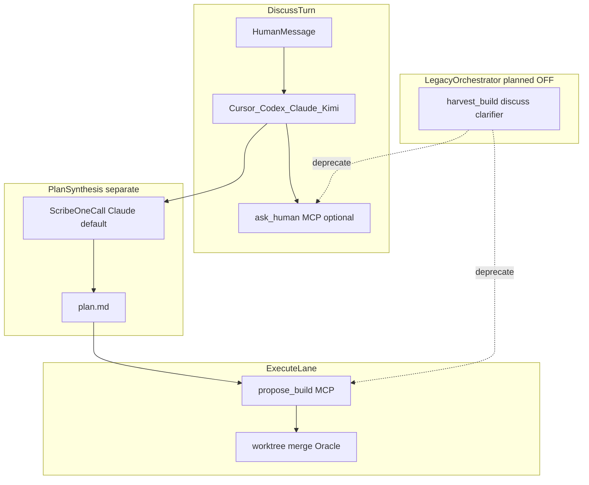

# MCP-first Human Inbox — 설계 방향

> **최종 업데이트:** 2026-06-26  
> **도구 스펙 (shipped):** [HUMAN-INBOX.md](./HUMAN-INBOX.md) · **Fast skip 트리거 표:** [05-room-agent-roles.md §Fast preset](./05-room-agent-roles.md) · **shipped 증거:** [EXTERNAL-REFS-TRACEABILITY.md](./EXTERNAL-REFS-TRACEABILITY.md)

이 문서는 Human gate가 **에이전트 MCP**(`ask_human` / `propose_build`)를 SSOT로 가는 **제품·아키텍처 방향**이다.  
Inbox API·MCP 계약·트리거 ID는 [HUMAN-INBOX.md](./HUMAN-INBOX.md)가 canonical이다.

---

## 1. 한 줄 포지션

| 원칙 | 내용 |
|------|------|
| **Human gate SSOT** | 선다형 질문·Build GO는 peer가 호출하는 **Inbox MCP**가 단일 진입점 |
| **Orchestrator harvest** | discuss 턴 종료 후 Python 파싱(`source=orchestrator`) — **레거시·축소 대상** |
| **전담 gate 에이전트 없음** | Codex/Claude/Cursor식 **역할 분담**으로 조율 (lead가 `ask_human` 주력) |
| **plan.md** | **Scribe 1-call** — Inbox harvest와 **별도 파이프라인** |

---

## 2. 현재 vs MCP-first 목표

| 경로 | 지금 | MCP-first 목표 | 구현 상태 |
|------|------|----------------|-----------|
| 선다형 질문 | harvest T-Q* + `ask_human` MCP | `ask_human` only | harvest: **off by default** · discuss MCP **on** (team lead; Fast 포함) |
| build GO 예고 | harvest T-B1 + `propose_build` MCP | `propose_build` only | harvest: **off by default** · legacy flag `AGENT_LAB_ORCHESTRATOR_INBOX_HARVEST=1` |
| `plan.md` | Scribe ([`room_plan_scribe.py`](../src/agent_lab/room_plan_scribe.py)) | 유지 | **shipped** |
| Facilitator | FORK→options (optional Claude 1-call) | 축소·lead가 options 작성 | **partial** |

---

## 3. 아키텍처



---

## 4. FAQ — 두 층이 겹쳐 보였던 이유

오늘 discuss Human gate에는 **세 층**이 공존한다.

| 층 | 메커니즘 | `source` / 진입 |
|----|----------|-----------------|
| **1. Orchestrator harvest** | 턴 종료 후 Python이 `plan.md`/transcript 파싱 | `source=orchestrator` |
| **2. Inbox MCP** | peer invoke 중 `ask_human`(선다형 **최소 2 options**) / `propose_build` | `source=mcp_*` |
| **3. Scribe** | peer가 아닌 별도 invoke — 3명 발화를 한 번에 합성 | `plan.md` only |

**코드 SSOT:** harvest [`inbox_harvest.py`](../src/agent_lab/inbox_harvest.py) · MCP [`inbox_mcp_server.py`](../src/agent_lab/inbox_mcp_server.py) · Scribe enrichment [`room_scribe_enrichment.py`](../src/agent_lab/room_scribe_enrichment.py)

### Q: 3명이 전부 MCP로 올리면 plan은?

- **Inbox** = peer gate (Human이 답하는 pending row)
- **plan** = Scribe가 resolved `[HUMAN-DECISION:]` + agent summaries로 **1-call** 작성
- 동시 3건 pending은 **정책 문제** — §6 single-flight (planned)

---

## 5. Fast preset (shipped)

Fast(`room_preset=fast` 또는 `user_mode=quick` + `plan_intent=none`)는 discuss lane에서 **orchestrator harvest**·plan CLARIFY inbox만 **스킵**한다.  
Team lead의 ``ask_human`` / ``propose_build`` MCP는 **유지**. Execute lane inbox MCP(GO)도 **유지**.

**판별 SSOT:** [`room_preset.is_fast_room_session`](../src/agent_lab/room_preset.py)

**트리거별 표·코드 경로:** [05-room-agent-roles.md §Fast preset — orchestrator Inbox skip](./05-room-agent-roles.md) (중복 서술 없이 여기서 위임)

**테스트:** [`tests/test_fast_inbox_skip.py`](../tests/test_fast_inbox_skip.py)

---

## 6. 3-agent MCP 조율 (shipped — Phase C)

전담 gate 에이전트 **없이** Codex/Claude/Cursor식 역할 분담:

| 역할 | discuss MCP |
|------|-------------|
| **Lead** (Codex 등) | `ask_human` 주력 |
| **Critic** (Claude) | objection/envelope; Human 필요 시 lead 위임 |
| **Cursor** | discuss MCP OFF; execute에서 `propose_build` |
| **Kimi Work** | peer; inbox gate owner만 |

**런타임 규칙 (shipped):**

- `has_pending_question` → 두 번째 `ask_human` 거부 — [`inbox_mcp_policy.enforce_mcp_ask_human_policy`](../src/agent_lab/inbox_mcp_policy.py)
- `inbox_gate_owner` — team lead가 `cursor`이면 `codex` → `claude` → `kimi_work` 폴백
- discuss MCP는 gate owner만 (`discuss_inbox_mcp_enabled(..., agent_id=)`)

**Supervisor 턴 순서 (target):**

```
R1 → R2 → pending ask? → pause → resolve → Scribe → lead propose_build
```

---

## 7. Orchestrator harvest 폐기 매핑 (planned)

| Legacy | MCP-first 대체 |
|--------|----------------|
| `harvest_build_proposal` | lead `propose_build` after Scribe |
| `harvest_discuss_questions` T-Q1/T-Q2 | lead `ask_human` from FORK/plan OPEN |
| `harvest_clarifier_questions` T-Q0 | clarity → lead ask or Scribe-only |
| Facilitator live | agent-written options + deterministic merge only |

**플래그 (Phase B shipped):** `AGENT_LAB_ORCHESTRATOR_INBOX_HARVEST` — default **`0`**. Legacy harvest: `=1`.

Discuss Build T-B* orchestrator surfacing은 MCP-first에서 **planned deprecation** — [HUMAN-INBOX.md §5.4](./HUMAN-INBOX.md).

---

## 8. 향후: Fast execute + plan-workflow

**가정 (오늘):** Fast는 discuss에서 `clarify → plan → execute` 오케스트레이션을 **쓰지 않는다**.

**향후:** execute lane만 plan CLARIFY MCP를 허용할 수 있다. 그때 `is_fast_room_session()`을 lane별로 **분리**해야 한다:

| 플래그 개념 | 의미 |
|-------------|------|
| `skip_discuss_*` | discuss harvest/MCP (현재 Fast) |
| `allow_execute_clarify_mcp` | execute plan-workflow CLARIFY (향후) |

**재검토 체크리스트 (4항):**

1. discuss harvest를 Fast에서 복구할지
2. execute lane inbox MCP 범위
3. Scribe 타이밍 vs execute CLARIFY
4. single-flight / lead-only 정책

상세: [FLOW.md §2.1](./FLOW.md)

---

## 9. 구현 로드맵 (Phase A–E)

| Phase | 내용 | 상태 |
|-------|------|------|
| **A** | Fast skip — `is_fast_room_session`, tests `test_fast_inbox_skip.py` | **shipped** |
| **B** | harvest flag OFF (default); supervisor discuss MCP ON | **shipped** |
| **C** | lead-only + single-flight guard | **shipped** |
| **D** | UI source badge (`mcp_*` vs `orchestrator`) | **shipped** |
| **E** | harvest test → MCP E2E migration | **shipped** (`tests/test_mcp_first_inbox.py`) |

---

## 10. 코드·테스트 SSOT

| Concern | File |
|---------|------|
| Fast gate | `room_preset.py`, `inbox_harvest.py`, `cursor_inbox_mcp.py`, `kimi_work_provider.py` |
| MCP tools | `inbox_mcp_server.py`, `kimi_work_inbox_bridge.py`, `inbox_mcp_policy.py` |
| Scribe / plan | `room_plan_scribe.py`, `room_scribe_enrichment.py`, `room_turn_meta.py` |
| Persist harvest call site | `room_session_persist.py` (~L433–453) |

---

## 관련 문서

| Doc | 역할 |
|-----|------|
| [HUMAN-INBOX.md](./HUMAN-INBOX.md) | Inbox RFC — API, MCP, 트리거 ID |
| [FLOW.md §2.1](./FLOW.md) | Fast vs Supervisor 플로우 가정 |
| [05-room-agent-roles.md §Fast preset](./05-room-agent-roles.md) | Fast skip 트리거 표 |
| [USER-GUIDE.md §6.2](./USER-GUIDE.md) | Composer preset + Inbox 한 줄 |
| [MCP-TOOL-CONTRACT.md](./MCP-TOOL-CONTRACT.md) | MCP 계약 |
