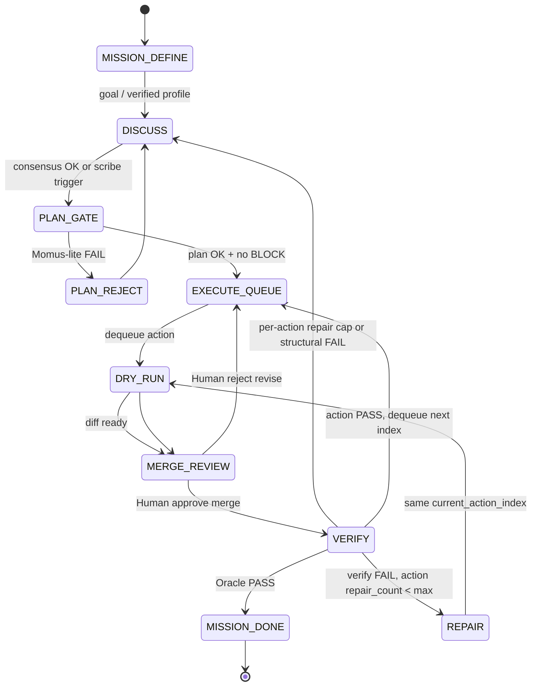

# Mission Loop — C안 + omo 레퍼런스

> **Status (2026-06-07):** **Backlog RFC** — 설계·로드맵만. 구현 큐는 [EXTERNAL-REFS-TRACEABILITY.md](./EXTERNAL-REFS-TRACEABILITY.md)에 티켓 추가 전.  
> **North star:** 복잡 작업을 **Discuss ↔ Execute ↔ Verify** 양방향 루프로 자동화. 단순 작업 fast path·3-agent 축소는 **범위 밖**.  
> **레퍼런스:** [Oh My OpenAgent (omo)](https://github.com/code-yeongyu/oh-my-openagent) — Planning / Orchestration / Workers 3층, `ulw-loop`, Momus plan gate, Atlas conductor, boulder/notepad.  
> **관련:** [EXTERNAL-REFS-PLAN.md](./EXTERNAL-REFS-PLAN.md) Layer 1–5 · [EXECUTE-WORKTREE-REFORM.md](./EXECUTE-WORKTREE-REFORM.md) · [GOAL-LOOP.md](./GOAL-LOOP.md) · [HUMAN-INBOX.md](./HUMAN-INBOX.md) · [PLUGIN-DISCOVERY.md](./PLUGIN-DISCOVERY.md) · [WORK-TAB-IA.md](./WORK-TAB-IA.md)

---

## 1. 한 줄 요약

```
Human 미션 정의
  → DISCUSS (Room 3-agent 합의·반론)
  → PLAN_GATE (scribe + Momus-lite 검증)
  → EXECUTE_QUEUE (worktree dry-run → Human merge gate)
  → VERIFY (action.verify + Oracle)
  → PASS → MISSION_DONE
  → FAIL → REPAIR (L3) 또는 DISCUSS 재진입 (C안 백엣지)
```

**omo에서 가져올 것:** 계획·실행 분리, 끝날 때까지 도는 conductor, plan OKAY/REJECT, wisdom 누적.  
**Agent Lab이 유지할 것:** BLOCK/CHALLENGE, provenance (`chat.jsonl#L`), worktree merge gate, 3-agent peer 토론.

---

## 2. C안 정의

| 방향 | 내용 |
|------|------|
| **Discuss → Execute** | 합의·plan이 `## 지금 실행` action 큐에 **자동 적재** (objection clear, plan gate PASS 후) |
| **Execute → Discuss** | verify/repair 한도 초과·구조적 실패 시 **미션 재진입** (R1 분해 턴 → plan 부분 갱신 → 재큐) |
| **종료 조건** | 에이전트 “완료” 주장이 아니라 **VERIFY Oracle PASS** (omo `ulw-loop` evidence audit) |

Discuss는 **read-only 유지** (말하면서 즉시 패치 X). 구현 연속성은 **큐 + worktree**로 확보.

---

## 3. 개발용 갭 6항목 — 반영 매트릭스

의도적 제외(**#6 단순 작업 3-agent 과잉 / fast path**)를 뺀 나머지.

| # | 갭 | Mission Loop 반영 | 트랙 · Phase |
|---|-----|-------------------|--------------|
| **1** | 단일 세션 implement 루프 | **우회版:** discuss와 execute를 Mission FSM으로 **한 미션 타임라인**에 연결. read-only discuss는 유지. | Phase 1–4 (Conductor) |
| **2** | 툴/MCP/skills 통합 | Mission Loop **병렬 필수** — execute/repair 품질 천장. | **Track B** (Plugin Phase B) |
| **3** | 컨텍스트 깊이 | notepad + mission state + (장기) per-dir `AGENTS.md`. layer 토글·Overview는 UI 트랙. | Phase 5 + **Track C** |
| **4** | 턴 안정성·중단·권한 UX | 구간 단위 미션으로 체감 완화; Stop·permission·partial turn은 UX 트랙. | Phase 1 UI + **Track D** |
| **5** | 검증·CI 연동 | **핵심.** `action.verify` + merge 후 Oracle + CI command를 MISSION_DONE 전제. | Phase 3–4 |
| ~~6~~ | ~~단순 작업 과잉~~ | **의도적 제외** — 본 RFC 범위 밖. | — |

---

## 4. omo ↔ Agent Lab 매핑

| omo | 역할 | Agent Lab 대응 (현재) | Mission Loop 목표 |
|-----|------|----------------------|-------------------|
| Prometheus + Metis + Momus | 인터뷰·갭·계획 검증 | Room + scribe + adversarial gate (약함) | **PLAN_GATE** — Momus-lite OKAY/REJECT |
| Atlas | conductor: 위임·검증·다음 태스크 | Human이 Work UI 클릭 | **Mission Conductor** (서버 FSM) |
| Sisyphus-Junior / workers | 패치·테스트 | Cursor execute, Codex repair | EXECUTE_QUEUE + L3 REPAIR |
| Oracle (omo) | 아키텍처 자문 | verified_loop / goal Oracle (mock-first) | **MISSION_DONE** 판정 (live opt-in) |
| `.sisyphus/plans`, boulder | 재개·상태 | `plan.md`, `run.json`, `completed_steps` | `mission_loop` + notepad |
| `ulw-loop` | 100% 될 때까지 | L3 + L5 (층별 분리) | **통합 Mission FSM** |
| Category routing | `deep` / `quick` … | cursor/codex/claude 고정 역할 | 턴 내 R1/R2 + (선택) category 메타 |
| LSP / built-in MCP | 실행 전 진단 | PLUGIN-DISCOVERY Phase A만 | **Track B** |

---

## 5. Mission Loop FSM

### 5.1 Phase (상태)



### 5.2 Human gate 밀도 (줄이되 없애지 않음)

| Gate | Human 행동 | 자동 구간 |
|------|------------|-----------|
| 미션 시작 | goal / verified profile 승인 | — |
| Plan gate REJECT 후 | (선택) 방향 한 줄 | auto DISCUSS 1–N 라운드 (상한) |
| Merge | diff 검토 approve/reject | dry-run ~ verify까지 |
| Inbox BLOCK / Build GO | 기존 Human Inbox | execute plan phase |
| MISSION_DONE | (선택) 최종 확인 | Oracle PASS 후 자동 종료 가능 |

omo Atlas는 merge를 Human이 안 하지만, Agent Lab은 **provenance·감사**를 위해 merge gate **유지**.

### 5.3 `run.json` — `mission_loop` (제안 스키마)

목표 텍스트는 **중복 저장하지 않음**. Conductor는 `read_run_meta()`에서 `verified_loop.loop_goal`을 읽는다 (실제 키 경로 — `approve_verified_loop()`가 씀):

```json
"verified_loop": {
  "loop_goal": {
    "text": "...",
    "completion_promise": "...",
    "criteria": "...",
    "approved_at": "ISO",
    "approved_by": "human"
  }
}
```

`mission_loop` 본문:

```json
{
  "mission_loop": {
    "enabled": true,
    "phase": "EXECUTE_QUEUE",
    "iteration": 2,
    "max_mission_iterations": 20,
    "pending_action_indices": [3, 4],
    "current_action_index": 3,
    "action_repair_counts": { "3": 1 },
    "max_repair_per_action": 2,
    "last_verify": { "status": "fail", "reason": "...", "at": "ISO", "action_index": 3 },
    "plan_gate": {
      "status": "ok",
      "momus_round": 1,
      "max_momus_rounds": 3,
      "last_reject_reason": null
    },
    "wisdom_refs": ["missions/<session_id>/learnings.md"],
    "autonomous_segment": {
      "active": true,
      "started_at": "ISO",
      "ends_on": ["merge_review", "circuit_breaker", "mission_done", "inbox_escalate"]
    },
    "circuit_breaker": false,
    "circuit_breaker_reason": null
  }
}
```

| 필드 | 기본값 | 의미 |
|------|--------|------|
| `max_momus_rounds` | `3` | PLAN_REJECT ↔ DISCUSS 자동 루프 상한 |
| `max_repair_per_action` | `2` | L3 `MAX_VERIFY_RETRIES`와 **동일** 유지 (`plan_execute.py`) |
| `max_mission_iterations` | `20` | 미션 전체 iteration 상한 (verified_loop `max_iterations`=100과 별도) |

기존 키와 병합: `verified_loop`, `goal_loop`, `completed_steps`, `human_inbox[]`.

### 5.4 REPAIR → DRY_RUN 재시도 정책

**원칙:** verify가 PASS할 때까지 **같은 `current_action_index`** 를 유지한다. 큐에서 다음 action으로 넘어가는 유일한 조건은 해당 action의 merge 후 verify **PASS**.

| 이벤트 | `current_action_index` | `pending_action_indices` | `action_repair_counts` |
|--------|------------------------|--------------------------|------------------------|
| VERIFY FAIL, repair 여유 | **유지** | 유지 | `{index}++` |
| REPAIR 완료 → DRY_RUN | **유지** | 유지 | 유지 |
| VERIFY PASS | — (dequeue) | head 제거 | 해당 key 삭제 또는 0 |
| VERIFY FAIL, `repair_count ≥ max_repair_per_action` | 유지 | 유지 | — → **DISCUSS** 전이 |
| MERGE_REVIEW Human **reject** | **유지** | 유지 | 유지 → PLAN_GATE 또는 DISCUSS (revise 경로) |
| structural FAIL (merge conflict, worktree fail closed) | — | — | → **DISCUSS** 즉시 |

구현 앵커: `plan_execute.reverify_merged_execution()` — action 단위 repair; Mission Conductor가 전이만 오케스트레이션.

**스킵 정책:** 자동 스킵 **금지**. action을 건너뛰려면 Human이 plan에서 action을 제거하거나 Inbox에서 “skip action N”을 명시적으로 resolve.

### 5.5 `circuit_breaker` — 활성화 조건과 이후 행동

`circuit_breaker: true` 가 되는 조건 (하나라도 해당):

| # | 조건 | `circuit_breaker_reason` 예 |
|---|------|---------------------------|
| 1 | `plan_gate.momus_round >= max_momus_rounds` 이고 status ≠ `ok` | `momus_round_cap` |
| 2 | 어떤 action이든 `action_repair_counts[i] >= max_repair_per_action` 후에도 verify FAIL이 **structural**로 분류 | `repair_cap_action_{i}` |
| 3 | `mission_loop.iteration >= max_mission_iterations` | `mission_iteration_cap` |
| 4 | `verified_loop.circuit_breaker` (기존 Layer 5) | `verified_loop` (위임) |

**`circuit_breaker: true` 이후:**

1. `phase` → `MISSION_PAUSED` (또는 현재 phase 유지 + `circuit_breaker` 플래그만)
2. **자동 전이 중단** — Conductor가 DISCUSS/EXECUTE/REPAIR를 스스로 시작하지 않음
3. `human_inbox[]`에 `kind: mission_circuit_break` 항목 생성 (요약 + 다음 선택지)
4. Human resolve 후: `circuit_breaker` clear + phase를 DISCUSS 또는 EXECUTE_QUEUE로 **명시적** 재개

verified_loop 패턴 참고: `verified_loop.py` — `iteration > max_iterations` 시 `_circuit_break()`.

---

## 6. 구현 Phase (Mission Loop 본선)

### Phase 0 — MISSION_DEFINE (기존 모듈 브리지)

FSM 첫 상태. **신규 LLM 역할 없음** — 아래 shipped 경로를 Conductor가 읽기만 한다.

| 진입 | 모듈 · API |
|------|------------|
| Verified profile 턴 | `verified_loop`: `proposing` → `pending_approval` → Human `approve_verified_loop()` |
| Goal only | `goal_loop` + `PATCH /api/sessions/{id}/goal` ([GOAL-LOOP.md](./GOAL-LOOP.md)) |
| Mission loop 활성 | `mission_loop.enabled: true` — verified approve 직후 또는 env `AGENT_LAB_MISSION_LOOP=1` |

**전이:** `MISSION_DEFINE` → `DISCUSS` when `verified_loop.status == "running"` (또는 goal_loop open + mission enabled).

Conductor Phase 1 구현 시 **Phase 0는 어댑터만** (`mission_loop.phase` 초기화 + `verified_loop.loop_goal` 존재 검사).

---

### Phase 1 — Mission Conductor (omo Atlas)

**목표:** 층별 Loop를 **한 FSM**으로 오케스트레이션.

| 항목 | 내용 |
|------|------|
| 모듈 | `src/agent_lab/mission_loop.py` (신규), `continue_room_round` / `plan_execute` 훅 |
| 전이 | discuss 종료 조건 → scribe 트리거 → phase 갱신 |
| UI | Work **Mission bar** — phase · next action · verify (WORK-TAB-IA 5단계와 정렬) |
| API | `GET/PATCH /api/sessions/{id}/mission-loop` (선택) |
| AC | mock 세션에서 DISCUSS → PLAN_GATE → EXECUTE_QUEUE 전이 pytest |

**갭 반영:** #1 (타임라인 연속), #4 (구간 가시성).

---

### Phase 2 — Plan gate (omo Momus-lite)

**목표:** execute 큐 적재 **전** 기계적 검증.

| 검사 | Momus 기준 대응 |
|------|-----------------|
| 파일/경로 ref | plan action에 구현 위치 명시 |
| acceptance / verify | `검증:` 필드 구체성 (명령·테스트·출력) |
| context | provenance ref 또는 workspace root |
| red flags | adversarial_gate + BLOCK 연동 |

| REJECT 시 | auto DISCUSS 1라운드, `plan_gate.momus_round++` |
| 상한 | `momus_round >= max_momus_rounds` (기본 3) → `circuit_breaker` + Human Inbox `plan_gate_exhausted` |

**갭 반영:** #1 (합의→실행 핸드오프), #5 (verify 필드 강제).

**기존 코드 확장:** `adversarial_gate.py`, `plan_execute` gate snapshot, `inbox_harvest.py`.

---

### Phase 3 — Execute 자동 큐 + CI verify

**목표:** Atlas delegate — action 순차 dry-run, Human은 merge만.

| 항목 | 내용 |
|------|------|
| 큐 | `## 지금 실행` → `pending_action_indices` dequeue |
| 격리 | 기존 worktree path ([EXECUTE-WORKTREE-REFORM](./EXECUTE-WORKTREE-REFORM.md)) |
| L3 | `reverify_merged_execution()` — conductor가 FAIL 시 자동 REPAIR 트리거 |
| CI | action.verify 기본 템플릿: `make test` / 프로젝트 `AGENT_LAB_VERIFY_CMD` / plan literal |
| merge 전 | (선택) dry-run 후 verify command in worktree — merge 전 1차 |
| REPAIR | §5.4 — 같은 `current_action_index`로 DRY_RUN 재진입 |
| Wisdom | `wisdom_refs` → execute/repair 프롬프트 (`plan_execute` hook); Phase 5 전에는 stub OK |

**Track B 없을 때 (degraded mode):** Mission Loop **최소 동작 허용**. `action.verify`는 shell/`make test`/plan literal만으로 Oracle 실행. MCP·skills 없이도 큐·merge·repair·verify FSM은 동작. 품질만 낮음 — blocking 의존 아님.

**갭 반영:** #5 (검증·CI 루프), #1 (execute 연속).

**기존 코드:** `plan_execute.py`, `plan_execute_merge.py`, `PlanExecutePanel.tsx`.

---

### Phase 4 — Verify → Discuss 백엣지 (C안 + ulw-loop)

**목표:** 검증 실패가 **미션 재진입**.

```
VERIFY FAIL
  → repair_count < MAX → REPAIR (L3)
  → repair_count ≥ MAX 또는 structural → DISCUSS
       → R1 specialist round (Codex + Claude, Cursor optional)
       → scribe partial plan update
       → PLAN_GATE (Momus-lite)
       → EXECUTE_QUEUE
```

| Oracle | mock 기본 유지; `AGENT_LAB_GOAL_ORACLE_LIVE=1` / verified profile에서 live |
| 종료 | **유일** MISSION_DONE = Oracle PASS + open BLOCK 없음 + inbox critical clear |
| Wisdom | DISCUSS 재진입 시 `room_context` context bundle에 `wisdom_refs` 요약 포함 (§6 Phase 5 hook) |

**Wisdom 주입 hook (구현 위치):**

| Phase | Hook | 파일 |
|-------|------|------|
| DISCUSS / PLAN_REJECT | context bundle append | `room_context.py` — `build_context_bundle()` |
| DRY_RUN / REPAIR | execute agent system/user | `plan_execute.py` — `_call_execute_agent`, `_call_repair_agent` |
| Guidance cap | workspace 주입 | `session_guidance.py` — 기존 1500자 cap 내 `[Mission wisdom]` 블록 |

**갭 반영:** #5, C안 백엣지.

**기존 코드:** `verified_loop.py`, `goal_loop.py`, `room` specialist rounds.

---

### Phase 5 — Wisdom / notepad (omo `.sisyphus/notepads`)

**목표:** 이터레이션 간 학습 누적 — 같은 실수 반복 방지.

| 경로 | `.agent-lab/missions/<session_id>/` |
|------|-------------------------------------|
| `learnings.md` | conventions, successes, gotchas |
| `verification.md` | verify/repair outcomes |
| `decisions.md` | Human + agent architectural choices |

주입: 다음 execute/repair/discuss 프롬프트 + `session_guidance` cap 내 요약.  
provenance: 항목마다 `chat.jsonl#L` / `plan (ref: Ln)` 링크.

**갭 반영:** #3 (부분 — 미션 메모리).

---

## 7. 병렬 트랙 (Mission Loop 필수 의존)

Mission Loop만으로 닫히지 않는 갭 — **동시에 또는 직후** 진행.

### Track B — 툴 / MCP / skills (#2)

[PLUGIN-DISCOVERY.md](./PLUGIN-DISCOVERY.md) Phase B.

| 항목 | 내용 |
|------|------|
| Claude | `--mcp-config`, skills `/skill-name`, session allowlist |
| Codex | `config_overrides` + plugin overlay |
| Cursor | inbox MCP 확장 + bridge MCP 가시성 |
| UI | Settings 또는 Work — 세션 plugin allowlist |
| Mission 연동 | EXECUTE_QUEUE / REPAIR 시 allowlisted 도구만; PLAN_GATE에서 “필요 MCP 명시” |

**없으면:** Mission Loop가 돌아도 execute 품질 천장이 낮음.

---

### Track C — 컨텍스트 깊이 (#3)

| 항목 | 내용 |
|------|------|
| Overview | Inspector — goal · mission phase · next action · open BLOCK (UI-MIGRATION-GAPS §2.1) |
| Context layers | 토글 API + Settings/Work UI ([USER-GUIDE](./USER-GUIDE.md) §27 gap) |
| Per-dir memory | LazyCodex `/init-deep` 스타일 계층 `AGENTS.md` (TRACEABILITY: per-dir **미구현**) |
| Navigation | artifact · plan ref → 파일 jump (기존 provenance 확장) |

**Mission 연동:** DISCUSS/PLAN_GATE 컨텍스트 번들 정책을 phase별로 다르게 (F2 slimming 확장).

---

### Track D — 턴 안정성 · 중단 · 권한 UX (#4)

| 항목 | 내용 |
|------|------|
| Stop | ⌘. global cancel → mission phase `paused` + subprocess terminate |
| Permission | `AgentPermissionAlert` bypass 제거 또는 mission 단위 “이번 구간 기본값” |
| Partial turn | R-P0 shipped — mission_loop에 `last_partial` 복구 포인트 기록 |
| Long run | mission iteration cap + circuit_breaker (verified_loop 패턴 재사용) |

**Mission 연동:** MERGE_REVIEW / DRY_RUN 중 cancel 시 worktree 정리 + phase 롤백 규칙.

---

## 8. 기존 Loop 계층과의 관계

[EXTERNAL-REFS-PLAN.md](./EXTERNAL-REFS-PLAN.md) Layer 1–5는 **유지**. Mission Loop는 **Layer 6 (Mission Orchestration)** 로 층을 묶는다.

```
Layer 6: Mission Loop (본 RFC)
  ├─ L1 CLI retry      (그대로)
  ├─ L2 consensus      (DISCUSS 내부)
  ├─ L3 execute verify (VERIFY / REPAIR)
  ├─ L4 adversarial    (PLAN_GATE 입력)
  └─ L5 goal/verified  (MISSION_DEFINE / MISSION_DONE)
```

---

## 9. UI 정렬 (Work tab)

[WORK-TAB-IA.md](./WORK-TAB-IA.md) 5단계 stepper와 Mission phase 매핑:

| Work stepper | Mission phase |
|--------------|---------------|
| PlanDraft | MISSION_DEFINE, DISCUSS |
| ReviewNeeded | PLAN_GATE, PLAN_REJECT |
| ExecutePending | EXECUTE_QUEUE, DRY_RUN |
| MergeVerify | MERGE_REVIEW, VERIFY, REPAIR |
| Done | MISSION_DONE |

`resolveWorkPhase()` 3상태 → mission_loop 기반 5상태 확장 (USER-GUIDE §27 gap 해소).

---

## 10. 수용 기준 (전체)

**M-C1 — Discuss → Execute**

- [ ] Room 합의 후 scribe → plan gate PASS → `pending_action_indices` 자동 채움
- [ ] open BLOCK 시 EXECUTE_QUEUE 진입 409

**M-C2 — Execute → Discuss**

- [ ] verify FAIL + repair cap → DISCUSS 전이 + R1 round 자동
- [ ] scribe partial update → 재큐 without Human “한 턴 더” 클릭 (mission 승인 구간 내)

**M-C3 — Verify / CI**

- [ ] merge 후 `action.verify` Oracle FAIL → REPAIR 자동 1회 이상
- [ ] MISSION_DONE은 Oracle PASS만

**M-C4 — 상태·재개**

- [ ] `mission_loop` + notepad로 세션 재시작 후 phase 복구
- [ ] Mission bar에 phase/next action 표시

**M-B/C/D (병렬)**

- [ ] Track B: 최소 1 agent에 session MCP allowlist pass-through
- [ ] Track C: Overview 또는 context layer 토글 1종
- [ ] Track D: mission 구간 cancel → safe pause

---

## 11. 구현 순서 (권장)

```
Phase 2 Plan gate  ─┐
Phase 1 Conductor   ├─→ Phase 3 Execute+CI ─→ Phase 4 Verify 백엣지
Track B (MCP)      ─┘         ↑
Phase 5 Notepad               │
Track C Overview (최소) ──────┘
Track D Stop/pause (Phase 3와 병렬)
```

omo도 **plan 견고 → Atlas 실행** 순. Agent Lab은 **Momus-lite → Conductor → C 백엣지**.

---

## 12. 하지 말 것 (범위 통제)

- 단순 작업용 fast path · 1-agent-only mode (의도적 제외)
- Discuss read-only 해제 (말하면서 패치) — execute gate 철학과 충돌
- merge Human gate 제거 — provenance·감사 유지
- execute gate 우회 — 아키텍처 불변 ([CLAUDE.md](../CLAUDE.md))
- live Oracle CI 필수화 — mock-first 유지, live opt-in

---

## 13. 추적

| 티켓 ID (제안) | 내용 | TRACEABILITY 등록 |
|----------------|------|-------------------|
| ML-C-omo | 본 RFC 전체 | 구현 시작 시 `EXTERNAL-REFS-TRACEABILITY.md`에 추가 |
| ML-P1 | Mission Conductor | |
| ML-P2 | Plan gate Momus-lite | |
| ML-P3 | Execute queue + CI verify | |
| ML-P4 | Verify → Discuss | |
| ML-P5 | Wisdom notepad | |
| ML-TB | Plugin Phase B | PLUGIN-DISCOVERY |
| ML-TC | Context Overview/layers | UI-MIGRATION-GAPS |
| ML-TD | Stop / permission / pause | USER-GUIDE §27 |

---

## 변경 이력

| 날짜 | 내용 |
|------|------|
| 2026-06-07 | 초안 — C안, omo 매핑, 갭 1–5 반영, Track B/C/D, Phase 1–5 |
