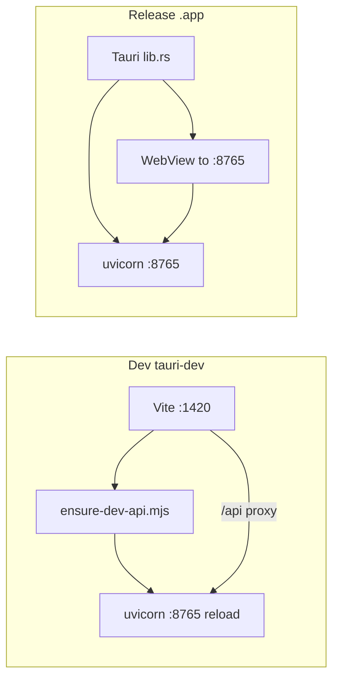

# Packaging baseline — pre hybrid Rust work

> **목적:** Python core + Tauri sidecar + (미래) selective PyO3 작업 **시작 전** 스냅샷.  
> 문제 발생 시 이 커밋/태그로 돌아와 parity·packaging·dev lifecycle을 비교한다.

**Baseline tag:** `baseline/pre-hybrid-rust-2026-06-28`  
**Baseline doc commit:** `9a1c7d48`  
**Parent code commit (dev API lifecycle):** `09e03c73` — `fix(dev): auto-manage API lifecycle and close hygiene gaps`

### 문서 충돌 시 원칙

| 구분 | 처리 |
|------|------|
| **Frozen @ tag** (아래 §) | 태그 시점의 pytest/smoke 수·known failures — **역사 기록**, 덮어쓰지 않음 |
| **Living SSOT** (아래 §) | Tier-1 docs·코드·`make test-fast` — **현재 버전으로 갱신** |
| **Archive / handoff RFC** | 본문·AC 유지; 상단 **경로 매핑** 배너만 추가 |
| **제품 불변식** | BLOCK→409, worktree, Oracle, Human gate — 초기/현재 관계없이 유지 |

---

## Living SSOT (현재 구조 — baseline 이후 갱신)

Tier-1 문서·에이전트 가이드는 아래를 canonical로 둔다. hybrid 작업 중 표현이 어긋나면 **이 절 + code**가 우선.

| 항목 | 현재 (2026-06-28+) |
|------|---------------------|
| Room facade | `src/agent_lab/room/__init__.py` (`import agent_lab.room`) — root `room.py` **삭제됨** |
| Room modules | `src/agent_lab/room/*.py` + root `room_*.py` **shim** (legacy import 호환) |
| Plan | `src/agent_lab/plan/` 패키지 |
| `make test-fast` | ~2130 tests (`not live and not integration`) |
| Smoke | `python scripts/smoke_room.py` → **37** regression baselines |
| Tauri dev API | `ensure-dev-api.mjs` + `AGENT_LAB_SKIP_TAURI_API=1` — Rust spawn **아님** |
| Tauri dev UI | Vite **:1420** + `/api` proxy |
| Browser dev | `make dev` — Vite **:5173** + proxy |

**경로 매핑 (구 표현 → 현재):**

| 구 문서 | 현재 |
|---------|------|
| `room.py` | `agent_lab.room` / `room/turn_flow.py` |
| `room_consensus.py` | `room/consensus.py` (shim: `room_consensus.py`) |
| `room_team_orchestration.py` | `room/team_orchestration.py` |
| `plan_execute*.py` (flat) | `plan/execute*.py` |

---

## 이 baseline으로 돌아오기

```bash
cd ~/Projects/agent-lab

# 방법 1 — annotated tag (권장)
git fetch --tags origin   # remote에 push한 경우
git checkout baseline/pre-hybrid-rust-2026-06-28

# 방법 2 — 코드만 (baseline 문서 없이)
git checkout 09e03c73

# 방법 3 — hybrid 작업 브랜치에서 비교
git diff baseline/pre-hybrid-rust-2026-06-28...HEAD -- web/src-tauri/ docs/
```

**새 브랜치에서 실험:**

```bash
git checkout -b experiment/hybrid-rust baseline/pre-hybrid-rust-2026-06-28
```

**되돌릴 때 확인:**

```bash
git rev-parse HEAD
git describe --tags --always
make test-fast
python scripts/smoke_room.py
make tauri-dev   # 또는 make dev
```

---

## 아키텍처 스냅샷 (2026-06-28)

### SSOT

| 계층 | 경로 | 역할 |
|------|------|------|
| Room / plan / mission | `src/agent_lab/` (Python) | 제품 불변식 — 합의·격리·Oracle·Human gate |
| API | `app/server/` (FastAPI, :8765) | REST + SSE |
| UI | `web/src/` (React 18 + Vite) | Mission OS console |
| Desktop shell | `web/src-tauri/` (Rust, Tauri 2) | 창 + uvicorn spawn/supervise |

**PyO3 / native extension:** 없음. Rust는 Tauri shell만.

### IPC 모델 (현재)

- **Primary bus:** HTTP `127.0.0.1:8765` (`web/src/api/client.ts`)
- **Tauri plugins:** dialog, notification, opener (custom `invoke` command 없음)
- **Dev API owner:** Vite plugin → `web/scripts/ensure-dev-api.mjs` (`AGENT_LAB_SKIP_TAURI_API=1`)
- **Prod API owner:** `web/src-tauri/src/lib.rs` → `start_api()` + 4s supervisor loop



### Dev vs prod

| Mode | 명령 | API owner | UI origin |
|------|------|-----------|-----------|
| Browser dev | `make dev` | `scripts/dev.sh` | `:5173` + proxy |
| Tauri dev | `make tauri-dev` | `ensure-dev-api.mjs` | `:1420` + proxy |
| Release | `make tauri-build` | `lib.rs` supervisor | webview → `:8765` |
| API only | `make prod` | manual uvicorn | StaticFiles from API |

### 핵심 파일

| 파일 | 내용 |
|------|------|
| [`web/src-tauri/src/lib.rs`](../web/src-tauri/src/lib.rs) | spawn, health, supervisor, prod navigation |
| [`web/scripts/ensure-dev-api.mjs`](../web/scripts/ensure-dev-api.mjs) | dev watchdog, port reclaim, reload grace |
| [`web/vite.config.ts`](../web/vite.config.ts) | `await ensureDevApi()`, `/api` proxy |
| [`web/scripts/tauri-dev.sh`](../web/scripts/tauri-dev.sh) | stale :8765 cleanup, `SKIP_TAURI_API` |
| [`scripts/prepare_bundled_runtime.sh`](../scripts/prepare_bundled_runtime.sh) | `.app` bundled venv |
| [`app/server/main.py`](../app/server/main.py) | StaticFiles + routers |
| [`docs/APP.md`](./APP.md) | Desktop install / config paths |

### Env / 플래그 (packaging)

| Variable | 의미 |
|----------|------|
| `AGENT_LAB_SKIP_TAURI_API=1` | Tauri가 API spawn 안 함 — dev에서 Vite/Node가 소유 |
| `AGENT_LAB_ROOT` | Repo or bundled `runtime/` root |
| `AGENT_LAB_PYTHON` | Override Python binary |
| `VITE_SKIP_API=1` | Browser dev: Vite가 API spawn 안 함 |
| `VITE_API_PROXY_TARGET` | Proxy upstream (default `http://127.0.0.1:8765`) |

---

## 검증 체크리스트 (baseline 시점)

| Check | 명령 | baseline 기대 |
|-------|------|---------------|
| Fast tests | `make test-fast` | 2108 passed, **3 known failures** (아래) |
| Smoke | `python scripts/smoke_room.py` | 36 baselines green |
| Structure | `make structure-metrics-check` | **drift** (room package refactor 진행 중) |
| Dev desktop | `make tauri-dev` | API auto-start, proxy OK |
| Dev browser | `make dev` | :5173 + :8765 |

### Known failures @ baseline (수정 전 hybrid 착수 OK)

hybrid 작업과 **무관** — room/package refactor·UI contract drift. 돌아온 뒤 회귀면 이 3개부터 확인:

1. `tests/test_integration_registry.py::test_fast_bucket_collection_budget`
2. `tests/test_structure_metrics.py::test_structure_metrics_check_passes` — `tests/fixtures/structure-metrics-baseline.json` 미동기
3. `tests/test_workspace_ui_contract.py::test_phase0_composer_plan_toggle_beside_turn_picker`

---

## Hybrid work (see ADR)

Rollout plan: **[HYBRID-RUST-PYTHON-ADR.md](./HYBRID-RUST-PYTHON-ADR.md)** — Track 1 packaging **proceed**; Track 2 native **conditional** (profile gate).

### Track 1 — shipped (Phase 1.2–1.3)

- Tauri `invoke`: **`api_restart`**, **`api_shell_status`** (incl. `sessions_dir_mismatch`)
- [`ApiDiagnosticsBar.tsx`](../web/src/components/ApiDiagnosticsBar.tsx) — **API 재시작**, mismatch hint
- Release API spawn failure — native dialog
- Cross-platform port reclaim — [`port_reclaim.rs`](../web/src-tauri/src/port_reclaim.rs)
- `make tauri-check-windows` — Windows compile check

### Track 2 — gated (not scheduled)

Opens only if profile shows native candidates ≥ **N%** of mock-turn/context-build time **and** Windows path verified. Steps: **profile → Python seam extract → optional dev-only PyO3 POC** (`syntax_gate` before `repo_map`).

### Permanent non-goals

- Room / plan_execute Rust rewrite
- UDS IPC, Tauri `externalBin`, bundled maturin until separate release gate
- `api_status` duplicating `/api/diagnostics`

### Already shipped (baseline — do not redo)

- [`ApiDiagnosticsBar.tsx`](../web/src/components/ApiDiagnosticsBar.tsx) HTTP diagnostics + **Tauri API 재시작** (release)
- `lib.rs` `api_restart` / `api_shell_status` invoke
- `lib.rs` `api_health_sessions_dir()` mismatch **log**
- Dev API supervisor [`ensure-dev-api.mjs`](../web/scripts/ensure-dev-api.mjs)

---

## Room 코어 상태 @ tag (frozen)

- Tag 시점: `room/` 패키지 + root shim 전환 **완료**, `room.py` 삭제
- 불변식: BLOCK→409, worktree 격리, Oracle verify, Human inbox — **Python SSOT**
- **현재 레이아웃:** 위 Living SSOT · [`ROOM-PACKAGE-REFACTOR-DESIGN.md`](./ROOM-PACKAGE-REFACTOR-DESIGN.md) status banner

---

## 문제 발생 시 디버그 순서

1. **API :8765** — `curl -s http://127.0.0.1:8765/api/health | head`
2. **Dev owner** — `echo $AGENT_LAB_SKIP_TAURI_API`; Tauri dev면 `1` 기대
3. **Port conflict** — `lsof -i tcp:8765` (macOS)
4. **Boot log** — `~/Library/Logs/Agent Lab/agent-lab-api.log`
5. **Supervisor loop** — dev: `ensure-dev-api.mjs` watchdog; prod: `lib.rs` 4s interval
6. **Mixed content** — release webview는 `:8765` origin으로 navigate (`navigate_main_to_api_origin`)

---

## 관련 문서

| 문서 | 용도 |
|------|------|
| [ARCHITECTURE.md §6.5](./ARCHITECTURE.md) | Desktop 요약 |
| [APP.md](./APP.md) | `.app` 빌드·설정 |
| [STABILITY.md](./STABILITY.md) | smoke / regression |

**규칙:** hybrid PR은 이 baseline 대비 **무엇이 바뀌었는지** PR 본문에 적고, Room pytest + smoke green을 gate로 둔다.
