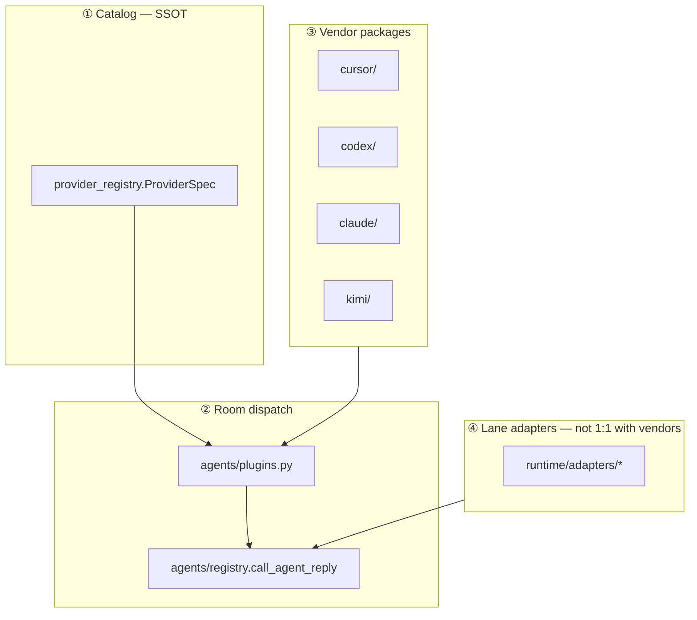

# Provider lane design

Design for vendor packages (`cursor/`, `codex/`, `claude/`, `kimi/`) and Room dispatch. Complements [RUNTIME-HARNESS-PLAN.md](./RUNTIME-HARNESS-PLAN.md) (lane orchestration) and [GJC-ENTRY.md](./GJC-ENTRY.md) (external GJC handoff).

## Principles (from GJC / Harness / Fugu synthesis)

| External ref | What it optimizes | Agent Lab mapping |
|--------------|-------------------|-------------------|
| **Gajae Code** | Skill + artifact + external CLI | `runtime/external_runner` + handoff; **not** absorbed as monolith |
| **Harness** | Team topology catalog | `room/preset`, `topic_router`, `role_plan` — data, not new presets |
| **Fugu** | Model pool + routing | `provider_registry` + `agents/plugins.py` dispatch table |

## Four layers (orthogonal)



## Vendor package layout

| Package | Modules | Role |
|---------|---------|------|
| `cursor/` | `bridge`, `registry`, `activity`, `inbox_mcp`, `provider` | Cursor SDK + inbox MCP + Room `respond()` |
| `codex/` | `cli`, `oauth`, `provider` | Codex CLI subprocess + profile slots |
| `claude/` | `cli`, `provider` | Claude CLI subprocess |
| `kimi/` | `provider`, `work_provider`, … | API + Kimi Work WS peer |
| `local/` | `provider` | Ollama / OpenAI-compatible floor provider |

**Not** a monolithic `bridges/` folder. Shared stream parsing lives in `agent/stream_parser.py` (cross-vendor utility).

## Adding a new provider

1. **`provider_registry.py`** — add `ProviderSpec` (auth, scribe_priority, login argv).
2. **`<vendor>/provider.py`** — implement `is_available()`, `model_label()`, `respond(...)`.
3. **`agents/plugins.py`** — register one `AgentPlugin` row (dict lookup, no if/elif in registry).
4. **`agent/health.py`** — probe hook if non-trivial transport.
5. Optional **`runtime/adapters/`** — only when execute/discuss lane needs typed invoke (lane ≠ vendor).

Kimi Work precedent: `auth_kind: peer`, WS transport in `kimi/work_provider.py`, not a “bridge” package.

## Room-facing shims

`agents/cursor_agent.py` (and codex/claude) remain thin re-exports of `<vendor>.provider` for tests and legacy monkeypatch paths. Prefer `agent_lab.cursor.provider` in new code.

## GJC rule

Full GJC pipeline (`gjc ralplan`, ultragoal, team) stays **external** via `runtime/external_runner` + `external_handoff`. In-app FSM: `plan/workflow`, `mission/loop`. Do not merge GJC subprocess into vendor packages.

## Harness rule

Team patterns = **data** in existing modules:

- Expert pool → `topic_router.py`
- Producer-reviewer → `role_plan.py`, `verified_loop`
- Supervisor → `room/preset` (loop), `room/consensus_rounds`

Do not add new Room presets for Harness patterns.

## Tooling

```bash
python scripts/migrate_vendor_packages.py   # one-shot move (already run)
make audit-vendor-imports                   # no cursor_*/codex_*/claude_* root imports
make typecheck-cursor-ratchet
make typecheck-codex-ratchet
make typecheck-claude-ratchet
```

Strict mypy overrides: `pyproject.toml` `agent_lab.cursor.*`, `agent_lab.codex.*`, `agent_lab.claude.*`.

## Related docs

- [STRUCTURE-REFACTOR-HISTORY.md §Room](./archive/STRUCTURE-REFACTOR-HISTORY.md#room)
- [STRUCTURE-METRICS.md](./STRUCTURE-METRICS.md)
- [GJC-ENTRY.md](./GJC-ENTRY.md)
