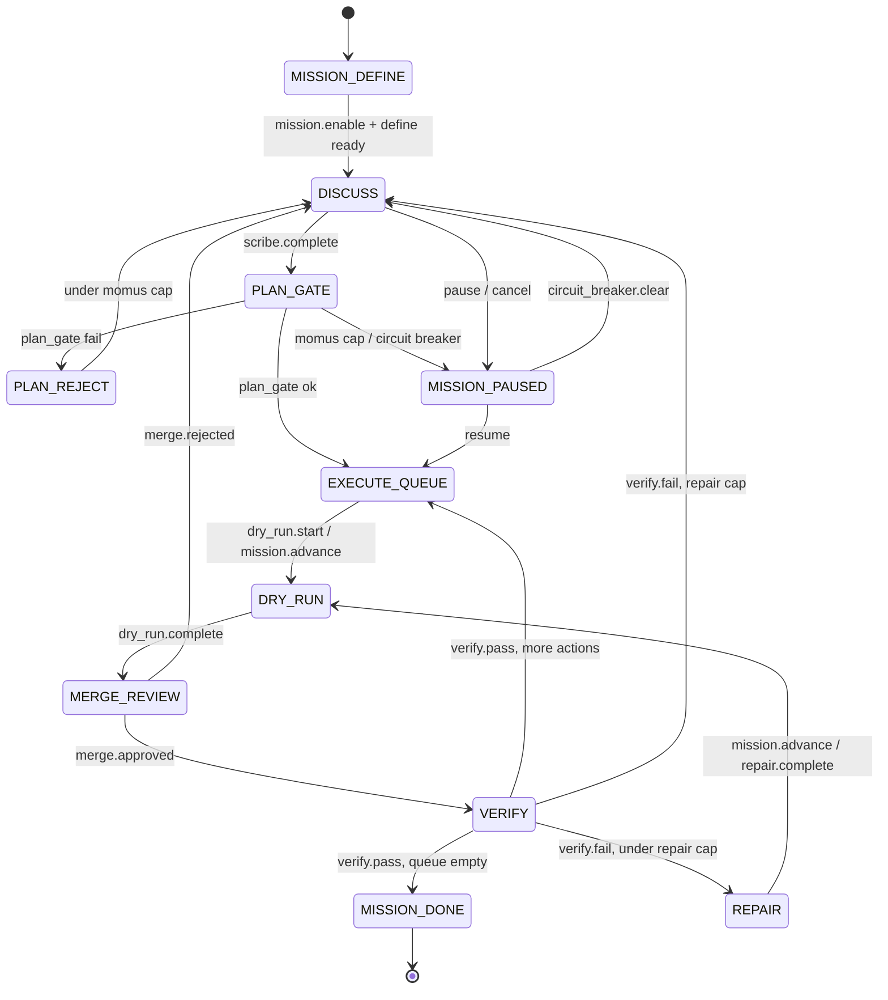

# Runtime Harness — unified orchestration plan

> **Status (2026-06-09):** **H0–H7 shipped** — unified runtime harness complete (external runner opt-in).  
> **Next:** production dogfood / UI allowlist polish (optional).  
> **Related:** [MISSION-LOOP-C-OMO.md](./MISSION-LOOP-C-OMO.md) · [USER-GUIDE.md](./USER-GUIDE.md) · [HUMAN-INBOX.md](./HUMAN-INBOX.md)

---

## 1. Problem

Agent Lab already implements harness **behaviors** (Room, execute gates, Mission FSM, Oracle, Inbox) but orchestration is **split across modules**:

| Module | Role today |
|--------|------------|
| `room.py` | Discuss turn pipeline |
| `plan_execute.py` | Worktree dry-run / merge / verify |
| `mission_loop.py` | Mission FSM conductor (closest to “Atlas”) |
| `human_inbox.py` | Human decisions (execute MCP + partial discuss) |
| `room/hooks.py` | Policy hooks |

Cross-lane **direct imports** (especially `plan_execute` ↔ `mission_loop`) make a single runtime entry point hard to reason about and test.

**Goal:** Introduce `AgentLabRuntime` as the sole orchestrator while preserving architectural invariants (Human gate, BLOCK→409, worktree isolation, Oracle verified).

---

## 2. H0 deliverables (this phase)

| Artifact | Path |
|----------|------|
| Phase vocabulary | `src/agent_lab/runtime/phases.py` |
| Event catalog | `src/agent_lab/runtime/events.py` |
| Transition table | `src/agent_lab/runtime/transitions.py` |
| Import graph | `src/agent_lab/runtime/import_graph.py` |
| **Runtime snapshot (H1)** | `src/agent_lab/runtime/snapshot.py`, `work_phase.py` |
| **API** | `GET /api/sessions/{id}/runtime` — `app/server/routers/runtime.py` |
| Contract tests | `tests/test_runtime_transition_table.py`, `tests/test_runtime_snapshot.py` |
| Import audit | `scripts/audit_runtime_imports.py` |

Run:

```bash
pytest tests/test_runtime_transition_table.py -q
python scripts/audit_runtime_imports.py
python scripts/audit_runtime_imports.py --strict
```

---

## 3. Session modes

| Mode | Condition | Phase writes |
|------|-----------|--------------|
| **standalone** | `mission_loop.enabled == false` | None — Room + manual execute only |
| **mission** | `mission_loop.enabled == true` | `run.json` → `mission_loop.phase` |

Standalone sessions still emit runtime **events** (turn, dry-run, merge) but do not traverse the Mission FSM.

---

## 4. Mission FSM phases



Canonical rows: `src/agent_lab/runtime/transitions.py` (`TRANSITION_TABLE`).

---

## 5. Event catalog (summary)

| Lane | Events |
|------|--------|
| **Discuss** | `turn.start`, `turn.complete`, `turn.partial`, `clarifier.prompt`, `agent.start`, `agent.done`, `consensus.round`, `scribe.complete`, `goal.check` |
| **Execute** | `execute.dry_run.start`, `execute.dry_run.complete`, `execute.merge.approved`, `execute.merge.rejected`, `execute.verify.pass`, `execute.verify.fail`, `execute.repair.*`, `execute.structural.fail` |
| **Mission** | `mission.enable`, `mission.plan_gate`, `mission.advance`, `mission.pause`, `mission.resume`, `mission.circuit_breaker`, `mission.discuss_recovery` |
| **Human** | `human.inbox.created`, `human.inbox.resolved`, `human.build_go`, `human.ask` |
| **Control** | `run.cancel` |

Full enum: `src/agent_lab/runtime/events.py`.

---

## 6. Cross-lane import graph (H0 audit)

Orchestration triangle edges to remove in H2–H3:

```
room ──after_plan_scribe──► mission_loop
room ──list_plan_actions──► plan_execute

mission_loop ──run_dry_run / reverify / cancel_open_execution──► plan_execute
mission_loop ──continue_room_round──► room

plan_execute ──set_execution_phase / on_* hooks──► mission_loop  (10+ symbols)
```

Full list: `CROSS_LANE_IMPORTS` in `import_graph.py`.  
Audit script verifies symbols still exist in source.

---

## 7. Roadmap (H1–H7)

| Phase | Focus | Exit criteria |
|-------|--------|---------------|
| **H0** | Contract | ✅ transition table + tests + import audit |
| **H1** | Read path | ✅ `RuntimeSnapshot`, `GET /runtime`, Work stepper via snapshot |
| **H2** | Execute lane | ✅ `Runtime.dispatch` + `invoke_execute`; zero `plan_execute` → `mission_loop` |
| **H3** | Discuss lane | ✅ `discuss_lane` + `invoke_discuss`; zero room ↔ mission/execute imports |
| **H4** | Policy | ✅ `PolicyEngine` — gate snapshot + pre_execute + task hooks |
| **H5** | Adapters | ✅ `runtime/adapters` — execute (Cursor/Codex) + discuss (registry) |
| **H6** | Boulder/resume | ✅ `runtime.last_failure` + `runtime.boulder`, dogfood resume checks |
| **H7** | External runner | ✅ `tools.yaml` + `runtime/external_runner` (opt-in, allowlist, human confirm) |

Feature flag for migration: `AGENT_LAB_RUNTIME=1` (H1+).

---

## 8. Non-goals

- Removing Human merge gate or BLOCK execute gate
- Collapsing 3-agent Room into single agent
- Porting OmO TypeScript harness wholesale
- quant-pipeline memory auto-injection

---

## 9. Acceptance

**H0**

- [x] `TRANSITION_TABLE` covers Mission FSM paths in `mission_loop.py`
- [x] Every transition `handler` is importable
- [x] `CROSS_LANE_IMPORTS` documents plan_execute ↔ mission_loop debt (H2)
- [x] `pytest tests/test_runtime_transition_table.py` green
- [x] `python scripts/audit_runtime_imports.py` passes

**H1**

- [x] `build_runtime_snapshot()` merges mission + execute + inbox + gates
- [x] `GET /api/sessions/{id}/runtime` returns `work_phase`, `next_action`
- [x] `WorkPanel` / `WorkStatusBar` stepper reads `runtime.work_phase` (legacy fallback)
- [x] `pytest tests/test_runtime_snapshot.py` green

**H2**

- [x] `agent_lab.runtime.runtime.dispatch` routes execute FSM events
- [x] `agent_lab.runtime.invoke_execute` bridges mission → plan_execute
- [x] `plan_execute.py` has zero `mission_loop` imports
- [x] `pytest tests/test_runtime_dispatch.py` green

**H3**

- [x] `SCRIBE_COMPLETE` → `discuss_lane` → `after_plan_scribe`
- [x] `invoke_discuss.continue_room_round` for mission recovery
- [x] `room` / `mission_loop` / `context_bundle` / `room_tasks` forbidden imports enforced
- [x] `pytest tests/test_runtime_discuss_dispatch.py` green

**H4**

- [x] `runtime/policy.py` — `PolicyEngine.gate_snapshot`, `require_pre_execute`, `execute_block_reason`
- [x] `room`, `plan_execute`, `context_bundle`, `room_hooks`, `mission_loop` use PolicyEngine
- [x] `execute_lane` skips dry-run start when policy blocks execute
- [x] `pytest tests/test_runtime_policy.py` + `tests/test_pre_execute_hooks.py` green

**H5**

- [x] `runtime/adapters/` — `invoke_execute`, `invoke_repair`, `invoke_discuss`
- [x] `plan_execute._call_execute_agent` / `_call_repair_agent` delegate to adapters (no circular imports)
- [x] `verify_follow_ups` shared between execute + repair paths
- [x] `pytest tests/test_runtime_adapters.py` green

**H6**

- [x] `runtime/boulder.py` — `last_failure`, `boulder` checkpoint in `run.json` → `runtime`
- [x] `build_runtime_snapshot` exposes `last_failure` + `boulder`; Work resume uses boulder SSOT
- [x] `pause` / `verify.fail` / `circuit_breaker` record failures; `resume` / `verify.pass` clear
- [x] `mission_dogfood_run.py` asserts boulder + last_failure lifecycle
- [x] `pytest tests/test_runtime_boulder.py` green

**H7**

- [x] `external_tools.py` — `tools.yaml` / `tools.json`, `subprocess_env`, `{session_id}` / `{args}` templates
- [x] `runtime/external_runner.py` — `AGENT_LAB_EXTERNAL_TOOLS=1`, session allowlist, `confirm` human gate
- [x] `PATCH /api/sessions/{id}/external-tools` + `commands/run` `confirm` body field
- [x] Runtime snapshot `external` block; failures → `runtime.last_failure`
- [x] `.agent-lab/tools.yaml.example` · `pytest tests/test_external_runner.py` green

---

*Code anchors: `mission_loop.py`, `plan_execute.py`, `room.py` (after_plan_scribe ~L2445). Update this doc when H1 changes API surface.*
