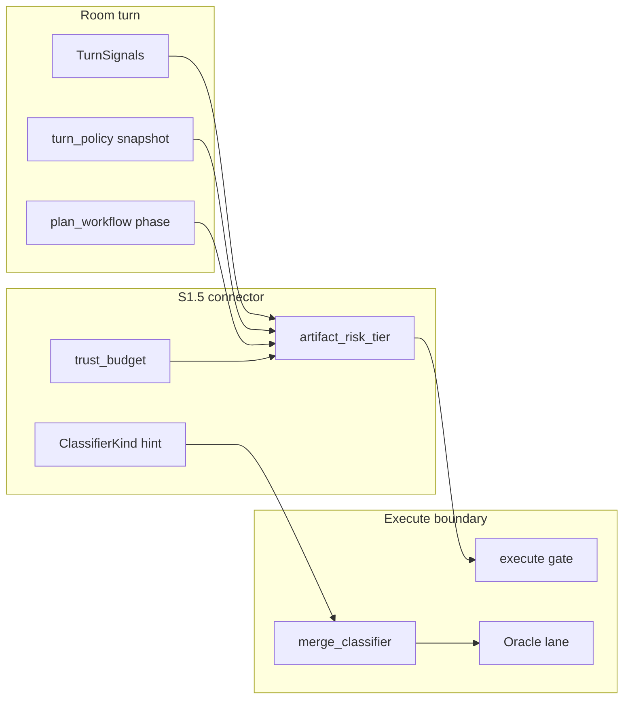

# S1.5 — Execute lane connector ADR

**Status:** proposed (2026-06)  
**Scope:** Connect `merge_classifier` × `trust_budget` × TurnSignals to Room / Workbench  
**Related:** [STRATEGIC-DIRECTION-2026.md](./STRATEGIC-DIRECTION-2026.md) S1.5 · [TURN-POLICY.md](./TURN-POLICY.md)

## Problem

Today:

- **VerificationLaneId** (`fast` / `integration` / …) governs Oracle verify depth after merge — not artifact risk at discuss/plan time.
- **`merge_classifier.ClassifierKind`** (`docs`, `patch`, `config`, …) exists only at execute boundary; **zero imports from `room/`**.
- **Human gate** blocks all execute lanes uniformly — no “docs autonomous / patch Human” tier UX.

Agents in the TurnPolicy Wave F session (C6, A2) agreed: this is a **new connector design**, not a lift-and-shift of execute classifiers into Room.

## Goals

1. Expose **artifact risk tier** on TurnSignals / Workbench so agents and Humans see why a path is discuss-only vs execute-eligible.
2. Map **ClassifierKind** + session **trust_budget** into a single **lane recommendation** before execute gate.
3. Preserve invariants: execute gate, worktree isolation, Oracle verify, Human approval for high-risk patches.

## Non-goals (S1.5)

- MCP self-discovery (S3).
- Removing Human gate for `patch` tier.
- Replacing TurnPolicy — connector **reads** TurnPolicy snapshot, does not re-resolve effects.

## Proposed model



### Dimensions

| Dimension | Source | Room-visible? | Execute effect |
|-----------|--------|---------------|----------------|
| **TurnPolicy effects** | `run.json` `turn_policy` | yes (S1 session_metrics) | scribe / FSM / assign_task_owners |
| **Artifact risk tier** | derived: plan actions + file refs + ClassifierKind | **new** Workbench field | pre-gate hint; optional auto-lane for `docs` |
| **trust_budget** | session / mission config | yes | caps autonomous execute attempts |
| **VerificationLaneId** | execute request | Work tab | Oracle depth only |

### Artifact risk tiers (v1)

| Tier | Typical ClassifierKind | Room policy | Execute |
|------|---------------------|-------------|---------|
| **L0 discuss** | n/a | `[PROPOSED:]` only | blocked |
| **L1 docs** | `docs`, `markdown` | scribe + plan | optional Human-skip when trust_budget allows |
| **L2 config** | `config`, `ci` | plan + peer review | Human gate default ON |
| **L3 patch** | `patch`, `code` | full supervisor | Human gate required |

## Connector API (sketch)

```python
@dataclass(frozen=True)
class LaneConnectorInput:
    turn_signals: TurnSignals
    turn_policy: dict[str, Any]
    plan_actions: list[PlanAction]
    trust_budget: TrustBudget

@dataclass(frozen=True)
class LaneConnectorOutput:
    artifact_risk_tier: Literal["L0", "L1", "L2", "L3"]
    classifier_hints: list[ClassifierKind]
    execute_lane: VerificationLaneId | None
    human_gate_required: bool
    workbench_lines: list[str]
```

**Rules (v1 heuristics):**

- CLARIFY / INTAKE → always L0, `human_gate_required=True`.
- Plan actions tagged `검증:` with integration lane → L2+.
- Any action touching `src/` or `tests/` → minimum L3.
- `trust_budget.autonomous_docs` exhausted → L1 behaves as L2.

## Integration points

1. **`session_metrics` MCP** — add `artifact_risk_tier` + `trust_budget` read-only fields (S1 extension).
2. **`turn_policy.py`** — do **not** embed classifier logic; emit signals only.
3. **`plan/execute_gate.py`** — call connector once; persist recommendation on `run.json`.
4. **Web Workbench** — show tier + skip reason alongside recombination / emergence hints (F3).

## Rollout

| Phase | Deliverable |
|-------|-------------|
| **S1.5a** | This ADR + `LaneConnectorInput/Output` types + mock tests |
| **S1.5b** | Workbench read-only tier from plan.md parse |
| **S1.5c** | Execute gate consumes connector; docs tier behind flag |
| **S1.5d** | trust_budget persistence + mission templates |

## Open questions

1. Should **Kimi Work** daimon peer votes affect tier (challenge → bump L2→L3)?
2. Is **partial plan execute** (single action) allowed at L1, or whole-plan only?
3. How does **fast preset** interact — always L0, or L1 for doc-only topics?

## Decision

Proceed with **connector module** under `src/agent_lab/plan/lane_connector.py` (name TBD) after Wave F + S1 session_metrics ship. Room imports **output DTO only** — never `merge_classifier` directly from turn flow.
