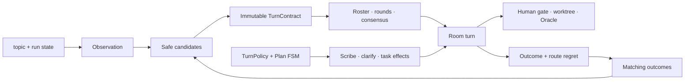

# TurnContract — Room 턴 선택 계약

> **Status:** canonical · current behavior
> **Last verified:** 2026-07-11
> **Code SSOT:** `src/agent_lab/room/turn_intent.py` · `turn_contract.py` · `turn_contract_feedback.py` · `turn_policy.py` · `turn_flow_phases.py`
> **History:** [TURN-POLICY.md](./TURN-POLICY.md) · [WORKFLOW-DYNAMIC-REFERENCE.md](./archive/rfcs/WORKFLOW-DYNAMIC-REFERENCE.md) §8.2

TurnContract는 한 턴의 품질·비용 경로를 증거로 선택한다. 안전 권한은 학습하지 않으며 TurnPolicy, Plan FSM, Human gate가 계속 소유한다.

## 1. 권한 경계

| 소유자 | 결정 | 학습/탐색 가능 |
|--------|------|----------------|
| **TurnContract** | 후보 계약, agent 상한, round 수, consensus | 가능, safety floor 안에서만 |
| **TurnPolicy** | agent round, Scribe, task owner, plan workflow 효과 | 정적 signal resolver |
| **Plan FSM / Clarify** | clarify 진입, phase 전이, Inbox 질문 | 정적 게이트 |
| **Human / Execute** | plan 승인, execute 409, merge, 외부 능력 mount | 불가, 명시 승인 |
| **Oracle** | 완료 판정, repair | 불가 |

따라서 history가 비용이 싼 경로를 선호해도 Scribe·clarify·Human 승인·BLOCK→409·worktree·Oracle을 제거할 수 없다.



## 2. Observation과 후보

`turn_intent.py`의 `observe_turn_intent()`가 topic과 현재 run state에서 공통 intent를 만들고, `turn_contract.py`와 `turn_policy.py`가 같은 결과를 소비한다. `observe_turn()`은 이 공통 observer의 호환 façade다.

다음 증거를 만든다.

- `task_kind`: `read` · `code` · `review` · `general`
- `risk`: 현재 observer는 `low` · `high`를 산출하고 type은 `medium` 확장을 예약한다.
- `write_intent`, `execute_intent`
- `ambiguity`
- marker와 plan workflow 상태를 설명하는 `evidence[]`

후보는 단일 category가 아니라 점수·근거·안전 거절 여부를 함께 가진다.

| Contract | 기본 runtime 효과 | 용도 |
|----------|-------------------|------|
| `quick_read` | 1 agent · 1 round · no consensus | 짧고 낮은 위험의 확인 |
| `standard_collab` | 기존 roster · 1 round · no consensus | 일반 협업·리뷰 |
| `guarded_plan` | 기존 roster · 2 rounds · consensus | 실행 의도가 있는 계획 |
| `critical_review` | 기존 roster · 2 rounds · consensus | 고위험 검토 |

`agent_limit=null`은 현재 roster를 그대로 사용한다는 뜻이다. `max_rounds`와 `consensus`는 runtime controls로 snapshot에 남고, roles rollout에서만 Room topology에 적용된다. consensus 내부의 debate·recombination·forced review는 이 cap을 넘지 않으며, Human gate·Oracle 같은 별도 workflow 단계는 consensus round와 별개다.

## 3. 선택 규칙

### Cold start

matching outcome이 10건 미만이면 `bootstrap` 점수만 사용한다. 위험 marker는 `critical_review`, 실행 의도는 최소 `guarded_plan`으로 올린다.

### History

`phase == "execute"`이고 `final_verdict`가 `pass` 또는 `fail`인 outcome 중 `task_kind + risk + execute_intent`가 맞는 표본이 10건 이상이면 후보별 평균 결과를 bounded adjustment로 반영한다. `turn` row와 phase가 없는 legacy row는 verdict history 표본에서 제외한다.

### Exploration

`AGENT_LAB_FEEDBACK_EXPLORE_RATE`가 0보다 크면 결정론적 hash와 후보 사용 횟수로 덜 사용한 safe candidate를 선택할 수 있다. 같은 evidence와 ledger에서는 같은 결과를 만든다.

### Asymmetric safety

- 위험 가능성이 있으면 상향한다.
- 비용이 늘어나는 과잉 라우팅은 관측 가능한 regret로 허용한다.
- safety floor 아래 후보는 점수가 높아도 선택하지 않는다.
- history와 exploration 모두 safety floor를 넘을 수 없다.

## 4. Rollout

`AGENT_LAB_TURN_CONTRACT_MODE`:

| Mode | 동작 |
|------|------|
| `off` | contract runtime 적용 안 함 |
| `shadow` | snapshot·eval·outcome만 기록, Room topology 유지 |
| `roles` | bootstrap/history/explore 결과를 roster·round·consensus에 적용 |
| `adaptive` | source가 `history` 또는 `explore`일 때 적용하고, `guarded_plan`/`critical_review` safety floor는 bootstrap에서도 강제 |

기본값은 `shadow`다. 잘못된 값도 `shadow`로 보수적으로 폴백한다.

## 5. Persisted contract

선택 결과는 `run.json.turn_contract`와 turn snapshot에 기록한다.

```json
{
  "contract_id": "guarded_plan",
  "source": "bootstrap",
  "confidence": "high",
  "safety_floor": "guarded_plan",
  "risk": "low",
  "task_kind": "code",
  "write_intent": true,
  "execute_intent": true,
  "evidence": ["execute_intent", "write_intent"],
  "candidates": [],
  "rollout_mode": "roles",
  "applied": true,
  "runtime_controls": {"agent_limit": null, "max_rounds": 2, "consensus": true}
}
```

이 snapshot은 eval trace의 `artifacts.turn_contract`로 export된다.

## 6. Feedback과 regret

Outcome row에는 contract context와 `route_regret_signals`를 기록한다.

| Signal | 의미 |
|--------|------|
| `under_routed` | quick에서 fail·repair·escalation 발생 |
| `over_routed_candidate` | guarded/critical이었지만 실행·escalation 없이 1 round 종료 |
| `clarify_no_delta` | clarify가 해결에 새 정보를 더하지 못함 |
| `fsm_no_action` | plan FSM을 열었지만 action이 생기지 않음 |
| `subset_escalated` | 축소 roster가 전원 참여로 확대됨 |

Regret는 keyword를 자동 수정하지 않는다. 후보 score adjustment와 rollout 판단의 관측 데이터다.

## 7. Dynamic workflow 흡수 경계

허용되는 것은 기존 contract를 설명하는 topology 패턴뿐이다. 다음은 별도 Human 결정 없이는 추가하지 않는다.

- runtime YAML/JSON workflow catalog
- DAG/workflow engine
- Scribe·clarify·Plan FSM·permission을 템플릿이 직접 제어하는 경로
- Inbox·execute·BLOCK·Oracle 우회
- Composer Plan/Agent picker 복원
- MoA 결과로 Room objection을 대체하는 경로

## 8. 검증

```bash
.venv/bin/pytest tests/test_turn_contract.py tests/test_turn_policy.py tests/test_outcome_harvester_execute.py -q
.venv/bin/pytest tests/test_eval_surface_graders.py tests/test_eval_surface_run_local.py -q
make feedback-report JSON=1
```

현재 작업 상태와 동결 판단은 [NOW.md](./NOW.md), 장기 방향과 해제 조건은 [NORTH-STAR.md](./NORTH-STAR.md)를 따른다.
