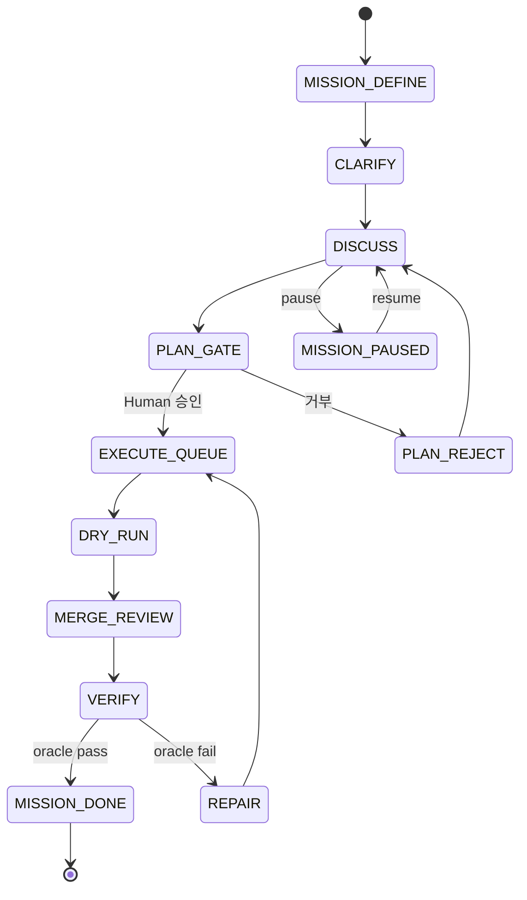
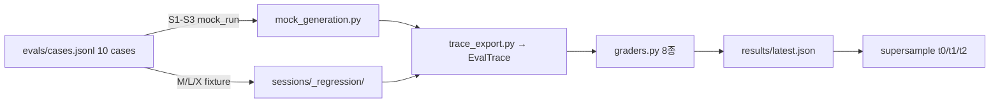
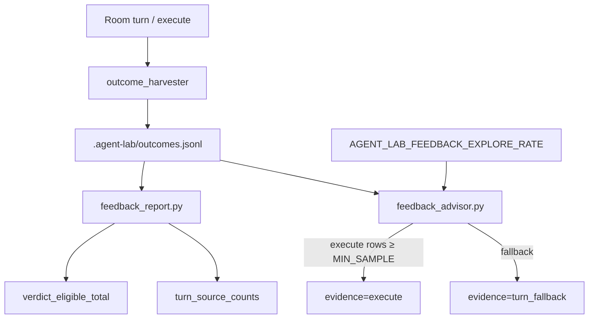
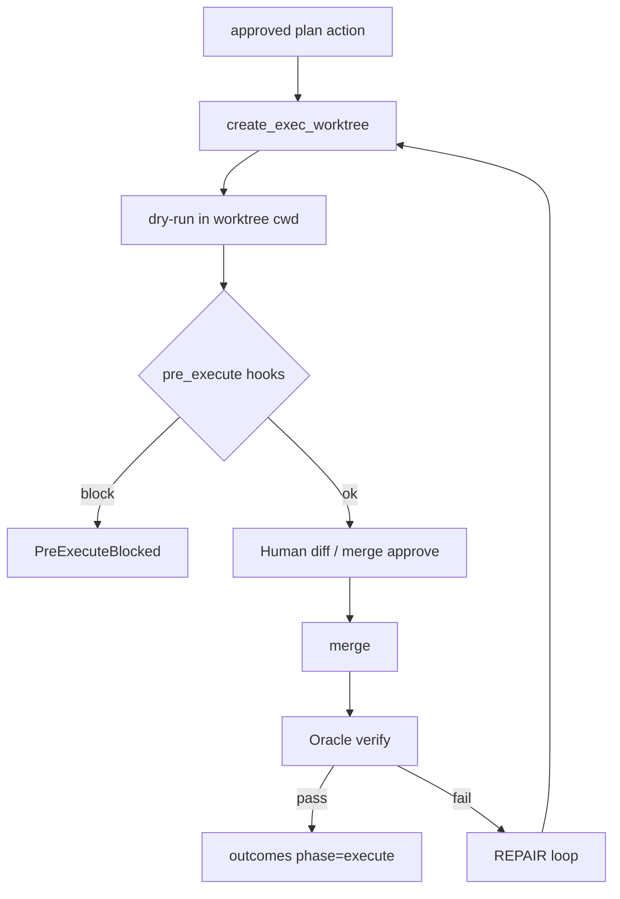
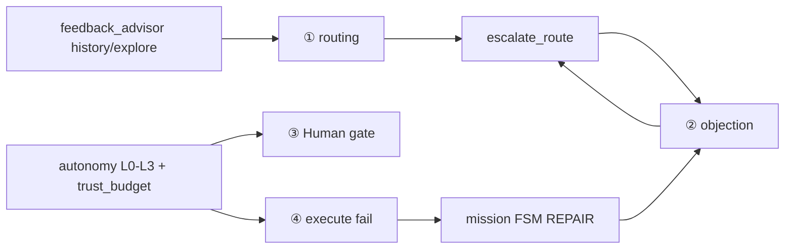

# Workflow · 동적 적응 · 슈퍼샘플 비교 — 작업 SSOT

> **작성:** 2026-07-07  
> **역할:** 이 문서 **하나만** 읽고 Room 4과정·Eval surface·슈퍼샘플 갭·다음 작업을 파악한다.  
> **관계:** 구조 상세 → [FLOW.md](./FLOW.md) · 북극성 → [NORTH-STAR.md](./NORTH-STAR.md) · Eval → [EVAL-SURFACE-V1-PLAN.md](./EVAL-SURFACE-V1-PLAN.md) · 흡수 매트릭스 → [NORTH-STAR.md §2.5](./NORTH-STAR.md)  
> **검증:** 문서 하단 [§12 작업 전 체크리스트](#12-작업-전-체크리스트) + [§13 명령 모음](#13-명령-모음)

---

## 0. 한 줄 요약

| 질문 | 답 |
|------|-----|
| Agent Lab 4과정이 뭔가? | `topic_router+role_plan` → `Room+objection` → `Human gate(MCP inbox)` → `plan/execute+worktree` |
| 충분히 동적인가? | **신뢰·검증 모트 안에서는 L2~L3** (규칙+escalation+repair). **Fugu/Hermes/Claude ultraworkflow급 per-query 재설계(L4)는 아님** |
| 슈퍼샘플 대비 위치 | ② objection · ④ Oracle/worktree **상위** · ① 학습 라우팅 · durable task queue **하위** |
| 작업 시 절대 금지 | Human gate 없는 auto-merge · inbox bypass 장기 미션 · main 무 gate sandbox · MoA로 objection 대체 ([NORTH-STAR §2.5](./NORTH-STAR.md)) |

---

## 1. 동적 적응 등급 (비교 기준)

모든 시스템·단계 비교에 **동일 척도**를 쓴다.

| 등급 | 이름 | 의미 | 예 |
|------|------|------|-----|
| **L4** | 학습형 | 쿼리/상태마다 오케스트레이터가 **구조를 생성** | Fugu-Ultra Conductor, LangGraph(설계자 정의 그래프) |
| **L3** | 런타임 적응 | 규칙+FSM+**피드백**으로 경로·자율도 변경 | Hermes Kanban, Devin confidence, Agent Lab escalation+repair |
| **L2** | 모드/정책 | 모드·샌드박스·프리셋 선택 + 턴 내 적응 | Cursor Plan/Agent, Codex sandbox×approval |
| **L1** | 고정 파이프라인 | 단계 고정, 분기 제한 | GJC skill FSM, Jules async PR |
| **L0** | 단일 에이전트 | 멀티 합의·게이트 거의 없음 | Aider, 초기 Copilot |

**Agent Lab 4과정 등급:**

| 단계 | 등급 | 이유 |
|------|------|------|
| ① routing/roles | L2~L3 | 휴리스틱+escalation; LLM 라우터 없음 |
| ② Room/objection | L2~L3 | envelope+BLOCK; fast는 경로 단순화 |
| ③ Human gate | **의도적 L1~L3** | gate 제거 안 함; L1~L3는 auto-approve/trust |
| ④ execute/verify | L2~L3 | worktree+Oracle+repair; 경로는 보수적 고정 |

---

## 2. 제품 미션 Workflow (운영 경로)

### 2.1 다이어그램

```mermaid
flowchart TB
    subgraph Input["입력"]
        T[Topic]
        UI[Composer: preset + Plan toggle]
    end

    subgraph S1["① topic_router + role_plan"]
        PRESET[room_preset: fast→quick · supervisor→loop]
        MODE{Plan ON?}
        ROUTE[category · debate cap · agent_subset · topology]
        ROLES[proposer/critic/synthesizer/executor/delegator]
    end

    subgraph S2["② Room agents + objection"]
        AGENTS[Cursor · Codex · Claude · Kimi Work]
        OBJ[envelope: PROPOSE/ENDORSE/CHALLENGE/AMEND/BLOCK]
        REG[run.json objections[]]
    end

    subgraph S3["③ Human gate"]
        MCP[ask_human · propose_build]
        INBOX[HumanInboxPanel · claim/resolve]
    end

    subgraph S4["④ plan/execute + worktree"]
        PLAN[plan.md · plan_workflow FSM]
        WT[git worktree dry-run]
        MERGE[merge approve]
        ORA[Oracle verify · repair]
    end

    subgraph Artifacts["sessions/&lt;id&gt;/"]
        RJ[run.json]
        CHAT[chat.jsonl]
        PLANF[plan.md]
        TRACE[trace.jsonl]
        OUT[outcomes.jsonl]
    end

    T --> UI --> PRESET --> MODE
    MODE -->|OFF discuss| AGENTS
    MODE -->|ON plan| PLAN
    ROUTE --> ROLES --> AGENTS
    AGENTS --> OBJ --> REG
    OBJ --> MCP
    PLAN --> MCP
    MCP --> INBOX
    INBOX -->|approve| WT
    WT --> MERGE --> ORA
    AGENTS --> RJ & CHAT
    PLAN --> PLANF
    WT --> TRACE
    ORA --> OUT
```

### 2.2 불변 모트 (코드·문서 SSOT)

| 모트 | 구현 | 실패 시 |
|------|------|---------|
| 합의 = Room | `room/` | — |
| 격리 = worktree | `plan/execute_worktree.py` | `WorktreeUnavailable` |
| 완료 = Oracle verified | `plan/execute_verify.py` | repair loop |
| BLOCK → execute 차단 | `room/objections.py` → `ObjectionBlocksExecute` | HTTP **409** |
| Human gate 유지 | `inbox/` MCP + plan approve | — |
| run.json 쓰기 규율 | `patch_run_meta()` / `stamp_run_meta()` only | `test_run_meta_write_discipline` |

---

## 3. Mission Loop FSM (Layer 6, supervisor)

`AGENT_LAB_MISSION_LOOP` + `supervisor` preset 시 Room 위 상태기계.



| 모듈 | 경로 |
|------|------|
| FSM 정의 | `src/agent_lab/mission/loop.py` (`MissionPhase`) |
| 전이 핸들러 | `src/agent_lab/mission/advance.py` |
| dispatch | `src/agent_lab/runtime/` → `dispatch()` |

---

## 4. Eval Surface Workflow (평가 경로)

**목표:** case → trace → grader → report → supersample T0/T1/T2.



### 4.1 EvalTrace 9 fixed spans

```
route → role_plan → room_round → objection → plan_update
     → human_gate → execute → oracle_verify → feedback_advisor
```

| 파일 | 역할 |
|------|------|
| `evals/cases.jsonl` | 10 case contract |
| `evals/trace_export.py` | session → EvalTrace (fail-open) |
| `evals/graders.py` | 8 deterministic graders |
| `evals/report.py` | `build_report()` · `build_supersample()` |
| `evals/run_local.py` | CLI entry |

### 4.2 Case tier

| Tier | IDs | 소스 | graders 초점 |
|------|-----|------|----------------|
| S | S1–S3 | `generated_mock` | routing, session, mock_quality |
| M | M3–M5 | regression | gate_integrity, objection_flow, oracle |
| L | L1–L3 | regression | routing escalation, worktree, verify loop |
| X | X2 | regression | trace_completeness |

### 4.3 Canonical episode (S1 feedback와 공유)

> SSOT: [EVAL-SURFACE-SUPER-SAMPLE-PLAN.md §Canonical Definitions](./EVAL-SURFACE-SUPER-SAMPLE-PLAN.md)

- **completed episode** = `outcomes.jsonl`에서 `phase == "execute"` row
- 구현: `feedback_report._is_verdict_eligible()`
- `advisor_lift.*: null` = below `MIN_SAMPLE`(3) — 효과 없음이 **아님**
- n≥30 / n≥10 = **사람 해석** (코드 게이트 아님)

---

## 5. S1 Feedback Loop (outcomes ↔ advisor)



| 모듈 | 경로 |
|------|------|
| harvest | `src/agent_lab/outcome_harvester.py` |
| report | `src/agent_lab/feedback_report.py` |
| advisor | `src/agent_lab/feedback_advisor.py` |
| S1 flags | `src/agent_lab/s1_flags.py` |

---

## 6. 네 과정 상세 — 작업 시 참조

### 6.1 ① `topic_router` + `role_plan`

**역할:** 토픽 → 합의 깊이 + 에이전트 풀 + 라운드별 역할.

#### topic_router

| 항목 | 내용 |
|------|------|
| **모듈** | `src/agent_lab/topic_router.py` |
| **입력** | `topic`, `turn_profile`, `[cat: deep]` 마커 |
| **판정 순서** | marker > session template > profile > keyword heuristic > default |
| **출력 `CategoryRoute`** | `category`, `debate_rounds`, `recombination`, `quality_gate`, `max_rounds`, `max_calls`, `agent_subset`, `task_type`, `topology_hint` |
| **category 순서** | quick → standard → trading → deep → critical |
| **Expert Pool** | code → cursor+codex, review → claude+codex, deep/critical → subset 해제(전원) |
| **자가 치유** | `CHALLENGE`/`BLOCK`/`AMEND` → `escalate_route()` — category 상향 + subset 해제 |
| **kill switch** | `AGENT_LAB_TOPIC_ROUTER=0` |
| **topology (N3)** | `parallel` · `producer_reviewer` · `pipeline` — `_resolve_topology` |

**작업 시 수정 포인트:**

```bash
# 회귀
pytest tests/test_topic_router.py -q
pytest tests/test_turn_routing.py -q
# fixture: sessions/_regression/category_escalation_quick_to_deep/
```

#### role_plan

| 항목 | 내용 |
|------|------|
| **모듈** | `src/agent_lab/role_plan.py` |
| **역할 ID** | proposer, critic, synthesizer, executor, delegator |
| **상태** | `run_meta["_turn_roles"]` (ephemeral, 턴 종료 시 리셋 가능) |
| **kill switch** | `AGENT_LAB_ROOM_ROLES=0` |
| **supervisor** | delegator + team_lead 오버레이 — `apply_preset_role_overrides()` |
| **연결** | `enrich_route_with_role_plan()` → prompt constraints |

**작업 시 수정 포인트:**

```bash
pytest tests/test_role_plan.py tests/test_dynamic_agent_roster.py -q
# fixture: sessions/_regression/producer-reviewer-roles/
```

---

### 6.2 ② `Room agents` + `objection`

#### Room agents

| 항목 | 내용 |
|------|------|
| **진입** | `room/turn_flow.py` (+ run/continue 분리) |
| **invoke** | `room/agent_invoke.py`, `consensus_rounds.py`, `parallel_rounds.py` |
| **에이전트** | cursor(execute), codex(분해·검증), claude(리스크·Scribe), kimi_work(peer) |
| **Composer 축** | preset: fast/supervisor · Plan toggle: discuss/plan |
| **Plan OFF** | Scribe skip, read-only overlay, `[PROPOSED:]` |
| **Plan ON** | Scribe → `plan.md` (`room/plan_scribe.py`) |
| **preset** | fast: 1 lead, consensus OFF, harvest skip · supervisor: team, consensus ON, Plan 잠금 historically — **signal-only plan으로 전환됨** ([NORTH-STAR §3.5.1](./NORTH-STAR.md)) |

#### objection

| 항목 | 내용 |
|------|------|
| **모듈** | `src/agent_lab/room/objections.py` |
| **act** | PROPOSE, ENDORSE, CHALLENGE, AMEND, **BLOCK** |
| **상태** | open → resolved_accepted / resolved_wontfix |
| **harvest** | `consensus_rounds.py` — discuss CHALLENGE/BLOCK → `run.json` |
| **하드 게이트** | open BLOCK → `ObjectionBlocksExecute` → API 409 |
| **플래그** | `AGENT_LAB_DISCUSS_OBJECTIONS` (default on) |

**작업 시 수정 포인트:**

```bash
pytest tests/test_discuss_objections.py tests/test_room_dispatch.py -q
# fixtures: objection_blocks_execute, discuss_challenge_resolved
python scripts/smoke_room.py  # 38 baselines
```

---

### 6.3 ③ `Human gate` (MCP inbox)

| 항목 | 내용 |
|------|------|
| **SSOT 방향** | [MCP-FIRST-INBOX.md](./MCP-FIRST-INBOX.md) |
| **MCP tools** | `ask_human` (≥2 options), `propose_build` (execute GO) |
| **서버** | `src/agent_lab/inbox/mcp_server.py`, `human_inbox.py` |
| **UI** | `web/src/components/HumanInboxPanel.tsx` |
| **세 층 (레거시→목표)** | ① orchestrator harvest (default OFF) ② Inbox MCP (SSOT) ③ Scribe (plan only) |
| **fast preset** | discuss harvest skip · **execute 시 MCP 유지** — [05-room-agent-roles.md §Fast](./05-room-agent-roles.md) |
| **autonomy** | L0~L3 — `src/agent_lab/autonomy_ladder.py`, `trust_budget.py`, `auto_approve_gate.py` |

**작업 시 수정 포인트:**

```bash
pytest tests/test_human_inbox.py tests/test_autonomy_ladder.py -q
GET /api/autonomy  # L level
make feedback-report JSON=1  # escalation_rate_by_level
```

---

### 6.4 ④ `plan/execute` + `worktree`

#### plan (계약)

| 항목 | 내용 |
|------|------|
| **파싱** | `plan/actions.py` — action list, `isolation: worktree|apply|block` |
| **FSM** | `plan/workflow*.py` — clarify → peer review → Human approve |
| **gate** | `ensure_plan_workflow_approved()` — 미통과 시 execute 불가 |
| **authority (P3)** | skill/MCP 우선 — `run_clarity_interview`, `execute_propose` |

#### execute + worktree

| 단계 | 모듈 |
|------|------|
| worktree 생성 | `plan/execute_worktree.py` — `create_exec_worktree()` |
| dry-run | `plan/execute_dry_run.py` |
| pre_execute hooks | `room/hooks.py` — exit 2 → `PreExecuteBlocked` |
| merge | `plan/execute_merge.py` (via workflow) |
| verify | `plan/execute_verify.py` — Oracle |
| repair | mission `REPAIR` + agent repair worktree |
| API | `app/server/routers/plan_execute.py` — 409 on gate |



**작업 시 수정 포인트:**

```bash
pytest tests/test_plan_execute.py tests/test_plan_workflow.py -q
# fixtures: worktree_merge_ok, execute_verify_loop, mission_loop_verify_repair
make check-worktrees  # stale worktree orphan
```

---

## 7. 단계 간 데이터 흐름 (한 줄)

```
topic
  → topic_router (category, cap, subset)
  → role_plan (proposer/critic/…)
  → Room agents (chat.jsonl, envelope)
  → objections[] (BLOCK locks execute)
  → Human gate (MCP / plan approve)
  → plan.md actions → worktree → merge → Oracle
  → outcomes.jsonl (completed episode)
  → feedback_advisor (next turn hint)
  → eval surface (case/grader/regression)
```

---

## 8. 동적 적응 — Agent Lab 내부 메커니즘



| 메커니즘 | 동적으로 하는 일 | 한계 |
|----------|------------------|------|
| `escalate_route()` | 충돌 시 category↑, subset 해제 | 첫 라운드 오분류 가능 |
| mission FSM | verify fail → REPAIR → DISCUSS | supervisor+loop 전제 |
| `feedback_advisor` | history execute 우선, explore ε-greedy | MIN_SAMPLE=3 cold-start |
| `autonomy_ladder` | L1 auto-approve low risk | L3 live 증거 부족 (D3) |
| fast vs supervisor | **프리셋이 경로 자체를 바꿈** | fast는 discuss 단순화 |

### 8.1 “충분히 동적” 판정 (Agent Lab)

| 질문 | 답 |
|------|-----|
| 토픽·충돌에 따라 합의 깊이·역할이 바뀌나? | **대체로 예** (L2~L3) |
| 실패·BLOCK에 경로가 바뀌나? | **예** (409, repair, DISCUSS) |
| Human 없이 execute? | **아니오** (좁은 auto-approve만) |
| LLM이 워크플로 자체를 재구성? | **아니오** |
| live 다양 토픽 검증? | **부분** (mock/regression 중심) |

---

## 9. 슈퍼샘플 비교 — 4과정 × 동적 등급

점수: **0** 없음 · **1** 약 · **2** 보통 · **3** 강 · **4** 매우 강 (해당 제품 핵심)

| 시스템 | ① Routing | ② Multi-agent | ③ Human gate | ④ Execute | 종합 등급 |
|--------|-----------|---------------|--------------|-----------|-----------|
| **Fugu / Fugu-Ultra** | 4 | 3 | 1 | 2 | **L4** |
| **Hermes Agent** | 3 | 4 | 2 | 2 | **L3** |
| **Claude Code** | 3 | 2 | 2 | 3 | **L2~L3** |
| **Cursor** | 2 | 2 | 2 | 3 | **L2** |
| **Codex** | 2 | 1 | 3 | 3 | **L2~L3** |
| **Devin** | 2 | 1 | 3 | 3 | **L2~L3** |
| **GJC** | 2 | 2 | 3 | 3 | **L1~L2** |
| **Agent Lab** | 3 | 3 | 3 | 4 | **L2~L3** |
| **OpenHands** | 2 | 1 | 2 | 2 | **L2** |
| **Jules** | 1 | 0 | 1 | 2 | **L1** |
| **Factory/Harness** | 2 | 2 | 2 | 2 | **L2** |
| **LazyCodex/OmO** | 3 | 2 | 2 | 3 | **L2~L3** (Agent Lab 조상) |
| **LangGraph** | 4* | 3* | * | * | **L4*** (*프레임워크) |
| **MoA/MetaGPT** | 2 | 2 | 0~1 | 1 | **L1~L2** |
| **Aider/SWE-agent** | 1 | 0 | 1 | 2 | **L0~L1** |

### 9.1 시스템별 작업 관점 요약

#### Fugu (Sakana)

- **① L4:** Trinity(저지연 라우팅) + Conductor(RL multi-step workflow 자연어 생성).
- **②:** 내부 multi-agent, 외부는 단일 OpenAI-compat API.
- **③:** gate 최소화 (복잡성 은닉).
- **④:** Verifier 배치; worktree/Oracle/Human Inbox 모트 없음.
- **Agent Lab 흡수:** `openai_compat`, `model_policy` — **학습 오케스트레이터 미흡수**.

#### Hermes Agent (Nous Research)

- **①③④:** Kanban SQLite WAL — `tasks→events`, dispatcher `BEGIN IMMEDIATE` claim, `kanban_block`/`kanban_complete`.
- **② L4:** 구조화 핸드오프; 침묵 종료 = 프로토콜 위반.
- **workspace:** scratch / dir / worktree; CLI lane(Codex/CC)은 플러그인.
- **Agent Lab 참조:** F11 `run_meta` god-object 대체 모델 — [NORTH-STAR §2.5](./NORTH-STAR.md).
- **차별 유지:** Oracle, BLOCK→409, Human Inbox.

#### Claude Code

- Plan subagent(read-only), Dynamic Workflows(v2.1.154+), `/effort ultracode`.
- subagent + hooks; **Room식 objection 없음**.
- worktree hooks; repair = 터미널 루프.

#### Cursor

- Plan / Agent / Debug / Ask 모드 (Shift+Tab).
- multi-agent + worktree 2.0; **합의 envelope 약함**.

#### Codex

- **동적성 = sandbox_mode × approval_policy** (`workspace-write` + `on-request`).
- App worktree 병렬; Handoff → IDE; N9 verify는 외부(Agent Lab).

#### Devin

- Interactive Planning + citation; confidence 🟢/🟡/🔴; 30s wait / "Wait for approval".
- 병렬 Devin; **내부 합의 약함**; auto-merge 흡수 금지.

#### GJC (Gajae Code)

- skill FSM: deep-interview → ralplan → ultragoal; tmux team.
- Agent Lab: Room 일상 + GJC slash 외부 + `POST /v1/verify` / MB-8 handoff — [GJC-ENTRY.md](./GJC-ENTRY.md).
- P3: phase 권한 skill/MCP 우선.

#### OpenHands / Jules / Factory / 기타

| 시스템 | 핵심 | Agent Lab 관계 |
|--------|------|----------------|
| OpenHands | EventStream, confirmation_mode, replay | sandbox 2차(F8); 모트는 Agent Lab 우위 |
| Jules | async VM → PR, label trigger | **흡수 금지** (Human gate 없는 merge) |
| Factory | Mission Control, milestone worker | supervisor + plan.md 유사 |
| Conductor.build | workspace 카드 UX | execute shipped; UI 참고 |
| MoA | proposer→aggregator | parallel topology **실험만**; Room 대체 불가 |
| Aider | repo-map, 단일 LLM | `repo_map.py` 계승 |

### 9.2 상대 위치 (아키텍처 판단, 정량 아님)

```
높은 동적 적응
    ↑
    │  Fugu-Ultra · Hermes · Claude ultraworkflow
    │       Cursor · Codex · Devin
    │            GJC · Agent Lab ← (모트 높음, 오케스트 지능 중간)
    │                 Jules · Aider
    └──────────────────────────────────→ 높은 신뢰/검증 모트
```

### 9.3 흡수 금지 (작업 시 재확인)

[NORTH-STAR §2.5](./NORTH-STAR.md) — 아래는 **PR에서 거부**:

1. Human gate 없이 PR auto-merge (Jules/Devin Auto-Fix 그대로)
2. fire-and-forget multi-day mission (Factory inbox bypass)
3. main checkout 무 gate sandbox (OpenHands default 그대로)
4. MoA proposer-aggregator로 Room objection/BLOCK **전체 대체**

---

## 10. Eval · supersample · CI — 작업 연결

### 10.1 T0/T1/T2 (`evals/results/latest.json`)

| 층 | 지표 / 명령 |
|----|-------------|
| **T0** | `routing_pass_rate`, `human_gate_bypass_count`, `objection_flow_pass_rate`, `trace_completeness_rate`, `s_case_quality_pass_rate` |
| **T1** | `make quickstart-verify`, `emergence-bench-check`, `feedback-report`, `dogfood-feedback-mock`, `eval-surface-local` |
| **T2** | `gate: false` — 외부 fork/PR (N8 잔여) |

### 10.2 grader ↔ 4과정 매핑

| 4과정 | grader | case 예 |
|-------|--------|---------|
| ① | `routing_contract`, `session_contract` | S1–S3, L1 |
| ② | `objection_flow`, `generated_mock_quality` | M3, M4 |
| ③ | `gate_integrity` | M3, L2 |
| ④ | `oracle_coverage`, `plan_contract` | M5, L3 |
| 전체 | `trace_completeness` | X2 |

### 10.3 CI / 로컬 검증

| 명령 | 포함 |
|------|------|
| `make lint` | ruff check |
| `make format-check` | ruff format |
| `make test-fast` | ~2480 mock, `-n auto` |
| `make ci` | lint + format + mypy ratchet + layer-cycles + test-fast + smoke + emergence-bench-check |
| `make eval-surface-check` | pytest eval_surface_* + ruff + basedpyright + eval-surface-local |
| `make install-dev` | basedpyright (eval-surface-check 전제) |

**주의:** GitHub `ci.yml` pytest는 `run_verification_lane` 래퍼 없이 직접 실행 — 로컬 `make test-fast`와 거의 동일 marker.

---

## 11. 갭 → 작업 백로그 (우선순위)

문서만 보고 착수할 때 **권장 순서**. 각 항목에 닫힘 기준 포함.

| P | 갭 | 참고 샘플 | Agent Lab 액션 | 닫힘 기준 |
|---|-----|-----------|----------------|-----------|
| **P0** | S1 lift live 증거 | — | supervisor dogfood + `make feedback-report JSON=1` | `by_source.history.n`≥3, lift 관측 기록 |
| **P0** | explore 비교군 | EVAL-PROGRAM §S1.5 | `AGENT_LAB_FEEDBACK_EXPLORE_RATE=0.1` dogfood | `turn_source_counts.explore`>0 |
| **P1** | trace completeness 해석/유지 | — | case-type-aware grader(`trace_profile`) 유지 + 신규 regression은 최소 plan/execute/oracle 신호 보존 | **2026-07-07 기준선:** `trace_completeness_rate=1.0`, 10개 eval case 전부 `trace_completeness=1.0`; `M4/L1`는 discuss-only semantics 유지 + `trace_profile`로 해석 — [M4-L1-DISCUSS-ONLY-TRACE-DECISION.md](./M4-L1-DISCUSS-ONLY-TRACE-DECISION.md) |
| **P1** | L3 autonomy 미증명 | Codex approval | dogfood `escalation_rate_by_level` n≥10/level | [NORTH-STAR §1.4.1](./NORTH-STAR.md) |
| **P2** | durable task queue 없음 | **Hermes Kanban** | spike: mission board ↔ SQLite task_events (F11 대체) | no `run_meta` god-object 경로 1개 |
| **P2** | per-query workflow 없음 | Fugu-Ultra, Claude ultraworkflow | **흡수 금지** 전제 — subset: `topic_router` + topology 실험만 | emergence-bench delta ≥ 0 |
| **P2** | confidence-gated plan 없음 | Devin 2.1 | plan_workflow에 readiness/confidence 필드 설계 | mock fixture 1개 |
| **P3** | fork_time 자동화 | N8 | clean-clone CI job | REPRODUCTION-REPORT 수치 자동 갱신 |
| **P3** | GJC full FSM in Room | GJC | 유지: external slash + verify API | handoff E2E green |

### 11.1 영역별 수정 시 건드릴 파일 (치트시트)

| 작업 주제 | 1차 파일 | 테스트 |
|-----------|----------|--------|
| routing/escalation | `topic_router.py`, `turn_routing.py` | `test_topic_router.py` |
| roles | `role_plan.py` | `test_role_plan.py` |
| objection/BLOCK | `objections.py`, `consensus_rounds.py` | `test_discuss_objections.py` |
| inbox/MCP | `inbox/mcp_server.py`, `human_inbox.py` | `test_human_inbox.py` |
| plan FSM | `plan/workflow*.py` | `test_plan_workflow.py` |
| worktree/execute | `plan/execute_*.py` | `test_plan_execute.py` |
| mission FSM | `mission/loop.py`, `advance.py` | `test_mission_loop.py` |
| outcomes/S1 | `outcome_harvester.py`, `feedback_*.py` | `test_feedback_report.py` |
| eval surface | `evals/*` | `test_eval_surface_*.py` |
| re-export lint | hooks `PreExecuteBlocked`, `repo_map` exports, `SESSIONS_DIR` | `make lint` + `test_api_smoke_fast.py` |

### 11.2 ruff --fix 주의 (public re-export)

아래는 **삭제하면 CI 깨짐** — `# noqa: F401` 유지:

- `room/hooks.py` → `PreExecuteBlocked`
- `repo_map.py` → `EXCLUDE_DIRS`, `MAX_FILES`, …
- `mission/loop.py` → `DEFAULT_MAX_REPAIR_PER_ACTION`, `default_mission_loop`
- `session_helpers.py` → `SESSIONS_DIR` (test monkeypatch)

---

## 12. 작업 전 체크리스트

새 PR / dogfood / eval 작업 시작 전:

- [ ] `.agent-lab/PROJECT.md` 최신 ([AGENTS.md](../AGENTS.md))
- [ ] 4과정 중 **어느 단계**를 바꾸는지 §6에서 해당 절 확인
- [ ] 5모트 위반 없음 (§2.2, §9.3)
- [ ] 신규 feature 플래그 → `run/profile.py` `flags` 또는 `owns` (F2)
- [ ] `run_meta` 직접 subscript 금지 — `stamp_run_meta` / `patch_run_meta`
- [ ] mock-only 테스트 (`AGENT_LAB_MOCK_AGENTS=1`, live CI 금지)
- [ ] 해당 fixture: `sessions/_regression/<name>/`
- [ ] eval case 추가 시 `evals/cases.jsonl` + grader + `make eval-surface-check`

---

## 13. 명령 모음

```bash
# 개발
make dev                    # API 8765 + web 5173
make install-dev            # basedpyright (eval-surface-check)

# 품질 게이트
make lint
make format-check
make test-fast              # ~2480 tests
make ci

# Eval / 재현
make eval-surface-local
make eval-surface-check
make feedback-report JSON=1
make dogfood-feedback-mock
make emergence-bench-check
make quickstart-verify

# 구조 ratchet
make structure-metrics-check
make list-flags

# 회귀
python scripts/smoke_room.py
```

---

## 14. 관련 문서 인덱스

| 문서 | 용도 |
|------|------|
| [FLOW.md](./FLOW.md) | Discuss→Plan→Execute→Verify 상세 |
| [05-room-agent-roles.md](./05-room-agent-roles.md) | 에이전트 역할 · fast preset |
| [MCP-FIRST-INBOX.md](./MCP-FIRST-INBOX.md) | Human gate SSOT |
| [TURN-MODES.md](./TURN-MODES.md) | preset · Plan authority |
| [EVAL-SURFACE-V1-PLAN.md](./EVAL-SURFACE-V1-PLAN.md) | EvalTrace · graders |
| [EVAL-SURFACE-SUPER-SAMPLE-PLAN.md](./EVAL-SURFACE-SUPER-SAMPLE-PLAN.md) | Canonical definitions · T0/T1/T2 |
| [REPRODUCTION-REPORT.md](./REPRODUCTION-REPORT.md) | 공개 재현 수치 |
| [GJC-ENTRY.md](./GJC-ENTRY.md) | Room vs GJC |
| [VERIFY-API.md](./VERIFY-API.md) | N9 외부 검증 |
| [NORTH-STAR.md](./NORTH-STAR.md) | 흡수 매트릭스 · 로드맵 |
| [EXTERNAL-REFS-TRACEABILITY.md](./EXTERNAL-REFS-TRACEABILITY.md) | shipped 증거 |

---

## 15. 변경 이력

| 날짜 | 내용 |
|------|------|
| 2026-07-07 | 초판 — workflow 4과정 상세, 동적 적응 판정, 슈퍼샘플 비교, eval/CI, 작업 백로그 통합 |
