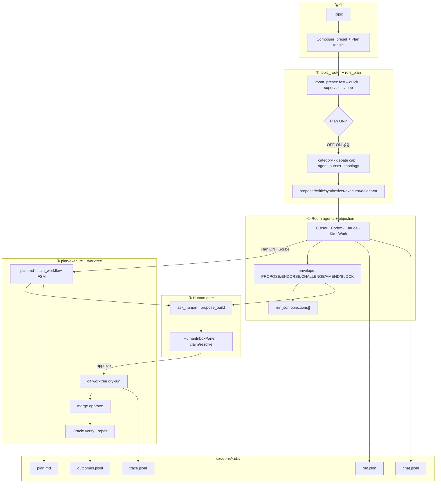
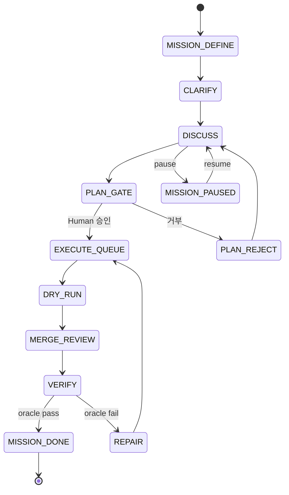
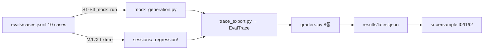
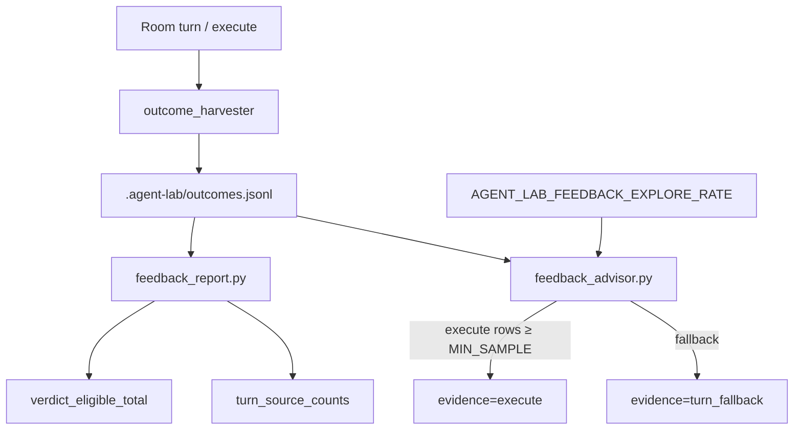
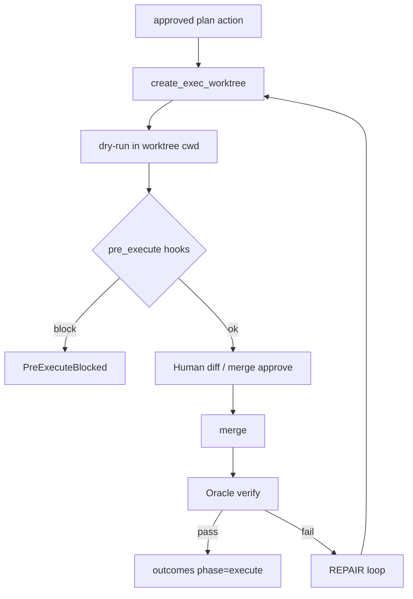
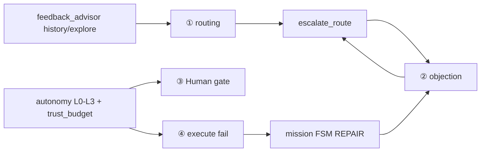
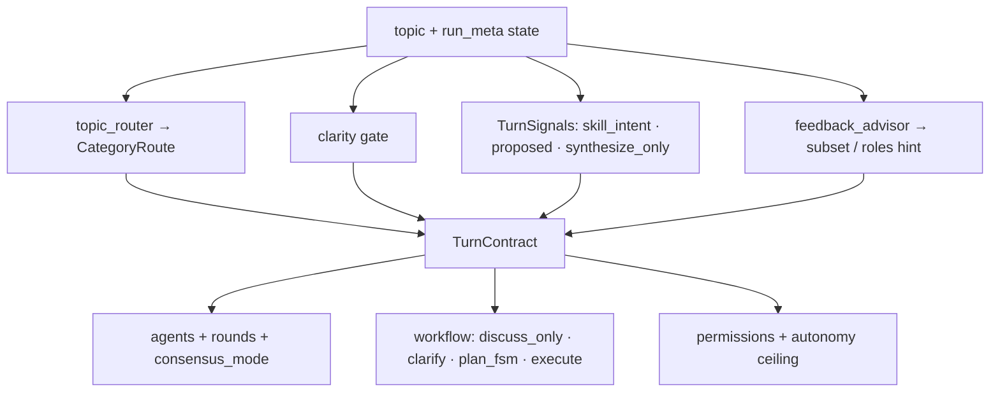
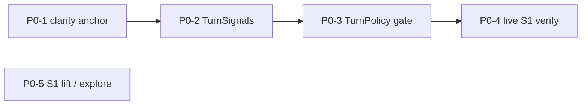
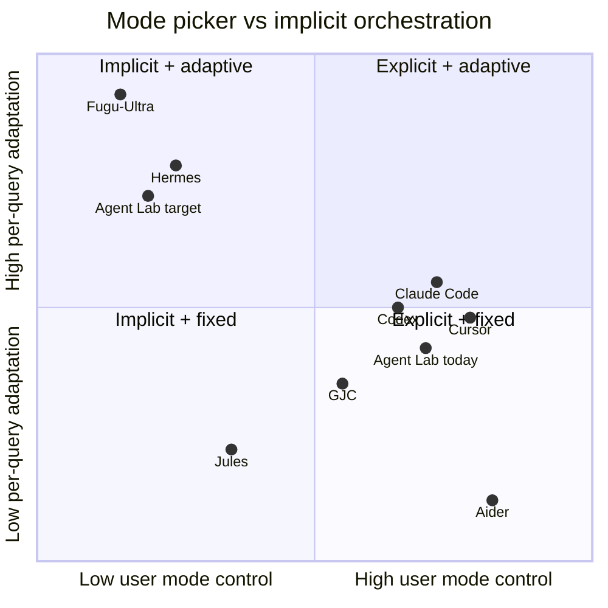

# Workflow · 동적 적응 · 슈퍼샘플 비교 — history/reference

> **Status:** historical reference · **작성:** 2026-07-07 · **authority 종료:** 2026-07-10
> **현재 구조:** [FLOW.md](../../FLOW.md) · **턴 제어:** [TURN-CONTRACT.md](../../TURN-CONTRACT.md) · **평가:** [EVAL-CONTRACT.md](../../EVAL-CONTRACT.md) · **방향:** [NORTH-STAR.md](../../NORTH-STAR.md)
> **보존 이유:** 4과정 비교, Fugu/Hermes 대조, TurnContract 도입 배경과 P0~P3 strangler 이력. 현재 상태·계약·착수 순서를 이 문서에서 판정하지 않는다.
> **검증 명령:** 현행 명령은 [EVAL-CONTRACT.md](../../EVAL-CONTRACT.md)와 [NOW.md](../../NOW.md)를 우선한다.

---

## 0. 한 줄 요약

| 질문 | 답 |
|------|-----|
| Agent Lab 4과정이 뭔가? | `topic_router+role_plan` → `Room+objection` → `Human gate(MCP inbox)` → `plan/execute+worktree` |
| 충분히 동적인가? | **신뢰·검증 모트 안에서는 L2~L3** (규칙+escalation+repair). **Fugu/Hermes/Claude ultraworkflow급 per-query 재설계(L4)는 아님** |
| 슈퍼샘플 대비 위치 | ② objection · ④ Oracle/worktree **상위** · ① 학습 라우팅 · durable task queue **하위** |
| Composer preset 필요한가? | **아직 예** (빠른/감독). 목표는 **아니오** — §8.2 TurnContract가 topology·FSM·인원을 신호로 결정하면 UI preset **삭제 가능** |
| 작업 시 절대 금지 | Human gate 없는 auto-merge · inbox bypass 장기 미션 · main 무 gate sandbox · MoA로 objection 대체 ([NORTH-STAR §2.5](../../NORTH-STAR.md)) |

---

## 1. 동적 적응 등급 (비교 기준)

모든 시스템·단계 비교에 **동일 척도**를 쓴다.

| 등급 | 이름 | 의미 | 예 |
|------|------|------|-----|
| **L4** | 학습형 | 쿼리/상태마다 오케스트레이터가 **구조를 생성** | Fugu-Ultra Conductor, LangGraph(설계자 정의 그래프) |
| **L3** | 런타임 적응 | 규칙+FSM+**피드백**으로 경로·자율도 변경 | Hermes Kanban, Devin confidence, Agent Lab escalation+repair |
| **L2** | 모드/정책 | 모드·샌드박스·프리셋 선택 + 턴 내 적응 | Cursor Plan/Agent, Codex sandbox×approval |
| **L1** | 고정 파이프라인 | 단계 고정, 분기 제한 | GJC skill FSM, Jules async PR |
| **L0** | 단일 에이전트 | 멀티 합의·게이트 거의 없음 | Aider, 초기 Copilot |

> **주의:** 이 L0~L4는 **동적 적응 등급**이다. §6.3의 autonomy ladder L0~L3(auto-approve 자율도, `autonomy_ladder.py`)와는 **다른 축** — 표기가 같아도 혼동하지 말 것.

**Agent Lab 4과정 등급:**

| 단계 | 등급 | 이유 |
|------|------|------|
| ① routing/roles | L2~L3 | 휴리스틱+escalation; LLM 라우터 없음 |
| ② Room/objection | L2~L3 | envelope+BLOCK; fast는 경로 단순화 |
| ③ Human gate | **의도적 L1~L3** | gate 제거 안 함; L1~L3는 auto-approve/trust |
| ④ execute/verify | L2~L3 | worktree+Oracle+repair; 경로는 보수적 고정 |

---

## 2. 제품 미션 Workflow (운영 경로)

### 2.1 다이어그램



### 2.2 불변 모트 (코드·문서 SSOT)

| 모트 | 구현 | 실패 시 |
|------|------|---------|
| 합의 = Room | `room/` | — |
| 격리 = worktree | `plan/execute_worktree.py` | `WorktreeUnavailable` |
| 완료 = Oracle verified | `plan/execute_verify.py` | repair loop |
| BLOCK → execute 차단 | `room/objections.py` → `ObjectionBlocksExecute` | HTTP **409** |
| Human gate 유지 | `inbox/` MCP + plan approve | — |
| run.json 쓰기 규율 | `patch_run_meta()` / `stamp_run_meta()` only | `test_run_meta_write_discipline` |

---

## 3. Mission Loop FSM (Layer 6, supervisor)

`AGENT_LAB_MISSION_LOOP` + `supervisor` preset 시 Room 위 상태기계.



| 모듈 | 경로 |
|------|------|
| FSM 정의 | `src/agent_lab/mission/loop.py` (`MissionPhase`) |
| 전이 핸들러 | `src/agent_lab/mission/advance.py` |
| dispatch | `src/agent_lab/runtime/` → `dispatch()` |

---

## 4. Eval Surface Workflow (평가 경로)

**목표:** case → trace → grader → report → supersample T0/T1/T2.



### 4.1 EvalTrace 9 fixed spans

```
route → role_plan → room_round → objection → plan_update
     → human_gate → execute → oracle_verify → feedback_advisor
```

| 파일 | 역할 |
|------|------|
| `evals/cases.jsonl` | 10 case contract |
| `evals/trace_export.py` | session → EvalTrace (fail-open) |
| `evals/graders.py` | 8 deterministic graders |
| `evals/report.py` | `build_report()` · `build_supersample()` |
| `evals/run_local.py` | CLI entry |

### 4.2 Case tier

| Tier | IDs | 소스 | graders 초점 |
|------|-----|------|----------------|
| S | S1–S3 | `generated_mock` | routing, session, mock_quality |
| M | M3–M5 | regression | gate_integrity, objection_flow, oracle |
| L | L1–L3 | regression | routing escalation, worktree, verify loop |
| X | X2 | regression | trace_completeness |

### 4.3 Canonical episode (S1 feedback와 공유)

> 현재 SSOT: [EVAL-CONTRACT.md](../../EVAL-CONTRACT.md). 아래 내용은 도입 당시 설명이다.

- **completed episode** = `outcomes.jsonl`에서 `phase == "execute"` row
- 구현: `feedback_report._is_verdict_eligible()`
- `advisor_lift.*: null` = below `MIN_SAMPLE`(3) — 효과 없음이 **아님**
- n≥30 / n≥10 = **사람 해석** (코드 게이트 아님)

---

## 5. S1 Feedback Loop (outcomes ↔ advisor)



| 모듈 | 경로 |
|------|------|
| harvest | `src/agent_lab/outcome_harvester.py` |
| report | `src/agent_lab/feedback_report.py` |
| advisor | `src/agent_lab/feedback_advisor.py` |
| S1 flags | `src/agent_lab/s1_flags.py` |

---

## 6. 네 과정 상세 — 작업 시 참조

### 6.1 ① `topic_router` + `role_plan`

**역할:** 토픽 → 합의 깊이 + 에이전트 풀 + 라운드별 역할.

#### topic_router

| 항목 | 내용 |
|------|------|
| **모듈** | `src/agent_lab/topic_router.py` |
| **입력** | `topic`, `turn_profile`, `[cat: deep]` 마커 |
| **판정 순서** | marker > session template > profile > keyword heuristic > default |
| **출력 `CategoryRoute`** | `category`, `debate_rounds`, `recombination`, `quality_gate`, `max_rounds`, `max_calls`, `agent_subset`, `task_type`, `topology_hint` |
| **category 순서** | quick → standard → trading → deep → critical (분류/표시용 — `escalate_route()` 자동 에스컬레이션은 trading을 건너뛰고 standard→deep으로 감; `risk_pin.py`가 `category=="trading"`을 신뢰 다운그레이드 트리거로 쓰므로 무관한 세션이 CHALLENGE 2회만으로 도달하면 안 됨. 2026-07-09) |
| **Expert Pool** | code → cursor+codex, review → claude+codex, deep/critical → subset 해제(전원) |
| **자가 치유** | `CHALLENGE`/`BLOCK`/`AMEND` → `escalate_route()` — category 상향 + subset 해제 |
| **kill switch** | `AGENT_LAB_TOPIC_ROUTER=0` |
| **topology (N3)** | `parallel` · `producer_reviewer` · `pipeline` — `_resolve_topology` |

**작업 시 수정 포인트:**

```bash
# 회귀
pytest tests/test_topic_router.py -q
pytest tests/test_turn_routing.py -q
# fixture: sessions/_regression/category_escalation_quick_to_deep/
```

#### role_plan

| 항목 | 내용 |
|------|------|
| **모듈** | `src/agent_lab/role_plan.py` |
| **역할 ID** | proposer, critic, synthesizer, executor, delegator |
| **상태** | `run_meta["_turn_roles"]` (ephemeral, 턴 종료 시 리셋 가능) |
| **kill switch** | `AGENT_LAB_ROOM_ROLES=0` |
| **supervisor** | delegator + team_lead 오버레이 — `apply_preset_role_overrides()` (§8.2.2: 커밋 `dfb96836`부터 raw preset이 아닌 `turn_policy.supervisor_turn_from_run_meta()` 신호 우선) |
| **연결** | `enrich_route_with_role_plan()` → prompt constraints |

**작업 시 수정 포인트:**

```bash
pytest tests/test_role_plan.py tests/test_dynamic_agent_roster.py -q
# fixture: sessions/_regression/producer-reviewer-roles/
```

---

### 6.2 ② `Room agents` + `objection`

#### Room agents

| 항목 | 내용 |
|------|------|
| **진입** | `room/turn_flow.py` (+ run/continue 분리) |
| **invoke** | `room/agent_invoke.py`, `consensus_rounds.py`, `parallel_rounds.py` |
| **에이전트** | cursor(execute), codex(분해·검증), claude(리스크·Scribe), kimi_work(peer) |
| **Composer 축** | preset: fast/supervisor · Plan toggle: discuss/plan |
| **Plan OFF** | Scribe skip, read-only overlay, `[PROPOSED:]` |
| **Plan ON** | Scribe → `plan.md` (`room/plan_scribe.py`) |
| **preset** | fast: 1 lead, consensus OFF, harvest skip · supervisor: team, consensus ON, Plan 잠금 historically — **signal-only plan으로 전환됨** ([NORTH-STAR §3.5.1](../../NORTH-STAR.md)) |

#### objection

| 항목 | 내용 |
|------|------|
| **모듈** | `src/agent_lab/room/objections.py` |
| **act** | PROPOSE, ENDORSE, CHALLENGE, AMEND, **BLOCK** |
| **상태** | open → resolved_accepted / resolved_wontfix |
| **harvest** | `consensus_rounds.py` — discuss CHALLENGE/BLOCK → `run.json` |
| **하드 게이트** | open BLOCK → `ObjectionBlocksExecute` → API 409 |
| **플래그** | `AGENT_LAB_DISCUSS_OBJECTIONS` (default on) |

**작업 시 수정 포인트:**

```bash
pytest tests/test_discuss_objections.py tests/test_room_dispatch.py -q
# fixtures: objection_blocks_execute, discuss_challenge_resolved
python scripts/smoke_room.py  # 38 baselines
```

---

### 6.3 ③ `Human gate` (MCP inbox)

| 항목 | 내용 |
|------|------|
| **SSOT 방향** | [MCP-FIRST-INBOX.md](../../MCP-FIRST-INBOX.md) |
| **MCP tools** | `ask_human` (≥2 options), `propose_build` (execute GO) |
| **서버** | `src/agent_lab/inbox/mcp_server.py`, `human_inbox.py` |
| **UI** | `web/src/components/HumanInboxPanel.tsx` |
| **세 층 (레거시→목표)** | ① orchestrator harvest (default OFF) ② Inbox MCP (SSOT) ③ Scribe (plan only) |
| **fast preset** | discuss harvest skip · **execute 시 MCP 유지** — [05-room-agent-roles.md §Fast](./05-room-agent-roles.md) |
| **autonomy** | L0~L3 — `src/agent_lab/autonomy_ladder.py`, `trust_budget.py`, `auto_approve_gate.py` |

**작업 시 수정 포인트:**

```bash
pytest tests/test_human_inbox.py tests/test_autonomy_ladder.py -q
GET /api/autonomy  # L level
make feedback-report JSON=1  # escalation_rate_by_level
```

---

### 6.4 ④ `plan/execute` + `worktree`

#### plan (계약)

| 항목 | 내용 |
|------|------|
| **파싱** | `plan/actions.py` — action list, `isolation: worktree\|apply\|block` |
| **FSM** | `plan/workflow*.py` — clarify → peer review → Human approve |
| **gate** | `ensure_plan_workflow_approved()` — 미통과 시 execute 불가 |
| **authority (P3)** | skill/MCP 우선 — `run_clarity_interview`, `execute_propose` |

#### execute + worktree

| 단계 | 모듈 |
|------|------|
| worktree 생성 | `plan/execute_worktree.py` — `create_exec_worktree()` |
| dry-run | `plan/execute_dry_run.py` |
| pre_execute hooks | `room/hooks.py` — exit 2 → `PreExecuteBlocked` |
| merge | `plan/execute_merge.py` (via workflow) |
| verify | `plan/execute_verify.py` — Oracle |
| repair | mission `REPAIR` + agent repair worktree |
| API | `app/server/routers/plan_execute.py` — 409 on gate |



**작업 시 수정 포인트:**

```bash
pytest tests/test_plan_execute.py tests/test_plan_workflow.py -q
# fixtures: worktree_merge_ok, execute_verify_loop, mission_loop_verify_repair
make check-worktrees  # stale worktree orphan
```

---

## 7. 단계 간 데이터 흐름 (한 줄)

```
topic
  → topic_router (category, cap, subset)
  → role_plan (proposer/critic/…)
  → Room agents (chat.jsonl, envelope)
  → objections[] (BLOCK locks execute)
  → Human gate (MCP / plan approve)
  → plan.md actions → worktree → merge → Oracle
  → outcomes.jsonl (completed episode)
  → feedback_advisor (next turn hint)
  → eval surface (case/grader/regression)
```

---

## 8. 동적 적응 — Agent Lab 내부 메커니즘



| 메커니즘 | 동적으로 하는 일 | 한계 |
|----------|------------------|------|
| `escalate_route()` | 충돌 시 category↑, subset 해제 | 첫 라운드 오분류 가능 |
| mission FSM | verify fail → REPAIR → DISCUSS | supervisor+loop 전제 |
| `feedback_advisor` | history execute 우선, explore ε-greedy | MIN_SAMPLE=3 cold-start |
| `autonomy_ladder` | L1 auto-approve low risk | L3 live 증거 부족 (D3) |
| fast vs supervisor | **프리셋이 경로 자체를 바꿈** | fast는 discuss 단순화 |

### 8.1 “충분히 동적” 판정 (Agent Lab)

| 질문 | 답 |
|------|-----|
| 토픽·충돌에 따라 합의 깊이·역할이 바뀌나? | **대체로 예** (L2~L3) |
| 실패·BLOCK에 경로가 바뀌나? | **예** (409, repair, DISCUSS) |
| Human 없이 execute? | **아니오** (좁은 auto-approve만) |
| LLM이 워크플로 자체를 재구성? | **아니오** |
| live 다양 토픽 검증? | **부분** (mock/regression 중심) |
| preset 없이 토픽만으로 경로 결정? | **아니오** — `room_preset`이 여전히 topology·FSM bootstrap을 바꿈 (§8.2) |

### 8.2 Preset elimination — TurnContract (목표 아키텍처)

> **관측 (2026-07-07 dogfood):** S1 사실 확인(`room.py consensus cap`)에 supervisor preset → trio 1 wave 후 **plan FSM CLARIFY tail**(`skill_first_hold`)이 붙음. 원인은 **겹침 2개:**
> 1. **`TurnPolicyEngine`이 `route.category`를 모름** — supervisor 첫 턴마다 `init_plan_workflow` ([`turn_policy.py`](../../../src/agent_lab/room/turn_policy.py) L234–243).
> 2. **`clarity_short_circuit`이 한글 접미 토픽에서 false** — `room.py에서…`처럼 확장자 직후 CJK가 오면 `_ANCHOR_PATTERNS`의 `\b`가 매치 실패 (실측: `short_circuit=False`, `threshold_met=False`, ambiguity≈0.18). 문서상 “`room.py` anchor 가능”은 **영문 경계 토픽에만** 해당.

#### 논지 (한 줄)

**에이전트 몇 명·누구·어떤 경로(discuss/CLARIFY/plan/execute)를 돌릴지가 토픽+상태 신호로 자동 결정되면, Composer의 preset 선택은 UX가 아니라 중복이다.**  
목표는 preset을 “내부에서 자동 선택”하는 것이 아니라, **사용자 설정 축 자체를 제거**하는 것이다.

이는 [NORTH-STAR §3.5.1](../../NORTH-STAR.md) **B(signal-only plan)** 의 확장 — plan lane만 신호화한 것이 아니라 **topology·인원·합의 깊이**까지 신호화.

#### Preset이 오늘 묶어 주는 것 (분해)

| Preset이 하는 일 | 오늘 구현 | TurnContract로 대체할 신호 |
|------------------|-----------|------------------------------|
| 에이전트 수 (1 vs trio) | fast=1 lead · supervisor=team | `topic_router.category` + `agent_subset` + `feedback_advisor` subset hint |
| consensus multi-round | supervisor `loop` → consensus ON | `category` (quick→`discuss_light` 1 wave) · execute/plan intent 시만 multi-round |
| plan FSM bootstrap | supervisor **첫 턴** → `init_plan_workflow` | `skill_intent` · `proposed_tags` · synthesize_only · **아님** “preset==supervisor” |
| CLARIFY 진입 | `AGENT_LAB_PLAN_FSM_SKILL_FIRST` + supervisor FSM | `clarity_threshold_met` / `clarity_short_circuit` · `category!=quick` |
| S1 harvest / advisor | supervisor implicit ON (`s1_flags.py`) | **부분 완료 (§8.2.2, 커밋 `dfb96836`):** `AGENT_LAB_FEEDBACK_ADVISOR`(pre-turn, latency 경로)는 `supervisor_turn` 신호로 전환. `AGENT_LAB_TURN_METRICS`/`AGENT_LAB_OUTCOME_LEDGER`(post-turn write-only)는 raw preset 기본값 유지 — 의도적, `AGENT_LAB_RUN_PROFILE` 전환은 별도 백로그 |
| 비용·지연 프로파일 | fast ~54s vs supervisor ~281s ([§3.2.1](../../NORTH-STAR.md)) | quick path는 **의도적 저비용** — category로 자동, preset 불필요 |

#### 목표: `TurnContract` (이름만 제안 — SSOT는 구현 시 `turn_policy` 확장)

한 턴 send 시 **단일 resolver**가 아래를 출력한다. Composer는 **topic (+ 첨부)** 만 받는다.



| TurnContract 필드 | 결정 근거 | 예: S1 `room.py cap?` |
|-------------------|-----------|------------------------|
| `agents` | subset + advisor | cursor+codex+claude 또는 quick 시 1 lead |
| `agent_rounds` | category + discuss_light | **1** |
| `consensus_mode` | discuss_only ∧ ¬execute intent | **false** |
| `plan_fsm` | skill/proposed/synthesize ∨ deep/critical | **off** |
| `clarify` | ¬clarity_short_circuit ∧ vague | **skip** |
| `execute_lane` | propose_build · approved plan | **off** |

#### 8.2.1 Clarity 앵커 — 한글 경계 버그 (P0-1)

| 항목 | 내용 |
|------|------|
| **증상** | dogfood S1 프롬프트 `room.py에서 consensus…` → `detect_concrete_anchors` / `clarity_short_circuit` **false** |
| **원인** | `clarity.py` `_ANCHOR_PATTERNS[0]`: `[\w./-]+\.[A-Za-z]{1,6}\b` — `.py` 뒤 `에서`(CJK)는 `\w`로 이어져 word boundary 없음 |
| **영향** | `skill_first_hold` · plan FSM CLARIFY tail · S1 1턴 종료 지연 · preset 없이도 “vague”로 오분류 |
| **수정** | 확장자 뒤 `(?=[\s\W]|$)` 또는 CJK-aware boundary; 회귀: `room.py에서` · `room.py consensus` · `src/foo/bar.py:` |
| **테스트** | `tests/test_clarity.py` — `clarity_short_circuit("room.py에서 …")` → `True` |
| **닫힘** | mock-only pytest green; live S1 토픽에서 `clarity_short_circuit(topic)==True` (<1s, LLM scoring 불필요) |

**주의:** `score_ambiguity()`는 live 에이전트 호출 가능 — **닫힘 검증은 `clarity_short_circuit` 단위 테스트 + TurnPolicy 통합**으로 한다 (dogfood 전 `make test-fast`).

#### P0 패치 순서 (실행 SSOT)

TurnContract·preset elimination의 **첫 PR 묶음**. 순서 고정 — 뒤 단계가 앞 신호에 의존.

| 순서 | ID | 작업 | 파일 | 닫힘 / 검증 |
|------|-----|------|------|-------------|
| **1** | **P0-1** ✅ | Clarity 앵커 한글 경계 수정 | `src/agent_lab/clarity.py` | `pytest tests/test_clarity.py -q` · S1 문자열 `short_circuit=True` |
| **2** | **P0-2** ✅ | `TurnSignals`에 라우팅·경량 discuss 신호 주입 | `turn_policy.py` (`TurnSignals`) · `turn_flow_phases.py` 또는 `turn_routing.py` | `route_category` · `discuss_light` · `clarity_short_circuit` 필드 존재 |
| **3** | **P0-3** ✅ | `TurnPolicyEngine`: quick·discuss_light·앵커 시 **FSM bootstrap 스킵** | `turn_policy.py` (`init_pw` / `advance_pw`) | `test_turn_policy.py`: supervisor+casual+quick → `init_plan_workflow=False` |
| **4** | **P0-4** ✅ | Live dogfood S1 1턴 재검증 | (코드 없음) | `plan_workflow.notice` 없음 · `turns=1` · run-lock 즉시 해제 · stop 버튼 잔상 없음 — live `…-14` 2026-07-08 |
| **5** | **P0-5** | S1 lift / explore (기존 백로그, **P0-1~4와 병행 가능**) | dogfood + `feedback-report` | `history.n`≥3 · `explore`>0 (별 트랙) |



**PR 권장:** P0-1~P0-3 = **한 PR** (TurnContract 전초). P0-4 = dogfood 기록만. P0-5 = 독립 PR/세션.

**P0-3 게이트 (의사코드):**

```python
# init_plan_workflow — preset==supervisor 만으로 켜지 않음
skip_fsm_bootstrap = (
    signals.route_category == "quick"
    or signals.discuss_light
    or signals.clarity_short_circuit
) and not signals.skill_intent and signals.proposed_tags_count == 0

init_pw = is_supervisor and signals.supervisor_first_turn and not skip_fsm_bootstrap and ...
```

**닫힘 기준 (preset UI 삭제 가능 — P1 이후):**

1. dogfood S1–S3가 **preset 무관** 동일 trace profile (또는 category별 기대값)을 만족.
2. `TurnPolicyEngine`에 `route_category`·`discuss_light`·`clarity_short_circuit` 입력 — supervisor 첫 턴 **무조건** `init_plan_workflow` 제거.
3. eval case `S1` + `trace_profile=discuss_only`가 preset 없이 mock/live 통과.
4. Composer에서 빠른/감독 제거 — 회귀: `test_turn_policy.py` · `test_workspace_ui_contract.py` · smoke 38.

#### Preset elimination ≠ 제거하는 것

| 유지 | 이유 |
|------|------|
| Human gate · Oracle · worktree · BLOCK→409 | 5모트 |
| Autonomy L0–L3 · trust_budget | 신뢰 사다리 (§6.3) |
| `AGENT_LAB_RUN_PROFILE` (balanced/thorough/…) | **운영/CI** 기본 env — 사용자가 매 턴 고르는 UI 아님 |
| `feedback_advisor` explore ε | 실험 설계 — TurnContract와 별축 |

#### 구현 순서 (strangler — big-bang 금지)

| 단계 | 작업 | 닫힘 |
|------|------|------|
| **P0** | §8.2.1 **P0-1~P0-4** ✅ (clarity anchor → TurnSignals → TurnPolicy gate → live S1) | S1에 plan FSM tail 없음 |
| **P0** | §8.2.1 **P0-5** S1 lift / explore (병행) | `feedback-report` history·explore |
| **P1** ✅ (커밋 `0f41dfe5`) | `TurnContract` 스냅샷을 `run.json` `turn_policy`에 기록 · eval grader `routing_contract` 확장 | trace에 “왜 이 경로” 근거 |
| **P2** 진행 중 (§8.2.2 — 커밋 `990b4ee6`·`dfb96836`) | Composer preset 제거 · `resolve_mode_contract()`가 preset 없이 `TurnContract`만 소비. 다운스트림 파일별 strangler 이관 — `turn_policy.py`(자체) ✅ · `role_plan.py` ✅ · `s1_flags.py`(FEEDBACK_ADVISOR만) ✅ · `peer_seats.py`/`TURN_METRICS`/`OUTCOME_LEDGER`는 조사 후 유지 | UI 1축(topic) — §8.2.2 표가 파일별 SSOT |
| **P3** | `feedback_advisor`가 인원·역할까지 주도 (S2 episode hint) | history/explore가 roster에 반영 |

코드 앵커: `topic_router.py` · `turn_routing.py` · `turn_policy.py` · `turn_modes.py` · `clarity.py` · `feedback_advisor.py` · `web/src/utils/roomPresets.ts`.

#### 8.2.2 P2 진행 로그 — preset 분기점별 strangler 상태

> **배경:** Composer가 이제 모든 턴에 상수 implicit `"supervisor"` preset을 보낸다 (990b4ee6). `turn_policy.py` 내부는 990b4ee6에서 고쳤지만, `room_preset == "supervisor"` 문자열 비교로 분기하는 다운스트림 파일이 더 있어 파일 단위로 strangler 이관 중. **big-bang 금지** — 파일마다 실제로 신호 전환이 필요한지 검증 후 개별 판단 (아래 표의 "변경 안 함" 두 건이 그 근거).

| 파일 / 함수 | 상태 | 커밋 | 근거 |
|---|---|---|---|
| `turn_policy.is_fast_turn` / `is_supervisor_turn` | ✅ 완료 | `990b4ee6` | `preset=="supervisor"` 무조건 분기 제거 → `route_category`/`clarity_short_circuit`/`roster_size` 신호. 유일한 preset-driven override는 명시적 `preset=="fast"` |
| `role_plan.apply_preset_role_overrides` | ✅ 완료 | `dfb96836` | 매 턴(fast turn 포함) delegator role을 오염시키던 실버그. `turn_policy.supervisor_turn_from_run_meta()`(신규 공유 헬퍼)로 `run_meta["turn_policy"]["routing_contract"]["supervisor_turn"]` stamp 재사용, 없으면 레거시 preset 체크로 폴백 |
| `s1_flags.AGENT_LAB_FEEDBACK_ADVISOR` | ✅ 완료 | `dfb96836` | 위와 동일 헬퍼. pre-turn 경로(`feedback_advisor.advise_setup` — outcomes.jsonl 읽기 + history 기반 role-combo 탐색)라 fast turn 지연시간에 직결 |
| `s1_flags.AGENT_LAB_TURN_METRICS` / `AGENT_LAB_OUTCOME_LEDGER` | 변경 안 함 (의도적) | — | `outcome_harvester.record_turn_outcome` — `_finalize_durable_turn` 이후 post-turn write-only observability, fast-turn latency 경로 밖. "실트래픽 전체에 기본 on"은 회귀가 아니라 S1 관측 커버리지 확대라는 원래 취지와 일치 |
| `plan.peer_seats.plan_cold_critic_enabled` / `plan_peer_review_uses_role_lanes` | 조사 후 변경 안 함 | — | `== "supervisor"` → `!= "fast"` 전환을 시도했으나 `test_antidrift.py::test_fresh_eyes_seat_added_on_antidrift` 파손 — `run_meta={}`(preset 정보 자체가 없는 호출)이 `AGENT_LAB_ANTIDRIFT` 단독으로만 켜지는 baseline을 전제하고 있었음. "supervisor가 상수라 tautology"라는 진단 자체는 맞지만 실제 회귀는 아니었음(아래 참고) |
| `room.preset.is_fast_room_session` | 변경 불필요 (확인됨) | — | 이미 §8.2 패턴과 동일 — `preset=="fast"` 명시적 override + `user_mode`/`plan_intent` 신호 폴백. 990b4ee6가 고친 "constant supervisor" 버그 클래스가 아님 |

**핵심 발견 (`dfb96836` 조사):** `apply_turn_role_plan()`(role plan 확정, `turn_routing.py`)은 `prepare_turn_policy_before_agent_round()`(turn_policy 신호 stamp, `turn_flow_phases.py`) **이후**에 실행된다 — `prepare_turn_routing_phase` → `run_consensus_phase` 순서라, role/advisor 단계에서 `routing_contract.supervisor_turn` stamp를 안전하게 재사용할 수 있다. 반면 `plan.peer_seats`의 PEER_REVIEW 게이트는 slash-command(`slash_commands.py`)·`mission/templates.py`·legacy(`turn_policy_enabled()==False`) 경로로 **TurnPolicy를 완전히 우회**해 plan workflow가 bootstrap될 수 있어, 같은 신호를 기계적으로 대입하면 PEER_REVIEW 도중 role-lane이 flip-flop하거나 stamp 자체가 없는 경로에서 예측 불가능해진다 — 파일마다 개별 검증이 전제.

---

## 9. 슈퍼샘플 비교 — 4과정 × 동적 등급

> **SSOT 분리:** 이 절은 시스템 간 **등급 비교 뷰**(점수·상대 위치)만 제공한다. "무엇을 베끼고 무엇은 안 하는가"의 **흡수 판정**은 [NORTH-STAR.md §2.5](../../NORTH-STAR.md#25-참고-샘플-흡수-매트릭스)가 SSOT — 두 절이 충돌하면 §2.5가 우선한다.

점수: **0** 없음 · **1** 약 · **2** 보통 · **3** 강 · **4** 매우 강 (해당 제품 핵심)

> 점수는 **단계별 역량 강도**, 종합 등급은 §1 **동적 적응** 축 — 서로 다른 축이라 점수 합이 높아도 등급이 낮을 수 있다 (예: GJC 2/2/3/3 → L1~L2, skill FSM이 고정 파이프라인이기 때문).

| 시스템 | ① Routing | ② Multi-agent | ③ Human gate | ④ Execute | 종합 등급 |
|--------|-----------|---------------|--------------|-----------|-----------|
| **Fugu / Fugu-Ultra** | 4 | 3 | 1 | 2 | **L4** |
| **Hermes Agent** | 3 | 4 | 2 | 2 | **L3** |
| **Claude Code** | 3 | 2 | 2 | 3 | **L2~L3** |
| **Cursor** | 2 | 2 | 2 | 3 | **L2** |
| **Codex** | 2 | 1 | 3 | 3 | **L2~L3** |
| **Devin** | 2 | 1 | 3 | 3 | **L2~L3** |
| **GJC** | 2 | 2 | 3 | 3 | **L1~L2** |
| **Agent Lab** | 3 | 3 | 3 | 4 | **L2~L3** |
| **OpenHands** | 2 | 1 | 2 | 2 | **L2** |
| **Jules** | 1 | 0 | 1 | 2 | **L1** |
| **Factory/Harness** | 2 | 2 | 2 | 2 | **L2** |
| **LazyCodex/OmO** | 3 | 2 | 2 | 3 | **L2~L3** (Agent Lab 조상) |
| **LangGraph** | 4* | 3* | * | * | **L4*** (*프레임워크) |
| **MoA/MetaGPT** | 2 | 2 | 0~1 | 1 | **L1~L2** |
| **Aider/SWE-agent** | 1 | 0 | 1 | 2 | **L0~L1** |

### 9.1 시스템별 작업 관점 요약

#### Fugu (Sakana)

- **① L4:** Trinity(저지연 라우팅) + Conductor(RL multi-step workflow 자연어 생성).
- **②:** 내부 multi-agent, 외부는 단일 OpenAI-compat API.
- **③:** gate 최소화 (복잡성 은닉).
- **④:** Verifier 배치; worktree/Oracle/Human Inbox 모트 없음.
- **Agent Lab 흡수:** `openai_compat`, `model_policy` — **학습 오케스트레이터 미흡수**.

#### Hermes Agent (Nous Research)

- **①③④:** Kanban SQLite WAL — `tasks→events`, dispatcher `BEGIN IMMEDIATE` claim, `kanban_block`/`kanban_complete`.
- **② L4:** 구조화 핸드오프; 침묵 종료 = 프로토콜 위반.
- **workspace:** scratch / dir / worktree; CLI lane(Codex/CC)은 플러그인.
- **Agent Lab 참조:** F11 `run_meta` god-object 대체 모델 — [NORTH-STAR §2.5](../../NORTH-STAR.md).
- **차별 유지:** Oracle, BLOCK→409, Human Inbox.

#### Claude Code

- Plan subagent(read-only), Dynamic Workflows(v2.1.154+), `/effort ultracode`.
- subagent + hooks; **Room식 objection 없음**.
- worktree hooks; repair = 터미널 루프.

#### Cursor

- Plan / Agent / Debug / Ask 모드 (Shift+Tab).
- multi-agent + worktree 2.0; **합의 envelope 약함**.

#### Codex

- **동적성 = sandbox_mode × approval_policy** (`workspace-write` + `on-request`).
- App worktree 병렬; Handoff → IDE; N9 verify는 외부(Agent Lab).

#### Devin

- Interactive Planning + citation; confidence 🟢/🟡/🔴; 30s wait / "Wait for approval".
- 병렬 Devin; **내부 합의 약함**; auto-merge 흡수 금지.

#### GJC (Gajae Code)

- skill FSM: deep-interview → ralplan → ultragoal; tmux team.
- Agent Lab: Room 일상 + GJC slash 외부 + `POST /v1/verify` / MB-8 handoff — [GJC-ENTRY.md](../../GJC-ENTRY.md).
- P3: phase 권한 skill/MCP 우선.

#### OpenHands / Jules / Factory / 기타

| 시스템 | 핵심 | Agent Lab 관계 |
|--------|------|----------------|
| OpenHands | EventStream, confirmation_mode, replay | sandbox 2차(F8); 모트는 Agent Lab 우위 |
| Jules | async VM → PR, label trigger | **흡수 금지** (Human gate 없는 merge) |
| Factory | Mission Control, milestone worker | supervisor + plan.md 유사 |
| Conductor.build | workspace 카드 UX | execute shipped; UI 참고 |
| MoA | proposer→aggregator | parallel topology **실험만**; Room 대체 불가 |
| Aider | repo-map, 단일 LLM | `repo_map.py` 계승 |

### 9.2 상대 위치 (아키텍처 판단, 정량 아님)

```
높은 동적 적응
    ↑
    │  Fugu-Ultra · Hermes · Claude ultraworkflow
    │       Cursor · Codex · Devin
    │            GJC · Agent Lab ← (모트 높음, 오케스트 지능 중간)
    │                 Jules · Aider
    └──────────────────────────────────→ 높은 신뢰/검증 모트
```

### 9.3 흡수 금지 (작업 시 재확인)

[NORTH-STAR §2.5](../../NORTH-STAR.md) — 아래는 **PR에서 거부**:

1. Human gate 없이 PR auto-merge (Jules/Devin Auto-Fix 그대로)
2. fire-and-forget multi-day mission (Factory inbox bypass)
3. main checkout 무 gate sandbox (OpenHands default 그대로)
4. MoA proposer-aggregator로 Room objection/BLOCK **전체 대체**

### 9.4 슈퍼샘플 — “모드 선택” vs “암시적 오케스트레이션” (preset 제거 축)

§1 동적 등급과 **직교**인 비교 축: 사용자가 **경로를 고르는가**, 시스템이 **토픽·상태로 경로를 만드는가**.

| 시스템 | 사용자 노출 제어 | Per-turn 구조 결정 | Agent Lab 관계 |
|--------|------------------|-------------------|----------------|
| **Fugu-Ultra** | API만 (모드 없음) | Conductor가 workflow **생성** (L4) | 학습 오케스트레이터 미흡수 — 모트 유지 |
| **LangGraph** | 그래프를 설계자가 정의 | 런타임이 그래프 따름 (L4*) | substrate 교체는 비추천 ([NORTH-STAR §3.5](../../NORTH-STAR.md)) |
| **Hermes** | task 제목·Kanban | dispatcher claim + `kanban_block` (L3) | durable queue 참고 — objection/Oracle 대체 불가 |
| **Claude Code** | Plan / Agent / Ask / Debug | 모드 + subagent (L2~L3) | Plan read-only·hooks 참고 — Room objection 없음 |
| **Cursor** | Plan / Agent / Debug (Shift+Tab) | 모드 매트릭스 (L2) | worktree·multi-agent 참고 — envelope 약함 |
| **Codex** | sandbox × approval policy | 정책 행렬 (L2~L3) | N9 verify 소비자 — 내부 합의 없음 |
| **Devin** | Interactive plan 후 confidence | 🟢🟡🔴 + wait (L2~L3) | auto-merge 흡수 금지 |
| **GJC** | slash skill (`/ralplan` …) | skill FSM (L1~L2) | external slash + verify — Room 일상 유지 |
| **Factory** | Mission milestone | worker 할당 (L2) | supervisor+plan 유사 — inbox bypass 금지 |
| **Agent Lab (오늘)** | **빠른 / 감독 preset** | preset이 topology·FSM bootstrap (**L2**) | `topic_router`는 L2~L3이나 **TurnPolicy가 preset에 종속** |
| **Agent Lab (목표)** | **(없음)** — topic only | **TurnContract** (L3, 부분 L4 subset) | Fugu/Hermes급 구조 생성은 흡수 금지 — **규칙+피드백 경로**만 |



**해석:**

- **Agent Lab 오늘**은 Cursor/Codex와 같은 **명시적 preset/모드** 사분면에 가깝다. `topic_router`·`feedback_advisor`는 있으나 **사용자가 먼저 감독을 고른 뒤**에야 trio·FSM·S1이 켜진다.
- **목표 사분면**은 Hermes/Fugu와 **인접하되 L4 전체 흡수는 금지** — Conductor식 RL workflow 생성 대신, 이미 있는 `CategoryRoute` + `TurnPolicy` + `outcomes` 루프로 **결정론적 TurnContract** (L3).
- **차별 유지 (흡수 후에도):** objection/BLOCK·MCP Inbox·worktree·Oracle — Fugu/Hermes/Cursor에 없는 모트.

**슈퍼샘플에서 빌려올 것 vs 버릴 것:**

| 샘플 | 빌릴 것 | 버리지 말 것 (Agent Lab) |
|------|---------|--------------------------|
| Fugu-Ultra | “사용자 모드 없음” UX | Human gate·verified merge |
| Hermes | task/event durability (P2 spike) | Oracle verdict |
| Claude ultraworkflow | clarity·plan 분리 | Room envelope |
| Devin | confidence 표면 (P2) | L3 auto-merge 증거 전 무단 승격 |
| Cursor | worktree 병렬 | preset을 Cursor Plan/Agent처럼 **영구 유지** |

---

## 10. Eval · supersample · CI — 작업 연결

### 10.1 T0/T1/T2 (`evals/results/latest.json`)

| 층 | 지표 / 명령 |
|----|-------------|
| **T0** | `routing_pass_rate`, `human_gate_bypass_count`, `objection_flow_pass_rate`, `trace_completeness_rate`, `s_case_quality_pass_rate` |
| **T1** | `make quickstart-verify`, `emergence-bench-check`, `feedback-report`, `dogfood-feedback-mock`, `eval-surface-local` |
| **T2** | `gate: false` — 외부 fork/PR (N8 잔여) |

### 10.2 grader ↔ 4과정 매핑

| 4과정 | grader | case 예 |
|-------|--------|---------|
| ① | `routing_contract`, `session_contract` | S1–S3, L1 |
| ② | `objection_flow`, `generated_mock_quality` | M3, M4 |
| ③ | `gate_integrity` | M3, L2 |
| ④ | `oracle_coverage`, `plan_contract` | M5, L3 |
| 전체 | `trace_completeness` | X2 |

### 10.3 CI / 로컬 검증

| 명령 | 포함 |
|------|------|
| `make lint` | ruff check |
| `make format-check` | ruff format |
| `make test-fast` | ~2660 mock, `-n auto` |
| `make ci` | lint + format + mypy ratchet + layer-cycles + test-fast + smoke + emergence-bench-check |
| `make eval-surface-check` | pytest eval_surface_* + ruff + basedpyright + eval-surface-local |
| `make install-dev` | basedpyright (eval-surface-check 전제) |

**주의:** GitHub `ci.yml` pytest는 `run_verification_lane` 래퍼 없이 직접 실행 — 로컬 `make test-fast`와 거의 동일 marker.

---

## 11. 갭 → 작업 백로그 (우선순위)

문서만 보고 착수할 때 **권장 순서**. 각 항목에 닫힘 기준 포함.

**TurnContract P0 실행 순서는 §8.2.1 표가 SSOT** — 아래 표의 P0 행은 요약.

### 11.0 P0 실행 순서 (요약)

| 순서 | ID | 한 줄 |
|------|-----|--------|
| 1 | P0-1 ✅ | `clarity.py` — `room.py에서` 앵커 매치 |
| 2 | P0-2 ✅ | `TurnSignals` ← category · discuss_light · clarity_short_circuit |
| 3 | P0-3 ✅ | `init_plan_workflow` — quick/discuss_light/anchor면 스킵 |
| 4 | P0-4 ✅ | live S1 1턴 — FSM tail 없음 (`…-14` 2026-07-08) |
| 5 | P0-5 | S1 lift / explore (1~4와 병행) |

| P | 갭 | 참고 샘플 | Agent Lab 액션 | 닫힘 기준 |
|---|-----|-----------|----------------|-----------|
| **P0** | **clarity 앵커 ⊥ 한글 토픽** | — | **P0-1** ✅ `clarity.py` | `clarity_short_circuit("room.py에서 …")==True` |
| **P0** | **TurnPolicy ⊥ topic_router** | §8.2 dogfood | **P0-2~4** ✅ TurnSignals + live S1 | `plan_workflow.notice` 없음 (`…-14`) |
| **P0** | S1 lift live 증거 | — | **P0-5:** supervisor dogfood + `make feedback-report JSON=1` | `by_source.history.n`≥3, lift 관측 기록 |
| **P0** | explore 비교군 | EVAL-PROGRAM §S1.5 | **P0-5:** `AGENT_LAB_FEEDBACK_EXPLORE_RATE=0.1` dogfood | `turn_source_counts.explore`>0 (**2026-07-07 mock 관측:** `1`) |
| **P1** | **Composer preset 제거** (TurnContract) | Fugu/Hermes implicit · Cursor 반례 | §8.2 P1–P2: contract 스냅샷 → UI preset 삭제 | `roomPresets.ts` 미사용 · S1–S3 eval green |
| **P1** | trace completeness 해석/유지 | — | case-type-aware grader(`trace_profile`) 유지 + 신규 regression은 최소 plan/execute/oracle 신호 보존 | **2026-07-07 기준선:** `trace_completeness_rate=1.0`, 10개 eval case 전부 `trace_completeness=1.0`; `M4/L1`는 discuss-only semantics 유지 + `trace_profile`로 해석 — [M4-L1-DISCUSS-ONLY-TRACE-DECISION.md](../../M4-L1-DISCUSS-ONLY-TRACE-DECISION.md) |
| **P1** | L3 autonomy 미증명 | Codex approval | dogfood `escalation_rate_by_level` n≥10/level | [NORTH-STAR §1.4.1](../../NORTH-STAR.md) |
| **P2** | durable task queue 없음 | **Hermes Kanban** | spike: mission board ↔ SQLite task_events (F11 대체) | no `run_meta` god-object 경로 1개 |
| **P2** | per-query workflow 없음 | Fugu-Ultra, Claude ultraworkflow | **흡수 금지** — TurnContract(규칙+피드백)만. RL Conductor·ultraworkflow 생성기는 제외 | emergence-bench delta ≥ 0 · preset 없이 deep/critical만 multi-round |
| **P2** | confidence-gated plan 없음 | Devin 2.1 | plan_workflow에 readiness/confidence 필드 설계 | mock fixture 1개 |
| **P3** | fork_time 자동화 | N8 | clean-clone CI job | REPRODUCTION-REPORT 수치 자동 갱신 |
| **P3** | GJC full FSM in Room | GJC | 유지: external slash + verify API | handoff E2E green |

### 11.1 영역별 수정 시 건드릴 파일 (치트시트)

| 작업 주제 | 1차 파일 | 테스트 |
|-----------|----------|--------|
| routing/escalation | `topic_router.py`, `turn_routing.py` | `test_topic_router.py` |
| TurnContract / preset | `turn_policy.py`, `turn_modes.py` | `test_turn_policy.py` |
| clarity anchor | `clarity.py` | `tests/test_clarity.py` |
| Composer preset UI | `web/src/utils/roomPresets.ts`, `RoomChat.tsx` | `test_workspace_ui_contract.py` |
| roles | `role_plan.py` | `test_role_plan.py` |
| objection/BLOCK | `objections.py`, `consensus_rounds.py` | `test_discuss_objections.py` |
| inbox/MCP | `inbox/mcp_server.py`, `human_inbox.py` | `test_human_inbox.py` |
| plan FSM | `plan/workflow*.py` | `test_plan_workflow.py` |
| worktree/execute | `plan/execute_*.py` | `test_plan_execute.py` |
| mission FSM | `mission/loop.py`, `advance.py` | `test_mission_loop.py` |
| outcomes/S1 | `outcome_harvester.py`, `feedback_*.py` | `test_feedback_report.py` |
| eval surface | `evals/*` | `test_eval_surface_*.py` |
| re-export lint | hooks `PreExecuteBlocked`, `repo_map` exports, `SESSIONS_DIR` | `make lint` + `test_api_smoke_fast.py` |

### 11.2 ruff --fix 주의 (public re-export)

아래는 **삭제하면 CI 깨짐** — `# noqa: F401` 유지:

- `room/hooks.py` → `PreExecuteBlocked`
- `repo_map.py` → `EXCLUDE_DIRS`, `MAX_FILES`, …
- `mission/loop.py` → `DEFAULT_MAX_REPAIR_PER_ACTION`, `default_mission_loop`
- `session_helpers.py` → `SESSIONS_DIR` (test monkeypatch)

---

## 12. 작업 전 체크리스트

새 PR / dogfood / eval 작업 시작 전:

- [ ] `.agent-lab/PROJECT.md` 최신 ([AGENTS.md](../AGENTS.md))
- [ ] 4과정 중 **어느 단계**를 바꾸는지 §6에서 해당 절 확인
- [ ] 5모트 위반 없음 (§2.2, §9.3)
- [ ] 신규 feature 플래그 → `run/profile.py` `flags` 또는 `owns` (F2)
- [ ] `run_meta` 직접 subscript 금지 — `stamp_run_meta` / `patch_run_meta`
- [ ] mock-only 테스트 (`AGENT_LAB_MOCK_AGENTS=1`, live CI 금지)
- [ ] 해당 fixture: `sessions/_regression/<name>/`
- [ ] eval case 추가 시 `evals/cases.jsonl` + grader + `make eval-surface-check`

---

## 13. 명령 모음

```bash
# 개발
make dev                    # API 8765 + web 5173
make install-dev            # basedpyright (eval-surface-check)

# 품질 게이트
make lint
make format-check
make test-fast              # ~2660 tests
make ci

# Eval / 재현
make eval-surface-local
make eval-surface-check
make feedback-report JSON=1
make feedback-report-snapshot
make dogfood-feedback-mock
make emergence-bench-check
make quickstart-verify

# 구조 ratchet
make structure-metrics-check
make list-flags

# 회귀
python scripts/smoke_room.py
```

---

## 14. 관련 문서 인덱스

| 문서 | 용도 |
|------|------|
| [FLOW.md](../../FLOW.md) | Discuss→Plan→Execute→Verify 상세 |
| [05-room-agent-roles.md](./05-room-agent-roles.md) | 에이전트 역할 · fast preset |
| [MCP-FIRST-INBOX.md](../../MCP-FIRST-INBOX.md) | Human gate SSOT |
| [TURN-CONTRACT.md](../../TURN-CONTRACT.md) | 현재 TurnPolicy · TurnContract · rollout · safety 권한 |
| [TURN-MODES.md](../../TURN-MODES.md) | legacy preset/Plan UI history |
| [TURN-POLICY.md](../../TURN-POLICY.md) | TurnSignals · TurnEffects 구현 이력 |
| [EVAL-CONTRACT.md](../../EVAL-CONTRACT.md) | 현재 episode · trace · graders · T0/T1/T2 |
| [REPRODUCTION-REPORT.md](../../REPRODUCTION-REPORT.md) | 공개 재현 수치 |
| [GJC-ENTRY.md](../../GJC-ENTRY.md) | Room vs GJC |
| [VERIFY-API.md](../../VERIFY-API.md) | N9 외부 검증 |
| [NORTH-STAR.md](../../NORTH-STAR.md) | 흡수 매트릭스 · 로드맵 |
| [EXTERNAL-REFS-TRACEABILITY.md](../../EXTERNAL-REFS-TRACEABILITY.md) | shipped 증거 |

---

## 15. 변경 이력

| 날짜 | 내용 |
|------|------|
| 2026-07-07 | 초판 — workflow 4과정 상세, 동적 적응 판정, 슈퍼샘플 비교, eval/CI, 작업 백로그 통합 |
| 2026-07-07 | §8.2 TurnContract·preset elimination 논지, §9.4 슈퍼샘플 모드-picker 축, P0 TurnPolicy⊥router 백로그 (S1 CLARIFY tail dogfood 관측) |
| 2026-07-07 | §8.2.1 clarity 앵커 한글 경계 버그 · **P0-1~P0-5 패치 순서** · §11.0 실행 요약 |
| 2026-07-08 | **P0-4** live S1 PASS — `…-room.py에서-consensus-라운드-cap-기본값이-뭐야-14` · §8.2.1·§11.0 ✅ |
| 2026-07-10 | **P2** §8.2.2 신설 — preset 분기점별 strangler 진행 로그. `turn_policy.py`(`990b4ee6`) 이관 이후 다운스트림: `role_plan.apply_preset_role_overrides` + `s1_flags.AGENT_LAB_FEEDBACK_ADVISOR`를 `supervisor_turn_from_run_meta()` 신호로 전환(`dfb96836`); `TURN_METRICS`/`OUTCOME_LEDGER`(post-turn observability)와 `peer_seats.py`(PEER_REVIEW 게이트)는 조사 후 원상 유지 — 근거는 §8.2.2 표 |
