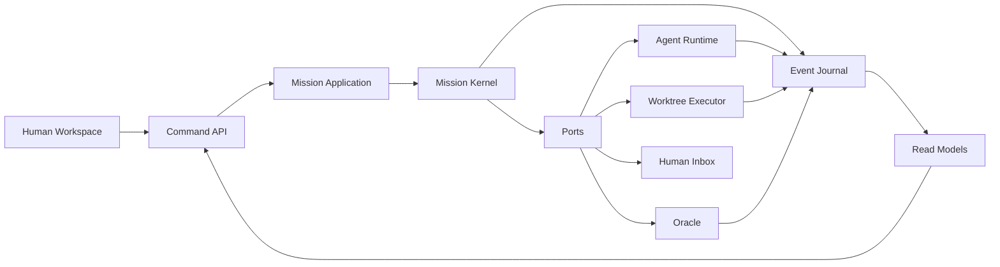

# Agent Lab 전면 재설계 계획 — 2026-07

> **상태:** In progress / D0 — Wave 0~1 계약·shadow spike 착수, legacy cutover는 Human gate 유지  
> **작성 기준일:** 2026-07-12  
> **입력:** `AI-에이전트-엔지니어링-발췌노트.md`, 현재 코드, 프로젝트 SSOT  
> **범위:** 설계·전환 계획과 격리된 first-pass 계약 검증. 기존 제품 writer의 cutover는 별도 Human gate 뒤에 수행한다.

## 1. 결론

Agent Lab의 제품 방향은 타당하다. `Room → plan.md → Human 승인 → worktree execute → merge → Oracle verify`는 일반적인 에이전트 프레임워크와 구별되는 강한 제품 계약이다. 문제는 기능 부족보다 **동일한 생명주기를 여러 상태 머신과 파생 모델이 중복 소유하고, 기능이 루트 모듈·플래그·API·UI 표면으로 계속 추가된 구조**다.

이번 재설계의 목표는 기능을 더 얹는 것이 아니라 다음 네 가지를 먼저 달성하는 것이다.

1. `Mission` 하나가 목표·계획·승인·실행·검증의 생명주기를 소유한다.
2. 명령, 이벤트, 현재 상태, 읽기 모델을 구분해 재시작과 동시 실행에도 설명 가능한 상태를 만든다.
3. 에이전트·도구·컨텍스트·메모리를 교체 가능한 런타임 포트로 제한한다.
4. Human에게는 내부 FSM이 아니라 “지금 필요한 결정 하나”와 근거·복구 경로만 보여준다.

## 2. 현재 코드베이스 평가 요약

### 유지할 제품 모트

| 모트                  | 판정 | 재설계 원칙                                                     |
| --------------------- | ---- | --------------------------------------------------------------- |
| BLOCK → execute 거부  | 유지 | 정책 엔진의 명시적 불변 조건으로 승격                           |
| worktree 격리         | 유지 | 실행 어댑터가 아닌 실행 도메인의 필수 capability                |
| Oracle + Repair       | 유지 | 실행 완료가 아니라 검증 통과가 mission 완료                     |
| 감사 가능한 세션 이력 | 강화 | 가변 `run.json` 단독 저장에서 event journal + snapshot으로 전환 |
| Human Inbox           | 강화 | 모든 Human 결정의 단일 command surface로 통합                   |

### 구조 진단

| 관찰                      | 근거                                                                        | 평가                                              |
| ------------------------- | --------------------------------------------------------------------------- | ------------------------------------------------- |
| Python 코어가 크고 평평함 | Python 403개 파일·약 84,945 LOC, 루트 `.py` 134개                           | 기능 발견·소유권 판단 비용이 큼                   |
| 프론트도 조정 로직이 큼   | TS/TSX 약 50,499 LOC, `api/client.ts` 2,742 LOC                             | 서버 상태와 UI 파생 상태의 중복 위험              |
| 생명주기 권한이 중복됨    | `plan_workflow.phase`, `mission_loop.phase`, `orchestration`, `work_phase`  | drift 감지·자동 reconcile 자체가 이중 쓰기의 증거 |
| 저장 계약이 느슨함        | `RunState`는 `dict[str, Any]`, `patch_run_meta()` 호출이 여러 도메인에 분산 | 필드 소유권·원자성·마이그레이션이 불명확          |
| 통신 표면이 많음          | REST endpoint 100개 이상, SSE/live log/chat/run snapshot 병존               | 같은 사실이 여러 형식과 타이밍으로 전달됨         |
| 실험 기능이 코어에 잔류   | default-off 또는 zero-call-site 모듈, 많은 `AGENT_LAB_*` 플래그             | 실험 성공·폐기 기준보다 축적이 쉬움               |
| 테스트 자산은 강함        | pytest, regression sessions, smoke, structure ratchet                       | 점진적 strangler 전환의 안전망으로 활용 가능      |

## 3. 발췌 노트에서 채택·변형·보류한 원칙

| 노트의 원칙                      | Agent Lab 적용                                                                                                |
| -------------------------------- | ------------------------------------------------------------------------------------------------------------- |
| 코드·워크플로·에이전트를 구분    | 결정 가능한 정책·git 조작·상태 전이는 결정적 코드, 비정형 탐색·계획·비평만 LLM에 맡긴다.                      |
| 비동기식 에이전트 경험           | Room 대화는 짧은 동기 상호작용, execute/verify/monitor는 내구성 있는 비동기 mission으로 분리한다.             |
| 멀티 에이전트는 이득이 있을 때만 | 기본은 lead + 필요한 specialist. 모든 에이전트의 전원 합의는 고위험 결정에 한정한다.                          |
| 관리자 중심·액터-크리틱          | Human이 권한 경계, Conductor가 라우팅, specialist가 산출, Oracle이 판정하는 혼합형을 선택한다.                |
| 메시지 버스·워크플로 엔진        | 먼저 로컬 append-only journal과 단일 writer를 구현한다. NATS/Temporal/Ray는 측정된 배포 요구 전까지 보류한다. |
| 단기·장기 메모리                 | working context, episode, semantic knowledge를 분리하고 provenance·TTL·쓰기 권한을 둔다.                      |
| 실환경 테스트·피드백             | mock pass와 dogfood 가치를 분리하고, 품질·비용·Human 개입·복구 가능성을 함께 측정한다.                        |

## 4. 목표 아키텍처



### 패키지 목표

```text
src/agent_lab/
  mission/       # aggregate, commands, events, policy, transitions
  application/   # use cases, coordinator, projections
  ports/         # agent, executor, oracle, inbox, clock, store interfaces
  adapters/      # codex, claude, cursor, kimi, git, filesystem, MCP
  context/       # context selection and budgeting
  memory/        # working / episodic / semantic stores
  observability/ # traces, metrics, cost, evaluation
  extensions/    # optional capability packages
app/server/      # transport-only HTTP/SSE/WS adapters
web/src/         # feature slices consuming server read models
```

패키지명은 구현 시 조정 가능하지만 의존 방향 `domain ← application ← adapters/transport`는 바꾸지 않는다.

## 5. 섹터 문서

| 순서 | 문서                                                                                 | 핵심 산출물                                                  |
| ---- | ------------------------------------------------------------------------------------ | ------------------------------------------------------------ |
| 1    | [01-mission-kernel.md](./01-mission-kernel.md)                                       | 단일 Mission aggregate와 전이 계약                           |
| 2    | [02-state-events-durability.md](./02-state-events-durability.md)                     | event journal, snapshot, single-writer 저장 경계             |
| 3    | [03-agent-runtime-context-memory.md](./03-agent-runtime-context-memory.md)           | capability 기반 agent/tool/context/memory 런타임             |
| 4    | [04-human-experience-api-ui.md](./04-human-experience-api-ui.md)                     | Human decision queue와 task-oriented API/UI                  |
| 5    | [05-reliability-evaluation-operations.md](./05-reliability-evaluation-operations.md) | eval pyramid, telemetry, cost, rollout, extension governance |

Wave 0 기준선: [00-wave0-mission-inventory.md](./00-wave0-mission-inventory.md) — 대표 Mission 시나리오·현재 writer·gate·side effect 매핑.

## 6. 전체 실행 순서

섹터는 수평 레이어가 아니라 검증 가능한 세로 절편으로 진행한다.

### Wave 0 — 계약 동결과 기준선

- 현재 실세션 5개를 대표 fixture로 고정한다: plan reject, execute success, Oracle repair, Human Inbox pause/resume, crash recovery.
- 각 fixture에 최종 상태뿐 아니라 command/event/decision/evidence 기대값을 기록한다.
- 기존 기능을 `keep / replace / retire / extension`으로 전수 분류한다.
- 신규 기능 개발은 blocker 외 동결한다.

**Checkpoint:** 현행 동작과 비용·지연·Human 개입 기준선이 재현된다.

### Wave 1 — Mission Kernel + Journal

- 새 Mission aggregate와 event schema를 별도 경로에 만든다.
- 기존 mutation 뒤 shadow event를 기록하고 projection 결과를 기존 snapshot과 비교한다.
- drift가 0인 대표 경로부터 새 command handler로 전환한다.

**Checkpoint:** plan approve 한 경로가 새 커널에서 재생 가능하며 기존 UI 결과와 동일하다.

### Wave 2 — Execute/Verify 세로 절편

- worktree create → agent execute → diff decision → merge → Oracle → repair를 port/adapter 경계로 이동한다.
- Human gate와 BLOCK 불변을 커널 테스트로 고정한다.
- 재시작 시 중복 merge·중복 agent call 없이 복구되는지 fault injection으로 검증한다.

**Checkpoint:** 실제 임시 git repo에서 happy path와 crash path가 통과한다.

### Wave 3 — Agent Runtime + Human Workspace

- capability manifest와 context assembler를 도입한다.
- UI를 mission read model + decision queue 기반으로 전환한다.
- REST/SSE 중복 endpoint와 클라이언트 파생 FSM을 축소한다.

**Checkpoint:** 사용자가 내부 phase 이름 없이 미션을 시작·승인·복구·완료할 수 있다.

### Wave 4 — Legacy 제거와 운영 승격

- dual-write 비교 기간 종료 후 `plan_workflow`/`mission_loop` 중복 상태, reconcile 코드, classic graph를 제거한다.
- 플래그를 profile/capability/migration으로 재분류하고 폐기 기한을 집행한다.
- dogfood cohort에서 SLO와 가치 KPI를 만족하면 새 경로를 default로 바꾼다.

**Checkpoint:** 새 커널이 유일한 write authority이고 rollback 절차가 검증된다.

## 7. 전환 불변 조건

- Human 승인 없이 기존보다 넓은 외부 변경 권한을 얻지 않는다.
- worktree 없는 코드 execute를 허용하지 않는다.
- merge 성공만으로 완료 처리하지 않는다. Oracle/evidence 판정을 요구한다.
- shadow mode는 외부 side effect를 두 번 실행하지 않는다.
- 새 상태와 구 상태를 무기한 dual-write하지 않는다. wave마다 제거 조건과 날짜를 둔다.
- NATS, Kafka, Temporal, Ray, 벡터 DB는 요구량과 실패 모델이 증명되기 전 도입하지 않는다.
- `trading_mission/`과 `quant/`는 코어 재설계의 요구사항을 만들지 않으며 extension lane에서만 적응한다.

## 8. 승인 요청과 현재 착수 범위

이번 착수는 새 kernel/journal/activity/decision 계약을 격리된 first-pass 경로에서 검증하는 범위다. 기존 API·UI·daemon writer를 교체하거나 execute gate를 우회하지 않는다. 다음 단계에서 legacy write-authority cutover를 진행하려면 별도 Human 승인이 필요하다.

> **제안:** 기존 `plan_workflow`와 `mission_loop`를 병합 보존하지 않고, 새 Mission aggregate로 대체한 뒤 두 구현을 제거한다.

이 선택이 승인되면 나머지는 섹터 문서의 검증 가능한 migration task로 진행할 수 있다.

### First-pass 경계

이번 착수 산출물은 production cutover가 아니라 typed contract와 shadow/replay 검증이다. 실제 전환 전에 다음을 닫아야 한다.

- Journal의 batch atomicity, mission/schema identity, queue daemon과 side-effect reconcile 통합
- Human Inbox answer와 Mission/Activity resume adapter
- Activity claim/lease/heartbeat·priority queue·side-effect recovery policy는 first pass, daemon/scheduler와 실제 adapter 통합은 pending
- dispatcher의 authority/authentication, payload provenance/redaction, gateway boundary
- 기존 plan/mission/execute writer와의 session-facing application adapter 및 parity evidence

read model의 첫 HTTP surface는 `/api/sessions/{id}/mission/read-model`로 추가되었으며, journal이 없는 세션을 `migrated=false`로 표시한다. scheduler shadow candidate report도 추가했지만, SSE cursor·실제 UI 소비·legacy writer와 scheduler cutover는 여전히 Human gate 전 과제다.

## 9. 주제별 심화 설계

섹터 문서의 경계를 가로지르는 핵심 에이전트 엔지니어링 주제는 다음 문서에서 더 구체적인 runtime·protocol·policy 수준으로 정의한다.

| 순서 | 문서                                                                                           | 소유 범위                                                            |
| ---- | ---------------------------------------------------------------------------------------------- | -------------------------------------------------------------------- |
| 6    | [06-asynchronous-mission-runtime.md](./06-asynchronous-mission-runtime.md)                     | 장기 실행 activity, queue, backpressure, cancel, retry, restart      |
| 7    | [07-five-agentic-system-principles.md](./07-five-agentic-system-principles.md)                 | 확장성·모듈성·지속 학습·회복탄력성·미래 대비의 fitness function      |
| 8    | [08-collaboration-messaging.md](./08-collaboration-messaging.md)                               | command/event/work/progress/decision 메시지와 delivery semantics     |
| 9    | [09-context-engineering.md](./09-context-engineering.md)                                       | activity별 context need, source, selection, budget, provenance, 안전 |
| 10   | [10-multi-agent-coordination.md](./10-multi-agent-coordination.md)                             | topology, 역할, delegation, quorum, actor-critic, 종료와 lift        |
| 11   | [11-ui-ux-surface-map.md](./11-ui-ux-surface-map.md)                                           | Mission first-pass를 노출하는 UI/UX surface와 accessibility          |
| 12   | [12-compatibility-and-legacy-audit.md](./12-compatibility-and-legacy-audit.md)                 | 기존 writer·dispatcher·UI와의 충돌·겹침·레거시 리스크                |
| 13   | [13-document-governance-and-execution-plan.md](./13-document-governance-and-execution-plan.md) | 기존 docs 정리 기준과 다음 실행 단계                                 |
| —    | [dual-read-report-2026-07-13.md](./dual-read-report-2026-07-13.md)                             | 대표 5개 fixture parity gate 결과                                      |

심화 문서는 새로운 독립 로드맵이 아니다. 각 문서의 구현 작업은 Wave 0~4와 해당 섹터 작업에 편입하며, 동일한 command/event/context 계약을 중복 구현하지 않는다.
